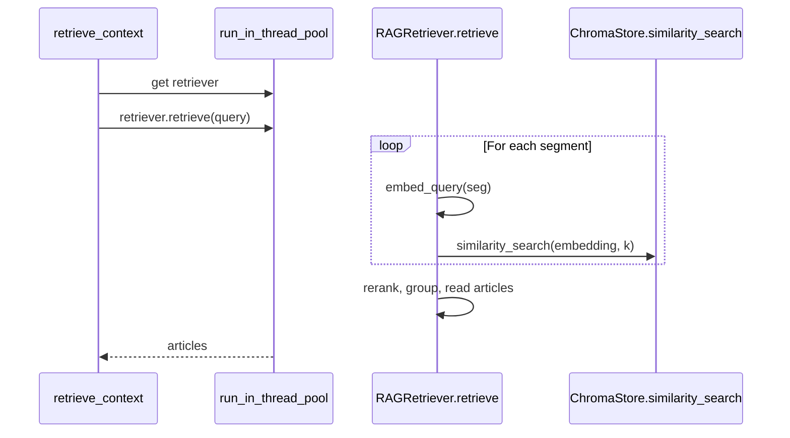
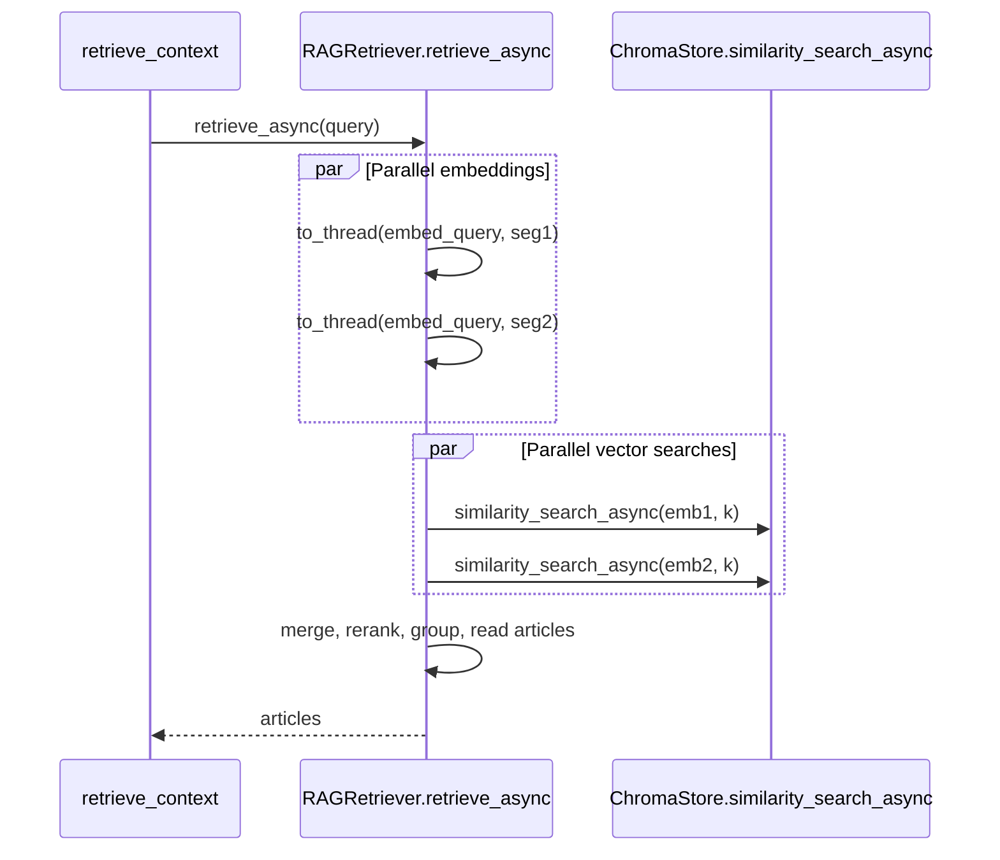

# Async Chroma Vector Store and Retriever Implementation

**Direction:** Chroma over HTTP and async Chroma communication everywhere. No duplicate sync/async methods: one async implementation. CLI scripts call the same async API via async entry points (`async def main_async()` + `asyncio.run(main_async())`).

**Principles (constraints):**

- **Non-breaking:** Current implementation works well; we only change how it runs (async) so concurrent requests do not block each other. Same retrieval logic, same inputs/outputs, same behavior. No change to segmenting, reranking, grouping, or article loading—only execution model (async + to_thread for blocking CPU).
- **Lean:** Minimal changes: add async entry points and await/to_thread where needed; no new abstractions or layers. Do the minimum required to fix blocking (async Chroma, parallel vector searches, to_thread for embedder/reranker). Reuse existing code paths. 
- **Abstract:** Keep existing abstraction boundaries (ChromaStore, vector_search, RAGRetriever, RAGIndexer). Callers still use store/retriever/indexer; only the underlying calls become async. No leak of Chroma or asyncio details to callers.
- **DRY:** One async implementation only; no duplicate sync and async versions of the same logic. Reuse all existing helpers (_split_query_segments, _llm_decompose_query, rerank logic, group by kb_id, _read_article, etc.) inside retrieve_async and index_documents_async; only add async orchestration (await, asyncio.gather, to_thread).
- **NO DUPLICATES:** if new code block repeat create a useful reusable helper if it saves ~5 or more lines of code.

## Current state

- **ChromaStore** ([rag_engine/storage/vector_store.py](rag_engine/storage/vector_store.py)): sync only (`chromadb.HttpClient`, `similarity_search()`).
- **RAGRetriever** ([rag_engine/retrieval/retriever.py](rag_engine/retrieval/retriever.py)): sync `retrieve()` calls `top_k_search(store, qv, k)` in a loop over segments/subqueries (sequential).
- **Tool** ([rag_engine/tools/retrieve_context.py](rag_engine/tools/retrieve_context.py)): async `retrieve_context` runs sync `retriever.retrieve()` inside `run_in_thread_pool(...)` so the event loop is not blocked, but retrieval is still sequential.




## Target state

- **ChromaStore**: single async implementation using `chromadb.AsyncHttpClient` only. Remove sync `HttpClient` and all sync methods. Expose async API: `get_collection()` (async, returns async collection), `similarity_search_async`, `add_async`, `get_any_doc_meta_async`, `delete_where_async`. Scripts that need pagination use `coll = await store.get_collection()` then `await coll.get(limit=..., offset=..., include=...)`.
- **vector_search**: only `top_k_search_async(store, embedding, k)`; remove sync `top_k_search` (all callers use async).
- **RAGRetriever**: only `retrieve_async()`; remove sync `retrieve()`. App direct search endpoint becomes async and calls `await retriever.retrieve_async()`.
- **RAGIndexer**: add `index_documents_async()` that uses `await store.get_any_doc_meta_async()`, `await store.delete_where_async()`, `await store.add_async()`. build_index calls `asyncio.run(run_async())` and `await indexer.index_documents_async(...)`.
- **CLI scripts**: convert to async entry points: `async def main_async(): ...` and `if __name__ == "__main__": asyncio.run(main_async())`. Use `await store.get_collection()`, `await store.similarity_search_async()`, `await store.add_async()`, etc. Scripts: build_index, maintain_chroma, search_kbid, inspect_kbids, check_kbids_in_db, migrate_normalize_kbids, inspect_db_schema (and any other that use ChromaStore).
- **Tool**: call `await retriever.retrieve_async(...)` only; remove thread-pool wrapper for retrieval.




## Implementation steps

**Order:** Run Step 9 first (verify AsyncHttpClient in terminal). Then implement Steps 1–8. Then Steps 10–11 (integration test, document migration plan).

### 1. Vector store: async-only (single implementation, no sync)

**File:** [rag_engine/storage/vector_store.py](rag_engine/storage/vector_store.py)

- Remove sync `_client` (HttpClient), sync `collection` property, sync `add`, `similarity_search`, `get_any_doc_meta`, `delete_where`.
- Use only `chromadb.AsyncHttpClient`. In the installed chromadb version, `AsyncHttpClient` is an async factory: create it with `await chromadb.AsyncHttpClient(host=..., port=...)` inside an async method, not in `__init__`. Lazy init: `_async_client` set in `async def _get_async_collection(self)` (or in `get_collection`) with `self._async_client = await chromadb.AsyncHttpClient(host=..., port=..., ssl=..., settings=...)`. Use settings: `chromadb_host`, `chromadb_port`, `chromadb_ssl`, `chromadb_connection_timeout`; add `chromadb.config.Settings(...)` if required by the API.
- Async methods: `get_collection()` (returns async collection for pagination/get/add/delete), `similarity_search_async(query_embedding, k)`, `add_async(texts, metadatas, ids=..., embeddings=...)`, `get_any_doc_meta_async(where)`, `delete_where_async(where)`. Map Chroma async collection methods (e.g. `await collection.add(...)`, `await collection.get(...)`, `await collection.delete(...)`, `await collection.query(...)`) into these wrappers where useful; for scripts that need raw pagination, `await store.get_collection()` then `await coll.get(limit=..., offset=..., include=...)` is enough.

### 2. Vector search: top_k_search_async only

**File:** [rag_engine/retrieval/vector_search.py](rag_engine/retrieval/vector_search.py)

- Add `async def top_k_search_async(store, embedding: list[float], k: int) -> list`: call `return await store.similarity_search_async(query_embedding=embedding, k=k)`. Remove sync `top_k_search`; all callers use async.

### 3. Retriever: retrieve_async only (remove sync retrieve)

**File:** [rag_engine/retrieval/retriever.py](rag_engine/retrieval/retriever.py)

- Add `async def retrieve_async(self, query: str, top_k: int | None = None, *, include_confidence: bool = True) -> list[Article]` with the same contract as current `retrieve()` (same return type and semantics). Implement: build texts-to-search list (segments, LLM subqueries, fallback) via existing helpers; call `_llm_decompose_query` in `asyncio.to_thread` if used; get embeddings via `asyncio.to_thread(self.embedder.embed_query, text)`; run all vector searches in parallel with `asyncio.gather(top_k_search_async(...))`; merge/dedupe; run **reranker** in `asyncio.to_thread(self.reranker.rerank, query, scored_candidates, ...)` so it does not block the event loop (same pattern as embedder); then group by kb_id, read articles, sort, normalize ranks (same logic as current `retrieve()`).
- Remove sync `retrieve()`. Update [rag_engine/api/app.py](rag_engine/api/app.py) direct search endpoint (e.g. `query_rag` or equivalent) to be async and call `await retriever.retrieve_async(...)` (or run `asyncio.run(retriever.retrieve_async(...))` if the endpoint is sync; prefer making the endpoint async if the framework allows).

### 4. Tool: use retrieve_async

**File:** [rag_engine/tools/retrieve_context.py](rag_engine/tools/retrieve_context.py)

- In `retrieve_context`, keep `retriever = await run_in_thread_pool(_get_or_create_retriever)` (initialization can load embedder/model; safer in thread).
- Replace `docs = await run_in_thread_pool(lambda: retriever.retrieve(query, top_k=top_k, include_confidence=True))` with `docs = await retriever.retrieve_async(query, top_k=top_k, include_confidence=True)`.
- Rest of the tool (exclude_kb_ids, format, trace) unchanged.

**Result:** Tool uses native async retrieval with parallel vector searches; no thread pool for retrieval.

### 5. RAGIndexer: async index path

**File:** [rag_engine/core/indexer.py](rag_engine/core/indexer.py)

- Add `async def index_documents_async(self, documents, chunk_size, chunk_overlap, max_files=None, force_reindex=False) -> dict[str, int]` with the same logic as `index_documents` but using `await self.store.get_any_doc_meta_async(...)`, `await self.store.delete_where_async(...)`, `await self.store.add_async(...)`.
- Keep sync `index_documents` only if build_index or other callers still need it; once build_index is async and calls `await indexer.index_documents_async(...)`, sync `index_documents` can be removed to avoid duplicate methods (per user request). So: add `index_documents_async`, then remove sync `index_documents` and have all callers use the async version.

### 6. CLI scripts: async entry points and async store usage

Convert each script that uses ChromaStore to an async entry point and await store methods:

- **[rag_engine/scripts/build_index.py](rag_engine/scripts/build_index.py):** Replace sync `main` with `async def run_async(): ...` (or keep `main` as `asyncio.run(run_async())`). Create store, embedder, indexer; call `await indexer.index_documents_async(...)`. Dry-run and prune loops: use `await store.get_any_doc_meta_async(...)`, `coll = await store.get_collection()`, then `await coll.get(limit=page_size, offset=offset, include=["metadatas"])`, `await store.delete_where_async(...)`.
- **[rag_engine/scripts/maintain_chroma.py](rag_engine/scripts/maintain_chroma.py):** `get_all_metadata_paginated` and any code that uses `store.collection.get` become async; use `coll = await store.get_collection()`, `await coll.get(...)`, `await coll.count()`. Entry point: `async def main_async(): ...`, `asyncio.run(main_async())`. Note: maintain_chroma also uses `chromadb.PersistentClient` in two places for local SQLite diagnostics; leave those as-is (they are not ChromaStore) or run in asyncio.to_thread if needed.
- **[rag_engine/scripts/search_kbid.py](rag_engine/scripts/search_kbid.py):** Async entry; use `coll = await store.get_collection()`, `await coll.get(...)` as needed.
- **[rag_engine/scripts/inspect_kbids.py](rag_engine/scripts/inspect_kbids.py):** Async entry; `coll = await store.get_collection()`, `await coll.get(limit=20, ...)`.
- **[rag_engine/scripts/check_kbids_in_db.py](rag_engine/scripts/check_kbids_in_db.py):** Async entry; same pattern.
- **[rag_engine/scripts/migrate_normalize_kbids.py](rag_engine/scripts/migrate_normalize_kbids.py):** Async entry; use `await store.get_collection()`, `await coll.get(...)`, `await store.get_any_doc_meta_async(...)`, `await coll.delete(ids=[...])` (or `await store.delete_where_async` if we expose it; else `await coll.delete(ids=[...])`).
- **[rag_engine/scripts/inspect_db_schema.py](rag_engine/scripts/inspect_db_schema.py):** Async entry; `coll = await store.get_collection()`, `await coll.get(...)`, `await coll.count()`.

Shared pattern: script body in `async def main_async()` or `async def run_async()`; `if __name__ == "__main__": asyncio.run(main_async())`.

### 7. process_requests_xlsx compatibility

**Script:** [rag_engine/scripts/process_requests_xlsx.py](rag_engine/scripts/process_requests_xlsx.py)

- The script does not call the retriever or ChromaStore directly. It uses `await api_app.ask_comindware_structured(md_request, ...)`, which runs the full agent (including the retrieve_context tool). After the tool is switched to `retrieve_async`, the agent path uses async retrieval; no changes to process_requests_xlsx.py are required.
- **Verification:** Run the existing [rag_engine/tests/test_process_requests_xlsx.py](rag_engine/tests/test_process_requests_xlsx.py) (unit tests for build_markdown_request, format_articles_column, etc.); they do not touch the retriever. Optionally run the script once against a test XLSX (or add an integration test that mocks the agent) to confirm end-to-end compatibility.

### 8. Test suite compatibility

- **test_tools_retrieve_context.py:** Tool calls `retriever.retrieve_async(...)`. Mock retriever implements `retrieve_async` (e.g. `AsyncMock(return_value=mock_articles)`). Assert `mock_ret.retrieve_async.assert_called_once_with(...)`. In `test_retrieve_same_as_direct_call`, compare tool result to mock's `retrieve_async` return value.
- **test_api_app.py:** All FakeRetriever classes get `retrieve_async` (e.g. `async def retrieve_async(self, query, top_k=None, *, include_confidence=True): return self.retrieve(query, top_k)` or same return shape). FakeStore (ChromaStore mock) gets `similarity_search_async` (and if any test uses store.add/get/delete, add `add_async`, `get_collection`, etc.) where the tool or retriever runs.
- **test_retriever.py:** Uses sync `retrieve()` and sync store. Since we remove sync `retrieve()`, tests must use async: either `asyncio.run(retriever.retrieve_async(...))` or convert tests to `@pytest.mark.asyncio` and `await retriever.retrieve_async(...)`. Mock store must implement `similarity_search_async` (e.g. AsyncMock returning list of docs).
- **test_storage_vector_store.py:** ChromaStore is async-only; tests must call async methods via `asyncio.run(store.similarity_search_async(...))` or pytest-asyncio. If tests use a real Chroma server, run it and use async client; if tests use mocks, mock must implement `similarity_search_async`, `add_async`, `get_any_doc_meta_async`, `delete_where_async`, `get_collection` as needed.
- **test_retrieval_vector_search.py:** Uses `top_k_search` and mock store. Switch to `top_k_search_async` and mock `store.similarity_search_async`; run with `asyncio.run(top_k_search_async(store, embedding, k))` or async test.
- **test_scripts_build_index.py:** Indexer now has only `index_documents_async`; script runs async. Tests that patch ChromaStore or indexer must provide async API (mock `add_async`, `get_any_doc_meta_async`, `delete_where_async`, `get_collection`) and run build_index via `asyncio.run(run_async())` or equivalent.
- **test_process_requests_xlsx.py:** No retriever/ChromaStore; no changes.
- **Lint:** Run `ruff check` on modified files.

## Design summary


| Path                                             | After change                                                                                                                                    |
| ------------------------------------------------ | ----------------------------------------------------------------------------------------------------------------------------------------------- |
| ChromaStore                                      | Async only: AsyncHttpClient, get_collection(), similarity_search_async, add_async, get_any_doc_meta_async, delete_where_async. No sync methods. |
| vector_search                                    | Only top_k_search_async                                                                                                                         |
| RAGRetriever                                     | Only retrieve_async                                                                                                                             |
| RAGIndexer                                       | Only index_documents_async                                                                                                                      |
| Agent / tool                                     | await retriever.retrieve_async; tool uses async only                                                                                            |
| process_requests_xlsx                            | No script change; goes through agent/tool                                                                                                       |
| CLI scripts (build_index, maintain_chroma, etc.) | async def main_async(); asyncio.run(main_async()); await store.get_collection(), await store.add_async(), etc.                                  |
| app.py direct search                             | Async endpoint; await retriever.retrieve_async                                                                                                  |
| Tests                                            | Use asyncio.run(...) or pytest-asyncio; mocks implement async API                                                                               |


Single async implementation everywhere; no duplicate sync/async methods.

**Blocking behavior:** All Chroma communication and retrieval orchestration are async. The only blocking work is the **embedder** (`embed_query`) and **reranker** (`rerank`) in **direct mode** (local models). Both are run in **asyncio.to_thread()** in `retrieve_async` so they do not block the event loop: embedder per segment (or batch), reranker once after merging candidates. Same pattern for both; direct mode is CPU-bound and has no async API. When embedder/reranker use HTTP (infinity, openrouter), they could be async later; for direct mode, to_thread is the right approach.

### 9. Verify ChromaDB AsyncHttpClient API (run in terminal)

**Deterministic check before implementing Step 1.** Run in project venv:

```bash
.venv\Scripts\Activate.ps1   # or source .venv/bin/activate
python -c "
import asyncio
import chromadb
assert hasattr(chromadb, 'AsyncHttpClient'), 'chromadb.AsyncHttpClient missing'
async def check():
    client = await chromadb.AsyncHttpClient(host='localhost', port=8000)
    print('AsyncHttpClient OK')
asyncio.run(check())
"
```

- In the installed chromadb version, `AsyncHttpClient` is an **async factory**: it returns a coroutine and must be created with `await chromadb.AsyncHttpClient(...)` inside an async context. Do not call it synchronously (that triggers "coroutine was never awaited").
- ChromaStore must create the client inside an async method (e.g. in `_get_async_collection`): `self._async_client = await chromadb.AsyncHttpClient(host=..., port=...)`, not in `__init__`.
- One-time check only: once Step 9 passes, implement Step 1 to match (no re-check during implementation). If Step 9 fails (e.g. `AsyncHttpClient` missing or different signature), consult the installed chromadb package and implement to match, then run Step 9 again only if you change chromadb version or need to re-verify.
- If Chroma server is not running, the await may still succeed; optional: call `await client.heartbeat()` to confirm connectivity.

### 10. Integration test (in scope, required)

- Add an integration test that runs `retrieve_async` (and optionally `similarity_search_async`) against a real Chroma HTTP server or a small in-process/mock async store. Assert that parallel behavior is exercised (e.g. multiple segments trigger multiple concurrent vector searches). Place in [rag_engine/tests/](rag_engine/tests/) (e.g. `test_retrieval_async_integration.py` or extend an existing test module). Mark as integration test (pytest marker or separate run) if it requires a running Chroma server.

### 11. Document migration plan (in scope, required)

- Update [.opencode/plans/chromadb-http-migration.md](.opencode/plans/chromadb-http-migration.md): in the Implementation Checklist, mark Phase 2.2 (Vector store refactoring) and Phase 2.3 (Retriever integration) as done, and add a short note that the implementation is async-only (AsyncHttpClient, retrieve_async, parallel vector searches).

## Risk mitigation (reference only)

- **ChromaDB AsyncHttpClient API:** Handled by Step 9 (verify in terminal; implement to match package if needed).
- **Fallback invoke:** When vLLM fallback uses `agent.invoke()`, LangChain still runs the async tool in an event loop; no change needed in [rag_engine/utils/vllm_fallback.py](rag_engine/utils/vllm_fallback.py).

