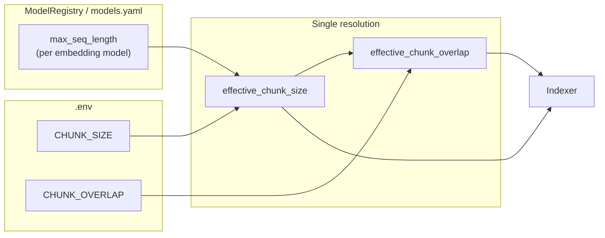

# Chunk size model-cap rewire

## Goal

Apply **effective chunk size = min(settings.chunk_size, model_max_seq_length)** (and a safe overlap cap) so that switching embedding models never silently truncates. Same .env vars (`CHUNK_SIZE`, `CHUNK_OVERLAP`); no renames.

## Data flow

- **CHUNK_SIZE** and **CHUNK_OVERLAP** stay the single source of intent.
- **max_seq_length** comes from the current embedding model in [rag_engine/config/models.yaml](rag_engine/config/models.yaml) (e.g. 512 for FRIDA, 8192 for Qwen 8B).
- One resolution path produces `effective_chunk_size` and `effective_chunk_overlap`; only the indexer (and any future index builders) use these.

## Implementation

### 1. ModelRegistry: expose embedding max sequence length

**File:** [rag_engine/config/schemas.py](rag_engine/config/schemas.py)

- Add `**get_embedding_max_seq_length(self, model_slug: str) -> int`**.
- Behavior: resolve model via `get_model(model_slug)`; require `type == "embedding"`. Read `provider_formats.direct.max_seq_length` (all current embedding models define it there). Return `direct.get("max_seq_length", 512)`.
- No YAML change: keep using existing `direct.max_seq_length` as the model capacity (same value for OpenRouter/direct for a given model).

### 2. Single helper: effective chunk params

**New file:** [rag_engine/config/chunk_config.py](rag_engine/config/chunk_config.py)

- `**get_effective_chunk_params(settings: Settings) -> tuple[int, int]`** returning `(effective_chunk_size, effective_chunk_overlap)`.
- Logic:
  - `max_len = ModelRegistry().get_embedding_max_seq_length(settings.embedding_model)`
  - `effective_chunk_size = max(1, min(settings.chunk_size, max_len))` (ensure at least 1 so overlap is never negative).
  - `effective_chunk_overlap = min(settings.chunk_overlap, effective_chunk_size - 1)` (keep overlap &lt; size; if size 1 then overlap 0).
- No other call sites today; indexer stays agnostic and keeps taking `chunk_size` / `chunk_overlap` as arguments.

### 3. Indexing entrypoint uses effective params

**File:** [rag_engine/scripts/build_index.py](rag_engine/scripts/build_index.py)

- Import `get_effective_chunk_params` from `rag_engine.config.chunk_config`.
- Before `indexer.index_documents_async(...)`, call `chunk_size, chunk_overlap = get_effective_chunk_params(settings)` and pass these into the call instead of `settings.chunk_size` / `settings.chunk_overlap`.
- Optional: log when capping occurs (e.g. when `effective_chunk_size < settings.chunk_size`) so operators see it.

### 4. Tests

- **ModelRegistry:** test `get_embedding_max_seq_length` for at least one model (e.g. FRIDA → 512, Qwen 8B → 8192) and that a non-embedding model raises.
- **chunk_config:** test `get_effective_chunk_params`:
  - when `settings.chunk_size` <= model max → unchanged;
  - when `settings.chunk_size` > model max → capped to model max, overlap capped to size - 1.
- **build_index:** existing test that records `chunk_size`/`chunk_overlap` can stay; if it mocks settings and embedder, ensure the test still sees the capped values when the mock model has a small `max_seq_length` (or add a small test that asserts capping when settings request more than model max).

### 5. Docs

- **[.env-example](.env-example):** next to `CHUNK_SIZE`/`CHUNK_OVERLAP`, add a short comment that the effective value is capped by the current embedding model’s max sequence length so switching to a smaller model may reduce effective chunk size.
- **AGENTS.md or README:** no strict requirement unless you document “switching embedding model” there; if you do, add one line that effective chunk size is min(.env, model max).

### 6. Exports

- **[rag_engine/config/__init__.py](rag_engine/config/__init__.py):** export `get_effective_chunk_params` from `chunk_config` so config remains the single place for “resolved” chunk params.

---

## What you need to switch embedding model and reindex

1. **.env**
  - Set `EMBEDDING_PROVIDER_TYPE` and `EMBEDDING_MODEL` (e.g. `openrouter` and `Qwen/Qwen3-Embedding-8B`).
  - Ensure provider credentials/endpoints (e.g. `OPENROUTER_API_KEY`, `OPENROUTER_ENDPOINT` if used) are set.
  - Leave `CHUNK_SIZE` / `CHUNK_OVERLAP` as-is; they will be capped by the new model’s max length.
2. **Reindex**
  - Run the index script with your usual source and `--reindex`, e.g.  
   `python rag_engine/scripts/build_index.py --source <path> --mode folder --reindex`.
3. **ChromaDB and embedding dimension**
  - See section below.

No extra steps beyond the above; the new cap ensures chunk size is always safe for the selected embedding model.

---

## ChromaDB: dimension is fixed per collection

**Behaviour:** ChromaDB sets a collection’s embedding dimension on the **first** `add()`. That dimension is **fixed** for the life of the collection. It does **not** support changing dimension or mixing dimensions in one collection.

**If you switch to an embedding model with a different dimension** (e.g. FRIDA 1536 → Qwen 8B 4096):

1. **Use a new collection**  
   Set a **new** `CHROMADB_COLLECTION` in `.env` (e.g. `mkdocs_kb_qwen8b`). Do this **before** running `build_index`.

2. **Run the index script**  
   `python rag_engine/scripts/build_index.py --source <path> --mode folder --reindex`  
   ChromaStore uses `get_or_create_collection(name=settings.chromadb_collection)` ([rag_engine/storage/vector_store.py](rag_engine/storage/vector_store.py)); the new name creates a new collection, and the first add sets its dimension to the current embedder’s (e.g. 4096).

3. **App usage**  
   The app already reads `settings.chromadb_collection` everywhere (build_index, retriever, app.py). After reindexing, the app uses the new collection as long as `.env` has the new name.

**Optional cleanup:** Old collection (e.g. `mkdocs_kb`) stays on disk; you can leave it for rollback or remove it later via ChromaDB API or scripts if you need the space.

**Summary:** When the embedding model’s dimension changes, point `CHROMADB_COLLECTION` to a new name, then reindex. No code change required; only `.env` and a full reindex.