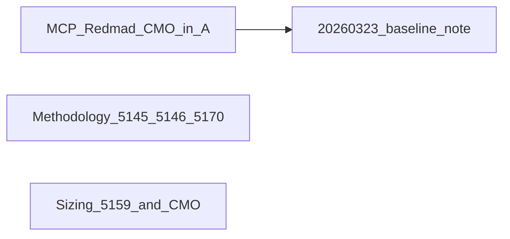

# Redmadnews digest — plan (complete, workspace repo)

## External sanity check (reference)

- [Habr — MCP Tool Registry](https://habr.com/ru/companies/redmadrobot/articles/982004/)
- [GitHub — redmadrobot-rnd/mcp-registry](https://github.com/redmadrobot-rnd/mcp-registry)

Telegram permalinks remain volatile; replace labels only after manual 404 check.

---

## Validation snapshot (`docs/research/20260325-*.md`, Appendix A ~1141 lines)

| Check                                                                            | Result                                                                                             |
| -------------------------------------------------------------------------------- | -------------------------------------------------------------------------------------------------- |
| Appendix A: Habr `982004` + GitHub `mcp-registry` under «Методологии внедрения…» | **Present**                                                                                        |
| Appendix A: `#### Посты @Redmadnews` with `/5132`+                               | **Present**                                                                                        |
| Appendix A: «Telegram-каналы и посты» Redmad permalinks                          | **Present**                                                                                        |
| Appendix A: `#### Исследования рынка` + cmoclub/197 + RB.RU (condensed + full)   | **Present** (`#app_a_market_research_genai_maturity`, `#…_genai_2`)                                |
| Appendix A: duplicate MCP after `openapi-to-cli`                                 | **Present**                                                                                        |
| Appendix B/C/D: MCP + body where applicable                                      | **Present**                                                                                        |
| Methodology / Sizing: Tier B hooks                                               | **Present**                                                                                        |
| `20260323-`* monoliths: new URLs                                                 | **Omitted by design**; Appendix A «Обзор комплекта» states split-pack is canonical for added links |

---

## Quality gates (on future edits)

1. [docs/research/AGENTS.md](docs/research/AGENTS.md): empty line before lists; plain links in final `## Источники`; no uncited CMO KPIs.
2. GenAI in marketing = demand signal in sizing narrative, not GPU line item.
3. No Python changes → no Ruff unless code touched.

