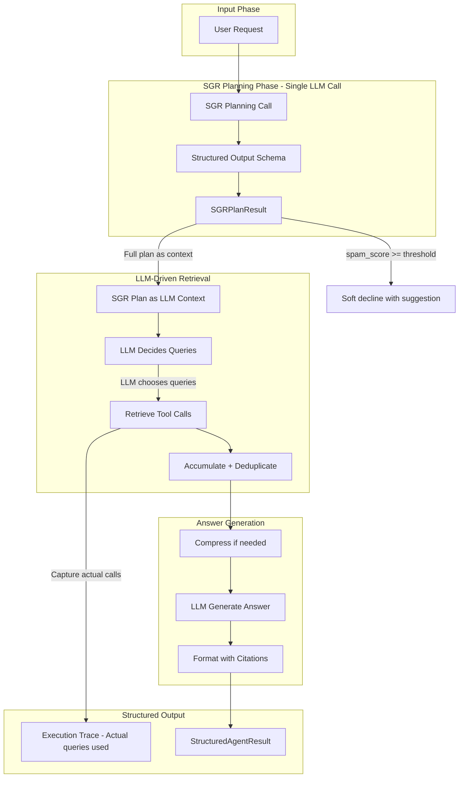

# SGR Planning + Structured Agent Callable Implementation

## Architecture Overview



## 1. New Pydantic Schemas (Lean - No Duplicate Trace Classes)

### File: [rag_engine/llm/schemas.py](rag_engine/llm/schemas.py) (NEW)

Only two schemas needed. Trace data uses dicts serialized from existing `Article` objects.

```python
class SGRPlanResult(BaseModel):
    """Request analyzer for Comindware Platform support.
    
    Analyze the user's request and produce a structured plan for knowledge base retrieval.
    """
    
    spam_score: float = Field(
        ...,
        ge=0.0,
        le=1.0,
        description=(
            "Classify if request is spam (unrelated to Comindware Platform support). "
            "0.0-0.2: Clearly related to Comindware, low-code, business apps, IT infrastructure. "
            "0.3-0.5: Ambiguous but could be IT/business/support related - ALLOW and paraphrase. "
            "0.6-0.8: Likely unrelated but has technical keywords - suggest clarification. "
            "0.9-1.0: Obviously unrelated (marketing, personal, random) - suggest rephrasing. "
            "STRATEGY: We prefer to allow 2% spam requests rather than block a single valid request."
        ),
    )
    
    spam_reason: str = Field(..., max_length=150, description="Brief explanation (10-20 words).")
    
    user_intent: str = Field(..., max_length=300, description="What the user wants (1-2 sentences).")
    
    subqueries: list[str] = Field(
        ...,
        min_length=1,
        max_length=10,
        description="Focused search queries for KB (1-10, in Russian, no duplicates).",
    )
    
    action_plan: list[str] = Field(
        default_factory=list,
        max_length=10,
        description="Concrete steps to resolve the request (up to 10 steps).",
    )
    
    ask_for_clarification: bool = Field(
        default=False,
        description="True if spam_score >= 0.6 or request is vague/harmful.",
    )
    
    clarification_suggestion: str | None = Field(
        default=None,
        max_length=200,
        description="If ask_for_clarification is True, helpful suggestion in Russian.",
    )


class StructuredAgentResult(BaseModel):
    """Full structured output from ask_comindware_structured().
    
    Uses existing Article objects (serialized to dicts) - NO duplicate trace classes.
    Article.metadata already contains: rerank_score, normalized_rank, article_rank, title, url.
    Chunks get rerank_score_raw added to their metadata.
    """
    plan: SGRPlanResult
    per_query_results: list[dict]  # [{query, confidence: dict, articles: list[dict]}]
    final_articles: list[dict]     # Serialized Article objects with full metadata
    answer_text: str
    diagnostics: dict              # tokens_used, compression_applied, etc.
```

**Key: NO ArticleTrace, ChunkTrace, QueryResult, RetrievalConfidence classes.** Reuse existing `Article` + metadata.

## 2. New Prompts

### File: [rag_engine/llm/prompts.py](rag_engine/llm/prompts.py) (EXTEND)

```python
# SGR Planning - reuses get_system_prompt() for context, schema provides task guidance
SGR_PLANNING_CLARIFICATION = "For this request, analyze and fill all schema fields."

# Parametric template for SGR user message
SGR_PLANNING_USER_TEMPLATE = "Analyze this request:\n<<<\n{request}\n>>>"

# Prefix for clarification suggestion (prepended to LLM's contextual clarification_suggestion)
SGR_CLARIFICATION_PREFIX = "Пожалуйста, уточните ваш вопрос."
```

## 3. Extend AgentContext (Self-Contained for Structured Output)

### File: [rag_engine/utils/context_tracker.py](rag_engine/utils/context_tracker.py) (EXTEND)

```python
class AgentContext(BaseModel):
    # ... existing fields (conversation_tokens, accumulated_tool_tokens, fetched_kb_ids) ...
    
    # NEW: SGR plan - SENT to LLM as context (guides retrieval decisions)
    sgr_plan: dict | None = Field(default=None)  # Included in LLM context
    
    # NEW: Execution trace - NOT sent to LLM (captures actual tool calls for output)
    query_traces: list[dict] = Field(default_factory=list, exclude=True)
    
    # NEW: Final results - populated at end of agent execution, NOT sent to LLM
    final_answer: str = Field(default="", exclude=True)
    final_articles: list[dict] = Field(default_factory=list, exclude=True)
    diagnostics: dict = Field(default_factory=dict, exclude=True)
```

**Key distinction:**

- `sgr_plan` → Sent to LLM (subqueries as suggestions, action_plan as guidance)
- Everything else with `exclude=True` → NOT sent to LLM, used for structured output only

**AgentContext is now self-contained** with all data needed for `StructuredAgentResult`.

## 4. Retrieval Confidence Helper

### File: [rag_engine/retrieval/confidence.py](rag_engine/retrieval/confidence.py) (NEW)

```python
def compute_retrieval_confidence(
    scored_chunks: list[tuple[Any, float]],
    relevance_threshold: float | None = None,
) -> dict:
    """Compute query-level confidence metrics from reranker scores.
    
    Returns dict (not Pydantic model): {top_score, mean_top_k, score_gap, n_above_threshold, likely_relevant}
    """
```

## 5. Extend Retriever to Preserve Chunk Scores

### File: [rag_engine/retrieval/retriever.py](rag_engine/retrieval/retriever.py) (EXTEND)

```python
# In step 3 (group chunks by kb_id), preserve per-chunk scores:
for doc, score in scored_candidates:
    if hasattr(doc, "metadata"):
        doc.metadata["rerank_score_raw"] = score  # NEW: preserve raw score
```

Also add optional `include_confidence: bool = False` parameter.

## 6. SGR Planning Function

### File: [rag_engine/llm/sgr_planning.py](rag_engine/llm/sgr_planning.py) (NEW)

```python
def run_sgr_planning(
    request: str,
    llm_manager: LLMManager,
    *,
    spam_threshold: float = 0.8,
) -> SGRPlanResult:
    """Single LLM call with existing system prompt + schema guidance."""
```

## 7. Extend Agent Factory

### File: [rag_engine/llm/agent_factory.py](rag_engine/llm/agent_factory.py) (EXTEND)

```python
def create_rag_agent(
    # ... existing params ...
    enable_sgr_planning: bool = True,  # NEW: opt-in SGR planning
    sgr_spam_threshold: float = 0.8,    # NEW: threshold for soft decline
) -> Agent:
```

When `enable_sgr_planning=True`:

1. Run SGR planning before first retrieval
2. Inject full SGR plan into LLM context (subqueries as suggestions)
3. LLM decides which retrieval calls to make
4. If spam_score > threshold, inject soft decline suggestion

## 8. Yield Context at End + Two Callables (No Duplication)

### File: [rag_engine/api/app.py](rag_engine/api/app.py) (MODIFY)

**Architecture: agent_chat_handler yields AgentContext as final item.**

Streaming UI remains unchanged. Structured callable consumes generator and captures context.

```python
async def agent_chat_handler(
    message: str,
    history: list[dict],
    ...
) -> AsyncGenerator[list[dict] | AgentContext, None]:
    """Streaming handler - yields history chunks, then AgentContext at end.
    
    Workflow:
 1. SGR planning (if enabled) -> spam_score, subqueries, action_plan
 2. Inject full SGR plan into LLM context
 3. LLM-driven retrieval (LLM decides which queries to use)
 4. Capture actual tool calls in AgentContext.query_traces
 5. Accumulate + deduplicate articles
 6. Compress if needed
 7. Generate answer with citations (streaming yields)
 8. Populate AgentContext with final results
 9. Yield AgentContext as final item
    """
    agent_context = AgentContext(...)
    
    # ... normal streaming, yields list[dict] for UI ...
    yield list(gradio_history)
    
    # At end, populate context with final results
    agent_context.final_answer = final_text
    agent_context.final_articles = [a.to_dict() for a in articles]
    agent_context.diagnostics = {"tokens_used": ..., "compression_applied": ...}
    
    # Final yield is the context object (different type)
    yield agent_context
```

**Two callables, same handler:**

```python
# Existing - for streaming UI (unchanged behavior)
# UI just iterates, ignores final AgentContext yield (not a list)
async for chunk in agent_chat_handler(message, history):
    if isinstance(chunk, list):
        update_ui(chunk)
    # AgentContext silently ignored


# Existing - for MCP (returns string)
async def ask_comindware(message: str) -> str:
    """Returns answer string only (backward compatible)."""
    context = None
    async for chunk in agent_chat_handler(message, []):
        if isinstance(chunk, AgentContext):
            context = chunk
    return context.final_answer if context else ""


# New - for batch processing and detailed output
async def ask_comindware_structured(
    message: str,
    *,
    include_per_query_trace: bool = True,
) -> StructuredAgentResult:
    """Returns full structured result - captures AgentContext from handler."""
    context = None
    async for chunk in agent_chat_handler(message, []):
        if isinstance(chunk, AgentContext):
            context = chunk
    
    return StructuredAgentResult(
        plan=context.sgr_plan,
        per_query_results=context.query_traces if include_per_query_trace else [],
        final_articles=context.final_articles,
        answer_text=context.final_answer,
        diagnostics=context.diagnostics,
    )
```

**Key benefits:**

- NO duplication - all callables use same `agent_chat_handler`
- Streaming UI unchanged - just ignores final AgentContext yield
- Context "returned" cleanly by yielding at end (no mutable input params)
- AgentContext is self-contained with all data for structured output
- Future: streaming UI can capture context for metadata display

## 9. Update Batch Script

### File: [rag_engine/scripts/process_requests_xlsx.py](rag_engine/scripts/process_requests_xlsx.py) (MODIFY)

```python
async def process_one(*, subject: str, html_description: str, top_k: int) -> RowResult:
    md_request = build_markdown_request(subject, html_description)
    
    result = await ask_comindware_structured(
        md_request,
        enable_sgr_planning=True,
        include_per_query_trace=True,
        top_k=top_k,
    )
    
    articles_text = format_articles_column_from_trace(result.per_query_results, top_k)
    chunks_text = format_chunks_column_from_trace(result.per_query_results)
    answer_text = build_answer_column_from_result(result)
    
    return RowResult(
        articles_text=articles_text,
        chunks_text=chunks_text,
        answer_text=answer_text,
        spam_score=result.plan.spam_score,
    )
```

## 10. Shared Formatting Helpers

### File: [rag_engine/utils/trace_formatters.py](rag_engine/utils/trace_formatters.py) (NEW)

```python
def format_articles_column_from_trace(query_results: list[dict], top_k: int) -> str:
    """Format articles column from trace dicts."""

def format_chunks_column_from_trace(query_results: list[dict], max_chars: int = 100) -> str:
    """Format chunks column from trace dicts."""

def build_answer_column_from_result(result: StructuredAgentResult) -> str:
    """Build answer column with disclaimer, recommendations, and citations."""
```

## 11. Gradio UI Metadata Display

### File: [rag_engine/api/app.py](rag_engine/api/app.py) (MODIFY - UI section)

**UI captures AgentContext and populates metadata components after streaming.**

```
┌─────────────────────────────────────────────────────────────┐
│ [Spam: 0.1 ✓]  [Confidence: High]  [Queries: 3]             │  ← Badges (gr.HTML)
├─────────────────────────────────────────────────────────────┤
│ Answer (streaming)                                          │  ← gr.Chatbot
├─────────────────────────────────────────────────────────────┤
│ ▶ Analysis Summary                                          │  ← gr.Accordion
│   Intent: Пользователь спрашивает о настройке форм          │
│   Subqueries: ["настройка форм", "поля формы"]              │
├─────────────────────────────────────────────────────────────┤
│ ▶ Retrieved Articles (3)                                    │  ← gr.Accordion
│   1. Настройка форм [confidence: 0.92]                      │
│   2. Работа с полями [confidence: 0.78]                     │
└─────────────────────────────────────────────────────────────┘

Use localization engine here for any new labels or static texts
```

**Implementation in Gradio Blocks:**

```python
with gr.Blocks() as demo:
    # Status badges row (hidden until context available)
    with gr.Row(visible=False) as metadata_row:
        spam_badge = gr.HTML()
        confidence_badge = gr.HTML()
        queries_badge = gr.HTML()
    
    # Main chatbot
    chatbot = gr.Chatbot(...)
    msg = gr.Textbox(...)
    
    # Collapsible metadata panels (hidden until context available)
    with gr.Accordion("Analysis Summary", open=False, visible=False) as analysis_accordion:
        intent_text = gr.Textbox(label="User Intent", interactive=False)
        subqueries_json = gr.JSON(label="Subqueries")
        action_plan_json = gr.JSON(label="Action Plan")
    
    with gr.Accordion("Retrieved Articles", open=False, visible=False) as articles_accordion:
        articles_df = gr.Dataframe(
            headers=["Rank", "Title", "Confidence", "URL"],
            interactive=False
        )
```

**Event handler captures and displays context:**

```python
async def chat_with_metadata(message, history):
    """Wrapper that captures AgentContext and returns metadata updates."""
    context = None
    
    async for chunk in agent_chat_handler(message, history):
        if isinstance(chunk, list):
            yield {
                chatbot: chunk,
                metadata_row: gr.Row(visible=False),  # Hide during streaming
            }
        elif isinstance(chunk, AgentContext):
            context = chunk
    
    # After streaming, populate metadata components
    if context and context.sgr_plan:
        plan = context.sgr_plan
        yield {
            chatbot: history,  # Keep final history
            metadata_row: gr.Row(visible=True),
            spam_badge: format_spam_badge(plan.get("spam_score", 0)),
            confidence_badge: format_confidence_badge(context.query_traces),
            queries_badge: f"Queries: {len(context.query_traces)}",
            analysis_accordion: gr.Accordion(visible=True),
            intent_text: plan.get("user_intent", ""),
            subqueries_json: plan.get("subqueries", []),
            action_plan_json: plan.get("action_plan", []),
            articles_accordion: gr.Accordion(visible=True),
            articles_df: format_articles_dataframe(context.final_articles),
        }
```

**Helper functions for UI formatting:**

```python
def format_spam_badge(score: float) -> str:
    """Format spam score as colored HTML badge."""
    if score < 0.3:
        color, label = "green", "✓ Low" # Use localization engine for this and othe labels
    elif score < 0.6:
        color, label = "orange", "⚠ Medium"
    else:
        color, label = "red", "✗ High"
    return f'<span style="background:{color};padding:2px 8px;border-radius:4px;">Spam: {score:.1f} {label}</span>'

def format_confidence_badge(query_traces: list[dict]) -> str:
    """Format overall confidence as HTML badge."""
    if not query_traces:
        return '<span style="background:gray;padding:2px 8px;border-radius:4px;">Confidence: N/A</span>'
    # Average top_score across queries
    scores = [t.get("confidence", {}).get("top_score", 0) for t in query_traces]
    avg = sum(scores) / len(scores) if scores else 0
    if avg > 0.7:
        color, label = "green", "High"
    elif avg > 0.4:
        color, label = "orange", "Medium"
    else:
        color, label = "red", "Low"
    return f'<span style="background:{color};padding:2px 8px;border-radius:4px;">Confidence: {label}</span>'

def format_articles_dataframe(articles: list[dict]) -> list[list]:
    """Format articles for gr.Dataframe."""
    rows = []
    for i, article in enumerate(articles, 1):
        meta = article.get("metadata", {})
        rows.append([
            i,
            meta.get("title", "Untitled"),
            f"{meta.get('rerank_score', 0):.2f}",
            meta.get("url", ""),
        ])
    return rows
```

## Files Changed Summary

| File | Action | Purpose |

|------|--------|---------|

| `rag_engine/llm/schemas.py` | NEW | SGRPlanResult + StructuredAgentResult (lean, 2 classes only) |

| `rag_engine/llm/prompts.py` | EXTEND | Add SGR prompts |

| `rag_engine/llm/sgr_planning.py` | NEW | SGR planning function |

| `rag_engine/retrieval/confidence.py` | NEW | Retrieval confidence (returns dict) |

| `rag_engine/retrieval/retriever.py` | EXTEND | Add rerank_score_raw to chunks |

| `rag_engine/utils/context_tracker.py` | EXTEND | Add sgr_plan + query_traces |

| `rag_engine/utils/trace_formatters.py` | NEW | Shared formatting helpers |

| `rag_engine/llm/agent_factory.py` | EXTEND | Add SGR planning option |

| `rag_engine/api/app.py` | MODIFY | Yield AgentContext + ask_comindware_structured() + UI metadata display |

| `rag_engine/scripts/process_requests_xlsx.py` | MODIFY | Use structured callable |

## Tests

- `test_sgr_planning.py` - Schema validation, spam thresholds, subquery generation
- `test_retrieval_confidence.py` - Confidence computation, edge cases
- `test_structured_agent.py` - Result schema, opt-in flags, deduplication
- `test_ui_metadata.py` - Badge formatting, dataframe generation, UI component visibility

## Key Design Decisions

1. **Single LLM call for SGR**: Spam score + subqueries + plan in one call

2. **SGR plan sent to LLM, execution trace not**:

                                                                                                                                                                                                                                                                                                                                                                                                                                                                                                                                                                                                                                                                                                                                                                                                - `sgr_plan` → Included in LLM context
                                                                                                                                                                                                                                                                                                                                                                                                                                                                                                                                                                                                                                                                                                                                                                                                - `query_traces` → Excluded (for output only)

3. **LLM-driven retrieval**: No forced loop. LLM receives subqueries as suggestions, decides what to execute

4. **Trace captures actual execution**: Output reflects what LLM actually did

5. **Opt-in everywhere**: `enable_sgr_planning=False` by default. Existing behavior unchanged

6. **Reuse, don't duplicate**:

                                                                                                                                                                                                - **Yield context at end** - `agent_chat_handler` yields `AgentContext` as final item
                                                                                                                                                                                                - All callables use same handler, differ only in how they consume it
                                                                                                                                                                                                - Existing `Article` class + metadata (no duplicate trace classes)
                                                                                                                                                                                                - `RAGRetriever.retrieve()` for retrieval
                                                                                                                                                                                                - `accumulate_articles_from_tool_results()` for deduplication
                                                                                                                                                                                                - `compress_all_articles_proportionally_by_rank()` for compression
                                                                                                                                                                                                - `format_with_citations()` for citations

7. **Streaming preserved**: UI streaming unchanged - just ignores final `AgentContext` yield (not a list)

8. **Clean context return**: No mutable input parameters. Context yielded at end, callers capture if needed

9. **Small payload additions OK**: `rerank_score_raw` in chunk metadata, confidence dict in result

10. **Soft decline, not hard block**: High spam triggers suggestion, not refusal