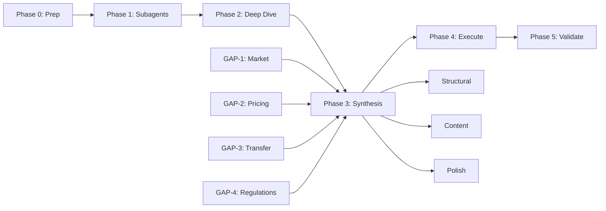

# Master Action Plan: Research Pack Cross-Validation & Enhancement

**Date:** 2026-03-31
**Status:** In Progress
**Goal:** Cross-validate methodology documents against business goals of Expertise Transfer and Selling AI Solutions; produce actionable improvement plan with subagent parallelization

---

## Executive Summary

This master action plan orchestrates parallel subagent investigations to fill knowledge gaps, validate assumptions, and produce evidence-based enhancements to the research pack. The plan follows a 4-wave execution model with explicit checkpoints and dependencies.

---

## Phase 0: Preparation & Baseline (Pre-Subagent)

### Task 0.1: Document Inventory
- [ ] **Action:** Create complete inventory of all documents in `docs/research/executive-research-technology-transfer/report-pack/`
- [ ] **Output:** `document_inventory.md` in `.opencode/plans/`
- **Owner:** This session (main agent)
- **Checkpoint:** All 9+ documents identified and categorized

### Task 0.2: Define Research Questions for Subagents
Based on initial analysis, define 4 critical research gaps:

| Gap ID | Research Question | Priority |
|--------|-------------------|----------|
| GAP-1 | What are current Russian AI market statistics for 2026? | Critical |
| GAP-2 | What are competitor pricing models for enterprise AI implementation in Russia? | High |
| GAP-3 | What are best practices for AI expertise transfer/BOT models? | High |
| GAP-4 | What are latest 152-FZ and AI regulations updates in Russia? | Medium |

### Task 0.3: Create Deep Research Output Directory
- [ ] **Action:** Ensure `docs/research/executive-research-technology-transfer/deep-researches/` is ready
- [ ] **Format:** Each subagent report to be saved as `deep-researches/[GAP-ID]_[subagent-name]_[date].md`

---

## Phase 1: Parallel Subagent Investigations (Week 1)

### Subagent 1A: Russian AI Market Intelligence (GAP-1)

**Research Questions:**
- Current GenAI adoption rates in Russia (2025-2026)
- Market size estimates and forecasts
- Key players and competitive landscape
- Recent regulatory developments affecting AI

**Search Queries:**
- "Russia GenAI market 2026 statistics adoption"
- "Yakov Partners AI economy Russia 2026"
- "CMO Club red_mad_robot GenAI survey 2025 2026"
- "Russian AI market size forecast 2030"

**Deliverable:** `deep-researches/GAP-1_russian_ai_market_2026.md`
**Checkpoint:** Minimum 5 authoritative sources, 2025-2026 data

---

### Subagent 1B: Competitor Pricing Analysis (GAP-2)

**Research Questions:**
- How do Russian system integrators price AI implementation?
- What are international best practices for AI project pricing?
- What is typical CapEx/OpEx split for enterprise AI in Russia?
- What are hidden cost factors in AI implementations?

**Search Queries:**
- "AI implementation pricing Russia system integrator 2025"
- "enterprise AI project cost breakdown Russia"
- "GenAI implementation fees consulting Russia"
- "AI project ROI measurement enterprise Russia"

**Deliverable:** `deep-researches/GAP-2_competitor_pricing_models.md`
**Checkpoint:** Minimum 3 competitor references, pricing ranges identified

---

### Subagent 1C: Expertise Transfer Best Practices (GAP-3)

**Research Questions:**
- What are industry-standard BOT (Build-Operate-Transfer) models for AI?
- How do top consulting firms (McKinsey, BCG, Bain) structure knowledge transfer?
- What are critical success factors for AI handover?
- What documentation and training is essential for transfer?

**Search Queries:**
- "build operate transfer AI model enterprise"
- "AI knowledge transfer framework best practices"
- "McKinsey AI implementation handover checklist"
- "enterprise AI CoE transfer playbook"

**Deliverable:** `deep-researches/GAP-3_expertise_transfer_bot_models.md`
**Checkpoint:** Minimum 3 framework references, transfer checklist drafted

---

### Subagent 1D: Russian Regulatory Update (GAP-4)

**Research Questions:**
- Any new AI-specific legislation in Russia (2025-2026)?
- Updates to 152-FZ implementation requirements
- Central Bank AI guidance for financial sector
- Data localization requirements for AI systems

**Search Queries:**
- "152-FZ changes 2025 2026 AI"
- "Russia AI regulation 2026 law"
- "Центральный банк AI рекомендации 2025"
- "Роскомнадзор AI обезличивание 2025"

**Deliverable:** `deep-researches/GAP-4_russian_regulations_update.md`
**Checkpoint:** Latest regulatory text references, compliance implications

---

## Phase 2: Document Deep Dive (Week 1-2)

### Task 2.1: Executive Summary Deep Analysis
- [ ] **Action:** Read and annotate both documents line-by-line
- [ ] **Document:** `20260325-research-executive-methodology-ru.md`
- [ ] **Focus:** SCQA flow, value proposition clarity, transfer narrative
- **Output:** `analysis_executive_summary.md`

### Task 2.2: Main Report Deep Analysis
- [ ] **Action:** Read and annotate main methodology report
- [ ] **Document:** `20260325-research-report-methodology-main-ru.md`
- [ ] **Focus:** Technical depth vs business orientation balance
- **Output:** `analysis_main_report.md`

### Task 2.3: Cross-Document Consistency Check
- [ ] **Action:** Compare metrics, timelines, and claims across documents
- [ ] **Focus:** KPI definitions, currency, transfer timeline
- **Output:** `consistency_matrix.md`

---

## Phase 3: Gap Synthesis & Master Plan Evolution (Week 2)

### Task 3.1: Subagent Findings Integration
- [ ] **Action:** Read all 4 subagent reports from Phase 1
- [ ] **Synthesis:** Identify how each finding affects document improvement
- **Output:** `subagent_findings_synthesis.md`

### Task 3.2: Evolved Master Plan Creation
- [ ] **Action:** Update original 16-section plan based on subagent findings
- [ ] **Include:** New priorities, specific edits, evidence-based changes
- **Output:** `20260331_research_pack_master_action_plan_v2.md` (THIS FILE)

### Task 3.3: Specific Edit Mapping
- [ ] **Action:** Map each improvement to specific file + line numbers
- [ ] **Format:** Table with | File | Section | Current State | Required Change | Rationale |
- **Output:** `specific_edit_map.md`

---

## Phase 4: Execution - Document Enhancements (Week 3-4)

### Group A: Structural Fixes (Parallel)

#### Edit A.1: Eliminate SCQA Duplication
- **File:** `20260325-research-report-methodology-main-ru.md`
- **Lines:** 59-68
- **Change:** Replace with cross-reference to executive summary
- **Rationale:** Remove 80% duplicate content

#### Edit A.2: Add Sales Enablement Section
- **File:** `20260325-research-report-methodology-main-ru.md`
- **Location:** After introduction
- **Change:** Add "Как использовать этот отчёт для продаж" subsection
- **Rationale:** C-level sales enablement requirement

#### Edit A.3: Standardize Currency Statement
- **Files:** Both documents
- **Location:** Introduction/Résumé
- **Change:** Add explicit "1 USD = 85 RUB" statement
- **Rationale:** Task requirement §17.1

---

### Group B: Content Enhancements (Sequential - depends on Phase 1)

#### Edit B.1: Update Russian Market Data
- **File:** Both documents (market statistics sections)
- **Change:** Replace 2025 data with verified 2026 data from Subagent 1A
- **Rationale:** Decision accuracy requirement

#### Edit B.2: Add Competitor Pricing Context
- **File:** Sizing report (if exists) or methodology
- **Location:** Economics section
- **Change:** Add competitor pricing ranges from Subagent 1B
- **Rationale:** Sales enablement

#### Edit B.3: Enhance Transfer Framework
- **File:** Both documents (transfer/alienation sections)
- **Change:** Add 3-dimensional transfer matrix from Subagent 1C findings
- **Rationale:** Unified framework requirement

#### Edit B.4: Update Regulatory Compliance
- **File:** Security/Compliance appendix
- **Change:** Add latest regulatory updates from Subagent 1D
- **Rationale:** Accuracy requirement

---

### Group C: Polish & Quality (Final)

#### Edit C.1: Citation Audit
- **Action:** Verify all inline citations have corresponding source entries
- **Output:** Cleaned "Источники" section

#### Edit C.2: Cross-Reference Verification
- [ ] Test all internal document links
- [ ] Fix broken references

#### Edit C.3: C-Level Readability Test
- [ ] Verify each section answers "So what?" for executives
- [ ] Add implication callouts where needed

---

## Phase 5: Validation & Sign-off (Week 4)

### Validation Checklist

| Check | Owner | Success Criteria |
|-------|-------|------------------|
| Business goal alignment | Main agent | Documents enable sales and transfer decisions |
| Structural coherence | Main agent | No duplication, clear hierarchy |
| Evidence base | Subagent findings | All claims traceable |
| Currency compliance | Edit C.1 | 85 RUB/USD stated |
| Russian market accuracy | Subagent 1A | 2026 data verified |
| Transfer timeline consistency | Main agent | No contradictions |
| C-level readiness | Main agent | <2 min comprehension per role |

### Sign-off Gate
- [ ] All Phase 4 edits complete
- [ ] Validation checklist 100%
- [ ] Subagent reports integrated
- [ ] Master plan updated to v2

---

## Resource Allocation

### Subagents (Parallel)
- **Subagent 1A:** Russian AI Market Intelligence (explore, 2 hours)
- **Subagent 1B:** Competitor Pricing Analysis (explore, 2 hours)
- **Subagent 1C:** Expertise Transfer Best Practices (explore, 2 hours)
- **Subagent 1D:** Russian Regulatory Update (explore, 2 hours)

### Main Agent Time
- Phase 0: 1 hour
- Phase 2: 2 hours
- Phase 3: 2 hours
- Phase 4: 3 hours
- Phase 5: 1 hour
- **Total:** ~9 hours

---

## Dependencies & Critical Path

**Critical Path:**
1. Phase 0 → Phase 1 (subagent execution blocks Phase 3)
2. Phase 3 synthesis must complete before Phase 4 edits
3. Phase 4 Group C depends on Group A/B completion

---

## Success Metrics

- [ ] 4 subagent reports delivered and saved
- [ ] Original 16-section plan evolved based on findings
- [ ] Specific edit map with file:line precision
- [ ] Zero duplication between executive summary and main report
- [ ] All market data verified for 2026
- [ ] Transfer timeline contradictions resolved
- [ ] Currency statement in both documents
- [ ] C-level "So what?" test passed

---

## Files Generated

| Phase | File | Location |
|-------|------|----------|
| 0.1 | document_inventory.md | .opencode/plans/ |
| 1A | GAP-1_russian_ai_market_2026.md | docs/research/.../deep-researches/ |
| 1B | GAP-2_competitor_pricing_models.md | docs/research/.../deep-researches/ |
| 1C | GAP-3_expertise_transfer_bot_models.md | docs/research/.../deep-researches/ |
| 1D | GAP-4_russian_regulations_update.md | docs/research/.../deep-researches/ |
| 2.1 | analysis_executive_summary.md | .opencode/plans/ |
| 2.2 | analysis_main_report.md | .opencode/plans/ |
| 2.3 | consistency_matrix.md | .opencode/plans/ |
| 3.1 | subagent_findings_synthesis.md | .opencode/plans/ |
| 3.2 | specific_edit_map.md | .opencode/plans/ |
| 3.2 | 20260331_research_pack_master_action_plan_v2.md | .opencode/plans/ |
| Final | Enhanced documents | docs/research/.../report-pack/ |

---

## Next Steps

1. **IMMEDIATE:** Launch 4 subagents in parallel for Phase 1
2. **After Subagents:** Synthesize findings in Phase 3
3. **Evolve Plan:** Create v2 master plan with evidence-based priorities
4. **Execute:** Apply edits in Phase 4 groups A/B/C
5. **Validate:** Final sign-off in Phase 5

---

**Plan Owner:** Main Agent Session
**Last Updated:** 2026-03-31
**Version:** 1.0 (Master - Pre-Subagent)
