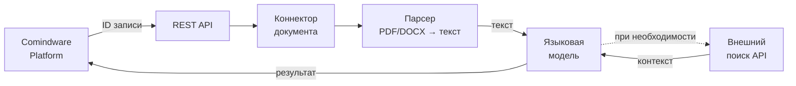
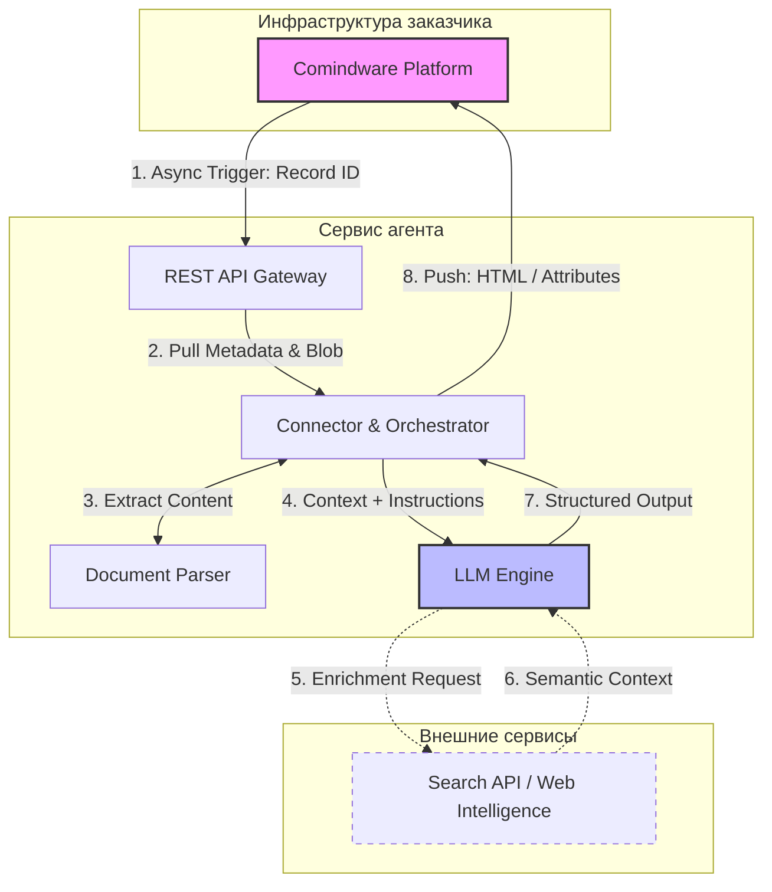

# Plan: Document Agent Architecture Report — Enhancements

## Goal

Enhance `20260420-document-agent-architecture-ru.md` with:
1. External systems integrations (from quick-start report)
2. Updated Mermaid diagram (matching colleague's design)

## External Integrations to Add

From `20260409-research-quick-start-rag-agent-ru.md`:

| External System | Use Case | Integration |
|:---|:---|:---|
| **ФНС (ЕГРЮЛ/ИП, РНП)** | Verify counterparty status (active, liquidation) | API |
| **1С (Предприятие 8.3+)** | Warehouse inventory, orders, counterparties | API |
| **Консультант+/Гарант** | Legal reference editions, court practice | API |

## Changes to Apply

### 1. Add a new section after "Интеграция с Comindware Platform" (~line 119)

Add after Section 5 (Интеграция с **Comindware Platform**):

```markdown
## Интеграция с внешними системами {: #external_systems }

Агент может подключаться к внешним системам для обогащения данных:

- **ФНС (ЕГРЮЛ/ИП):** проверка статуса контрагента, получение выписок, мониторинг изменений.
- **1С (Предприятие 8.3+):** остатки на складе, заказы, справочники контрагентов.
- **Консультант+/Гарант:** актуальные редакции документов, судебная практика.
- **Поисковые API (Yandex, Tavily, Exa):** веб-поиск для уточнения информации.

!!! note "Архитектура интеграции"

    Все интеграции реализуются через API-коннекторы на стороне агента. Агент определяет необходимость обращения к внешней системе и вызывает соответствующий инструмент.
```

### 2. Update Mermaid Diagram

Replace existing diagram (lines 47-57):

Current:


Replace with colleague's design:


### 3. Update Components Table

Update line 42 to be more explicit:

Before:
```
| **Поиск** | Проверка и обогащение данных из внешних источников (котировки, данные контрагентов) | Интеграция с API (Yandex, Tavily, Exa, 1C, Консультант+, ФНС) |
```

After:
```
| **Внешние интеграции** | ФНС, 1С, Консультант+, веб-поиск (Yandex, Tavily, Exa) | Обогащение данные через API |
```

## Checkpoint

- [ ] New section added (lines ~119–130)
- [ ] Mermaid diagram updated
- [ ] Components table updated
- [ ] Quick-start cross-reference added (optional)