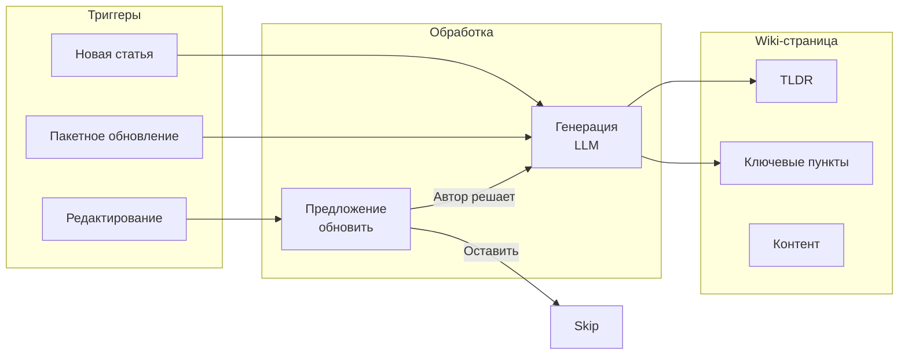
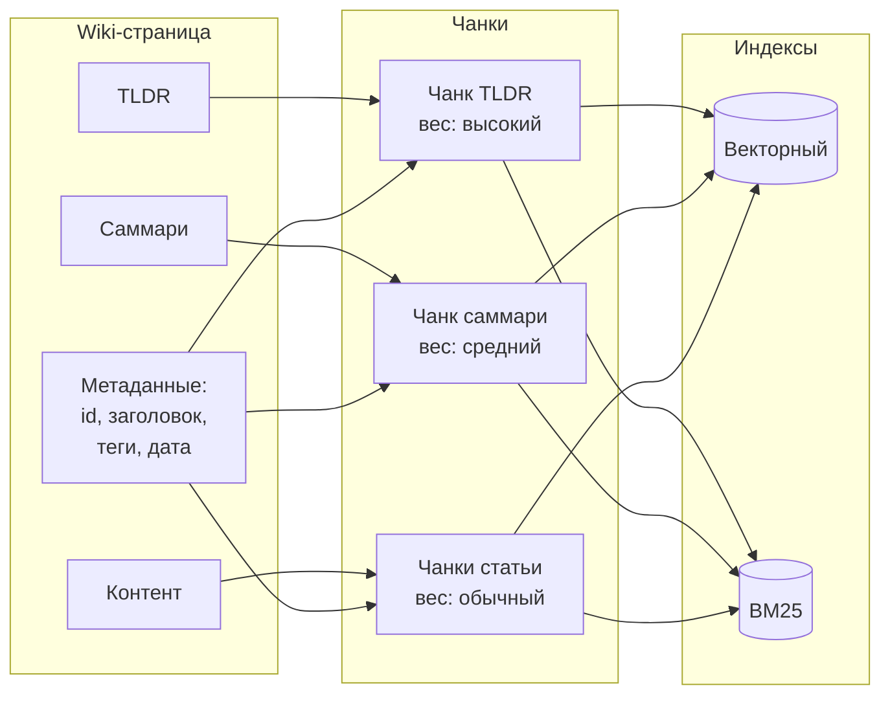
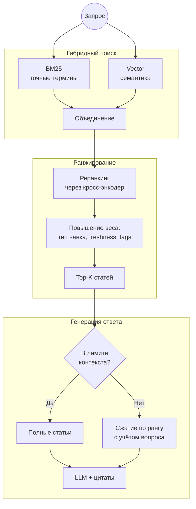

# Архитектура RAG-системы для корпоративной Wiki

## Обзор решения

| Проблема | Решение |
|----------|---------|
| Сложно найти информацию | Гибридный поиск (семантика + ключевые слова) с умным ранжированием |
| Статьи длинные | Автоматическое формирование TLDR и кратких обзоров (саммари) в Wiki, которые помогают быстро оценить релевантность статьи и используются при поиске |
| Знания устаревают | Инкрементальная индексация, приоритет свежим статьям, маркировка старых статей |

---

## 1. Обобщение страниц Wiki

**Логика:**

- **TLDR** — 2-3 предложения для быстрой оценки релевантности (размером в один чанк).
- **Саммари** — структурированный список ключевых фактов (размером в один чанк).
- **Новая статья** — автоматическая генерация TLDR и саммари.
- **Редактирование статьи** — предложение обновить TLDR и саммари; автор решает и может отредактировать результат.
- **Пакетная обработка** — генерация TLDR и саммари для статей без саммари.
- **Контроль авторов** — TLDR и саммари можно редактировать вручную.
- **Видимость** — TLDR и саммари доступны и пользователям Wiki, и RAG-агенту.

---

## 2. Индексация для RAG

**Логика:**

- **Иерархия чанков** — TLDR → Саммари → Статья (связаны через ID статьи).
- **TLDR и саммари** — индексируются как целостные чанки с повышенным весом.
- **Контент статьи** — разбивается на чанки с сохранением границ параграфов и блоков кода.
- **Два индекса** — векторный (семантика) + BM25 (точные термины).
- **Обогащение метаданными** — ID статьи, заголовок, теги, дата обновления.
- **Связь чанков** — для любого чанка можно получить полную статью через общий ID и смежные чанки.
- **Если саммари нет** — индексируются только чанки контента.
- **Инкрементальная индексация** — переиндексируются только изменённые страницы.

---

## 3. Гибридный поиск и генерация ответа

**Логика:**

- **Гибридный поиск** — BM25 (точные термины) + векторный (семантический), результаты объединяются с настраиваемыми весами.
- **Реранкинг** — кросс-энкодер оценивает релевантность с учётом типа чанка и свежести статьи.
- **Бусты** — TLDR/саммари-чанки весят выше контентных; новые статьи приоритетнее старых.
- **Группировка** — чанки объединяются по ID статьи и ранжируются, после чего для генерации ответа передаются полные статьи.
- **Бюджетирование контекста** — если Top-K статей не помещаются в контекстное окно LLM, низкоранговые статьи сжимаются с помощью LLM пропорционально рангу с учётом вопроса.
- **Цитаты**: автоматические ссылки на источники в ответе.

---

## 4. Борьба с устареванием

| Механизм | Описание |
|----------|----------|
| **Рейтинг свежести** | Возраст статьи влияет на ранжирование |
| **Предупреждения** | Маркировка устаревших источников в ответе |
| **Инкрементальная индексация** | Переиндексация изменённых страниц |

---

## Итого

| Задача | Реализация |
|--------|------------|
| **Улучшенный поиск** | Гибридный (BM25 + векторный) → ранжирование с приоритетами по типу и свежести контента |
| **Автосаммари** | Генерация TLDR и саммари по триггерам + редактирование авторами |
| **Адаптация Wiki для RAG** | Обогащение метаданными и иерархия чанков, два индекса, бюджетирование контекста |