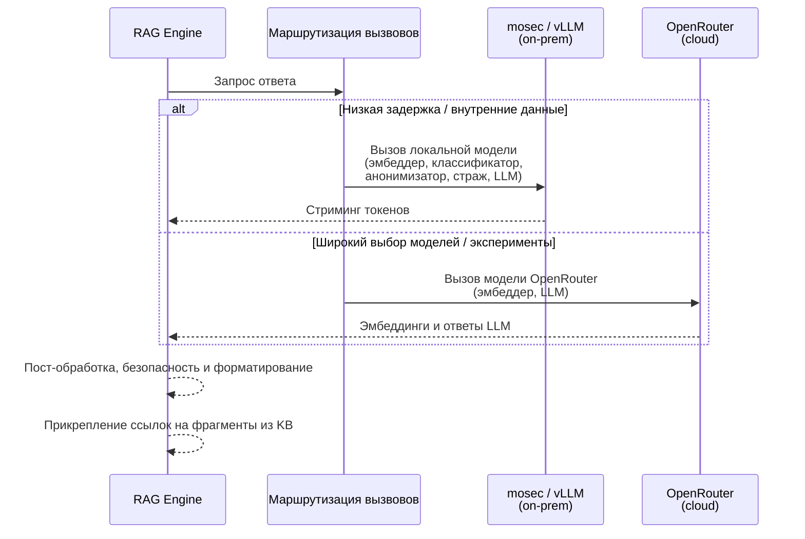

# CMW RAG Engine

Глубокая интеграция с платформой Comindware

**Цель демо (сегодня)**

- Показать, как RAG-движок встраивается в платформу Comindware
- Подчеркнуть ценность для команд поддержки и клиентов
- Пройтись по ключевым техническим решениям и расширяемости

<!--
Короткая история: «Мы построили RAG‑движок, который говорит на языке нашей базы знаний и наших инженеров и аккуратно встраивается в платформу Comindware».
-->

---

# Боли поддержки, которые мы закрываем

**Текущие сложности**

- Русская база знаний, английские тикеты и смешанная коммуникация замедляют поддержку
- Инженерам приходится вручную искать по `kb.comindware.ru` и разбирать длинные статьи
- Контекст о среде клиента и состоянии платформы разбросан по разным системам

**Что даёт движок**

- Единый RAG‑слой поверх данных Comindware и базы знаний
- Черновики качественных ответов на английском, которые русскоязычные инженеры могут проверить
- Объяснение сложного поведения платформы в сжатом, понятном для поддержки виде

<!--
Сделать акцент на «RAG как объединяющем слое» между базой знаний, состоянием платформы и LLM‑провайдерами.
-->

---

# Сквозной поток данных

```mermaid
flowchart LR
    A[Comindware UI<br/>Инженер поддержки] --> B[Демо‑коннектор<br/>(API / webhook)]
    B --> C[CMW RAG Engine API]
    C --> D[Query & context builder]
    D --> E[Vector store / index<br/>(KB, docs, tickets)]
    E --> F[Ranked relevant chunks]
    C --> G[Runtime metadata<br/>(tenant, product, version)]
    F & G --> H[LLM Orchestrator]
    H --> I[Inference providers<br/>mosec / vLLM / OpenRouter]
    I --> J[Draft answer<br/>+ citations + reasoning]
    J --> K[Comindware UI<br/>на проверку и отправку]
```

**Ключевые моменты**

- Движок находится за чёткой HTTP‑границей API
- Все ответы опираются на фрагменты из базы знаний и runtime‑метаданные
- Слой инференса легко заменяем: on‑prem (mosec/vLLM) и облако (OpenRouter)

<!--
Отдельно отметить, что мы никогда не отвечаем «только из модели» – всегда с подтянутым контекстом.
-->

---

# Интеграция инференса: mosec, vLLM, OpenRouter



---

# Интеграция инференса: дизайн‑решения

**Ключевые принципы**

- **Единый оркестратор**: одна абстракция для всех провайдеров
- **Маршрутизация по политике**: задержка, стоимость, чувствительность данных и требования к функциям
- **Единые контракты**: унифицированные лимиты токенов, temperature и safety‑хуки

<!--
Упомянуть реестр `MODEL_CONFIGS` и то, как мы прячем различия провайдеров от платформы.
-->

---

# Как это помогает инженерам поддержки

**Для русскоязычных инженеров, обрабатывающих английские тикеты**

- Движок читает английский тикет, ищет по русской базе знаний и собирает черновик ответа на английском
- Даёт прямые ссылки на русские статьи KB, чтобы инженер мог быстро проверить и доработать ответ
- Объясняет специфичные для платформы сценарии (например, процессы и настройки Comindware) простым английским

**Операционные преимущества**

- Более быстрые первые ответы и более стабильные рекомендации
- Меньше переключений между Comindware UI, базой знаний и внутренними инструментами
- Проще онбординг новых инженеров (движок подсвечивает «те самые» фрагменты из KB)

<!--
Пример: показать реальный тикет → выделить найденные фрагменты KB → финальный ответ на английском.
-->

---

# Ключевые технические решения

**Архитектурные решения**

- **Централизованный реестр моделей** с явными оконными размерами токенов и безопасными значениями по умолчанию
- **12‑factor, API‑first дизайн**, готовый к оркестрации со стороны Comindware
- **Провайдер‑агностичный RAG‑пайплайн** (mosec, vLLM, OpenRouter как взаимозаменяемые блоки)
- **Только "grounded" ответы**: строгая необходимость ретривала и цитат

---

# Следующие шаги

**Планы развития**

- Уплотнить интеграцию с UI Comindware (inline‑подсказки, шаблоны)
- Добавить больше телеметрии для настройки маршрутизации и промптов
- Расширить на многязычные сценарии и дополнительные продуктовые области

<!--
В конце пригласить к обсуждению, куда это в первую очередь должно приземлиться в продукте Comindware.
-->

