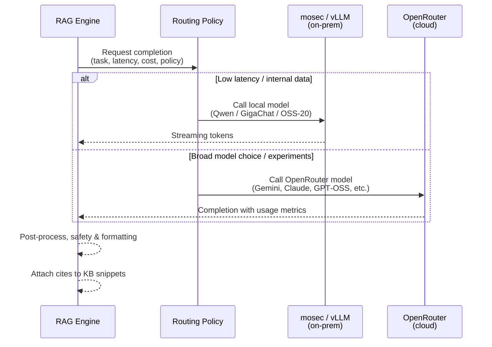

---
title: "CMW RAG Engine – Comindware Integration"
---

# CMW RAG Engine

**Deep integration with Comindware platform**

**Demo goal (today)**

- Show how the RAG engine plugs into the Comindware platform
- Highlight value for support teams and customers
- Walk through key technical decisions and extensibility

<!-- Presenter notes:
- Quick story: "We built a RAG engine that speaks the language of our KB and our engineers, and plugs cleanly into the Comindware platform."
-->

---
layout: default
title: "Support Pain Points We Solve"
---

**Current challenges**

- Russian KB, English tickets, and mixed-language communication slow down support
- Engineers must manually search `kb.comindware.ru` and interpret long articles
- Context about customer environment and platform state is scattered across systems

**What the engine delivers**

- Unified RAG layer on top of Comindware data + KB
- Drafts high-quality English answers that Russian-speaking engineers can verify
- Explains complex platform behavior in concise, support-ready language

<!-- Presenter notes:
- Emphasize "RAG as a unifying layer" between KB, platform state, and LLM providers.
-->

---
layout: default
title: "End‑to‑End Data Flow"
---

```mermaid
flowchart LR
    A[Comindware UI<br/>Support engineer] --> B[Demo connector<br/>(API / webhook)]
    B --> C[CMW RAG Engine API]
    C --> D[Query & context builder]
    D --> E[Vector store / index<br/>(KB, docs, tickets)]
    E --> F[Ranked relevant chunks]
    C --> G[Runtime metadata<br/>(tenant, product, version)]
    F & G --> H[LLM Orchestrator]
    H --> I[Inference providers<br/>mosec / vLLM / OpenRouter]
    I --> J[Draft answer<br/>+ citations + reasoning]
    J --> K[Comindware UI<br/>for review & send]
```

**Key points**

- Engine sits behind a clean HTTP API boundary
- All answers are grounded in KB snippets and runtime metadata
- Inference layer is pluggable: on‑prem (mosec/vLLM) and cloud (OpenRouter)

<!-- Presenter notes:
- Call out that we never answer "from the model alone" – always with retrieved context.
-->

---
layout: default
title: "Inference Integration: mosec, vLLM, OpenRouter"
---



**Design choices**

- **Single orchestrator**: one abstraction for all providers
- **Routing by policy**: latency, cost, data‑sensitivity, and feature needs
- **Consistent contracts**: unified token limits, temperature, and safety hooks

<!-- Presenter notes:
- Mention `MODEL_CONFIGS` registry and how we keep provider differences hidden from the platform.
-->

---
layout: default
title: "How It Helps Support Engineers"
---

**For Russian engineers handling English tickets**

- Engine reads English ticket, searches Russian KB, and drafts an English answer
- Links directly to Russian KB articles so engineers can quickly verify and adjust
- Explains platform‑specific workflows (e.g., Comindware processes, configs) in plain English

**Operational benefits**

- Faster first responses and more consistent recommendations
- Reduced context‑switching between Comindware UI, KB, and internal tools
- Easier onboarding for new engineers (engine surfaces the “right” KB fragments)

<!-- Presenter notes:
- Example: show a real ticket → highlight retrieved KB snippets → final answer in English.
-->

---
layout: default
title: "Key Technical Decisions & Next Steps"
---

**Key decisions**

- **Central model registry** with explicit token windows and safe defaults
- **12‑factor, API‑first design** ready for Comindware‑side orchestration
- **Provider‑agnostic RAG pipeline** (mosec, vLLM, OpenRouter pluggable)
- **Grounded answers only**: strict retrieval + citation requirement

**Next steps**

- Tighten UI integration in Comindware (inline suggestions, templates)
- Add more telemetry to refine routing and prompt strategies
- Extend to multi‑language workflows and more product areas

<!-- Presenter notes:
- Close by inviting feedback on where this should land first in the Comindware product.
-->

