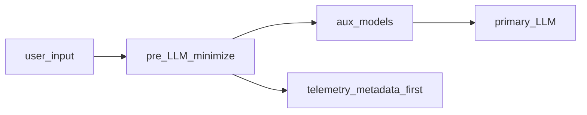

# Краткое изложение: Методология внедрения и отчуждения ИИ в российской инфраструктуре

**Проекты:** **корпоративный RAG-контур**, **сервер инференса MOSEC**, **инференс на базе vLLM**, **агентный слой платформы (CMW Platform)**
**Дата:** 2026-03-24
**Подготовлено для:** CEO, CTO, CFO
**Статус:** обновление от 2026-03-24

---

## Назначение документа и границы применения

Документ обобщает **методологию внедрения и отчуждения** решений класса корпоративных ИИ-ассистентов с RAG, локальным или облачным инференсом и агентными сценариями. Названия **корпоративный RAG-контур**, **сервер инференса MOSEC**, **инференс на базе vLLM**, **агентный слой платформы (CMW Platform)** используются как **условные обозначения ролей компонентов** иллюстративного референс-стека, а не как коммерческое предложение готового продукта.

**Фокус ценности:** воспроизводимые практики, пакет артефактов для передачи (knowledge transfer), критерии приёмки, комплаенс и управление рисками — материал пригоден для доработки руководством и стейкхолдерами и далее как **ориентир для продаж, передачи знаний и ИС, обучения команд и оценки новых проектов**.

**Сопутствующее резюме:** **Оценка сайзинга, КапЭкс и ОпЭкс для клиентов** — экономика, тарифы, дерево затрат; там же раздел **«Открытые веса и API: влияние на TCO»**.

---

## Резюме для руководства

**Ситуация:** в 2026 году GenAI оценивается по P&L, а в РФ добавляются требования суверенитета данных и регуляторные инициативы по ИИ.

**Осложнение:** без явного **периметра до LLM** (минимизация и обезличивание входа, разделение вспомогательных и основной модели, политика телеметрии) растут риски по 152-ФЗ и стоимость инцидентов; без **офлайн и онлайн eval** невозможно доказуемо связывать смену модели или индекса с качеством и бюджетом.

**Вопрос для решения:** как внедрять и масштабировать ассистентов на стеке **корпоративный RAG-контур** (RAG и доставка), **сервер инференса MOSEC** / **инференс на базе vLLM** (инференс) и **агентный слой платформы (CMW Platform)** (при сценариях CMW Platform), и **как отчуждать** экспертизу и артефакты клиенту без потери управляемости.

**Рекомендуемый ответ:** опереться на целевую операционную модель (роли, KPI, риски), поэтапный POC → Pilot → Scale, пакет отчуждения (код, конфигурация, данные, модели, runbook, обучение) и блок комплаенса (152-ФЗ, приказ Роскомнадзора № 140 о методах обезличивания, NIST AI RMF, guardrails), а также на **единую промышленную наблюдаемость** (трассировки и метрики по этапам RAG и агента, учёт токенов) с политикой данных, согласованной с ПДн. Закладывать **три оси гибрида:** резидентность и обработка ПДн, размещение вспомогательных моделей (эмбеддинг, реранг, гард, при необходимости NER/маскирование), размещение основной LLM. Глобальные шлюзы для coding agents (**OpenRouter**, **OpenCode Zen**) относить к **разработке и экспериментам**, а не к подразумеваемому продакшн-API для ПД в РФ без отдельной оценки — см. «Ориентиры для заказчика» и Compliance. Детали — в разделах TOM, внедрение, **Промышленная наблюдаемость**, отчуждение и Compliance ниже.

**Зоны готовности (ориентир для портфеля инициатив):** зелёная — политика данных и телеметрии согласованы с ДПО, eval и SLO зафиксированы; жёлтая — пилот без полного пакета отчуждения или без учёта приказа № 140 в процессах; красная — прод с ПДн без локализации/обезличивания или с полным текстом промптов в недоверенных SaaS.

**Управленческие компромиссы (горизонт 12–24 мес.):**

- **Облако (РФ API)** — быстрый старт и предсказуемый OpEx по токену vs зависимость от тарифов и политики провайдера.
- **On-prem / выделенный GPU** — CapEx и LLMOps vs контроль данных и устойчивость под высокую утилизацию.
- **Гибрид** — баланс затрат vs сложность оркестрации и единая обсервабильность.
- **Открытые веса российских LLM** — Сбер публикует GigaChat-3.1-Ultra и GigaChat-3.1-Lightning под **MIT** ([Hugging Face](https://huggingface.co/collections/ai-sage/gigachat-31), [GitVerse](https://gitverse.ru/GigaTeam/gigachat3.1), [обзор на Хабре](https://habr.com/ru/companies/sberbank/articles/1014146/)): расширяется сценарий **закрытого контура** и пакет отчуждения (веса + лицензия + фиксация версий) при росте доли **CapEx/OpEx GPU** и LLMOps; сравнение с оплатой по токенам — в сопутствующем резюме **Оценка сайзинга, КапЭкс и ОпЭкс для клиентов**.

**Примеры метрик успеха:** экономический эффект кейса (экономия FTE, снижение тикетов), доля ответов с проверяемой цитатой, SLO по задержке, покрытие red teaming / guardrails, готовность пакета отчуждения (чек-лист в конце документа).

**Ключевой инсайт:** успех внедрения на ~70% определяется операционной моделью и качеством данных, ~30% — выбором LLM; для госсектора и КИИ критичен контур **доверенных моделей** и локализация обработки.

- **Инженерия обвязки (harness)** для агентов — **операционный и передаваемый** актив: контекст в репо, инструменты, линтеры, циклы проверки; её тяжесть и декомпозиция задач имеет смысл **пересматривать при смене поколения модели** ([Anthropic — Harness design for long-running application development](https://www.anthropic.com/engineering/harness-design-long-running-apps)).
- **Отчуждение:** в пакет передачи закладывают версионируемые skills, регламенты MCP/CI и рубрики независимой оценки — см. раздел **«Инженерия обвязки для агентов (harness engineering)»** ниже.

---

## Целевая операционная модель (Target Operating Model)

Для масштабирования ИИ-решений рекомендуется переход от централизованного AI CoE к **федеративной модели** с сильным центром компетенций.

### Роли и ответственности
* **AI Product Owner:** Ответственность за бизнес-эффект (ROI), приоритизацию гипотез.
* **LLMOps / AI Architect:** Проектирование инфраструктуры (vLLM/MOSEC), мониторинг качества (RAGAS/DeepEval), целевая архитектура **телеметрии** (трассировки, метрики токенов и латентности, политика сэмплинга и ретенции) и согласование с ИБ при контурах с ПДн; совместно с владельцами разработки — **среда для агентов** (инструменты, линтеры, CI, контуры офлайн/eval и при необходимости мультиагентных циклов разработки — см. **«Инженерия обвязки для агентов»**).
* **AI Security Officer:** Комплаенс с 152-ФЗ и NIST AI RMF, аудит безопасности (Red Teaming).
* **Knowledge Engineer:** Подготовка и актуализация базы знаний (ChromaDB), управление онтологиями.

### Процессы и КПЭ (KPI)
* **Utilization:** % сотрудников, использующих ИИ ежедневно (цель: >60%).
* **Proficiency:** Сокращение времени на решение тикета/задачи (цель: -30-40%).
* **Accuracy:** Точность ответов без галлюцинаций (цель: >95% по результатам LLM-as-a-Judge).
* **Unit Economics:** Стоимость одного успешного ответа (P&L вклад).

**Независимые русскоязычные бенчмарки и методы оценки:** экосистема **MERA** ([mera.a-ai.ru](https://mera.a-ai.ru/)) на площадке **Альянса в сфере искусственного интеллекта** ([a-ai.ru](https://a-ai.ru/)) задаёт открытый контур сравнения фундаментальных моделей на русском языке; участие **MTS AI** и других организаций в таких инициативах иллюстрирует **отраслевую стандартизацию eval**, дополняющую внутренние метрики заказчика (RAGAS, DeepEval, LLM-as-judge). Отдельно как **методологический** (а не коммерческий) референс для настройки взаимной оценки моделей полезен разбор цикла улучшения **Cotype** с опорой на LLM-судей ([Хабр, MTS AI](https://habr.com/ru/companies/mts_ai/articles/892176/)): воспроизводимость на корпоративных данных требует явной фиксации промптов судей, эталонов и регрессионных наборов в пакете отчуждения.

---

## Методология внедрения (Этапы и Качество)

Рекомендуется 4-фазный подход, основанный на практиках **red_mad_robot** и **Just AI**:

### Фаза 1: POC (2-4 недели)
* **Цель:** Проверка технической осуществимости.
* **Артефакты:** Прототип на **корпоративный RAG-контур** с типовым инференсом через **сервер инференса MOSEC**, замер baseline-метрик; при кейсах платформы — задействование **агентный слой платформы (CMW Platform)**.
* **Контроль:** Успешное выполнение 10 критических сценариев.

### Фаза 2: Pilot (1-3 месяца)
* **Цель:** Валидация в промышленном окружении на ограниченной группе пользователей.
* **Инструментарий:** Развертывание инференса через **сервер инференса MOSEC** (или **инференс на базе vLLM** при высокой нагрузке на LLM), внедрение Guardrails; согласование нагрузки со стороны **корпоративный RAG-контур** и **агентный слой платформы (CMW Platform)**.
* **Контроль:** Замер ROI, сбор обратной связи (Human-in-the-loop).

### Фаза 3: Scale (3-12 месяцев)
* **Цель:** Enterprise-wide внедрение.
* **Архитектура:** Масштабирование LLM через **инференс на базе vLLM**, развитие **корпоративный RAG-контур** под нагрузкой; для операций с сущностями платформы — **агентный слой платформы (CMW Platform)**; при необходимости Multi-Agent Swarm (координатор/воркер).
* **Контроль:** Стабильность под нагрузкой (SLA 99.9%), соответствие бюджету (FinOps).

### Фаза 4: Optimize (Постоянно)
* **Цель:** Снижение TCO и повышение качества.
* **Методы:** DSPy для оптимизации промптов, квантование моделей, кэширование (LMCache).
* **Агентская разработка и сопровождение:** при зрелости команды и контура — регламент **мультиагентных** циклов (план → реализация → независимая проверка) и меры против **энтропии** документации относительно кода (периодическая синхронизация, «сборка мусора» артефактов) в духе отраслевой **инженерии обвязки** ([OpenAI — Harness engineering](https://openai.com/ru-RU/index/harness-engineering/), [Хабр](https://habr.com/ru/articles/1005032/)).

---

## Промышленная наблюдаемость LLM, RAG и агентов

Раздел задаёт **воспроизводимый каркас** для руководства и архитектуры: какие сигналы собирать, как связать их с качеством и FinOps и что учитывать в РФ при ПДн. Он **дополняет** справочные обзоры по паттернам агентов ниже по тексту и опирается на **открытые спецификации**, а не на единственный коммерческий продукт.

### Задача для бизнеса и эксплуатации

Без сквозной видимости по шагам пайплайна (поиск, вызов модели, инструменты агента) инциденты и регрессии качества разбираются дольше; без метрик токенов и задержек **невозможно** устойчиво связывать рост нагрузки с P&L. Для агентов критичны также **глубина цикла** (число итераций, повторы вызовов инструментов) и корреляция с [OWASP Top 10 for Agentic Applications (2026)](https://genai.owasp.org/resource/owasp-top-10-for-agentic-applications-for-2026/). Для **внутренних** процессов разработки с coding agents полезно отдельно учитывать **эпизоды harness** (план → реализация → проверка → итерация): суммарные токены, длительность и число циклов связывают с OpEx инженерии; количественные ориентиры — в сопутствующем резюме **Оценка сайзинга, КапЭкс и ОпЭкс для клиентов** ([Anthropic — Harness design for long-running application development](https://www.anthropic.com/engineering/harness-design-long-running-apps)).

### Сигналы: трассировки, метрики, события

Ориентир для **единого языка** телеметрии между приложением, шлюзами и бэкендом инференса — семантические конвенции **OpenTelemetry** для генеративного ИИ (статус спецификации на момент подготовки документа: **Development**; при миграции инструментария с более старых версений конвенций используется переменная окружения `OTEL_SEMCONV_STABILITY_OPT_IN`, в т.ч. значение `gen_ai_latest_experimental` — см. [документацию по спанам](https://opentelemetry.io/docs/specs/semconv/gen-ai/gen-ai-spans/) и [метрикам](https://opentelemetry.io/docs/specs/semconv/gen-ai/gen-ai-metrics/)).

- **Типовое дерево спанов для RAG/агента:** операции вроде `embeddings`, `retrieval`, `chat` (или `generate_content`), `execute_tool`; для агентских продуктов провайдера — также `invoke_agent` / `create_agent` там, где применимо к API ([перечень `gen_ai.operation.name`](https://opentelemetry.io/docs/specs/semconv/gen-ai/gen-ai-spans/)).
- **Корреляция:** идентификатор трассировки, при наличии — `gen_ai.conversation.id` (сессия/тред), чтобы связывать многошаговые диалоги и повторные вызовы.
- **Метрики клиента:** обязательная к поддержке в конвенциях — `gen_ai.client.operation.duration`; рекомендуется гистограмма `gen_ai.client.token.usage` по типам `input` / `output` (в т.ч. для **аллокации затрат** и сопоставления с биллингом API при наличии поля billable tokens у провайдера) — [описание метрик](https://opentelemetry.io/docs/specs/semconv/gen-ai/gen-ai-metrics/).
- **Метрики сервера инференса (self-hosted, vLLM и аналоги):** `gen_ai.server.request.duration`, `gen_ai.server.time_to_first_token`, `gen_ai.server.time_per_output_token` — для SLO по задержке, очередям и фазам prefill/decode ([метрики сервера](https://opentelemetry.io/docs/specs/semconv/gen-ai/gen-ai-metrics/)).
- **События политик:** срабатывания guardrails, отказы по политике, эскалации human-in-the-loop — как отдельные записи или атрибуты, согласованные с матрицей ИБ заказчика.

Дополнительно **OpenInference** описывает инструментирование ИИ-приложений совместимо с OpenTelemetry и поддерживается, в частности, в **Arize Phoenix** ([OpenInference](https://arize-ai.github.io/openinference/)); выбор бэкенда хранения трассов остаётся за заказчиком.

### Применимость в России: что не блокируется и где нужны оговорки

- **Открытые стандарты (OpenTelemetry, конвенции GenAI)** не привязаны к юрисдикции поставщика; их можно закладывать в проектирование **без ограничений**, сохраняя осознанность, что часть полей спецификации ещё в статусе **Development**.
- **Self-hosted** стеки наблюдаемости (в т.ч. **Langfuse** с открытым ядром, **Phoenix** + OpenInference, корпоративные стеки на Prometheus/Grafana/Tempo и аналоги) при размещении в контуре заказчика или в **облаке РФ** согласуются с типовыми требованиями к **локализации** обработки ПДн — при условии, что **содержимое** промптов и ответов не утекает за пределы разрешённого контура (см. следующий подраздел).
- **Зарубежные SaaS** наблюдаемости (например, **LangSmith**, облако **Arize**) **не запрещены** абстрактно, но для персональных и иных чувствительных данных и для регулируемых отраслей их использование в проде должно проходить через **ДПО, субобработчиков, резидентность** и явное решение по **запрету полного логирования** промптов/контекста без правовой базы. **Базовая рекомендация** для чувствительного продакшена в РФ: приоритет **on-prem / РФ-размещение** бэкенда телеметрии или режим без передачи текста запросов вне контура.
- **NIST AI RMF** и **профиль GenAI** полезны как **методологический** якорь функции **Measure** (измерение и мониторинг свойств системы) — [публикация NIST.AI.600-1](https://www.nist.gov/publications/artificial-intelligence-risk-management-framework-generative-artificial-intelligence); они **не подменяют** 152-ФЗ и отраслевые требования РФ. **EU AI Act** приводить только как **сравнительный** контекст обязанностей к логированию у поставщиков высокорисковых систем в ЕС, без выдачи этих обязанностей за нормы РФ без отдельного юридического заключения.

### Персональные данные и содержимое в телеметрии (152-ФЗ)

Спецификация OpenTelemetry для GenAI прямо предписывает: **по умолчанию не** записывать системные инструкции, полные сообщения и вывод модели в атрибуты спанов; для зрелого продакшена рекомендуется паттерн **внешнего хранилища контента** с **ссылками** в телеметрии и раздельным контролем доступа ([раздел о записи контента](https://opentelemetry.io/docs/specs/semconv/gen-ai/gen-ai-spans/)). Это согласуется с минимизацией обработки ПДн: маскирование, сроки хранения журналов, матрица доступа (SRE vs разработка) и исключение из экспорта в недоверенные SaaS без ДПО.

### Связь с оценкой качества (eval)

Офлайн- и прод-метрики (RAGAS, DeepEval, MERA, LLM-as-a-judge — см. выше по документу) усиливаются, если **идентификаторы трасс** или сессий связываются с оценками, рейтингами пользователей и результатами выборочного разбора. Это даёт регрессии после смены модели, индекса или промпта и обратную связь для дообучения без смешения с необезличенными логами в публичных облаках.

**Связка NIST AI RMF (функция Measure), ISO/IEC 42001 и операционного цикла:** профиль [NIST.AI.600-1 (Generative AI Profile)](https://www.nist.gov/publications/artificial-intelligence-risk-management-framework-generative-artificial-intelligence) задаёт измерение и мониторинг свойств генеративных систем; [сопоставление NIST AI RMF с ISO/IEC 42001](https://airc.nist.gov/docs/NIST_AI_RMF_to_ISO_IEC_42001_Crosswalk.pdf) помогает выровнять управленческую **AIMS** с уже принятой рамкой рисков. На уровне практики удобно разделять: **офлайн-оценки** (регрессия на фиксированных наборах до выката) и **онлайн-оценки** на живом трафике без эталонного ответа — см. концепции и гайды [LangSmith — Evaluation concepts](https://docs.langchain.com/langsmith/evaluation-concepts) и [онлайн-оценки в LangSmith](https://docs.smith.langchain.com/observability/how_to_guides/online_evaluations). Рекомендуемый цикл: мониторинг прод → выделение сбоев → превращение в воспроизводимые тест-кейсы → офлайн-eval → выкат → повторная проверка по метрикам и трассам. Направление развития официальных материалов NIST — [дорожная карта AI RMF](https://airc.nist.gov/airmf-resources/roadmap).

### Периметр до LLM: минимизация данных, обезличивание и обратимые подстановки

Для контуров с ПДн и для снижения объёма сырого текста, попадающего к внешней или облачной LLM, целесообразен **каскад до вызова основной модели**: (1) детерминированные правила для структурированных идентификаторов (телефоны, e-mail, реквизиты и т.п.) с валидацией где применимо; (2) при необходимости — контекстные фильтры и малые модели распознавания сущностей по языку/скрипту; (3) основная генерация по тексту с **семантическими плейсхолдерами**, при этом отображение пользователю может оставаться исходным за счёт **отображения обратно** по защищённому хранилищу соответствий (срок жизни сессии, контроль доступа). Такой шаблон согласуется с **минимизацией** обработки ПДн по 152-ФЗ и с рекомендациями [OpenTelemetry GenAI spans](https://opentelemetry.io/docs/specs/semconv/gen-ai/gen-ai-spans/) не писать полный текст запросов и ответов в атрибуты спанов по умолчанию. Инженерные ориентиры по качеству и режимам «быстрый путь / полный каскад» на синтетических корпусах поддержки приводятся в сопутствующем резюме **Оценка сайзинга, КапЭкс и ОпЭкс для клиентов** (юнит-экономика пре-LLM слоя).

**Исследовательские аналоги (не норма):** адаптивное разделение вычислений между периметром и облаком встречается в работах класса edge–cloud LLM routing (например, [HybridFlow](https://arxiv.org/html/2512.22137v4), [PRISM](https://arxiv.org/html/2511.22788v1)); их имеет смысл цитировать как направления НИОКР, а не как обязательную архитектуру поставки.

### Пакет отчуждения: что добавить по наблюдаемости

В таблицу **«Пакет отчуждения (минимально целостный)»** ниже по тексту включены отдельные строки по телеметрии; при передаче заказчику дополнительно фиксируют: владельца архитектуры наблюдаемости, перечень бэкендов, политику **сэмплинга** (в т.ч. полные трассы для ошибок / канареек), **ретенцию**, runbook разбора инцидента по `trace_id` и правила маскирования ПДн.

---

## Обзор текущей архитектуры CMW

В данном документе описывается методология внедрения и управления инфраструктурой ИИ в экосистеме CMW с фокусом на российские облачные провайдеры и локальный инференс. Архитектура основана на **модульном, контейнеризованном подходе**, объединяющем RAG-движок (**корпоративный RAG-контур**) с серверами инференса (**сервер инференса MOSEC**, **инференс на базе vLLM**), агентным слоем для CMW Platform (**агентный слой платформы (CMW Platform)**, по сценарию) и интеграцией с российскими облачными платформами.

Детальная экономика сайзинга, CapEx/OpEx и TCO — в сопутствующем резюме **Оценка сайзинга, КапЭкс и ОпЭкс для клиентов**. Технические детали развёртывания конкретных модулей — в публичной документации соответствующих программных компонентов экосистемы.

**Ключевые методологические принципы:**
- **Разделение ответственности:** Отдельные слои для обработки данных, поиска, инференса и доставки API.
- **Гибридный поиск:** Объединение векторного поиска (плотного) с ключевым (разреженным) для оптимальной точности.
- **Агентная архитектура:** Использование агентов LangChain для динамического вызова инструментов и рассуждения.
- **Гибкость инфраструктуры:** Поддержка как MOSEC (единый сервер), так и vLLM (распределенные инстансы) бэкендов инференса.
- **Российская суверенность:** Приоритет российских облачных провайдеров (Cloud.ru, Yandex Cloud, SberCloud, MWS GPT, Selectel и др. по контуру заказчика) для обеспечения соответствия требованиям о данных и инфраструктуре.

Публичные кейсы и платформенные описания крупных игроков рынка РФ (в том числе **МТС Web Services / MTS AI**) полезны как **каталог воспроизводимых инженерных и организационных идей** — гибридный ретрив, жизненный цикл агентов, интеграционные протоколы, аттестованные контуры для ПДн. Выбор поставщика и архитектуры остаётся за заказчиком по тендеру, требованиям ИБ и экономической модели; интегратор может опираться на такие материалы при выравнивании ожиданий и пакета отчуждения.

### Связанные проекты

**Экосистема CMW включает ключевые программные проекты (имена условные, обозначают роли компонентов):**

| Проект | Назначение | Архитектура |
|-------------|-----------|--------------|
| **корпоративный RAG-контур** | RAG-движок для поиска и генерации ответов | LangChain, Gradio, ChromaDB |
| **сервер инференса MOSEC** | Унифицированный сервер инференса (MOSEC) | Эмбеддинг, Реранкер, Охранник на одном порту |
| **инференс на базе vLLM** | Распределённый сервер инференса (vLLM) | LLM, KV-кэш, непрерывная пакетная обработка |
| **агентный слой платформы (CMW Platform)** | AI-агент для управления CMW Platform | 49 инструментов (27 CMW + 22 утилиты) |

### CMW Platform Agent: Агент для управления сущностями

**Проект:** **агентный слой платформы (CMW Platform)** (отдельный компонент экосистемы CMW, см. таблицу выше).

**Назначение:** ИИ-агент для создания и управления сущностями в CMW Platform на естественном языке.

**Архитектура:**
```
Слой интерфейса (Gradio)
    ↓
Ядро агента (оркестрация, доступ к LLM, состояние сессий)
    ↓
Слой инструментов (49)
    ├── Инструменты CMW Platform (27)
    │   ├── Приложения и шаблоны (6)
    │   ├── Атрибуты (15)
    │   └── Шаблоны и записи (6)
    └── Утилитарные инструменты (22)
        ├── Поиск и исследования (веб, Wikipedia, arXiv)
        ├── Исполнение кода (Python, Bash, SQL)
        ├── Анализ файлов (CSV, Excel, PDF, OCR)
        └── Математические операции
```

**Поддерживаемые поставщики LLM:**
- OpenRouter (по умолчанию) — 100K–2M токенов, полная поддержка инструментов
- Google Gemini — 1M+ токенов, сильные рассуждения
- Groq — низкая задержка инференса, 131K токенов
- Hugging Face — локальные и облачные модели
- Mistral — европейские модели
- GigaChat — российские модели

**Контекст для внедрения у заказчика в РФ:** значение «по умолчанию» для OpenRouter отражает **удобство исходной конфигурации разработки** (единый API, быстрые эксперименты), а не рекомендацию **промышленного** контура при персональных данных и требованиях суверенитета. В таких случаях целевой выбор инференса — **API российских облаков**, **on-prem** или иной маршрут из блока Compliance ниже и из сопутствующего резюме **Оценка сайзинга, КапЭкс и ОпЭкс для клиентов**.

**Ключевые возможности:**
- **Многоходовый диалог** — управление памятью в стеке LangChain
- **Потоковая выдача** — ответ по токенам через потоковый API
- **Изоляция сессий** — разделение пользователей и освобождение ресурсов
- **Локализация** — полная поддержка английского и русского
- **Восстановление после ошибок** — векторная классификация сбоев
- **Учёт токенов и бюджета** — фактический расход токенов и оценка стоимости

**Инструменты для отчуждения:**
| Компонент | Артефакт | Назначение |
|-----------|----------|-----------|
| Документация | Руководство для AI-агентов | Инструкции для агентов и контрибьюторов |
| Код | **агентный слой платформы (CMW Platform)** | 49 инструментов (платформа CMW и утилиты) |
| Тесты | Пакет поведенческих тестов | Регрессия и контракты инструментов |
| Конфигурация | Шаблон переменных окружения | Параметры окружения без секретов |

---

## Детальная архитектура внедрения

### Основные компоненты

| Компонент | Проект | Роль | Технология |
|-----------|------------|------|------------|
| **RAG-движок** | **корпоративный RAG-контур** | Оркестрация поиска, генерации и логики агентов | Python, LangChain, Gradio |
| **Сервер инференса (Унифицированный)** | **сервер инференса MOSEC** | Обслуживание моделей эмбеддинга, реранкера и охранника на одном порту | MOSEC, PyTorch |
| **Сервер инференса (Распределенный)** | **инференс на базе vLLM** | Обслуживание LLM и пулинг-моделей через vLLM | vLLM, CUDA |
| **Векторное хранилище** | **корпоративный RAG-контур** | Постоянное хранение встраиваний документов | ChromaDB (HTTP) |

### Поток данных и конвейер

1.  **Ингестия:**
    *   Документы (Markdown, MkDocs) обрабатываются модулем обработки документов RAG-движка.
    *   Разбиваются на чанки через токен-зависимый чанкер.
    *   Встраиваются через компонент эмбеддинга (FRIDA/Qwen3).
    *   Векторы и метаданные сохраняются в ChromaDB через слой векторного хранилища.

2.  **Поиск (RAG):**
    *   Пользовательский запрос поступает в конвейер ретривера.
    *   **Векторный поиск:** ChromaDB извлекает top-k чанков.
    *   **Реранкинг:** Кросс-энкодер или LLM-реранкер уточняет результаты.
    *   **Сборка контекста:** Статьи восстанавливаются, при необходимости суммируются (модуль суммаризации).

3.  **Генерация:**
    *   **Режим агента (Рекомендуется):** Агент LangChain анализирует запрос, принудительно вызывает инструмент извлечения контекста и генерирует ответ с цитатами.
    *   **Прямой режим:** Менеджер LLM генерирует ответ напрямую из найденного контекста.

4.  **Доставка:**
    *   **Веб-интерфейс:** Gradio ChatInterface в сервисном слое API RAG-движка.
    *   **API:** REST-эндпоинт `/api/query_rag`.
    *   **Виджет:** Встраиваемый HTML/JS виджет для внедрения на сторонние страницы.

### Конфигурация сервера инференса

#### MOSEC, vLLM и репозитории CMW

- **MOSEC** (апстрим, проект [mosecorg/mosec](https://github.com/mosecorg/mosec)) — открытый фреймворк **подачи ML-моделей через HTTP API**: быстрый веб-слой (Rust), логика воркеров на Python, динамическое батчирование запросов, поэтапные пайплайны и облачно-ориентированные практики (прогрев, graceful shutdown, метрики). Подробнее: [документация MOSEC](https://mosecorg.github.io/mosec/index.html).
- **vLLM** — высокопроизводительный **движок инференса** для больших языковых моделей с OpenAI-совместимым API, оптимизациями памяти и пакетной обработкой; описание сервера: [OpenAI-Compatible Server](https://docs.vllm.ai/en/stable/serving/openai_compatible_server.html).

**Репозитории CMW** (прикладные пакеты вокруг MOSEC и vLLM; подробности развёртывания — в публичной документации каждого модуля):

- **сервер инференса MOSEC** — прикладной пакет: управление процессом, реестр моделей (YAML), воркеры **эмбеддинга, реранкера и контент-охранника**, OpenAI-совместимые маршруты. **Одна сетевая точка** для вспомогательных моделей RAG — проще политики безопасности и сопровождение.
- **инференс на базе vLLM** — прикладной пакет: жизненный цикл процессов vLLM (загрузка моделей, проверки здоровья, конфигурация), в т.ч. режимы pooling для эмбеддингов/скоринга в поддерживаемых сборках vLLM. Ориентир: **максимальная производительность LLM** и гибкий выбор чекпоинтов под нагрузку.

#### Одна HTTP-точка и несколько серверных процессов

В **сервер инференса MOSEC** на **одном HTTP-порту** сосуществуют **разные роли** (эмбеддинг, реранг, модерация) в рамках **одного MOSEC-сервиса** с разными воркерами — это **не** размещение нескольких независимых процессов vLLM за одним портом. У **vLLM** распространённый паттерн — **отдельный серверный процесс на модель/конфигурацию**; несколько моделей обычно означает **несколько инстансов** (часто на разных портах) и маршрутизацию на стороне клиента, API-шлюза или балансировщика. Исключения и тонкости multi-GPU/репликации одной модели — по документации vLLM для выбранной версии.

#### Вариант А: унифицированный сервер (сервер инференса MOSEC)

- **Эксплуатация:** запуск объединённого сервиса через CLI пакета **сервер инференса MOSEC** (порт и активные модели задаются конфигурацией; типичный порт по умолчанию — 8001, см. поставляемую документацию).
- **Модели:** эмбеддинг, реранкер и охранник могут подключаться динамически в рамках поддержанного набора.
- **Выгоды для внедрения:** меньше сетевых конечных точек, проще обучение эксплуатации и отчуждение runbook-а клиенту; хороший старт для пилотов **корпоративный RAG-контур**.
- **Сайзинг:** VRAM делится между фактически загруженными моделями на узле; детальные оценки памяти публикуются вместе с пакетом **сервер инференса MOSEC** (артефакты замеров и методика — в документации репозитория).
- **Ограничения:** расширение модельного ряда упирается в то, что команда интегрировала в MOSEC-воркеры (меньше «произвольного зоопарка», чем у голого vLLM).

#### Вариант Б: распределённые инстансы vLLM (инференс на базе vLLM)

- **Эксплуатация:** отдельный процесс vLLM на выбранную модель и порт через CLI **инференс на базе vLLM** (точные флаги и примеры — в поставляемой документации **инференса на базе vLLM**).
- **Типичная схема сети:** отдельные порты для LLM, эмбеддинга, реранкера, охранника, если все роли вынесены на vLLM (например, 8100, 8101, 8105 — иллюстративно; фактические значения задаются политикой развёртывания).
- **Выгоды для внедрения:** зрелые GPU-оптимизации vLLM (в т.ч. KV-кэш, непрерывное батчирование), удобное горизонтальное масштабирование реплик под SLA по задержке и пропускной способности.
- **Сайзинг:** выше суммарный оверхед VRAM и число процессов; зато предсказуемее поведение под пиковый чат и длинный контекст при правильном шардировании и профиле **корпоративный RAG-контур** / **агентный слой платформы (CMW Platform)**.
- **Ограничения:** сложнее операционная картина (несколько сервисов); смена модели чаще требует перезапуска процесса по сравнению с динамической загрузкой в **сервер инференса MOSEC**.

Команды CLI, примеры портов и переменные окружения приведены в поставляемой документации **сервера инференса MOSEC** и **инференса на базе vLLM**; в этом документе зафиксированы архитектурный выбор, экономика и риски, без повторения пошагового runbook.

#### Три оси гибридного размещения и выбор бэкенда по типу модели

**Ось 1 — данные и ПДн:** где хранятся и обрабатываются исходные сообщения, индекс RAG, журналы; соответствует требованиям локализации и согласий.

**Ось 2 — вспомогательные модели:** эмбеддинг, реранг, контент-охранник, при необходимости слой маскирования/NER до LLM; часто совмещаются на одном унифицированном HTTP-сервисе (**сервер инференса MOSEC**) или распределяются по отдельным процессам (**инференс на базе vLLM** и др.) в зависимости от нагрузки и поддерживаемых форматов.

**Ось 3 — основная LLM:** управляемый API в РФ или self-hosted; здесь концентрируется основной счётчик токенов и требования к задержке.

На **оси 2** инженерные замеры на референс-стеке показали, что **разные классы моделей** не всегда допускают один и тот же серверный движок без потери корректности (например, корректный pooling для эмбеддингов и ограничения для генеративного реранкера). Это влияет на **число процессов, фрагментацию GPU и регрессионное тестирование** при обновлениях — количественные ориентиры и строки TCO вынесены в сопутствующее резюме **Оценка сайзинга, КапЭкс и ОпЭкс для клиентов**.



### Российские облачные провайдеры ИИ

Для соответствия требованиям о данных и инфраструктуре в России рекомендуются локальные облачные платформы и/или закрытый контур. **Все количественные тарифы** (₽ за токены, пакеты, ₽/час GPU) собраны в одном месте — раздел **«Тарифы российских облачных провайдеров ИИ»** в сопутствующем резюме **Краткое изложение: Оценка сайзинга, КапЭкс и ОпЭкс для клиентов (российский рынок)**; ниже — **роли провайдеров, состав моделей и правила сверки** без повторения таблиц. Дерево факторов стоимости и сценарный сайзинг — там же.

**Cloud.ru (Evolution Foundation Models)** · [[продукт]](https://cloud.ru/products/evolution-foundation-models) · [[тарифы]](https://cloud.ru/documents/tariffs/evolution/foundation-models)

- **API:** OpenAI-совместимый доступ к моделям в российских ЦОД.

- **Каталог (на [странице продукта](https://cloud.ru/products/evolution-foundation-models) перечислены позиции с идентификаторами Hugging Face `org/repo`):**
  - **GigaChat:** продуктовые имена GigaChat / Lite / Pro / **GigaChat-2-Max** и ветка **`ai-sage/GigaChat3-10B-A1.8B`** (сверка с линейкой 3.0 / 3.1 на Hub — отдельно).
  - **GLM (Zhipu, org `zai-org`):** **`GLM-4.6`**, **`GLM-4.7`**, **`GLM-4.7-Flash`** ([пример карточки](https://huggingface.co/zai-org/GLM-4.7-Flash)); крупное семейство **`GLM-5`** — на [HF](https://huggingface.co/zai-org/GLM-5).
  - **Qwen (Alibaba, org `Qwen`):** **`Qwen3-235B-A22B-Instruct-2507`**, семейства **`Qwen3-Coder-*`**, **`Qwen3-Next-80B-A3B-Instruct`**.
  - **T‑Tech:** линейки **`t-tech/T-lite-it-*`**, **`T-pro-it-*`**.
  - **Прочие текстовые LLM:** **`openai/gpt-oss-120b`**, **`MiniMaxAI/MiniMax-M2`**.
  - **Эмбеддинги и реранкинг:** **`BAAI/bge-m3`**, **`BAAI/bge-reranker-v2-m3`**, **`Qwen/Qwen3-Embedding-0.6B`**, **`Qwen/Qwen3-Reranker-0.6B`**.
  - **Речь и документы:** **`openai/whisper-large-v3`**, **`deepseek-ai/DeepSeek-OCR-2`**.

- **Тарификация:** оплата **по токенам** (входные и генерируемые — отдельно, см. [официальный прайс](https://cloud.ru/documents/tariffs/evolution/foundation-models)). **Все ₽/млн и расшифровка по строкам** (в т.ч. GigaChat3-10B-A1.8B, Qwen3-235B, GigaChat-2-Max, GLM-4.6, MiniMax-M2) — только в сопутствующем резюме, раздел **«Тарифы российских облачных провайдеров ИИ»**; маркетинговый перечень на сайте может быть **шире** прайса на дату сверки.

- **SKU vs Hub:** имя в биллинге **не** гарантирует ту же ревизию весов, что на Hugging Face, без явной проверки.

**Yandex Cloud (Yandex AI Studio / YandexGPT)** · [[модели]](https://aistudio.yandex.ru/docs/ru/ai-studio/concepts/generation/models.html) · [[тарификация]](https://aistudio.yandex.ru/docs/ru/ai-studio/pricing.html)

- **Модели (текст, базовый инстанс):** в обзорах и переговорах часто выделяют **YandexGPT Pro 5.1** и **Alice AI LLM**; полный перечень — [доступные генеративные модели](https://aistudio.yandex.ru/docs/ru/ai-studio/concepts/generation/models.html): Alice AI LLM; YandexGPT Pro 5.1 и Pro 5; YandexGPT Lite 5; DeepSeek V3.2; Qwen3 235B; gpt-oss-120b и gpt-oss-20b; Gemma 3 27B ([условия Gemma](https://ai.google.dev/gemma/terms)); дообученная YandexGPT Lite; YandexART и Realtime.

- **Тарифы:** первоисточник — [правила тарификации AI Studio](https://aistudio.yandex.ru/docs/ru/ai-studio/pricing.html): таблица Model Gallery, ₽ **с НДС** за **1000** токенов (входящие, кеш, инструменты, исходящие); для агентов — отдельно токены инструментов. Эквиваленты **₽/млн** и строки по моделям — в сопутствующем резюме. **Контекст рынка (не договорный прайс):** в публикации [AKM.ru](https://www.akm.ru/eng/press/yandex-b2b-tech-has-opened-access-to-the-largest-language-model-on-the-russian-market/) встречались ориентиры порядка **~0,5 ₽ за 1000** токенов (**~50 коп.**); они полезны как **иллюстрация прессы**, но **не** подменяют официальную таблицу на дату сверки (для сопоставимости с КП см. сопутствующее резюме).

- **Особенности:** **OpenAI-совместимый** доступ к ряду моделей; **интеграция с экосистемой Yandex Cloud** (данные, идентичность, смежные сервисы — по политике заказчика и документации Яндекса); линейка **YandexGPT / Alice** ориентирована в том числе на **русскоязычные** сценарии наряду с мультиязычными моделями в галерее.

**SberCloud (GigaChat API)** [[портал]](https://developers.sber.ru/portal/products/gigachat-api) · [[юридические тарифы]](https://developers.sber.ru/docs/ru/gigachat/tariffs/legal-tariffs)

- **Модели:** GigaChat-2 Lite, Pro, Max.

- **Тарифы:** пакеты токенов по [юридическим тарифам](https://developers.sber.ru/docs/ru/gigachat/tariffs/legal-tariffs); эквиваленты **₽/млн** и размеры пакетов — в таблицах сопутствующего резюме (тот же раздел **«Тарифы российских облачных провайдеров ИИ»**).

**Selectel (Foundation Models Catalog)** [[источник]](https://selectel.ru/services/cloud/foundation-models-catalog)

- Каталог с выделенным endpoint, API **совместим с OpenAI**; оплата за **CPU, GPU, RAM, диски**, не за токены. **Private Preview**, список моделей в панели (ссылки на HF). Свои веса **не** заявлены (FAQ на сайте).

**MWS GPT (МТС Web Services)** [[продукт]](https://mws.ru/mws-gpt/) · [[тарифы]](https://mws.ru/docs/docum/cloud_terms_mwsgpt_pricing.html)

- OpenAI-совместимый API, SLA **99,95%** (для части моделей), режимы **SaaS / hybrid / on-prem**. Прайс **без НДС** за 1000 токенов под внутренними именами; сопоставление с публичными названиями — у поставщика. **Цифры** (лендинг, таблица «Модель N», НДС) — в сопутствующем резюме, подраздел **MWS GPT**.

**VK Cloud (ML)** [[документация]](https://cloud.vk.com/docs/ru/ml)

- **Cloud ML Platform**, Spark, Cloud Voice, Vision — **без** публичного каталога готовых LLM в формате Evolution FM / AI Studio; типичный путь — **своя** модель и MLOps.

#### Матрица: управляемый API в РФ и открытые веса

| Контур | API в РФ | Self-host / HF | Примеры семейств |
| :--- | :--- | :--- | :--- |
| Cloud.ru Evolution FM | Да | Часто те же `org/repo`, что в каталоге FM | GigaChat, GLM‑4.6–4.7‑Flash, Qwen3‑235B / Coder / Next, gpt‑oss, MiniMax‑M2, T‑tech |
| Yandex AI Studio | Да | Отдельные модели на HF (в т.ч. кастомные лицензии) | YandexGPT, Alice, DeepSeek V3.2, Qwen3 235B, gpt‑oss, Gemma 3 |
| Sber GigaChat API | Да | **GigaChat 3.1** MIT на HF ([ai-sage](https://huggingface.co/ai-sage)) | Коммерческий API и открытые веса — разный TCO |
| Selectel FMC | Да (Private Preview) | Каталог → HF; свои веса не заявлены | Оплата **инфраструктура**, не токены |
| MWS GPT | Да | Публичный каталог HF не сведён | Прайс по кодам «Модель N» |
| VK Cloud ML | Нет LLM‑каталога в доке | BYO на ML Platform | Инфраструктура под **инференс на базе vLLM** / **сервер инференса MOSEC** |

**Типично только open weights (доставка в РФ — GPU‑облако или on-prem):** ниже — **родственные чекпойнты** на Hugging Face по группам; многие те же `org/repo`, что в каталоге **Cloud.ru Evolution FM** (количественный прайс и SKU — только у провайдера).

| Группа | Репозитории на Hugging Face (родственные модели) | Заметка для заказчика |
| :--- | :--- | :--- |
| **GLM (Zhipu, `zai-org`)** | [GLM-4.6](https://huggingface.co/zai-org/GLM-4.6) · [GLM-4.7](https://huggingface.co/zai-org/GLM-4.7) · [**GLM-4.7-Flash**](https://huggingface.co/zai-org/GLM-4.7-Flash) (более компактная ветка) · [GLM-5](https://huggingface.co/zai-org/GLM-5) (флагман MoE) | Линейка **4.6–4.7** и **GLM-5** — разный масштаб VRAM; **4.7-Flash** — типичный кандидат, когда нужен меньший след по железу при том же бренде |
| **gpt-oss (OpenAI)** | [openai/gpt-oss-20b](https://huggingface.co/openai/gpt-oss-20b) · [openai/gpt-oss-120b](https://huggingface.co/openai/gpt-oss-120b); варианты с фильтрацией: [gpt-oss-safeguard-20b](https://huggingface.co/openai/gpt-oss-safeguard-20b) · [gpt-oss-safeguard-120b](https://huggingface.co/openai/gpt-oss-safeguard-120b) | **Apache-2.0**; те же публичные имена, что у **Yandex AI Studio** и **Cloud.ru** FM, но хостинг и комплаенс — на стороне заказчика |
| **Qwen3 (`Qwen`)** | org [Qwen](https://huggingface.co/Qwen): MoE [Qwen3-235B-A22B-Instruct-2507](https://huggingface.co/Qwen/Qwen3-235B-A22B-Instruct-2507), [Qwen3-Next-80B-A3B-Instruct](https://huggingface.co/Qwen/Qwen3-Next-80B-A3B-Instruct); код: [Qwen3-Coder-30B-A3B-Instruct](https://huggingface.co/Qwen/Qwen3-Coder-30B-A3B-Instruct), [Qwen3-Coder-480B-A35B-Instruct](https://huggingface.co/Qwen/Qwen3-Coder-480B-A35B-Instruct) и др. | Семейство шире перечисления; сверять **лицензию**, **gated** и поддержку **vLLM/SGLang** по карточке |
| **GigaChat (открытые веса Сбера, `ai-sage`)** | [GigaChat3-10B-A1.8B](https://huggingface.co/ai-sage/GigaChat3-10B-A1.8B) (3.0) · [GigaChat3.1-10B-A1.8B](https://huggingface.co/ai-sage/GigaChat3.1-10B-A1.8B); крупный чекпойнт: [GigaChat3.1-702B-A36B](https://huggingface.co/ai-sage/GigaChat3.1-702B-A36B) | **MIT** на публичных весах; **GigaChat API** (SberCloud) и self-host — разный TCO (см. абзац ниже) |
| **MiniMax M2** | [MiniMaxAI/MiniMax-M2](https://huggingface.co/MiniMaxAI/MiniMax-M2) | На HF — **modified MIT** / особая лицензия в карточке; дублируется как SKU **Cloud.ru** FM — сверять прайс и условия |
| **DeepSeek R1 distill** | [DeepSeek-R1-Distill-Qwen-32B](https://huggingface.co/deepseek-ai/DeepSeek-R1-Distill-Qwen-32B) · [DeepSeek-R1-Distill-Llama-70B](https://huggingface.co/deepseek-ai/DeepSeek-R1-Distill-Llama-70B) и др. на `deepseek-ai` | Плотные модели разного размера под локальный инференс; рядом на Hub — полные ветки **DeepSeek-V3 / R1** (другой сайзинг) |
| **NVIDIA Nemotron 3** | [NVIDIA-Nemotron-3-Nano-30B-A3B-FP8](https://huggingface.co/nvidia/NVIDIA-Nemotron-3-Nano-30B-A3B-FP8) и др. в org [nvidia](https://huggingface.co/nvidia) | MoE, заявленный контекст до **1M** токенов ([обзор](https://research.nvidia.com/labs/nemotron/Nemotron-3/)); **не** готовый **API РФ** без своего контура |
| **Kimi (Moonshot)** | [moonshotai/Kimi-K2-Base](https://huggingface.co/moonshotai/Kimi-K2-Base); линейка K2.5 — в org [moonshotai](https://huggingface.co/moonshotai) | Часто IDE и агрегаторы; для КП — **не** baseline без явного контура и лицензии |

Все **числовые** ориентиры по управляемым API — в сопутствующем резюме **Краткое изложение: Оценка сайзинга, КапЭкс и ОпЭкс для клиентов (российский рынок)** (раздел **«Тарифы российских облачных провайдеров ИИ»**). Отдельно Сбер публикует **открытые веса** GigaChat‑3.1‑Ultra и Lightning под **MIT** ([Хабр](https://habr.com/ru/companies/sberbank/articles/1014146/)): экономика смещается в **CapEx/OpEx GPU** — см. **«Открытые веса и API: влияние на TCO»** в том же сопутствующем резюме.

**Паттерн «чекпойнт на Hugging Face + отдельная лицензия»** (не эквивалент permissive open source вроде MIT) меняет пакет отчуждения и учёт: у публичной ветки **YandexGPT-5-Lite-8B** применяется **кастомное лицензионное соглашение**, где при коммерческом использовании при достижении **10 миллионов выходных токенов в месяц** лицензиат в течение **30 календарных дней** после такого месяца обязан связаться с правообладателем для согласования дальнейшего использования, иначе лицензии прекращаются ([полный текст](https://huggingface.co/yandex/YandexGPT-5-Lite-8B-instruct/raw/main/LICENSE)). В том же тексте зафиксированы **применимое право РФ** и требования к **указанию авторства** при распространении — это входит в юридический контур передачи и в **мониторинг объёма генерации**, параллельно со сдвигом TCO в сторону **GPU и эксплуатации**, как у любого self-hosted чекпойнта.

**Идеи из открытой исследовательской публикации (не SLA коммерческих сервисов):** в обзорных материалах лабораторий перечисляются направления вроде **эффективных LLM** и оптимизации ([пример — дайджест за 2025 год](https://research.yandex.com/blog/yandex-research-in-2025)); как **инженерный ориентир** для PoC по памяти при длинном контексте полезен класс работ по **сжатию KV-кеша** ([arXiv:2501.19392](https://arxiv.org/abs/2501.19392), среди [принятых к ICML 2025](https://research.yandex.com/blog/papers-accepted-to-icml-2025)).

---

## Детальная методология отчуждения

### Ориентиры для заказчика: инструменты ускорения разработки (вне поставки CMW)

Ниже перечисленные продукты — **подсказки заказчику** для ускорения прототипирования и освоения практик разработки с ИИ; они **не** входят в коммерческую поставку референс-стека **корпоративный RAG-контур**, **сервер инференса MOSEC**, **инференс на базе vLLM**, **агентный слой платформы (CMW Platform)** и **не** заменяют промышленный контур RAG и инференса, описанный в этом документе.

**Важно:** продукт [OpenCode](https://opencode.ai/) (открытый AI coding agent) и внутренние каталоги планирования в репозиториях CMW — **разные сущности**; не смешивать их в переговорах и в договорной документации.

- **[OpenCode](https://opencode.ai/)** — открытый агент для кода; провайдеры и модели задаются конфигурацией. Каталог плагинов и интеграций сообщества: [Ecosystem](https://opencode.ai/docs/ecosystem/).
- **[OpenWork](https://github.com/different-ai/openwork)** — десктоп/UI-слой для команд поверх OpenCode (также перечислен в [Ecosystem](https://opencode.ai/docs/ecosystem/)).
- **[OpenCode Zen](https://opencode.ai/docs/zen)** — опциональный **платный** шлюз с отобранными моделями (beta); для контуров с **152-ФЗ** и суверенитетом данных **не** следует принимать как дефолт без оценки: хостинг и политики обработки данных определяются провайдерами шлюза (в т.ч. юрисдикция США). Бесплатные линейки на Zen могут иметь **ограниченный срок** и **особые условия использования данных** — см. официальный текст Zen.
- **[OpenRouter](https://openrouter.ai/)** — агрегирующий **API-шлюз** к множеству зарубежных провайдеров; типичное применение — **IDE, coding agents, прототипирование** (в т.ч. совместимо с конфигурацией **агентный слой платформы (CMW Platform)** в upstream). Для **продакшн-развёртывания ИИ-решений** у заказчиков в РФ с ПД и ожиданием локализации OpenRouter **не** является подразумеваемым baseline: маршрутизация к исполнителям за рубежом, биллинг и политики логирования/удержания данных задаются цепочкой провайдеров ([документация OpenRouter — logging и политики](https://openrouter.ai/docs/guides/privacy/logging)); без отдельной **юридической и ИБ-оценки** не подменяет API **Cloud.ru / Yandex Cloud / SberCloud / MWS GPT / Selectel** или закрытый контур.
- **Cursor** — коммерческая IDE с подпиской; ориентиры по токенам для сравнения — в сопутствующем резюме **Оценка сайзинга, КапЭкс и ОпЭкс для клиентов**.

**Практика для РФ:** снижение зависимости от зарубежного биллинга возможно за счёт **локальных моделей** и/или **API в РФ** там, где это допускает конфигурация выбранного инструмента и политика ИБ заказчика; доступность сервисов и условия использования нужно **проверять на дату** по официальным источникам и TOS. Итоговый контур согласовывается с комплаенсом и владельцем данных.

### Отчуждение данных
*   **Поддержка ChromaDB:** Штатные утилиты сопровождения (обслуживание коллекций, инспекция схемы) позволяют диагностировать, очищать и мигрировать.
*   **Удаление векторного хранилища:** Коллекции можно удалить через HTTP API ChromaDB или Python-клиент.
*   **Архивация документов:** Исходные документы (Markdown) остаются в файловой системе; векторные данные не теряются, если сохранен источник.

### Отчуждение моделей
*   **Обновление конфигурации:** Смена идентификаторов моделей через переменные окружения и файл конфигурации моделей (YAML).
*   **Горячая перезагрузка:** MOSEC поддерживает динамическую загрузку/выгрузку моделей (для vLLM требуется перезапуск).
*   **Версионирование:** Модели отслеживаются через HuggingFace Hub; откат изменением ID модели.
* **Открытые веса и лицензия:** при self-hosted чекпойнтах (в т.ч. GigaChat-3.1 под MIT — [Хабр, Сбер](https://habr.com/ru/companies/sberbank/articles/1014146/)) в пакет передачи входят идентификаторы релиза (HF/GitVerse), текст лицензии, политика фиксации версий, регрессионные eval при смене весов; интеграция с **инференс на базе vLLM** / **сервер инференса MOSEC** фиксируется в runbook.
* **Кастомные лицензии на публичные веса:** помимо permissive-лицензий хранить пороги по **выходным токенам**, календарные сроки уведомления правообладателя и условия атрибуции; иллюстративный полный текст — [Лицензионное соглашение YandexGPT-5-Lite-8B (файл на Hugging Face)](https://huggingface.co/yandex/YandexGPT-5-Lite-8B-instruct/raw/main/LICENSE).
*   **Реестр доверенных моделей:** публикация открытых весов **не заменяет** проверку допуска модели для госсектора и КИИ (см. раздел Compliance ниже).

### Отчуждение инфраструктуры

- **Завершение сервисов инференса:** штатная остановка через CLI соответствующего пакета (**сервер инференса MOSEC** или **инференс на базе vLLM**); детали — в поставляемой документации.
- **Завершение контейнера:** при развёртывании через Docker — стандартные процедуры остановки и удаления контейнеров.
- **Очистка ресурсов:** память GPU освобождается при завершении процесса; данные ChromaDB сохраняются на диске до явного удаления.

### Модели поставки и передачи (интеллектуальная собственность (ИС) и передача знаний)

| Модель | Суть | Типичный пакет на выходе | Риски для заказчика |
| :--- | :--- | :--- | :--- |
| **Управляемый сервис** | Эксплуатация и развитие у интегратора | SLA, отчёты, доступ к API; ограниченный доступ к коду | Зависимость от поставщика, границы ИС по договору |
| **Совместная разработка** | Команды заказчика и интегратора в одном контуре | Репозиторий, CI, совместные регламенты | Согласование скорости и приоритетов |
| **Построение — эксплуатация — передача (BOT, Build–Operate–Transfer)** | Сначала ввод в промышленную эксплуатацию силами интегратора, затем передача заказчику | Регламент эксплуатации (runbook), обучение, интенсивное сопровождение сразу после передачи (hypercare), права на код и конфигурацию по договору | Качество передачи и полнота документации |
| **Создание и передача (create–transfer)** | Разработка и передача заказчику «под ключ» без длительной эксплуатации у интегратора | Код, тесты, документация, сессии передачи знаний (KT — knowledge transfer) | Нужна внутренняя эксплуатационная готовность |

Модель **BOT** и факторы успешной передачи обобщены, в частности, в материалах [Luxoft — Build–Operate–Transfer](https://www.luxoft.com/blog/master-the-build-operate-transfer-bot-model-with-luxoft) и [InOrg — seamless handover](https://inorg.com/blog/from-build-to-transfer-key-success-factors-a-seamless-bot-model-transition).

При выборе **управляемой LLM-платформы** у инфраструктурного провайдера типовой пакет для юридической и закупочной сверки включает **лицензионные и иные условия ПО**, описание режимов **SaaS / hybrid / on-prem** и границ ответственности — иллюстрация: [специальные условия для ПО «MWS GPT»](https://mws.ru/docs/docum/lic_terms_mwsgpt.html). Публичная декомпозиция **платформы корпоративных агентов** (разметка, RAG, ops, интеграции) задаёт **чеклист владельцев** и артефактов передачи, переносимый на стек **корпоративный RAG-контур** / **агентный слой платформы (CMW Platform)** независимо от бренда ([MWS AI Agents Platform](https://mts.ai/product/ai-agents-platform/)).

### Пакет отчуждения (минимально целостный)

| Артефакт | Назначение |
| :--- | :--- |
| Исходный код и манифест зависимостей | Воспроизводимая сборка |
| Конфигурация без секретов + описание переменных окружения | Развёртывание у заказчика |
| Runbook эксплуатации (старт, стоп, бэкап, масштабирование) | Снижение bus factor |
| Наборы для оценки качества (eval) и регрессии | Контроль деградации после релизов |
| Политика наблюдаемости (сэмплинг, ретенция, маскирование ПДн) и схема экспорта телеметрии | Согласованность с 152-ФЗ и воспроизводимость разборов инцидентов |
| Дашборды и правила алертов (латентность, ошибки, токены, guardrails) | Эксплуатация и FinOps в одном контуре метрик |
| Описание данных и политика индексации RAG | Повторяемость ingestion |
| Политики ИБ и guardrails (черновик под ЛНА заказчика) | Согласование с комплаенсом |
| Матрица ролей и эскалаций | Эксплуатация и аудит |
| Регламент и реестр **Agent Skills** (версии, условия вызова) | Воспроизводимая агентская разработка и сопровождение |
| Конфигурация **MCP** и **CI** для агентов (allowlist, секреты, политика веток) | Контролируемая среда исполнения |
| **Рубрики и промпты** независимой оценки (evaluator), эталоны few-shot | Снижение «мягких» вердиктов LLM-only QA |
| Регламент **синхронизации док ↔ код** (периодические прогоны, ответственный) | Борьба с устареванием знаний в репозитории |

### Уровни обучения при передаче

| Аудитория | Фокус |
| :--- | :--- |
| Бизнес / владельцы продукта | Сценарии, KPI, ограничения и ответственность |
| Эксплуатация (DevOps / SRE) | Развёртывание, мониторинг, инциденты |
| Разработка / ML | Код, пайплайны, доработка промптов и инструментов |
| Комплаенс / ИБ | ПД, журналирование, доступы, требования регуляторов |

### Критерии приёмки передачи (чек-лист)

- Сборка из переданных артефактов воспроизводится на стенде заказчика без «скрытых» шагов.
- Пройдены согласованные сценарии eval; зафиксированы baseline-метрики.
- Runbook покрывает типовые сбои и контакты эскалации.
- Определены владельцы компонентов на стороне заказчика и дата окончания hypercare.
- По ИС: зафиксированы лицензии, сторонние компоненты и ограничения использования.

### Справочно: открытые стандарты OWASP и внешние программы обучения (не входят в поставку по умолчанию)

В пакет **отчуждения знаний** целесообразно включать **ссылочный каркас**: канонические URL [OWASP GenAI Security Project](https://genai.owasp.org/introduction-genai-security-project/) (LLM Top 10 2025, Agentic Top 10 2026, [AI Testing Guide](https://github.com/OWASP/www-project-ai-testing-guide)), при необходимости — [WSTG](https://owasp.org/www-project-web-security-testing-guide/stable/) и [ASVS 5.0 RU](https://github.com/OWASP/ASVS/blob/master/5.0/OWASP_Application_Security_Verification_Standard_5.0.0_ru.pdf). Русскоязычные дайджесты сообщества (например, [Habr — OWASP LLM TOP 10 2025](https://habr.com/ru/companies/owasp/articles/893712/)) удобны для онбординга, но **не** заменяют официальные тексты.

Коммерческие **курсы безопасности LLM** у третьих лиц (иллюстративный пример публичной программы — «Large Language Models Security» у [«Лаборатории Касперского»](https://www.kaspersky.com/about/press-releases/kaspersky-introduces-a-new-training-large-language-models-security), расписание и стоимость — только по сайту поставщика на дату закупки) могут дополнять подготовку ИБ и разработки заказчика; это **опция**, а не часть базовой поставки **корпоративный RAG-контур** / **сервер инференса MOSEC** / **инференс на базе vLLM** / **агентный слой платформы (CMW Platform)** без отдельного соглашения.

---

## Рекомендации по производственной эксплуатации (2026)

На основе исследования «Продвинутые подходы к RAG»:

1.  **Гибридный поиск:** Реализуйте BM25 + Плотный поиск для точности уровня enterprise (4-7,5% прирост).
2.  **Адаптивная маршрутизация:** Используйте анализ сложности запроса для прямой маршрутизации простых запросов в LLM, избегая ненужного поиска.
3.  **Самокоррекция:** Реализуйте механизмы критики для сложных запросов для уменьшения галлюцинаций.
4.  **Мониторинг и наблюдаемость:** Отслеживайте точность поиска, релевантность контекста и частоту галлюцинаций; закрепите **трассировки по этапам RAG/агента** и **метрики токенов и задержек** в духе раздела **«Промышленная наблюдаемость LLM, RAG и агентов»** и [OpenTelemetry GenAI](https://opentelemetry.io/docs/specs/semconv/gen-ai/gen-ai-spans/), с политикой данных для ПДн.
5.  **Длинные ответы и зацикливание:** для продакшена полезно измерять устойчивость генерации (повторы, «хвостовые» циклы). Сбер публично описывает борьбу с зацикливанием и связанные метрики в постобучении MoE-моделей GigaChat 3.1 ([Хабр](https://habr.com/ru/companies/sberbank/articles/1014146/)); на стороне заказчика показатели нужно воспроизводить на **своих** eval-сценариях, а не принимать как гарантию без замеров.

---

## Общие рекомендации

1.  **Для новых внедрений:**
    *   Начните с **сервер инференса MOSEC** для простоты (единый сервер).
    *   Используйте режим агента в **корпоративный RAG-контур** для динамического вызова инструментов.
    *   При сценариях управления CMW Platform подключайте **агентный слой платформы (CMW Platform)** и планируйте нагрузку на LLM/API совместно с **корпоративный RAG-контур**.
    *   Реализуйте гибридный поиск (BM25 + Вектор) для оптимальных результатов.

2.  **Для масштабирования:**
    *   Переходите на **инференс на базе vLLM** для инференса LLM (лучшая производительность).
    *   Масштабируйте **корпоративный RAG-контур** и **агентный слой платформы (CMW Platform)** отдельно по профилю трафика (RAG vs операции платформы).
    *   Используйте отдельные инстансы vLLM для эмбеддинга/реранкера/охранника для распределения нагрузки.
    *   Рассмотрите Kubernetes для оркестрации при масштабировании на несколько узлов.

3.  **Для отчуждения:**
    *   Архивируйте исходные документы перед удалением векторных данных.
    *   Перед выключением выполните диагностику состояния векторного хранилища штатными утилитами сопровождения.

---

## Практики и архитектуры RAG: NeuralDeep и продвинутая ретривальная инженерия

Конвейер **корпоративный RAG-контур** при отчуждении должен оставаться воспроизводимым: ingestion, чанкинг, эмбеддинги, LLM, реранкинг, выбор фреймворка, agentic-петля, eval и guardrails. Ниже — консолидированная разведка по NeuralDeep и паттернам @ai_archnadzor; первичные ссылки — в разделе «Источники».

### Извлекаемые уроки из публичных материалов OZON Tech (РФ)

Формулировки ниже — **не продвижение компании**, а переносимые управленческие и инженерные идеи с **краткой атрибуцией** первоисточникам Ozon Tech (Хабр, анонсы митапов). **Классический ML в поиске и рекламе, а также сценарные чат-боты с навыками, не тождественны GenAI/RAG**; использовать материалы как **аналогии** для ретривала, платформенного внедрения и MLOps, а не как замену стандартам вроде NIST AI RMF, практикам FinOps и принятому в организации пакету отчуждения.

- **Платформа вместо разовых ботов:** переход от узкой команды сценаристов к **no-code**-конструктору, **масштабирование на организацию** и цель **запуска нового бота за сутки** (против «не менее недели» в прежней модели), плюс поэтапный **MVP на одном боте** с последующим переносом остальных — близко к идее **федеративной TOM** и **платформенного** внедрения множества ассистентов, а не только одного RAG-контура ([Хабр, Ozon Tech](https://habr.com/ru/companies/ozontech/articles/834812/)).
- **Ретривал: не везде «только вектор»:** в задаче подсказок/текстового поиска обсуждаются компромиссы **ANN (эмбеддинги) vs обратный индекс**, фильтрация по бизнес-правилам в рантайме, **латентность и ресурсы**, интерпретируемость выдачи — по смыслу сонаправлено с **гибридным поиском** в RAG и с **FinOps-учётом стоимости и задержки** этапа извлечения ([Хабр, Ozon Tech](https://habr.com/ru/companies/ozontech/articles/990180/)).
- **MLOps-ритм:** в программе публичного митапа описана **ML-инфраструктура**, позволяющая **регулярно тестировать новую функциональность, обучать модели и автоматически выкатывать** их — перекликается с требованиями к **LLMOps, регрессиям и выкатке** в этом документе ([Хабр, Ozon Tech](https://habr.com/ru/companies/ozontech/articles/768734/)).
- **Отчуждение vs открытая инженерия:** публикации статей и **открытые репозитории** на GitHub — пример **обмена практиками** с рынком; это **не эквивалент** полноценному пакету передачи (код, данные, модели, runbook, IP, обучение) из раздела «Детальная методология отчуждения» в этом документе ([организация ozontech на GitHub](https://github.com/ozontech)).

### NeuralDeep: данные, модельный ряд, agentic RAG и безопасность

#### ETL и подготовка данных

*   **markitdown** — конвертация документов в Markdown [[GitHub]](https://github.com/microsoft/markitdown)
*   **marker** — быстрое извлечение текста из PDF [[GitHub]](https://github.com/datalab-to/marker)
*   **docling** — продвинутое извлечение данных из документов [[GitHub]](https://github.com/docling-project/docling)

#### Чанкование (Chunking)

*   **Chonkie** — быстрая и легковесная библиотека для чанкования [[GitHub]](https://github.com/chonkie-inc/chonkie)
*   LangChain text splitters [[GitHub]](https://github.com/langchain-ai/langchain/tree/master/libs/text-splitters)

#### Векторные модели для русского языка

*   **ai-forever/FRIDA** — российская модель, оптимизированная для русского
*   **BAAI/bge-m3** — мультиязычная модель
*   **intfloat/multilingual-e5-large** — мультиязычные эмбеддинги
*   **Qwen3-Embedding-8B** — большая мультиязычная модель

#### Суверенный стек одного вендора (опционально)

Помимо LLM из коллекции [GigaChat 3.1](https://huggingface.co/collections/ai-sage/gigachat-31) на Hugging Face у организации [ai-sage](https://huggingface.co/ai-sage) опубликованы коллекции [GigaEmbeddings](https://huggingface.co/collections/ai-sage/gigaembeddings), [GigaAM](https://huggingface.co/collections/ai-sage/gigaam) (модели для речи) и [GigaChat Lite](https://huggingface.co/collections/ai-sage/gigachat-lite). Их можно рассматривать при цели **единого открытого контура** под одним вендором весов; это **не** обязательная замена рекомендованных для **корпоративный RAG-контур** эмбеддингов (FRIDA, Qwen3 и т.д.): решение фиксируется в **ADR**, с eval качества RAG и проверкой **лицензии** на каждой карточке модели.

#### LLM и vLLM модели для русского сегмента

**Рекомендации сообщества по соотношению цена/качество:**

*   **t-tech/T-lite-it-1.0** — легкая модель для русского языка
*   **t-tech/T-pro-it-2.0** — продвинутая модель для русского языка
*   **Qwen3-30B-A3B-Instruct-2507** — рекомендуется для Agentic RAG [[GitHub]](https://github.com/vamplabAI/sgr-agent-core/tree/tool-confluence)
*   **RefalMachine/RuadaptQwen2.5-14B-Instruct** — адаптированная для русского

#### Реранкеры

*   **BAAI/bge-reranker-v2-m3** — мультиязычный кросс-энкодер
*   **Qwen3-Reranker-8B** — большая модель для реранкинга

#### Фреймворки для RAG

Одобрено сообществом NeuralDeep:
*   **Dify** — Low-code платформа для AI-приложений [[GitHub]](https://github.com/langgenius/dify/)
*   **AutoRAG** — автоматический RAG оптимизатор [[GitHub]](https://github.com/Marker-Inc-Korea/AutoRAG)
*   **LlamaIndex** — структурированная работа с данными [[GitHub]](https://github.com/run-llama/llama_index)
*   **Mastra** — AI-фреймворк для продакшена [[GitHub]](https://github.com/mastra-ai/mastra)

#### Agentic RAG архитектура

**SGR (Schema-Guided Reasoning)** — фреймворк для агентов от neuraldeep:
*   SGR Agent Core [[GitHub]](https://github.com/vamplabAI/sgr-agent-core) — 1k+ stars
*   Запуск и философия | SGR vs Tools | Бенчмарки
*   Agentic RAG на локальных моделях (Qwen3-30B-A3B)

#### Оценка (Eval)

*   **RAGAS** — метрики для RAG [[Docs]](https://docs.ragas.io/en/stable/)
*   **ARES** — автоматическая оценка RAG [[GitHub]](https://github.com/stanford-futuredata/ARES)

#### Безопасность

*   **NVIDIA NeMo Guardrails** — удержание бота в рамках темы [[GitHub]](https://github.com/NVIDIA-NeMo/Guardrails)
*   **Lakera / Rebuff** — детекторы инъекций [[Platform]](https://platform.lakera.ai/) [[GitHub]](https://github.com/protectai/rebuff)
*   **Garak** — сканер уязвимостей LLM [[GitHub]](https://github.com/NVIDIA/garak)

#### Кейс: RAG для ФСК (Строительная компания)

*   **Задача:** RAG-чат-бот для ФСК (5млн+ токенов) — B2B
*   **Результат:** Снижение нагрузки на команду поддержки на **30–40%**
*   **Архитектура:** Router-компонент + два workflow AI-агента
*   **Фокус:** Предотвращение галлюцинаций для минимизации репутационных рисков

### Продвинутая индексация, качество ответа и экономика ретрива (@ai_archnadzor)

Материалы канала **@ai_archnadzor** задают ориентиры по логике рассуждений, графам, задержке (TTFT) и стоимости индексации; конкретный выбор паттерна для **корпоративный RAG-контур** фиксируется в ADR и пакете отчуждения.

#### Disco-RAG: Логический анализ вместо «плоского супа» из фактов

**Концепция:** Внедрение теории риторических структур (RST). Модель понимает, где аргумент, где противоречие, где условие.

**Архитектура:**
*   **Intra-chunk RST Trees:** Для каждого чанка строится дерево связей (Nucleus/Satellite)
*   **Inter-chunk Rhetorical Graph:** Анализ отношений между чанками (дополняет/противоречит)
*   **Discourse-Aware Planning:** План ответа на основе графа связей перед генерацией

**Результат:** Превращает RAG из «читателя фактов» в «аналитика логики»

#### REFRAG: Ускорение RAG в 30 раз

**Проблема:** Огромный контекст убивает TTFT и «съедает» KV-Cache

**Решение:** Сжатие «сырых» чанков в компактные эмбеддинги через RoBERTa + селективное расширение через RL-политику

**Для кого:** Tier-1 системы с миллионами запросов, где важна скорость

#### Cog-RAG: Гиперграфы и «тематическое» мышление

**Концепция:** Двойные гиперграфы (темы и сущности) для имитации человеческого подхода «от общего к частному»

**Результат:** Win Rate выше на **84.5%** по сравнению с обычным RAG

**Вердикт:** Мощно, но дорого по индексации. Идеально для медицины и науки

#### HippoRAG 2: Экономим на графах в 12 раз

**Инновация:** Dual-Node архитектура (узлы-сущности + узлы-пассажи)

**Экономика:** Снижение затрат на токены при индексации в **12 раз** (9 млн токенов vs 115 млн)

**Стек:** `pip install hipporag`

#### Topo-RAG: Победа над «табличной слепотой»

**Проблема:** Линеаризация таблиц в один вектор превращает данные в «семантический шум»

**Решение:** Мульти-векторный индекс (каждой ячейке — свой вектор) + умный роутер

**Результат:** Снижение галлюцинаций в цифрах с **45% до 8%**. Маст-хэв для финтеха и логистики

#### DSPy 3 и GEPA: Промышленный промпт-инжиниринг

**DSPy 3:** LLM как вычислительное устройство. Архитектор описывает Signatures, система генерирует и оптимизирует код промпта

**GEPA (Genetic-Pareto Prompt Optimizer):**
*   Генетические алгоритмы для «скрещивания» лучших промптов
*   Языковая рефлексия — модель анализирует свои ошибки текстом
*   **Результат:** В **35 раз быстрее** MIPROv2, промпты в **9 раз короче**, на **10% точнее**

#### Новый «старый» OCR: NEMOTRON-PARSE, Chandra, DOTS.OCR

| Модель | Фокус | Выход | Для кого |
|--------|-------|-------|----------|
| **NVIDIA Nemotron (885M)** | Скорость и Enterprise RAG | Markdown / LaTeX | Высоконагруженные RAG-системы |
| **Chandra (~1B)** | Рукопись и точность | MD / JSON / HTML | Архивы, оцифровка |
| **dots.ocr (1.7B, MIT)** | Агенты и лицензия | MD / HTML | Коммерческие SaaS |

#### BitNet: 1-битные LLM для CPU-инференса

**Концепция:** 1-бит веса для Attention/MLP слоев + 8/16 бит для активаций

**Почему важно:**
*   **Edge AI:** Огромные модели теперь могут жить локально
*   **Снижение TCO:** CPU-инстансы на порядок дешевле GPU
*   **Гибридные кластеры:** Обучаем на GPU, деплоим на CPU

**Вердикт:** Не «убийца GPU» для обучения, но подтачивает монополию GPU на инференс

#### Doc-to-LoRA: Конец «налога на контекст»

**Проблема:** KV-кэш поглощает гигабайты VRAM для длинных контекстов

**Решение:** Гиперсеть генерирует LoRA-адаптер из документа за один проход

**Результаты:**
*   Потребление VRAM: **12 ГБ → 50 МБ** (99% экономия)
*   Скорость усвоения: **<1 секунда** (vs 100+ секунд при дообучении)
*   Требования: **<2 ГБ VRAM** (vs 40+ ГБ для градиентных методов)

---

## Паттерны промышленного RAG и защитных контуров

При проектировании корпоративных ассистентов (в т.ч. на базе **корпоративный RAG-контур**) мы опираемся на **классы архитектур**, а не на привязку к одному демонстрационному примеру: локальный vs облачный эмбеддинг и LLM, agentic-петля с инструментами, корректирующий RAG, гибридный поиск, граф знаний и мультимодальный ретрив. Отчуждение клиенту включает описание выбранного класса, конфигурацию индекса, политику guardrails и сценарии оценки качества. Ниже — обобщение типовых паттернов; иллюстративные примеры из открытых туториалов сведены в подраздел «Справочно»; первичная ссылка на подборку — в разделе «Источники» в конце документа.

### Классы RAG-агентов (обобщение)

| Класс | Назначение для клиента | Типовой технический смысл |
| ----- | ---------------------- | ------------------------- |
| **Agentic RAG (локальный контур)** | Суверенный PoC/Pilot без обязательной отправки данных наружу | Локальные эмбеддинги и LLM, векторное хранилище |
| **Agentic RAG (облако)** | Быстрый старт при допустимой передаче данных в управляемый API | Управляемые LLM + динамическая KB |
| **Agentic RAG (reasoning)** | Запросы, где важна явная цепочка рассуждений | Модель + инструменты рассуждения |
| **Corrective RAG (CRAG)** | Снижение галлюцинаций за счёт самопроверки и повторного поиска | Оркестрация + guardrails |
| **Knowledge Graph RAG** | Ответы с опорой на связи сущностей и цитирование | Граф + векторный поиск |
| **Hybrid Search RAG** | Точность поиска по смеси лексики и семантики | BM25 + dense embeddings |
| **Vision RAG** | Документы, схемы, сканы | Мультимодальные энкодеры + векторный индекс |

Для класса **Knowledge Graph RAG** публичный разбор на стороне **MTS AI** подчёркивает, что графовый слой оправдан при **сильно связанных** доменах (регуляторика, оргструктуры, каталоги с отношениями), а для «плоского» корпоративного документооборота достаточно часто оказывается достаточной связка векторного и лексического поиска — иначе растёт сложность внедрения без гарантированного выигрыша по качеству ([Хабр, MTS AI — граф в RAG](https://habr.com/ru/companies/mts_ai/articles/915276/)).

### Справочно: примеры из открытых RAG-туториалов

В материалах вроде подборки open-source LLM-приложений встречаются **конкретные связки стеков** (имена моделей и БД — ориентир для разведки, не обязательный стек поставки).

**Math Tutor Agent с обратной связью (иллюстративная схема):**

```
Query → Input Guardrails (DSPy) → Router
    ↓
    ├── KB Match (>threshold) → Qdrant Vector DB → GPT-4.1
    └── No Match → Tavily Web Search → GPT-4o
    ↓
Output Guardrails → Human Feedback Loop
```

- **Input Guardrails:** DSPy для фильтрации только академических вопросов
- **Knowledge Base:** Qdrant с OpenAI Embeddings, датасет JEEBench
- **Web Fallback:** Tavily API при отсутствии в KB
- **Output Guardrails:** Фильтрация галлюцинаций
- **Feedback Loop:** Логирование 👍/👎 для улучшения
- **Бенчмарк (в источнике):** 66% точность на 50 случайных JEE-вопросах

**Guardrails в RAG (типовые слои):**

- **Вход:** классификатор типа запроса, фильтрация вне области, проверка контекста безопасности
- **Выход:** блокировка галлюцинаций, соответствие теме, отсечение off-topic

### Иллюстративный опыт: внутренний RAG для поддержки (публикации МТС / MWS)

В открытом разборе **МТС** описан рабочий контур ассистента для саппорта на базе **Confluence** и **Jira**: **гибридный поиск** (pgvector + BM25), **локальные эмбеддинги** (в материале — BGE-m3) без обращения к внешнему API эмбеддингов, нормализация текста, чанкинг порядка **~3000** символов с перекрытием, раздельные конвейеры **индексации** и **поиска** с общей базой знаний. Это переносимый ориентир для класса **Hybrid Search RAG** и **Agentic RAG (локальный контур)** на референс-стеке **корпоративный RAG-контур** / **сервер инференса MOSEC**, независимо от выбора облака ([Хабр, МТС](https://habr.com/ru/companies/ru_mts/articles/970476/); смежная публикация — [Хабр, МТС](https://habr.com/ru/companies/ru_mts/articles/970392/)).

**Угрозы уровня GenAI и ретрива (сопоставление с OWASP LLM Top 10):** помимо прямых промпт-инъекций в чат актуальны **непрямые** (вредоносные инструкции во внешнем контенте, который модель суммирует или индексирует) и **сохранённые** (инструкции в данных, которые система многократно подмешивает в контекст). Поверхность атаки включает **слой поиска и векторного хранилища**: отравление корпуса, манипуляцию ранжированием и сценарии, где злоумышленник стремится вынудить ассистента **извлечь** из индекса конфиденциальные фрагменты и **оформить** их в ответе или действии. Обзор таксономии и бытовых мер (human-in-the-loop, минимизация прав) — у [Kaspersky (prompt injection)](https://www.kaspersky.com/resource-center/threats/prompt-injection); примеры векторов 2025 года — [Kaspersky — How LLMs can be compromised in 2025](https://www.kaspersky.com/blog/new-llm-attack-vectors-2025/54323/). Эти материалы используем как **внешнюю разведку угроз**, а не как обязательный стек продуктов.

**Антипаттерн (публичный разбор инцидента):** в red teaming [CodeWall описывает](https://codewall.ai/blog/how-we-hacked-mckinseys-ai-platform) цепочку, где классические уязвимости веб/API (в т.ч. SQL-инъекция) сочетались с тем, что **системные инструкции и guardrails хранились в той же базе**, что и данные, доступные приложению: компрометация БД позволила подменить политики и ослабить защиту RAG. Для промышленной архитектуры **корпоративный RAG-контур** это аргумент за **разделение** хранилища политик, секретов и пользовательского/корпоративного контента, жёсткое разграничение доступа API и регрессионные проверки после изменений схемы данных.

---

## Агенты, инструменты, память и обсервабильность (справочный обзор @ai_archnadzor)

Ниже — паттерны, влияющие на стоимость контекста, выбор CLI vs толстых протоколов, память агента и наблюдаемость в продакшене; при поставке **корпоративный RAG-контур** / **агентный слой платформы (CMW Platform)** они сверяются с целевой операционной моделью и пакетом отчуждения, а не принимаются как обязательный «золотой стек».

**Экспертное наблюдение (платформенный ассистент, естественный язык → действия):** пользовательский запрос опирается на **устойчивые контракты инструментов** — схемы параметров, семантика ошибок, идемпотентность там, где она уместна. Рост числа инструментов раздувает матрицу регрессии и риск **расхождения версий** между разработкой, приёмкой и продакшеном; в TOM и пакет отчуждения стоит включить политику **версионирования схем**, поэтапного включения инструментов и явных сценариев **деградации** (безопасный отказ или упрощённый ответ вместо необязательного вызова при сбое бэкенда). Переносимо на любой оркестратор и на внешнее потребление через протоколы вроде MCP: решает не бренд фреймворка, а **управляемость контракта и среды**.

**Сопоставление с публичной декомпозицией корпоративной платформы (иллюстрация):** на сайте **MWS AI** перечислены модули **MWS AI Agents Platform** — визуальный конструктор сценариев, **LabelX** (разметка), **autoRAG**, **OPS Level** (LLMOps / MLOps / AgentOps / observability), **AutoML**, **NER**, интеграционный хаб, модули продакшена (версии, алерты, масштабирование, роли) ([продукт](https://mts.ai/product/ai-agents-platform/)). Ниже — **логическое** сопоставление с целевой операционной моделью этого документа и пакетом отчуждения, без переноса маркетинговых KPI с лендинга.

| Публичный модуль (MWS AI) | Роли TOM (ориентир) | Артефакты отчуждения (ориентир) |
| --- | --- | --- |
| LabelX, AutoML | Knowledge Engineer; при необходимости ML-роль | Регламенты разметки, версии датасетов, описание дообучения |
| autoRAG | Knowledge Engineer, LLMOps / AI Architect | Конфигурация индекса, eval ретрива, сценарии регрессии |
| OPS Level | LLMOps / AI Architect; AI Security Officer (аудит) | Дашборды, политики алертов, журналы для комплаенса |
| Интеграционный хаб | LLMOps; владельцы смежных систем | Контракты API, секреты (вне репозитория), runbook интеграций |
| Прод-модули (версии, роли, масштабирование) | LLMOps; AI Security Officer | Матрица RBAC, процедуры релиза, SLO |

#### Semantic Gravity Framework: Физика против галлюцинаций

**Проблема:** Синдром «Yes Man» — модель пытается помочь даже с вредоносными запросами или галлюцинирует, чтобы «угодить» пользователю.

**Решение:** Использование физики и геометрии вместо убеждения промптами:

**Геометрия как карта истины:**
1.  **Matryoshka Slicing:** Обрезка векторов до 256 измерений (из 1536) — на 83% быстрее без потери качества.
2.  **SGI (Semantic Grounding Index):** Измеряет, куда «тянет» ответ модели:
    *   Если ответ (R) слишком близок к запросу (Q), но далек от контекста (C) → Sycophancy
    *   SGI = Дистанция(R, Q) / Дистанция(R, C)
    *   Если SGI < 1.0 → Агент «галлюцинирует»

**Физика как движок:**
*   Chain-of-Thought рассматривается как движение частицы в энергетическом поле
*   Высокая энергия = Конфликт между запросом и контекстом
*   Dynamic Beta: «Температура» системы (ниже для сленга, выше для юридических вопросов)

**Петля обратной связи:**
1.  LLM генерирует мысль
2.  Physics Engine считает SGI и энергию
3.  Если энергия слишком высока → мысль отклоняется
4.  Вбрасывается системное сообщение: "Previous thought rejected. Stick strictly to facts."
5.  LLM пробует снова

**Результаты:** 100% Safety Compliance в тестах на 10 индустриях.

#### GraphOS для RAG: 16-слойная архитектура

**Архитектура:**
*   Request Routers — экономия 47% на стоимости
*   Трехуровневая память (Redis + Neo4j)
*   Полный стек Observability

#### Nested Learning: Transformer 2.0

Концепция Google DeepMind (NeurIPS 2025):
*   Модели с «быстрыми весами» для текущей задачи и «медленными» для фундаментальных знаний
*   Модуль HOPE (Higher-Order Processing Engine)
*   Способность к Continual Learning

#### LEANN: Самый маленький векторный индекс в мире

**Инновация:** Вычисление эмбеддингов по требованию вместо хранения векторов

**Результаты:**
*   Индексация 60 миллионов текстовых чанков
*   Классический VectorDB: ~201 ГБ
*   LEANN: ~6 ГБ (97% снижение)

**Применения:**
*   Настоящий Offline-First
*   Приватность: 100% локальный запуск без передачи данных в облако
*   Интеграция с Claude Code и Ollama

#### OpenClaw (ex-Moltbot): Self-Hosted AI Agent

**GitHub:** 170,000 звезд за одну неделю

**Архитектура (4 слоя):**
1.  Gateway: WebSocket-маршрутизация
2.  Runtime: Управление состоянием, выполнение инструментов
3.  Providers: Единый API для Cloud/Local моделей
4.  Integration: Адаптеры каналов (Telegram, Slack, Discord, WhatsApp)

**Безопасность:**
*   Требуется Docker-изоляция
*   Включить auth.mode: "token" и sandbox: "docker"
*   Аудит: `openclaw security audit --deep`

#### Perplexica: Open Source клон Perplexity

**Архитектура:**
1.  Intent Classification —классификация намерения
2.  Search Query Generation —генерация поисковых запросов
3.  Aggregated Search —агрегированный поиск (SearXNG)
4.  Reranking —переранжирование (эмбеддинги)
5.  Answer Generation —генерация ответов с цитатами

**Особенности:** Ollama-поддержка (полный локал), API-first (/api/search, /api/chat)

#### Guardrails: Архитектурный паттерн №1 для эпохи AI-агентов

**Стек 2026:**
*   **Guardrails AI (v2.x):** Структурная валидация, кросс-модельный аудит галлюцинаций
*   **NeMo Guardrails:** Контроль диалогового потока, ограничение тем
*   **Llama Guard 4 / ShieldGemma:** Классификаторы безопасности в реальном времени

**Мониторинг:** HiveTrace для глубокого трассирования агентов, визуализация Chain-of-Thought, обсервабилити безопасности

**Архитектура слоев:**
1.  Input Rails: Защита от промпт-инъекций
2.  Logic/Tool Rails: Валидация параметров перед вызовами функций
3.  Output Rails: Проверка соответствия политике бренда
4.  HiveTrace: Полная видимость и отладка

#### EffGen: Нативный Agentic Framework для SLM

**Проблема:** LangChain/AutoGen «съедают» контекст SLM своей обвязкой

**Результаты на 13 бенчмарках:**
*   Модель 1.5B + EffGen обходит LangChain/AutoGen
*   +11.2% эффективности для моделей 1.5B
*   +2.4% эффективности для моделей 32B

**Архитектура (4 столпа):**
1.  **Сжатие промптов:** 70-80% снижение
2.  **Маршрутизация по сложности:** 5-факторная триаж-система
3.  **Интеллектуальная декомпозиция задач:** Параллельные подзадачи
4.  **Унифицированная система памяти:** Краткосрочная/долгосрочная + векторное хранилище

**Протоколы:** MCP + A2A + ACP

#### CLI заменяют MCP: Секретное оружие AI-агентов

**Проблема MCP:**
*   Context Bloat: 30-40% оверхед от сброса схем
*   Хрупкие зависимости: Сервер, хэндшейк, WebSocket
*   Сложное тестирование: Нельзя просто запустить одну команду

**Почему CLI идеален для агентов:**
1.  Zero overhead: Просто `--help` для понимания
2.  Композиция: Нативные пайпы и jq
3.  Структурированный вывод: Флаг `--json`
4.  Exit Codes: 0 = успех, 1 = ошибка

**Паттерн:** Бинарник + файл SKILL.md

#### Память AI-агентов: Почему векторный поиск не всегда достаточен

**Тезис:** Будущее автономных агентов — не «плоский суп» векторов, а связка Онтологии + Графы.

**Почему онтологии критичны:**
*   Без: Факт «Юзер перешел на Pro-план во вторник» = текстовый фрагмент
*   С онтологией: Структурированное событие PlanChange, связывающее Customer + Subscription + timestamp

**4 типа графовой памяти:**
1.  Knowledge Graphs: Фактический скелет
2.  Hierarchical Graphs: Возможность масштабирования
3.  Temporal Graphs: История изменений
4.  Hypergraphs: Сложные N-арные отношения

#### Multimodal LLM: Как устроено «зрение» и «слух»

**Архитектура:**
1.  Modal Encoders: ViT (изображения), Whisper (аудио)
2.  Alignment Mechanism: Проектор (MLP/Q-Former)
3.  LLM Backbone: Единое пространство рассуждений

**Два подхода:**
*   **Modular:** LLaVA, Qwen-VL (замороженный LLM + энкодер + проектор)
*   **Monolithic:** Fuyu-8B (нативное мультимодальное обучение)

**Применения:**
*   Document AI 2.0: Не нужен отдельный OCR
*   VQA: Графики, медицинские снимки, поиск дефектов
*   GUI Agents: Агенты, которые «смотрят» на экран как люди, без доступа к DOM

#### Полный локальный стек обсервабильности

**Стек:** vLLM + LangGraph + Arize Phoenix

**Установка:**
```bash
pip install arize-phoenix-otel openinference-instrumentation-langchain langchain-openai

from phoenix.otel import register
tracer_provider = register(
    project_name="local-agent-research",
    endpoint="http://localhost:6006/v1/traces",
    auto_instrument=True
)
```

**Что вы получаете:** Визуализация Spans & Traces, входные/выходные данные инструментов, метрики токенов и latency

#### Типы AI-агентов

1.  **Реактивная:** Стимул → Реакция (термостат)
2.  **Делиберативная:** Сначала думаем, потом делаем (шахматист)
3.  **Гибридная:** Быстрые рефлексы + глубокое планирование (водитель)
4.  **BDI (Когнитивная):** Beliefs, Desires, Intentions
5.  **Мультиагентные системы (MAS):** Команда узких специалистов

#### GenAI в продакшене: Технологический манифест

**5-слойная архитектура:**

1.  **Слой ретрива (RAG 2.0):**
    *   Ingestion: Unstructured.io / LlamaParse
    *   Hybrid Search: BM25 + Vector
    *   Reranking: BGE-Reranker / Cohere
    *   Query Expansion: Multi-query generation

2.  **Слой оркестрации:**
    *   State Management: LangGraph (не линейные цепочки)
    *   Tool Calling: Нативный JSON-output (instructor/outlines)
    *   Router: Быстрая модель для классификации запросов

3.  **Промпт-инжиниринг как код:**
    *   Templating: Jinja2
    *   Optimization: DSPy
    *   Structured Output: JSON Schema

4.  **Оценка и Guardrails:**
    *   Метрики: RAGAS / G-Eval
    *   Безопасность: NeMo Guardrails / Pydantic Guard
    *   HITL: Подтверждение человека для критических действий

5.  **Инфраструктура:**
    *   Inference: vLLM / TGI
    *   Caching: GPTCache (Redis)
    *   Observability: Arize Phoenix / LangSmith

**Золотой стандарт стека:**
*   LLM: Claude 3.5 Sonnet / Llama 3.1 70B (локально)
*   Orchestrator: LangGraph
*   Vector DB: Qdrant / pgvector
*   Eval: DeepEval
*   Monitoring: Arize Phoenix

---

## MCP, мультиагентная маршрутизация и воспроизводимые навыки

**Model Context Protocol (MCP)** для нас — это способ **формализовать границу доверия** между LLM и инструментами: отдельные процессы-серверы с явными правами, проще аудировать и передавать клиенту при отчуждении (конфигурация серверов, политика секретов, allowlist URL и путей). Маршрутизация запросов к разным наборам инструментов — шаблон проектирования для сложных сценариев (код, безопасность, исследование, доменные интеграции), а не реклама конкретных вендоров.

**Риски агентских контуров:** чем больше подключено MCP-серверов и внешних API, тем шире класс сценариев «инструмент вызван легитимно, но **вредоносно**» (злоупотребление полномочиями, цепочки делегирования, подмена целей). Официальный ориентир — [OWASP Top 10 for Agentic Applications (2026)](https://genai.owasp.org/resource/owasp-top-10-for-agentic-applications-for-2026/); иллюстративное сопоставление категорий угроз с практикой SecOps — [Kaspersky — Agentic AI security measures and OWASP ASI Top 10](https://www.kaspersky.com/blog/top-agentic-ai-risks-2026/29988/) и вебинар [Securelist — AI agents vs. prompt injections](https://securelist.com/webinars/ai-agents-vs-prompt-injections/). Это **не** замена внутренней модели угроз заказчика и **не** требование закупки конкретного вендора.

### Корпоративный слой API и MCP (пример MWS Octapi)

**МТС Web Services** позиционирует **MWS Octapi** как интеграционную платформу с поддержкой **MCP (Model Context Protocol)** для подключения ИИ-агентов к корпоративным API и экосистемным сервисам ([продукт](https://mws.ru/dev-tools/octapi/)); в новостных материалах провайдера приводятся количественные эффекты ускорения создания агентских решений — их следует трактовать как **заявления поставщика**, а не как независимо верифицированный benchmark для КП ([новость MWS](https://mws.ru/news/mts-web-services-na-30-uskorila-sozdanie-ii-agentov-pri-pomoshhi-platformy-mws-octapi/)). Инженерный смысл для методологии: отдельный **шлюз управления API**, политики, наблюдаемость и стандартизованное подключение инструментов к агентам — тот же класс задач, что закрывается проектированием MCP-серверов и API-менеджмента в контуре заказчика; разбор паттерна — [Хабр, МТС](https://habr.com/ru/companies/ru_mts/articles/932382/).

**Корпоративный LLM-шлюз (справочно):** архитектура и эксплуатационные соображения по платформе **MWS GPT** изложены в публичной статье ([Хабр, МТС](https://habr.com/ru/companies/ru_mts/articles/967478/)); тарифы и TCO по токенам — в сопутствующем резюме **Оценка сайзинга, КапЭкс и ОпЭкс для клиентов**.

### Классы MCP-интеграций в корпоративном контуре

- **Файловая среда** — доступ только к изолированным корням; обязателен для on-prem KB
- **HTTP / внешние API** — вызовы по allowlist, журналирование
- **Репозитории и CI** — при необходимости через одобренный Git- или API-слой
- **Браузерная автоматизация** — только под внутренней политикой и с трассировкой
- **Кастомные серверы** — закрытый контур (аналог доменных шин, named pipes и т.п.)

### Паттерны мультиагентной оркестрации

| Класс сценария | Бизнес-смысл | Типовые источники данных / инструменты |
| -------------- | ------------ | -------------------------------------- |
| **Аналитика и отчётность** | Сводки, метрики, проверка фактов | БД, файлы, веб-поиск в рамках политики |
| **Комплаенс и документы** | Работа с регламентами и договорами | Поиск по корпоративным хранилищам |
| **Операции и CRM** | Лиды, коммуникации | Интеграции с корпоративными системами (по согласованию) |
| **Исследование рынка** | Внешние сигналы | Новости, открытые API |
| **Подбор / HR** | Резюме, вакансии | Изолированные пайплайны с ПДн |
| **Due diligence** | Сбор и сверка фактов | Финансовые данные + исследование |

**Паттерны координации агентов:** последовательная цепочка; параллель с агрегацией; иерархия с координатором; консенсус / «дебаты» при разногласии моделей.

### Навыки агента (Agent Skills) и отчуждение

Воспроизводимый **skill** — это версионируемый артефакт: метаданные (имя, когда вызывать), текст инструкций и согласованный контракт с инструментами. При передаче клиенту мы закладываем шаблон skill, реестр и правила ревью.

**Пример структуры skill (YAML front matter + тело):**

```markdown
---
name: skill-name
description: |
  Когда использовать
license: MIT
metadata:
  author: ...
  version: "..."
---

# Skill Name
Описание и инструкции
```

**Типовые классы навыков из экосистемы (ориентиры):** глубокое исследование; ревью кода; академический поиск; отладка; проверка фактов.

### Справочно: схемы MCP и примеры маршрутизации

**MCP Agent (обобщённо):**

```
LLM (Claude/GPT/Gemini)
    ↓
MCP Client (Model Context Protocol)
    ↓
MCP Server(s) → Tools (GitHub, Filesystem, Fetch, etc.)
```

**Multi-MCP Router (пример декомпозиции ролей):**

```
User Query
    ↓
[Router] → Классификация намерения
    ├── Code Review Agent → GitHub MCP + Filesystem MCP
    ├── Security Agent → GitHub MCP + Fetch MCP
    ├── Research Agent → Fetch MCP + Filesystem MCP
    └── BIM Engineer → Custom MCP (named pipes)
```

**Альтернативные стеки оркестрации:** в экосистеме встречаются и другие SDK (например, Google Agent Development Kit): агент на базе LLM, инструменты (в т.ч. MCP), память, колбэки, структурированный вывод (Pydantic); паттерны — смена провайдера модели без смены прикладной логики, function calling, передача контекста между агентами. Для конкретной поставки выбор стека фиксируется в архитектурном решении и пакете отчуждения.

---

## Инженерия обвязки для агентов (harness engineering)

**Harness (обвязка)** в смысле отраслевой практики — это не замена сильной модели, а **среда исполнения** агента: что он видит в контексте, какие инструменты доступны, какие **детерминированные** проверки и петли обратной связи окружают генерацию. Подход описан и развивается в публичных материалах OpenAI («harness engineering»), Anthropic (длительные агентские сессии разработки), Thoughtworks / Martin Fowler (интерпретация и пробелы) и обзорах на русском языке (например, Хабр).

### Логические роли: планирование, генерация, оценка

В качестве переносимого шаблона удобно различать три **логические** роли (не обязательно три отдельные команды): **планировщик** формирует или уточняет спецификацию и границы задачи; **генератор** вносит изменения в код и конфигурацию; **оценщик** проверяет результат **независимо** от генератора. Anthropic показывает, что такое разделение снижает типичную для одного агента **самопохвалу** и поверхностное тестирование; при этом сам LLM-оценщик остаётся **склонным к мягким вердиктам**, поэтому критичны **жёсткие пороги по критериям**, few-shot калибровка промптов оценки и **инструментальная** проверка (клики по UI, вызовы API, сверка состояния данных), а не одна только «самооценка» модели ([Anthropic — Harness design for long-running application development](https://www.anthropic.com/engineering/harness-design-long-running-apps)).

Сопоставление с TOM из настоящего документа: планирование — зона **AI Product Owner** и архитектуры; генерация — разработка и coding agents под регламентом; оценка — **QA, приёмочные сценарии и ИБ** плюс регрессионные и e2e тесты. Блоки про MERA, RAGAS, DeepEval и LLM-as-a-judge остаются в силе: **судья по промпту** дополняет, но **не заменяет** согласованные приёмочные критерии и тесты.

### Контекст в репозитории и «карта», а не энциклопедия

OpenAI и независимые обзоры сходятся в том, что **монолитный** сверхдлинный файл правил для агента вытесняет из контекста код и задачу, быстро устаревает и плохо проверяется автоматически. Практичнее держать **короткий** верхнеуровневый регламент (оглавление, куда смотреть) и детали — в структурированном каталоге документации и ADR; правило «для агента не существует того, что не закреплено в репозитории» переносится на знания о продукте и решениях ([OpenAI — Harness engineering](https://openai.com/ru-RU/index/harness-engineering/), [Хабр — обвязка для агентов](https://habr.com/ru/articles/1005032/)).

### Архитектурные ограничения и обратная связь

Детерминированная часть обвязки — **линтеры, структурные тесты, явные границы модулей**; сообщения об ошибках целесообразно формулировать так, чтобы агент (или человек) сразу видел **как исправить** нарушение. Это согласуется с акцентом на **снижение пространства решений** для устойчивого AI-generated кода ([Martin Fowler — Harness Engineering](https://martinfowler.com/articles/exploring-gen-ai/harness-engineering.html)).

### Длительные задачи: handoff, сброс контекста и компакция

На длительных агентских прогонах актуальны **структурированные артефакты передачи** между шагами и сессиями. Anthropic различает **компакцию** истории (сжатие на месте) и **полный сброс** контекста с явным handoff: второй вариант дороже по оркестрации и токенам, но снимает эффект «тревоги по контексту», когда модель преждевременно сворачивает работу; выбор политики — предмет настройки harness, а не замена политики **ретенции** телеметрии и ПДн ([Anthropic — Harness design for long-running application development](https://www.anthropic.com/engineering/harness-design-long-running-apps)).

### Поведение продукта и «разрыв верификации»

Fowler справедливо отмечает, что в публичных описаниях harness сильнее прозвучивают **поддерживаемость** и внутренняя качество кода, а **проверка функционального поведения** перед пользователем должна быть явно заложена в методологию: приёмочные тесты, e2e, согласованные с заказчиком сценарии — в дополнение к обвязке ([Martin Fowler — Harness Engineering](https://martinfowler.com/articles/exploring-gen-ai/harness-engineering.html)).

### Российский контур и ПДн

Если **оценщик** использует браузерную автоматизацию, скриншоты или прогон против стендов с чувствительными данными, действуют те же принципы, что и для телеметрии GenAI: **минимизация**, сроки хранения артефактов, контур хранения и матрица доступа — см. подраздел **«Персональные данные и содержимое в телеметрии»** и **периметр до LLM** выше по документу. Новые нормативные тезисы здесь не вводятся.

### Отчуждение обвязки

При передаче клиенту в пакет имеет смысл включать **версионируемые** skills и playbooks, конфигурацию MCP/CI под согласованный контур, **рубрики и промпты** независимой оценки и регламент периодической синхронизации документации с кодом («сборка мусора» / садовник документации в духе публичных практик) ([OpenAI — Harness engineering](https://openai.com/ru-RU/index/harness-engineering/), [Хабр — обвязка для агентов](https://habr.com/ru/articles/1005032/)).

**Связь с FinOps:** мультиагентные циклы и длительные прогоны разработки увеличивают **токены и wall-clock**; ориентиры по закладке в TCO — в сопутствующем резюме **Оценка сайзинга, КапЭкс и ОпЭкс для клиентов**.

---

## Практический опыт внедрения ИИ (red_mad_robot)

**Источник:** Канал @Redmadnews (red_mad_robot) — российская компания с 17-летним опытом внедрения ИИ [[источник]](https://t.me/Redmadnews)

### Подход к ИИ-коду в бизнесе

По данным CTO AI red_mad_robot Влада Шевченко [[источник]](https://www.vedomosti.ru/technologies/trendsrub/articles/2026/03/11/1181757-ii-uskoril-kod):

> «Вместо построчной проверки компании всё чаще переходят к системе верификации с автоматическими тестами, метриками, регрессионными проверками и оценкой качества. Акцент смещается с контроля действий на контроль результата.»

**Ключевые принципы:**
- Верификация результата, а не контроль действий
- Автоматические тесты и метрики качества
- Регрессионные проверки
- Доверие к AI формируется за счёт среды, где ошибки быстро выявляются

### Оптимизация рассуждений моделей

**Google: Deep-Thinking Ratio (DTR)** [[источник]](https://arxiv.org/pdf/2602.13517)
- Метрика оценивает активность мышления на уровне внутренних слоёв
- Метод Think@n отбирает ответы с высоким DTR
- Снижение вычислительных затрат примерно в 2 раза

**Oppo AI: Search More, Think Less (SMTL)** [[источник]](https://arxiv.org/pdf/2602.22675)
- Разбиение запроса на независимые подзадачи
- Параллельный сбор информации
- Сокращение шагов инференса на 70.7%

### Память и контекст в ИИ-агентах

**Databricks KARL** [[источник]](https://arxiv.org/pdf/2603.05218)
- ИИ-агент для корпоративного поиска
- Обошёл Claude 4.6 и GPT-5.2
- Работает на 33% дешевле и на 47% быстрее

**Accenture Memex(RL)** [[источник]](https://arxiv.org/pdf/2603.04257)
- Индексированная память для агентов
- Успешность выросла с 24.2% до 85.6%
- Пиковое потребление токенов сократилось вдвое

### Инфраструктура навыков ИИ

**SkillNet (Alibaba, Ant, Tencent, Oppo)** [[источник]](https://arxiv.org/pdf/2603.04448)
- Открытая инфраструктура для навыков ИИ
- Трёхуровневая онтология: таксономия → граф связей → модульные наборы
- Средняя награда +40%, количество шагов -30%

### R&D-практики

red_mad_robot запустил публичный R&D-канал @rmr_rnd с фокусом на:
- Reasoning-архитектуры
- RAG-системы
- Агентные пайплайны
- LLM-инфраструктура
- Реальный продакшн AI

### Инструменты для агентов (neuraldeep)

**openapi-to-cli (ocli)** [[источник]](https://github.com/EvilFreelancer/openapi-to-cli)
- Конвертация OpenAPI/Swagger в CLI команды на лету
- BM25-поиск по эндпоинтам за 7мс
- 100 MCP tools (~50K токенов) → 1 CLI tool + поиск

**SGR Agent Core** [[источник]](https://github.com/vamplabAI/sgr-agent-core/)
- Schema-Guided Reasoning для агентов
- RunCommandTool (safe/unsafe режимы)
- WebSearchTool (Tavily, Brave, Perplexity)
- IronAgent для моделей без function calling
- Progressive discovery для 50+ тулов

**SkillsBD.ru** [[источник]](https://skillsbd.ru/)
- База навыков для российских сервисов
- Яндекс, Битрикс24, 1С
- Установка одной командой
- Проверки безопасности

### Engineering Harness (llm_under_hood)

**Структура проекта (логическая, без привязки к каталогам):**
```
Дерево Markdown-документации
Политики и инструкции для агентов (по областям кодовой базы)
Каталог RFC и дизайн-документов
```

**Принципы:**
- Написанному в политиках для агентов — верить
- RFC перед реализацией
- Feedback Loop для оценки качества
- NixOS для отката конфигураций

**DevOps с агентами:**
- Codex настраивает сервер по RFC
- SystemD Socket Activation для zero-downtime
- Cloudflare DNS-01 для wildcard domains

### Практики разработки с AI (virrius_tech_chat)

**Источник:** Артём Лысенко, канал «ITипичные аспекты Артёма» [[источник]](https://t.me/virrius_tech_chat)

**Coding with AI vs Full-Agent:**
- Coding with AI: production уклон, код видишь
- Full-Agent: код в глаза не видишь, нужен feedback loop

**MVP vs Demo:**
- Demo: коленка, морально-волевые решения
- MVP: проработанные бизнес-фичи, стабильный запуск, итерационное развитие

**Критерии выбора технологий:**
1. Решает ли существующую проблему?
2. Насколько интуитивно?
3. Насколько стабильно развивается?

**VectorDB кейс:**
- ChromaDB фокусируется на managed инфре, не на ядре
- Лучше Milvus для RAG-проектов

**Личные базы знаний (ЛБЗ):**
- Слабоструктурированный текст невозможно найти
- Польза стремится к нулю со временем
- Альтернатива: шитпостить в канал

### Новости индустрии (Март 2026)

**Модели:**

- **Cursor Composer 2** — **платный ориентир рынка, не продукт CMW**; код на уровне Opus 4.6 / GPT-5.4; в публичных прайсах фигурирует порядок **~42,5 ₽/млн** входных токенов (эквивалент **~0,5 USD/млн** при пересчёте **85 ₽/USD**). Контекст вспомогательных инструментов заказчика — в подразделе «Ориентиры для заказчика: инструменты ускорения разработки» выше.
- **NVIDIA Nemotron-Cascade 2** — MoE 30B, золото на IMO/IOI/ICPC
- **GLM 5.1** — опенсорс
- **Mamba3** — улучшенное декодирование
- **GPT-5.4 mini/nano** — новые модели от OpenAI

**Инструменты:**

- **[OpenCode](https://opencode.ai/docs)** — открытый AI coding agent; расширения — [Ecosystem](https://opencode.ai/docs/ecosystem/)
- **[OpenWork](https://github.com/different-ai/openwork)** — UI/десктоп для команд поверх OpenCode
- **Unsloth Studio** — no-code LLM комбайн с Triton-ядрами
- **Claude Code Channels** — Telegram/Discord управление агентом
- **Google Stitch** — AI для вайбдизайна интерфейсов
- **Hermes Agent** — агент для длинных проектов (79K слов роман)

**Рынок:**
- OpenAI: 4,500 → 8,000 сотрудников, покупка Astral, суперапп стратегия
- Runway: HD видео в реальном времени (TTFF < 100 мс)
- Claude Code → OpenClaw: Agent Client Protocol (ACP)

### Практики AI Coding (How2AI, Тимур Хахалев)

**Dogfooding:** Практика использования собственного продукта для улучшения.

**OpenClaw/Клешня:**
- Доступ к кодовой базе через чат
- Внесение изменений в репо по запросу
- Agent Client Protocol (ACP) для коммуникации между агентами

**BitGN Challenge:** Челлендж от @llm_under_hood для демонстрации статистики GitHub.

### AI-автоматизация для бизнеса (ROИИ)

**Кейс:** Олег, 15 лет в логистике, digital-агентство по ИИ-автоматизации для SMB.

**Направления:**
- ИИ-агенты для автоматизации звонков
- Решения для малого и среднего бизнеса
- Практические внедрения AI

---

**Заключение:** экосистема ИИ CMW (**корпоративный RAG-контур**, **сервер инференса MOSEC**, **инференс на базе vLLM**, **агентный слой платформы (CMW Platform)**) **поддерживает** модульную методологию внедрения и управления производственными RAG-системами и агентными сценариями платформы. Архитектура допускает гибкое развертывание инференса (унифицированное и распределённое) и включает практики обслуживания и отчуждения. Материалы сообщества (NeuralDeep, канал «Эй ай надзор», публикации на Хабре) **согласуются** с широко обсуждаемым сдвигом от «ванильного» RAG к композитным архитектурам; при этом итог внедрения у конкретного заказчика по-прежнему определяется **данными, комплаенсом и эксплуатационной зрелостью**.

---

## Российский рынок ИИ: Текущее состояние и Прогнозы (2024-2026)

### Национальная стратегия развития ИИ

**Указ Президента РФ №124 (февраль 2024):**
- Поправки к Национальной стратегии развития ИИ до 2030 года
- Новые определения: «датасет», «большие генеративные модели», «модель ИИ», «сильный ИИ»
- Федеральный проект «Искусственный интеллект» включен в национальный проект «Экономика данных»
- Цель: более 11 трлн руб. влияния ИИ на ВВП к 2030 году

**Финансирование (2025):**
- 7.7 млрд руб. на федеральный проект «ИИ»
- Фокус: исследовательские центры, обучение специалистов (15 500 к 2030), здравоохранение, кибербезопасность

### Создание офисов внедрения ИИ

**Тренд 2025-2026:**
- Массовое открытие офисов внедрения ИИ в российских компаниях
- Северсталь: ~30 человек в офисе ИИ, платформа DaVinci
- План на 2026: масштабное внедрение, первые автономные ИИ-агенты
- Рост вакансий с ИИ-скиллами: +62% за янв-окт 2024

### Экономический эффект

**Прогноз Yakov Partners (2025):**
- Экономический эффект ИИ в России: **13 трлн руб.** (превышает предыдущие прогнозы 4.2-6.9 трлн)
- Фокус: **60% эффекта** приходится на 5 секторов:
  - E-commerce
  - Телеком и медиа
  - IT и технологии
  - Строительство и недвижимость
  - Здравоохранение
- К 2030: ИИ-внедрение станет вопросом выживания для большинства компаний

**Российские модели:**
- Alice AI (ex-YandexGPT), GigaChat — конкурентоспособные ориентиры в линейке больших диалоговых моделей; у Сбера дополнительно доступны **открытые веса** GigaChat-3.1-Ultra и GigaChat-3.1-Lightning под **MIT** ([Хабр](https://habr.com/ru/companies/sberbank/articles/1014146/), [коллекция на Hugging Face](https://huggingface.co/collections/ai-sage/gigachat-31)).
- **86% компаний** используют open-source модели и fine-tuning

### Применение ИИ-агентов

**Статистика:**
- **46% компаний** уже внедряют или тестируют автономные решения
- Сферы применения: аналитика, логистика, поддержка принятия решений

### Публично описанные паттерны (финсектор)

Ниже — **переносимые идеи** из открытых инженерных и отраслевых материалов, а не рекомендация конкретных поставщиков или продуктов. Их удобно использовать как ориентиры зрелости для внедрений в духе **корпоративный RAG-контур** и агентных сценариев.

- **Жизненный цикл моделей и дрейф:** закладывать деградацию качества (сдвиг признаков, целевой метки, качество данных) и автоматизировать переобучение и вывод в прод через шаблонизированный MLOps-пайплайн и конфигурируемые сценарии, чтобы портфель моделей не съедал растущую долю времени DS — [Альфа-Банк, Хабр](https://habr.com/ru/companies/alfa/articles/852790/).

- **Высокая кардинальность тем в текстовых каналах:** масштабировать маршрутизацию обращений и разгрузку операторов через ML на большом числе тематик — [классификация диалогов, Хабр](https://habr.com/ru/companies/alfa/articles/900538/).

- **MLOps и каскады моделей:** связывать подготовку данных, обучение и деплой в единый контур; в публикациях как пример стека упоминаются Airflow, Hadoop/Spark, MLflow, Kubernetes — [MLOps и каскады, Хабр](https://habr.com/ru/companies/alfa/articles/801893/).

- **Внутренний RAG над регламентами:** для операционных ролей — поисково-дополненная генерация (RAG) по корпоративным базам знаний (инструкции, тарифы, продукты), выделенный RAG-сервис и регулярное обновление источников — [«Открытые системы», 2025](https://www.osp.ru/articles/2025/0324/13059305).

- **Instruction following и вызов инструментов:** в агентских сценариях критичны соблюдение формата ответа и многошаговый tool calling; публично разобраны синтетические обучающие пайплайны, верифицируемые награды и защита от reward hacking — [обновление LLM, Хабр](https://habr.com/ru/companies/tbank/articles/979650/).

- **Чат-канал под высокой нагрузкой:** фиксировать SLO по латентности и комбинировать векторизацию запроса, классификаторы и извлечение сущностей; расширять генеративный слой поэтапно, с пилотом на ограниченном наборе сценариев при большой матрице тем — [CIO, 2024](https://cio.osp.ru/articles/5455).

### Российские облачные провайдеры для ИИ (экономический срез)

Сводные **цифры по токенам** (Cloud.ru, Yandex AI Studio, пакеты SberCloud, примечания MWS/Selectel) **не дублируются** здесь: единый блок таблиц — в сопутствующем резюме **Краткое изложение: Оценка сайзинга, КапЭкс и ОпЭкс для клиентов (российский рынок)**, раздел **«Тарифы российских облачных провайдеров ИИ»**. Архитектура доступа к моделям и матрица API vs open weights — в подразделе **«Российские облачные провайдеры ИИ»** выше по этому документу.

**Открытые веса** GigaChat‑3.1 (MIT, HF/GitVerse — см. [Хабр](https://habr.com/ru/companies/sberbank/articles/1014146/)) переносят основную стоимость в **инфраструктуру и эксплуатацию**; вилка TCO разобрана в сопутствующем резюме в **«Открытые веса и API: влияние на TCO»**.

### Sovereign AI для предприятий

**Тренды суверенного ИИ:**
- Хранение данных внутри юрисдикции
- Разработка локальных моделей
- Снижение зависимости от иностранных технологий

**Российская специфика:**
- Государственная поддержка ИИ-инициатив
- Инвестиции в внутреннюю инфраструктуру ИИ
- Политики локализации данных
- Платформа SME.Russia: +35% рост предпринимателей, получивших поддержку через ИИ-рекомендации (2024-2025)

---

## Методология Enterprise AI (Global Best Practices)

### От «vibes» к измеримым результатам

**Три измерения ROI:**
1. **Utilization** — кто использует ИИ-инструменты, как часто, для каких задач
2. **Proficiency** — качество использования
3. **Business Value** — связь использования с бизнес-результатами

**Ключевые метрики:**
- AI Leaders: **3-4x лучше** по продуктивности, инновациям, удовлетворенности сотрудников
- Организации с полным набором измерений: **5.2x выше уверенность** в ИИ-инвестициях

### Break-even для инфраструктуры

**TCO Cloud vs On-Prem:**
| Оборудование | Облако (3 года) | On-Prem (амортизация) | Экономия |
|--------------|-----------------|----------------------|----------|
| 8xH100 cloud | ~70 125 000 руб. | ~21 250 000 руб. | **70%** |
| H100 час (cloud) | ~5 525 000 руб./год | — | — |
| H100 покупка | — | 2 550 000 – 2 975 000 руб. | — |

*Оценки пересчитаны из ориентиров в USD по правилу **1 USD = 85 ₽** для сопоставимости с остальным документом; фактический TCO зависит от контракта и курса на дату закупки.*

**Порог утилизации:**
- < 40% нагрузки: облако экономичнее
- > 60-70% нагрузки: собственная инфраструктура выигрывает

### Методология внедрения ИИ (IBM Sovereign Core)

**Ключевые компоненты:**
- In-boundary identity и ключи (все данные остаются в юрисдикции)
Governanced AI inference (локальные GPU, локальный инференс)
- Audit trails и compliance внутри суверенной границы

---

## Практические кейсы из каналов

### AGORA: Industrial AI и Enterprise

**Кейс Норникель:**
- Head of ML Данил Ивашечкин
- Стек: сигналы/SCADA → модели/LLM → агенты/оркестрация
- Поиск value в производстве, снабжении, офисе
- Многомиллионный финансовый эффект

**Кейс Burger King:**
- CDO Александр Кулиев
- Data-driven подход к цифровой трансформации
- ИИ для автоматизации принятия решений

**Кейс МТС Медиа:**
- CPO Вячеслав Карнаушевский
- Экосистема: KION, MTS Music, Строки, MTS Live, TicketLand, Bartello
- AI-first подход к продуктовым решениям

### AI & грабли: Agile-подход к ИИ-внедрению

**Методология проверки гипотез:**
1. Сокращение времени проверки: не 5 идей полгода, а 1 идея → 2 недели
2. Порог чувствительности: 20% премии для мотивации, 5-7 касаний для маркетинга
3. Психологическая безопасность: Google Project Aristotle — ключевой фактор эффективности

### How2AI: Российские ИИ-инструменты

**GigaChat (Сбер) — март 2026:**

- **Open source:** по [материалам Сбера на Хабре](https://habr.com/ru/companies/sberbank/articles/1014146/), выпущены обновлённые **GigaChat-3.1-Ultra** и **GigaChat-3.1-Lightning** под лицензией **MIT**; веса и сопутствующие материалы — в [коллекции на Hugging Face](https://huggingface.co/collections/ai-sage/gigachat-31) и в проекте [на GitVerse](https://gitverse.ru/GigaTeam/gigachat3.1). В статье описаны переход от dense-моделей к **MoE**, переработка постобучения, снижение **зацикливания** генерации, этап **DPO в нативном FP8** и обнаруженный **баг SGLang** при `dp > 1` (исправление — [pull request в SGLang](https://github.com/sgl-project/sglang/pull/18802)); это влияет на выбор версий инференс-стека и на доверие к внутренним бенчмаркам.
- **Продукт GigaChat и открытые веса:** в том же источнике отдельно описываются данные и потребительские сценарии (поисковая выдача, цитирование, персонализация с **памятью о пользователе**). Эти возможности **не следует** автоматически приравнивать к полному набору функций self-hosted развёртывания весов у заказчика без отдельной проработки архитектуры.
- **Карточки Hugging Face (идентификаторы и масштаб):** флагман **Ultra** — [ai-sage/GigaChat3.1-702B-A36B](https://huggingface.co/ai-sage/GigaChat3.1-702B-A36B): **702B** параметров всего, **36B** активных при инференсе, лицензия **MIT**; в карточке зафиксированы сценарии **кластера / крупного on-prem** и пример **многоузлового SGLang** (`nnodes`, `tp`, `ep`) как **ориентир порядка инфраструктуры**, а не готовый сайзинг заказчика.
- **Lightning (3.1 vs 3.0 и API):** актуальная ветка **3.1** — [ai-sage/GigaChat3.1-10B-A1.8B](https://huggingface.co/ai-sage/GigaChat3.1-10B-A1.8B) (**10B** / **1.8B** активных, MIT); линейка **3.0** — [ai-sage/GigaChat3-10B-A1.8B](https://huggingface.co/ai-sage/GigaChat3-10B-A1.8B). SKU **GigaChat3-10B-A1.8B** в тарифах **Cloud.ru** [[источник]](https://cloud.ru/documents/tariffs/evolution/foundation-models) относится к **управляемому API** и может не совпадать один в один с версией чекпойнта на Hub; self-hosted исключает счётчик токенов провайдера, но добавляет **GPU и инженерию** (см. сопутствующее резюме **Оценка сайзинга, КапЭкс и ОпЭкс для клиентов**).
- **инференс на базе vLLM и совместимость:** для [GigaChat3-10B-A1.8B](https://huggingface.co/ai-sage/GigaChat3-10B-A1.8B) в карточке указано **`VLLM_USE_DEEP_GEMM=0`** при работе с vLLM из-за конфликта с размерностью скрытого слоя; для [GigaChat3.1-10B-A1.8B](https://huggingface.co/ai-sage/GigaChat3.1-10B-A1.8B) описаны **MTP** (`speculative-config` в vLLM) и для **function calling** — требования к **минимальным коммитам** vLLM и SGLang (см. карточку). Это включают в runbook и учитывают как **скрытый OpEx** сопровождения и регрессий.

**Исторический контекст:** ранние этапы семейства опирались на суперкомпьютер Christofari Neo и линейку в духе ru-GPT; для закупок и дизайна 2026 года ориентир — публичные релизы 3.x, условия **MIT** на веса и разделение API vs on-prem.

---

## Рекомендации по внедрению ИИ для клиентов

### Методология «двенадцать факторов» для ИИ

1. **Кодовая база:** одна кодовая база — много развёртываний
2. **Зависимости:** явное объявление всех зависимостей
3. **Конфигурация:** все параметры — через переменные окружения
4. **Подключаемые ресурсы:** векторные хранилища, API LLM — как внешние сервисы
5. **Сборка, релиз, запуск:** строгое разделение этапов
6. **Процессы:** процессы без сохранения состояния (stateless)
7. **Привязка к порту:** самодостаточные сервисы
8. **Параллелизм:** масштабирование за счёт процессов
9. **Устраняемость:** быстрый старт и корректное завершение работы
10. **Паритет сред:** минимизация различий между разработкой и эксплуатацией
11. **Логи:** логи как поток событий
12. **Административные задачи:** разовые операции в том же стеке

### Фазы внедрения

| Фаза | Продолжительность | Цель | Результат |
|------|-------------------|------|-----------|
| **POC** | 2-4 недели | Проверка гипотезы | MVP, данные для ROI |
| **Пилот** | 1-3 месяца | Валидация в продуктивной среде | Интеграция, первые пользователи |
| **Масштаб** | 3-12 месяцев | Масштабирование | Внедрение по всей организации |
| **Оптимизация** | Постоянно | Оптимизация совокупной стоимости владения (TCO) | Снижение затрат, повышение ROI |

---

## Управление рисками и соответствие (Compliance)

### Российские правовые аспекты ИИ (Март 2026)

Базовый правовой контур построен на требованиях 152-ФЗ, практиках комплаенса для LLM и
ограничениях по обработке персональных данных в трансграничных сценариях.

Раздел основан на действующих сведениях о законодательстве по состоянию на **24.03.2026** и учитывает актуальные
законодательные инициативы. Законопроекты и подзаконные изменения уже сейчас должны влиять на
архитектурные и продуктовые решения, чтобы обеспечить юридическую устойчивость решений на горизонте
ближайших 12 месяцев и далее.

### Проектный контур: законопроект об ИИ (2026)

**Статус:** на **24.03.2026** речь идёт о **проекте** федерального закона, а не о действующей норме. Первичная фиксация проекта — на портале НПА: [проект № 166424](https://regulation.gov.ru/projects#npa=166424) (актуальная редакция, сроки обсуждения и текст — только по материалам портала).

По публичным описаниям проекта (в т.ч. [Москва 24, 18.03.2026](https://www.m24.ru/news/politika/18032026/883742)) обсуждаются направления вроде **маркировки** контента, созданного с применением ИИ, риск-ориентированных требований и возможного **реестра доверенных моделей** для отдельных контуров. **До принятия и вступления в силу** конкретные обязанности нельзя трактовать как действующее право; материалы проекта использовать как **сигнал для дорожной карты** продуктовой и архитектурной готовности.

**Законопроект об ИИ (ориентир по публичному обсуждению проекта в марте 2026 г.):** в пересказах **проекта** (ещё не закона) фигурируют **строгие правила маркировки** контента, созданного с применением ИИ, и логика, при которой **взаимодействие с пользователем** должно сопровождаться **уведомлением об использовании ИИ** (в исходной редакции встречалась формулировка, что такое уведомление должно предшествовать или сопровождать начало взаимодействия — **итоговый обязательный текст, каналы, исключения и санкции** задаются только **принятым** актом и подзаконными нормами).

**Определение суверенного ИИ (как описывается в повестке проекта):** в обсуждаемых определениях подчёркивается модель, **полностью обученная в РФ на российских данных** при участии **российских субъектов** (точные критерии и исключения — по финальной редакции закона). **Ориентир для референс-стека CMW:** сочетание **Qwen3** и **GigaChat** с **локальным инференсом** через **сервер инференса MOSEC** / **инференс на базе vLLM** и/или с управляемыми API российских облаков **согласуется с этим направлением** при условии локализации обработки и данных в контуре заказчика, соблюдения лицензий на веса, внутренних ЛНА и (для госсектора и КИИ) требований к **допустимым моделям** на дату эксплуатации; это **не** заменяет самостоятельную правовую экспертизу и **не** тождественно автоматическому включению в будущий реестр до проверки по действующим и вступившим нормам.

**Реестр доверенных ИИ-моделей, госсектор и КИИ (ФСБ, ФСТЭК):** использование ИИ в **госсистемах** и на объектах **КИИ** (критическая инфраструктура) в **типовой** практике допуска и аттестации возможно **только** для решений, соответствующих **требованиям к составу средств** и **реестрам**, подведомственным **ФСБ** и **ФСТЭК** на **дату внедрения** (конкретные перечни, приказы и процедуры — у заказчика и уполномоченных органов). **Модели OpenAI/Anthropic** в варианте **исключительно зарубежного облачного API** для **госсектора** и типовых сценариев **КИИ** **де-факто запрещены** (не проходят требования к отечественной цепочке поставки и сертификации применительно к ФСБ/ФСТЭК на дату внедрения). В **проекте** закона об ИИ (см. выше) дополнительно обсуждается логика **реестра доверенных ИИ-моделей** — до принятия норм она **не заменяет** действующие требования ФСБ/ФСТЭК, а **дополняет** дорожную карту. Для иных контуров с повышенными требованиями заказчик так же опирается на **действующие** нормы на дату проекта. Зарубежные облачные API без явного допуска обычно **несовместимы** с ожиданиями госсектора и КИИ без отдельного обоснования.

**Трансграничные шлюзы разработки** (OpenRouter, OpenCode Zen и аналоги) для **продакшн**-решений с ПД в РФ **не подменяют** маркировку, локализацию и логику реестра — см. в этом документе «Ориентиры для заказчика: инструменты ускорения разработки» и сопутствующее резюме **Оценка сайзинга, КапЭкс и ОпЭкс для клиентов** (экономика таких шлюзов).

### Федеральный закон № 152-ФЗ «О персональных данных»

**Требования к операторам персональных данных:**

С 1 сентября 2025 года все операторы персональных данных обязаны предоставлять анонимизированные наборы данных в государственную информационную систему по запросу Минцифры [[источник]](https://acsour.com/en/news-and-articles/tpost/2g13ahnab1-mandatory-anonymized-personal-data-shari).

**Ключевые требования:**
- **Локализация данных:** Первичный сбор персональных данных граждан РФ должен осуществляться в базах данных на территории России. Локализация данных и обработки в контуре ИИ-агента с локальным хранилищем является обязательной.
- **Аудит соответствия:** Операторы должны пройти аудит соответствия 152-ФЗ.
- **Анализ разрывов:** Выявление потенциальных нарушений до аудита.
- **Подготовка документов:** Соответствие регуляторным требованиям.

**С 1 июля 2025 года:**
- Ужесточение требований к локализации персональных данных. Запрещена обработка ПД в иностранных БД.
- Запрет обработки персональных данных с использованием иностранных баз данных для:
  - Сбора
  - Записи
  - Систематизации
  - Накопления
  - Хранения
  - Уточнения
  - Извлечения

**Исключения:**
- Запрет не распространяется на трансграничную передачу данных (отдельная операция)
- Допускается передача данных за рубеж после завершения целевой обработки

### Приказ Роскомнадзора № 140 и жизненный цикл RAG

С 1 сентября 2025 года действуют утверждённые **требования и методы обезличивания** персональных данных (официальное опубликование: [publication.pravo.gov.ru — документ 0001202508010002](http://publication.pravo.gov.ru/document/0001202508010002); агрегаторы норматекста — например [Контур](https://normativ.kontur.ru/document?documentId=500957&moduleId=1)). Для ИИ-ассистента с RAG это означает явное проектирование процессов: **какие поля** попадают в индекс и обучающие выборки; **какой метод обезличивания** применяется до индексации и при выгрузках; **учёт действий** по обезличиванию; **раздельное хранение** исходных и обезличенных наборов где это требуется политикой. Практика должна быть согласована с ДПО заказчика; настоящий документ не заменяет юридическое заключение.

### Аттестованное облако для ПДн (иллюстрация на примере MWS)

Для сценариев, где в контуре ИИ обрабатываются **персональные данные** (логи обращений, обучающие выборки с ПДн, хранилища), заказчик может рассматривать размещение части инфраструктуры в **аттестованном** облачном сегменте вместо полной самостоятельной аттестации собственных площадок — при условии соответствия вида обработки и уровня защиты требованиям **152-ФЗ** и внутренним ЛНА. **МТС Web Services** публикует **IaaS** для персональных данных с уровнем защищённости **УЗ-1** ([страница сервиса](https://cloud.mts.ru/services/iaas-152-fz/)), специальные условия аттестованного сегмента — в [документации MWS](https://mws.ru/docs/docum/cloud_terms_152fz.html); отдельно анонсировался сервис хранения ПДн в облаке ([новость MWS](https://mws.ru/news/mts-web-services-zapustila-servis-dlya-hraneniya-personalnyh-dannyh-v-oblake/)). Это **один из** возможных поставщиков на рынке РФ, а не исключительная рекомендация; выбор сегмента и договорных гарантий остаётся за заказчиком и юридической экспертизой.

### EU AI Act: Последствия для российских компаний

**Принятые запреты (август 2025):**
- Биометрическая категоризация
- Распознавание эмоций
- Социальный рейтинг
- Манипуляция поведением через ИИ
- Эксплуатация уязвимостей

**Code of Practice (май 2025):**
- Добровольный «технический паспорт» для провайдеров моделей
- Конкретные действия для создания безопасных моделей
- Помогает компаниям адаптироваться заранее

**Для российских компаний:**
- **Компании, работающие с ЕС:** Необходимо соответствие EU AI Act для экспорта продуктов.
- **On-premise решения:** Критическое условие для работы с данными, которые нельзя выносить за периметр.
- **Комплаенс:** опора на [OWASP Top 10 for LLM Applications (2025)](https://genai.owasp.org/resource/owasp-top-10-for-llm-applications-2025/) и связанные проекты GenAI Security; при агентских сценариях — [OWASP Top 10 for Agentic Applications (2026)](https://genai.owasp.org/resource/owasp-top-10-for-agentic-applications-for-2026/); классическая обвязка HTTP/API остаётся на линейке OWASP WSTG / ASVS (см. ниже); плюс **ЛНА и governance** заказчика по ответственному использованию GenAI (в т.ч. матрица ролей, допустимые данные и модели).

### OWASP Top 10 for LLM Applications (2025)

Канонический перечень и PDF — на странице проекта [GenAI Security — LLM Top 10 for 2025](https://genai.owasp.org/resource/owasp-top-10-for-llm-applications-2025/) и в [проекте OWASP Foundation](https://owasp.org/www-project-top-10-for-large-language-model-applications/). Краткая русскоязычная адаптация для руководства и ИБ — [Habr — OWASP LLM TOP 10 2025](https://habr.com/ru/companies/owasp/articles/893712/); она **не** заменяет официальный текст при аудите и договорных формулировках.

**Десять категорий рисков (LLM01:2025 — LLM10:2025), кратко:**

1. **Промпт-инъекции (LLM01)** — манипуляция поведением модели через входной текст: прямые, непрямые и сохранённые в данных сценарии.
2. **Утечка конфиденциальной информации (LLM02)** — раскрытие чувствительных данных через ответы, логи, контуры обучения или ретрива.
3. **Уязвимости цепочки поставок (LLM03)** — компрометация моделей, плагинов, наборов данных и интеграций на пути поставки.
4. **Отравление данных и модели (LLM04)** — целенаправленное искажение дообучения, индекса RAG или эмбеддингов.
5. **Небезопасная обработка вывода (LLM05)** — передача ответа LLM в другие компоненты или пользователю без надлежащих проверок и экранирования.
6. **Чрезмерная автономия (LLM06)** — излишние полномочия и действия без ограничений и подтверждений человека.
7. **Утечка системного промпта (LLM07)** — раскрытие скрытых инструкций и внутренней конфигурации приложения.
8. **Слабости векторов и эмбеддингов (LLM08)** — уязвимости векторного поиска и представлений, подрывающие целостность ретрива.
9. **Вводящая в заблуждение информация (LLM09)** — ответы без достаточного обоснования при слабом контроле качества.
10. **Неограниченное потребление ресурсов (LLM10)** — неконтролируемый расход токенов, вычислений и вызовов внешних API, в том числе из-за злоупотреблений.

**Практика:** перечень и меры смягчения пересматривать **не реже чем раз в квартал** или при смене модели, инструментов агента и политики данных; количественные оценки вреда закладывать в сопутствующее резюме по TCO и рискам бюджета.

### OWASP Top 10 for Agentic Applications (2026)

Для систем с **планированием, вызовом инструментов и многошаговыми** сценариями OWASP выделяет отдельный перечень [Agentic Applications for 2026](https://genai.owasp.org/resource/owasp-top-10-for-agentic-applications-for-2026/) (обозначения **ASI01 — ASI10** в официальном документе). Полные формулировки, сценарии атак и меры смягчения — в **PDF на сайте проекта**; ниже — **высокоуровневое** резюме для выравнивания с блоком LLM Top 10 2025.

**Десять категорий рисков (ASI01:2026 — ASI10:2026), кратко:**

1. **Agent Goal Hijack** — подмена целей, плана или критериев успеха агента вредоносным вводом или подложными данными.
2. **Tool Misuse and Exploitation** — вызов разрешённых инструментов с параметрами или в контексте, ведущим к утечке, саботажу или **denial-of-wallet**.
3. **Identity and Privilege Abuse** — злоупотребление цепочками делегирования, сервисными учётными записями и правами **non-human identity**.
4. **Agentic Supply Chain Vulnerabilities** — компрометация сторонних модулей, промптов, навыков, MCP-серверов и иных артефактов среды исполнения.
5. **Unexpected Code Execution (RCE)** — исполнение кода или команд, порождённых или доставленных через недоверенный вывод/цепочку рассуждений.
6. **Memory and Context Poisoning** — устойчивое искажение памяти агента или долгоживущего контекста, влияющее на будущие решения и сессии.
7. **Insecure Inter-Agent Communication** — слабая аутентификация, подмена или перехват сообщений между агентами и оркестратором.
8. **Cascading Failures** — распространение ошибки или компрометации по сети взаимодействующих агентов и сервисов.
9. **Human-Agent Trust Exploitation** — манипуляция пользователем через доверие к «авторитету» агента (социальная инженерия через UI/рекомендации).
10. **Rogue Agents** — агенты, вышедшие из-под политики: персистентность вредоносного поведения, обход мониторинга или коллюзия.

**Практика:** при появлении или смене **инструментов, MCP, оркестрации и межагентских протоколов** пересматривать сценарии тестирования **наряду** с [LLM Top 10 2025](https://genai.owasp.org/resource/owasp-top-10-for-llm-applications-2025/); для заказчиков с **агентный слой платформы (CMW Platform)** и сложной маршрутизацией агентов оба перечня считать **обязательными к учёту** в модели угроз и смете (см. сопутствующее резюме по OpEx безопасности GenAI).

### OWASP AI Testing Guide и граница с классическим веб-тестированием

[OWASP AI Testing Guide](https://github.com/OWASP/www-project-ai-testing-guide) задаёт рамку **проверки доверия** к ИИ-системам (атаки, методы тестирования, увязка с зарождающимися стандартами). Его следует использовать **наряду с**, а не вместо проверок **HTTP/API-обвязки** ассистента.

**Важно для команд, привыкших к ZAP и «OWASP Top 10 для веба»:** автоматизированное сканирование (в т.ч. ZAP) **не** выдаёт готового «соответствия OWASP Top 10 for LLM»; чеклисты в духе [OWASP Web Security Testing Guide (WSTG)](https://owasp.org/www-project-web-security-testing-guide/stable/) остаются релевантны для **шлюза, админки, REST/WebSocket** вокруг RAG, а перечень рисков **GenAI** требует отдельных сценариев (промпт-инъекции, ретрив, агентские инструменты). Практические вводные по ручному тестированию веб-приложений — в материалах сообщества, в т.ч. [Habr — OWASP](https://habr.com/ru/companies/owasp/articles/817241/); углубление по отдельным темам — [Habr](https://habr.com/ru/companies/owasp/articles/896328/), [Habr](https://habr.com/ru/companies/owasp/articles/900276/).

**Наборы запросов для adversarial eval (только легитимный red team):** при проектировании регрессионных тестов опасности полезны открытые корпуса вроде [AdvBench / llm-attacks](https://github.com/llm-attacks/llm-attacks), [XSTest](https://github.com/paul-rottger/xstest), [Do-Not-Answer](https://github.com/Libr-AI/do-not-answer), [ToxicChat](https://huggingface.co/datasets/lmsys/toxic-chat), [WildJailbreak](https://huggingface.co/datasets/allenai/wildjailbreak); коллекции джейлбрейков (например, [L1B3RT4S](https://github.com/elder-plinius/L1B3RT4S)) применять **только** в изолированных стендах и с явной политикой этики — не как инструкции для злоупотреблений.

### Machine Unlearning: Право на забвение

**Проблема:** Классические методы защиты (промпты, классификаторы, RLHF) блокируют генерацию контента, но персональные данные остаются внутри модели. Это конфликтует с:
- GDPR (Европа)
- 149-ФЗ (Россия)

**Решение:** OpenUnlearning с поддержкой LoRA для экономии GPU-памяти.

**Forget Set и Retain Set:**
- Forget Set — данные, которые модель должна забыть
- Retain Set — данные, которые должны остаться

### Безопасность ИИ-агентов

**Моделирование угроз:**
Уровни автономности от инференса до полной автономности. Наибольшую опасность представляют агенты с доступом к инструментам:
- Отправка email через LLM
- Совершение покупок
- Физические действия (регулирование температуры)

**Чат против агента:** обход ограничений в **диалоге** (jailbreak) и компрометация **агента с инструментами** — разные классы последствий: второй вариант масштабирует ущерб через API, файловые системы, биллинг токенов и интеграции. Здесь опираемся на [OWASP Agentic Top 10 (2026)](https://genai.owasp.org/resource/owasp-top-10-for-agentic-applications-for-2026/) и внешние разборы вроде [Kaspersky — agentic risks / ASI](https://www.kaspersky.com/blog/top-agentic-ai-risks-2026/29988/).

**Защитные меры:**
- Guardrails как обязательный инфраструктурный слой
- Input Rails: Защита от промпт-инъекций
- Logic/Tool Rails: Валидация параметров
- Output Rails: Проверка соответствия политике бренда
- HiveTrace: Полная видимость и отладка

### NIST AI RMF 1.0 (GenAI Profile)

Мы следуем 4 функциям NIST:
1.  **Govern:** Установление политик ответственности и этики.
2.  **Map:** Идентификация рисков галлюцинаций и утечек данных.
3.  **Measure:** Количественная оценка рисков через бенчмарки (MERA, ruMMLU).
4.  **Manage:** Внедрение технических контролей (Input/Output Guardrails).

**ISO/IEC 42001:2023** задаёт требования к **системе менеджмента ИИ** (AIMS) в организации: политика, роли, жизненный цикл ИИ-систем, оценка рисков и улучшение. Для согласования с уже используемой рамкой NIST AI RMF полезен официальный **crosswalk** (сопоставление элементов двух подходов) — см. [NIST AI RMF to ISO/IEC 42001 Crosswalk (PDF)](https://airc.nist.gov/docs/NIST_AI_RMF_to_ISO_IEC_42001_Crosswalk.pdf). Сертификация по ISO 42001 не заменяет российских требований к ПД и отраслевых норм; её имеет смысл рассматривать как опцию зрелости для Enterprise и экспорта.

### AI Security Market в России

**Ключевые игроки:**
- HiveTrace — безопасность GenAI-приложений
- Raft — инструменты безопасности LLM
- i-legal — юридические услуги для ИИ

**Тренды регулирования:**
- Мягкое регулирование в России (подход «сначала технология, потом регулирование»)
- Казахстан: принцип «сначала технология, потом регулирование»
- ОАЭ: намеренное отсутствие регулирования для развития технологий

**Рекомендуется:**
- Разработать сервис мониторинга токсичного контента для чатботов
- Инструменты очистки персональных данных для RAG-систем
- Бюджет на очистку датасетов при подготовке ИИ-систем

### Практические рекомендации по комплаенсу

| Требование | Действие | Срок |
|------------|----------|------|
| **Аудит 152-ФЗ** | Проверка локализации данных | До запуска |
| **Очистка данных** | Маскирование ПД для RAG | При индексации |
| **Guardrails** | Внедрение защитных слоев | При проектировании |
| **Мониторинг** | Токсичный контент, ПД | Постоянно |
| **Аудит безопасности** | Red teaming, пен-тесты | Ежеквартально |
| **Верификация API/шлюза (классика)** | Требования [OWASP ASVS 5.0](https://github.com/OWASP/ASVS/blob/master/5.0/OWASP_Application_Security_Verification_Standard_5.0.0_ru.pdf) (русская редакция) к поверхности входа/выхода ассистента | До пром и при крупных релизах |
| **GenAI / агенты** | Сценарии по [OWASP LLM Top 10 2025](https://genai.owasp.org/resource/owasp-top-10-for-llm-applications-2025/) и при наличии инструментов — [Agentic 2026](https://genai.owasp.org/resource/owasp-top-10-for-agentic-applications-for-2026/) | Ежеквартально и при смене модели или MCP |

**Закон о страховании рисков ИИ:** Принят для разработчиков в экспериментальном правовом режиме. Консорциум при Минцифры занимается вопросами безопасности ИИ.

### Санкции и доступность технологий

**Импорт GPU:**
- Параллельный импорт: +30-50% к стоимости
- Логистика: +10-20%
- Российские премиум-наценки на H100, A100, RTX 4090

**Аналоги и решения:**
- Китайские ускорители (Huawei Atlas 350 на Ascend 950PR — 2.87x быстрее Nvidia H20)
- Российские облачные провайдеры (Cloud.ru, Yandex Cloud, SberCloud, MWS GPT, Selectel — по контуру)
- Open-source модели с локальным инференсом
## Матрица принятия решений и экономика (РБК 2026)

| Вариант | Плюсы | Минусы | Стоимость (подсчеты экспертов) | Рекомендация |
| :--- | :--- | :--- | :--- | :--- |
| **Управляемый сервис (SaaS)** | Быстрый старт, нет нужды в железе | Риски безопасности, зависимость от вендора | от **212 500 руб./мес** в облаке (ориентир экспертов РБК, см. источники) | Для POC и малых Pilot |
| **Локальный инференс (On-Prem)** | 100% приватность, соответствие КИИ | Высокие CapEx, сложность поддержки | до **~9 010 000 руб.** за серверы (эквивалент ~106 тыс. USD при **85 ₽/USD**) | Для крупных Enterprise и Госсектора |
| **Гибридная модель** | Гибкость, оптимизация затрат | Сложность оркестрации | 300к – 1.5 млн ₽ (внедрение) | Оптимально для Middle-to-Large бизнеса |

### Компоненты стоимости внедрения ИИ-агента:
1.  **Инфраструктура:** Облачные токены vs GPU серверы.
2.  **Оркестрация:** Разработка логики управления.
3.  **Бизнес-сценарии:** Проработка промптов и workflow.
4.  **Интеграции:** CRM, ERP, внутренние БД.
5.  **Эксплуатация:** Техническая поддержка и дообучение.
6.  **Эффективность:** Юнит-экономика одного запроса.

---

## Рекомендованный план 30/60/90 дней

*   **0-30 дней:** Выбор 2-3 приоритетных бизнес-кейсов; POC на связке **корпоративный RAG-контур** + **сервер инференса MOSEC**; при кейсах платформы — пилот **агентный слой платформы (CMW Platform)**; замер базового ROI.
*   **30-60 дней:** Расширение пилота (**корпоративный RAG-контур**, при необходимости **агентный слой платформы (CMW Platform)**) на департамент, внедрение обсервабилити (Arize Phoenix), начало обучения команды клиента.
*   **60-90 дней:** Финализация масштабирования LLM на **инференс на базе vLLM**, стабилизация **корпоративный RAG-контур** и (при внедрении) **агентный слой платформы (CMW Platform)**, подготовка пакета отчуждения, аудит на соответствие новому закону об ИИ.

---

## Выводы по отчуждению ИИ

### Передача экспертизы
**Методы:**
*   **Документация:** руководство для агентов с инструкциями, RFC для дизайн-документов.
*   **Обучение:** Воркшопы, курс «ШАД: Интенсив по AI-агентам» (Яндекс).
*   **Код:** исходный код под открытой лицензией (при применимости), примеры использования.

### Создание агентов для клиентов
**Подходы:**
*   **SkillsBD.ru** — база навыков для российских сервисов (Яндекс, Битрикс24, 1С).
*   **SGR Agent Core** — Schema-Guided Reasoning для агентов.
*   **OpenClaw** — self-hosted AI-агент (170K звезд за неделю).

### Национальная стратегия развития ИИ (Россия)
**Указ Президента РФ №124 (февраль 2024):**
*   Поправки к Национальной стратегии развития ИИ до 2030 года.
*   Цель: более 11 трлн руб. влияния ИИ на ВВП к 2030 году.
*   7.7 млрд руб. на федеральный проект «ИИ» (2025).

**Тренд 2025-2026:**
*   Массовое открытие офисов внедрения ИИ.
*   Рост вакансий с ИИ-скиллами: +62% за янв-окт 2024.
*   86% компаний используют open-source модели и fine-tuning.

---

## Обоснование рекомендаций (метод исследования)

Рекомендации в этом резюме формируются как **управленческий синтез**, а не как перечень гипотез без источников. Практический рабочий цикл:

1. **Границы:** зафиксировать вопрос заказчика, допущения по контуру данных и целевые KPI.
2. **Сбор доказательств:** нормативные и отраслевые источники, документация стеков (LangChain, vLLM, MOSEC и др.), публичные кейсы и исследования.
3. **Триангуляция:** на каждый **существенный** тезис — по возможности **не менее трёх** независимых опор, из них **не менее одной** — первого приоритета (регулятор, стандарт, официальная документация вендора/фреймворка). Количественные оценки (ROI, CapEx, эффекты SLA) — с отсылкой к первоисточнику или явной пометкой «оценочная модель».
4. **Синтез:** варианты решений, компромиссы и рекомендации, пригодные для решений руководства.

**Журнал доказательств (шаблон строки):** тезис | источник | тип (норма / стандарт / вендор / исследование / кейс) | дата | надёжность (высокая / средняя / низкая) | комментарий.

**Конфликт источников:** фиксировать расхождение и условия, при которых верна каждая оценка (например, разные границы TCO или дата тарифа).

### Сигналы из открытых каналов и сообществ

Иногда в тексте используются выдержки из **публичных** профессиональных каналов (в том числе мессенджеров). Они показывают **рыночную и инженерную повестку на дату подготовки документа** и по возможности снабжены ссылкой на первоисточник.

**Как этим пользоваться на уровне решений:** считайте такие фрагменты **дополнительным сигналом** — повод уточнить позицию своей команды, юристов и поставщиков. Они **не** являются нормой права, официальным тарифом, обязательством вендора или заменой договору. Перед утверждением бюджета или подписанием контракта **перепроверьте** дату первоисточника, актуальные прайс-листы и соответствие вашим требованиям комплаенса (в том числе 152-ФЗ, режим критической информационной инфраструктуры, реестры программного обеспечения и иные применимые нормы).

### Что передаётся клиенту при отчуждении знаний

В рамках отчуждения заказчик получает **согласованный пакет**: методологию внедрения, перечень передаваемых артефактов (при необходимости — код, эксплуатационная и проектная документация, регламенты, программа обучения под контур заказчика), модель сопровождения и требования по комплаенсу — то, что можно зафиксировать в договоре и передать как часть поставки.

**Смысл для руководства:** учебные подборки, внутренние справочники по стеку и рабочие материалы исполнителя **не входят** в объём передачи **сами по себе**, пока они **отдельно** не перечислены в соглашении. Без явного включения не стоит исходить из того, что «передаётся вся внутренняя база знаний» вместе с решением.

---

## Источники

### Инженерия обвязки и мультиагентная разработка

- [OpenAI — Harness engineering](https://openai.com/ru-RU/index/harness-engineering/)
- [Anthropic — Harness design for long-running application development](https://www.anthropic.com/engineering/harness-design-long-running-apps)
- [Martin Fowler — Harness Engineering (Thoughtworks)](https://martinfowler.com/articles/exploring-gen-ai/harness-engineering.html)
- [Хабр — Инженер будущего строит обвязку для агентов](https://habr.com/ru/articles/1005032/)

### OWASP GenAI Security, тестирование и адаптации на русском

- [OWASP Gen AI Security Project — Introduction](https://genai.owasp.org/introduction-genai-security-project/)
- [OWASP — проект Top 10 for Large Language Model Applications](https://owasp.org/www-project-top-10-for-large-language-model-applications/)
- [GenAI Security — OWASP Top 10 for LLM Applications 2025](https://genai.owasp.org/resource/owasp-top-10-for-llm-applications-2025/)
- [GenAI Security — OWASP Top 10 for Agentic Applications for 2026](https://genai.owasp.org/resource/owasp-top-10-for-agentic-applications-for-2026/)
- [OWASP — Web Security Testing Guide (WSTG), stable](https://owasp.org/www-project-web-security-testing-guide/stable/)
- [GitHub — OWASP Application Security Verification Standard 5.0.0 (PDF, RU)](https://github.com/OWASP/ASVS/blob/master/5.0/OWASP_Application_Security_Verification_Standard_5.0.0_ru.pdf)
- [GitHub — OWASP www-project-ai-testing-guide](https://github.com/OWASP/www-project-ai-testing-guide)
- [Habr — OWASP: LLM TOP 10 2025 (адаптация)](https://habr.com/ru/companies/owasp/articles/893712/)
- [Habr — OWASP (вводные по тестированию и материалам сообщества)](https://habr.com/ru/companies/owasp/articles/817241/)
- [Habr — OWASP (смежные публикации сообщества)](https://habr.com/ru/companies/owasp/articles/896328/)
- [Habr — OWASP (смежные публикации сообщества)](https://habr.com/ru/companies/owasp/articles/900276/)

### Угрозы GenAI и иллюстративные материалы третьих лиц (не реклама)

- [Kaspersky Resource Center — What Is Prompt Injection?](https://www.kaspersky.com/resource-center/threats/prompt-injection)
- [Kaspersky Blog — How LLMs can be compromised in 2025](https://www.kaspersky.com/blog/new-llm-attack-vectors-2025/54323/)
- [Kaspersky Blog — Agentic AI security measures and OWASP ASI Top 10](https://www.kaspersky.com/blog/top-agentic-ai-risks-2026/29988/)
- [Securelist — webinar: AI agents vs. prompt injections](https://securelist.com/webinars/ai-agents-vs-prompt-injections/)
- [Kaspersky — press release: training Large Language Models Security (описание программы)](https://www.kaspersky.com/about/press-releases/kaspersky-introduces-a-new-training-large-language-models-security)
- [CodeWall — How we hacked McKinsey’s AI platform (разбор red team)](https://codewall.ai/blog/how-we-hacked-mckinseys-ai-platform)

### Нормативные и стратегические материалы

- [ISO/IEC 42001:2023 — Artificial intelligence management system](https://www.iso.org/standard/81230.html)
- [NIST — AI RMF to ISO/IEC 42001 Crosswalk (PDF)](https://airc.nist.gov/docs/NIST_AI_RMF_to_ISO_IEC_42001_Crosswalk.pdf)
- [NIST — AI RMF: Generative AI Profile (NIST.AI.600-1, 2024)](https://www.nist.gov/publications/artificial-intelligence-risk-management-framework-generative-artificial-intelligence)
- [NIST AIRC — Roadmap for the AI Risk Management Framework](https://airc.nist.gov/airmf-resources/roadmap)
- [Официальное опубликование — Приказ Роскомнадзора от 19.06.2025 № 140 (обезличивание ПДн)](http://publication.pravo.gov.ru/document/0001202508010002)
- [Фонтанка — проект закона о госрегулировании ИИ (Минцифры, 18.03.2026)](https://www.fontanka.ru/2026/03/18/76318717/)
- [ACSOUR — обязанность операторов передавать анонимизированные ПД в ГИС (152-ФЗ)](https://acsour.com/en/news-and-articles/tpost/2g13ahnab1-mandatory-anonymized-personal-data-shari)
- [DataGuidance — поправки к национальной стратегии развития ИИ РФ](https://www.dataguidance.com/news/russia-president-issues-amendments-national-ai)
- [Известия (EN) — создание офисов внедрения ИИ](https://en.iz.ru/en/node/1985740)

### Стек инференса (MOSEC, vLLM) и открытая документация

- [MOSEC — документация](https://mosecorg.github.io/mosec/index.html)
- [mosecorg/mosec (GitHub)](https://github.com/mosecorg/mosec)
- [vLLM — OpenAI-Compatible Server](https://docs.vllm.ai/en/stable/serving/openai_compatible_server.html)
- [сервер инференса MOSEC — README проекта (пример публичного зеркала)](https://github.com/arterm-sedov/cmw-mosec)

### Экономика, рынок, enterprise AI

- [Yakov & Partners — публикация AI 2025](https://yakovpartners.com/publications/ai-2025/)
- [MarketsandMarkets — Russia AI Inference PaaS Market](https://www.marketsandmarkets.com/ResearchInsight/russia-ai-inference-platform-as-a-service-paas-market.asp)
- [Larridin — State of Enterprise AI in 2025](https://larridin.com/blog/state-of-enterprise-ai-in-2025)
- [ITNext — GPU infrastructure as foundational to enterprise AI strategy](https://itnext.io/why-gpu-infrastructure-is-foundational-to-an-enterprise-ai-strategy-5b574ef1eebc)
- [РБК Education — во сколько обойдётся ИИ-агент: подсчёты экспертов (2026)](https://www.rbc.ru/education/05/02/2026/697162269a794772c9cf9991)
- [FinOps Foundation — Generative AI / Unit Economics](https://www.finops.org/wg/generative-ai/)
- [FinOps Foundation — Framework: Unit Economics (Capability)](https://www.finops.org/framework/capabilities/unit-economics/)

### Оценка качества и мониторинг (LangSmith)

- [LangChain Docs — Evaluation concepts (LangSmith)](https://docs.langchain.com/langsmith/evaluation-concepts)
- [LangSmith — Online evaluations (how-to)](https://docs.smith.langchain.com/observability/how_to_guides/online_evaluations)

### Исследования (edge–cloud routing, ориентиры НИОКР)

- [arXiv — HybridFlow: Resource-Adaptive Subtask Routing for Edge-Cloud LLM Inference](https://arxiv.org/html/2512.22137v4)
- [arXiv — PRISM: Privacy-Aware Routing for Cloud-Edge LLM Inference](https://arxiv.org/html/2511.22788v1)

### Облачные провайдеры и тарифы (РФ)

- [Cloud.ru — Evolution Foundation Models (продукт)](https://cloud.ru/products/evolution-foundation-models)
- [Cloud.ru — тарифы Evolution Foundation Models](https://cloud.ru/documents/tariffs/evolution/foundation-models)
- [Yandex AI Studio — доступные генеративные модели](https://aistudio.yandex.ru/docs/ru/ai-studio/concepts/generation/models.html)
- [Yandex AI Studio — прайсинг](https://aistudio.yandex.ru/docs/ru/ai-studio/pricing.html)
- [AKM.ru — Yandex B2B Tech и языковые модели на рынке РФ](https://www.akm.ru/eng/press/yandex-b2b-tech-has-opened-access-to-the-largest-language-model-on-the-russian-market/)
- [Сбер — портал GigaChat API](https://developers.sber.ru/portal/products/gigachat-api)
- [Сбер — юридические тарифы GigaChat](https://developers.sber.ru/docs/ru/gigachat/tariffs/legal-tariffs)
- [Selectel — Foundation Models Catalog](https://selectel.ru/services/cloud/foundation-models-catalog)
- [MWS — MWS GPT (продукт)](https://mws.ru/mws-gpt/)
- [MWS — тарифы MWS GPT](https://mws.ru/docs/docum/cloud_terms_mwsgpt_pricing.html)
- [VK Cloud — машинное обучение в облаке (документация)](https://cloud.vk.com/docs/ru/ml)
- [Google — условия использования Gemma](https://ai.google.dev/gemma/terms)
- [NVIDIA — Nemotron 3 (обзор семейства)](https://research.nvidia.com/labs/nemotron/Nemotron-3/)
- [Hugging Face — nvidia/NVIDIA-Nemotron-3-Nano-30B-A3B-FP8](https://huggingface.co/nvidia/NVIDIA-Nemotron-3-Nano-30B-A3B-FP8)
- [Hugging Face — zai-org/GLM-4.6](https://huggingface.co/zai-org/GLM-4.6)
- [Hugging Face — zai-org/GLM-4.7](https://huggingface.co/zai-org/GLM-4.7)
- [Hugging Face — zai-org/GLM-4.7-Flash](https://huggingface.co/zai-org/GLM-4.7-Flash)
- [Hugging Face — zai-org/GLM-5](https://huggingface.co/zai-org/GLM-5)
- [Hugging Face — openai/gpt-oss-20b](https://huggingface.co/openai/gpt-oss-20b)
- [Hugging Face — openai/gpt-oss-120b](https://huggingface.co/openai/gpt-oss-120b)
- [Hugging Face — MiniMaxAI/MiniMax-M2](https://huggingface.co/MiniMaxAI/MiniMax-M2)
- [Hugging Face — moonshotai/Kimi-K2-Base](https://huggingface.co/moonshotai/Kimi-K2-Base)
- [Hugging Face — организация moonshotai](https://huggingface.co/moonshotai)
- [Hugging Face — deepseek-ai/DeepSeek-R1-Distill-Qwen-32B](https://huggingface.co/deepseek-ai/DeepSeek-R1-Distill-Qwen-32B)
- [Hugging Face — deepseek-ai/DeepSeek-R1-Distill-Llama-70B](https://huggingface.co/deepseek-ai/DeepSeek-R1-Distill-Llama-70B)
- [Hugging Face — организация Qwen](https://huggingface.co/Qwen)

### Иллюстрация: публичные веса с нестандартной лицензией

- [Hugging Face — LICENSE (YandexGPT-5-Lite-8B), сырой текст соглашения](https://huggingface.co/yandex/YandexGPT-5-Lite-8B-instruct/raw/main/LICENSE)
- [Hugging Face — карточка модели YandexGPT-5-Lite-8B-instruct](https://huggingface.co/yandex/YandexGPT-5-Lite-8B-instruct)
- [Yandex Research — обзор направлений работ (2025)](https://research.yandex.com/blog/yandex-research-in-2025)
- [Yandex Research — принятые к ICML 2025 (список, в т.ч. KV-cache)](https://research.yandex.com/blog/papers-accepted-to-icml-2025)
- [arXiv — Cache Me If You Must (KV-quantization), 2501.19392](https://arxiv.org/abs/2501.19392)

### Открытые модели ai-sage (GigaChat и спутники)

- [Хабр — GigaChat-3.1: большое обновление больших моделей (блог Сбера)](https://habr.com/ru/companies/sberbank/articles/1014146/)
- [Hugging Face — организация ai-sage](https://huggingface.co/ai-sage)
- [Hugging Face — коллекция GigaChat 3.1](https://huggingface.co/collections/ai-sage/gigachat-31)
- [Hugging Face — ai-sage/GigaChat3.1-702B-A36B (Ultra)](https://huggingface.co/ai-sage/GigaChat3.1-702B-A36B)
- [Hugging Face — ai-sage/GigaChat3.1-10B-A1.8B (Lightning 3.1)](https://huggingface.co/ai-sage/GigaChat3.1-10B-A1.8B)
- [Hugging Face — ai-sage/GigaChat3-10B-A1.8B (Lightning 3.0)](https://huggingface.co/ai-sage/GigaChat3-10B-A1.8B)
- [Hugging Face — коллекция GigaEmbeddings](https://huggingface.co/collections/ai-sage/gigaembeddings)
- [Hugging Face — коллекция GigaAM](https://huggingface.co/collections/ai-sage/gigaam)
- [Hugging Face — коллекция GigaChat Lite](https://huggingface.co/collections/ai-sage/gigachat-lite)
- [GitVerse — GigaTeam/gigachat3.1](https://gitverse.ru/GigaTeam/gigachat3.1)
- [GitHub — sgl-project/sglang, PR #18802](https://github.com/sgl-project/sglang/pull/18802)

### Публичные материалы Ozon Tech

- [Хабр — Ozon Tech: пересборка конструктора чат-ботов (Bots Factory, no-code, масштаб)](https://habr.com/ru/companies/ozontech/articles/834812/)
- [Хабр — Ozon Tech: Query Prediction, ANN и обратный индекс](https://habr.com/ru/companies/ozontech/articles/990180/)
- [Хабр — Ozon Tech: анонс ML&DS Meetup (MLOps, программа докладов)](https://habr.com/ru/companies/ozontech/articles/768734/)
- [GitHub — организация ozontech (открытые репозитории)](https://github.com/ozontech)

### Методологии внедрения и отраслевые практики

- [Just AI — корпоративный GenAI (упоминается как практикующий вендор)](https://just-ai.com/ru/)
- [Luxoft — модель Build–Operate–Transfer (BOT)](https://www.luxoft.com/blog/master-the-build-operate-transfer-bot-model-with-luxoft)
- [InOrg — seamless handover в модели BOT](https://inorg.com/blog/from-build-to-transfer-key-success-factors-a-seamless-bot-model-transition)
- [Habr — red_mad_robot: кейс RAG для ФСК](https://habr.com/ru/companies/redmadrobot/articles/892882/)
- [Ведомости — CTO AI red_mad_robot (Влад Шевченко)](https://www.vedomosti.ru/technologies/trendsrub/articles/2026/03/11/1181757-ii-uskoril-kod)

### Публичные материалы MWS / MTS AI (референс рынка РФ, без рекламы)

- [Хабр — МТС: RAG для поддержки (Confluence, Jira, гибридный поиск)](https://habr.com/ru/companies/ru_mts/articles/970476/)
- [Хабр — МТС: RAG-помощник для саппорта (смежная публикация)](https://habr.com/ru/companies/ru_mts/articles/970392/)
- [Хабр — MTS AI: граф в RAG](https://habr.com/ru/companies/mts_ai/articles/915276/)
- [Хабр — МТС: MWS Octapi и AI-агенты](https://habr.com/ru/companies/ru_mts/articles/932382/)
- [Хабр — МТС: архитектура LLM-платформы MWS GPT](https://habr.com/ru/companies/ru_mts/articles/967478/)
- [Хабр — MTS AI: взаимная оценка LLM при улучшении Cotype](https://habr.com/ru/companies/mts_ai/articles/892176/)
- [MWS — MWS Octapi (продукт)](https://mws.ru/dev-tools/octapi/)
- [MWS — новость: Octapi и создание ИИ-агентов](https://mws.ru/news/mts-web-services-na-30-uskorila-sozdanie-ii-agentov-pri-pomoshhi-platformy-mws-octapi/)
- [MWS AI — MWS AI Agents Platform (описание модулей)](https://mts.ai/product/ai-agents-platform/)
- [MERA — бенчмарк русскоязычных моделей](https://mera.a-ai.ru/)
- [Альянс в сфере искусственного интеллекта](https://a-ai.ru/)
- [MWS Docs — лицензионные условия ПО «MWS GPT»](https://mws.ru/docs/docum/lic_terms_mwsgpt.html)
- [МТС Cloud — IaaS 152-ФЗ УЗ-1](https://cloud.mts.ru/services/iaas-152-fz/)
- [MWS Docs — условия облачного сегмента 152-ФЗ](https://mws.ru/docs/docum/cloud_terms_152fz.html)
- [MWS — новость: хранение персональных данных в облаке](https://mws.ru/news/mts-web-services-zapustila-servis-dlya-hraneniya-personalnyh-dannyh-v-oblake/)

### Публичные материалы финсектора (паттерны внедрения, без рекламы)

- [Хабр — автоматизация обучения и обновления моделей](https://habr.com/ru/companies/alfa/articles/852790/)
- [Хабр — классификация текстов диалогов на большом числе классов](https://habr.com/ru/companies/alfa/articles/900538/)
- [Хабр — MLOps и каскады моделей](https://habr.com/ru/companies/alfa/articles/801893/)
- [Хабр — обновление LLM: instruction following и tool calling](https://habr.com/ru/companies/tbank/articles/979650/)
- [CIO — интервью: чат-бот, масштаб обращений и сценарии](https://cio.osp.ru/articles/5455)
- [«Открытые системы» — RAG и LLM для поддержки операционистов](https://www.osp.ru/articles/2025/0324/13059305)

### Telegram-каналы

- [NeuralDeep](https://t.me/neuraldeep)
- [@ai_archnadzor](https://t.me/ai_archnadzor)
- [@Redmadnews (red_mad_robot)](https://t.me/Redmadnews)
- [@rmr_rnd — R&D red_mad_robot](https://t.me/rmr_rnd)
- [AGORA — Industrial AI](https://t.me/AGORA)
- [«ITипичные аспекты Артёма» (Артём Лысенко)](https://t.me/virrius_tech_chat)

### Посты NeuralDeep (цитируемые в тексте)

- [ETL, эмбеддинги, реранкеры, фреймворки RAG, eval, безопасность](https://t.me/neuraldeep/1758)
- [Agentic RAG / SGR](https://t.me/neuraldeep/1605)

### Посты @ai_archnadzor (цитируемые в тексте)

- [GraphOS для RAG](https://t.me/ai_archnadzor/151)
- [Semantic Gravity Framework](https://t.me/ai_archnadzor/155)
- [Nested Learning](https://t.me/ai_archnadzor/157)
- [LEANN](https://t.me/ai_archnadzor/161)
- [OpenClaw (ex-Moltbot)](https://t.me/ai_archnadzor/165)
- [Perplexica](https://t.me/ai_archnadzor/166)
- [Guardrails как архитектурный паттерн](https://t.me/ai_archnadzor/168)
- [EffGen / agentic SLM](https://t.me/ai_archnadzor/171)
- [Типы AI-агентов](https://t.me/ai_archnadzor/173)
- [GenAI в продакшене: технологический манифест](https://t.me/ai_archnadzor/175)
- [Локальный стек обсервабильности](https://t.me/ai_archnadzor/177)
- [REFRAG](https://t.me/ai_archnadzor/178)
- [Cog-RAG](https://t.me/ai_archnadzor/179)
- [HippoRAG 2](https://t.me/ai_archnadzor/180)
- [Topo-RAG](https://t.me/ai_archnadzor/182)
- [Disco-RAG](https://t.me/ai_archnadzor/183)
- [DSPy 3 и GEPA](https://t.me/ai_archnadzor/184)
- [OCR: NEMOTRON-PARSE, Chandra, DOTS.OCR](https://t.me/ai_archnadzor/185)
- [BitNet](https://t.me/ai_archnadzor/189)
- [CLI вместо MCP](https://t.me/ai_archnadzor/190)
- [Doc-to-LoRA; память агентов (пост /191)](https://t.me/ai_archnadzor/191)
- [Multimodal LLM](https://t.me/ai_archnadzor/192)

### Habr и статьи по инженерии RAG

- [Raft на Habr — чанкование](https://habr.com/ru/companies/raft/articles/954158/)

### Препринты (arXiv), упомянутые в обзоре оптимизации рассуждений

- [Google — Deep-Thinking Ratio (DTR), 2602.13517](https://arxiv.org/pdf/2602.13517)
- [Oppo AI — Search More, Think Less (SMTL), 2602.22675](https://arxiv.org/pdf/2602.22675)
- [Databricks — KARL, 2603.05218](https://arxiv.org/pdf/2603.05218)
- [Accenture — Memex(RL), 2603.04257](https://arxiv.org/pdf/2603.04257)
- [SkillNet, 2603.04448](https://arxiv.org/pdf/2603.04448)

### Открытые проекты третьих сторон (исходный код, документация, платформы)

- [microsoft/markitdown](https://github.com/microsoft/markitdown)
- [datalab-to/marker](https://github.com/datalab-to/marker)
- [docling-project/docling](https://github.com/docling-project/docling)
- [chonkie-inc/chonkie](https://github.com/chonkie-inc/chonkie)
- [langchain-ai/langchain — text-splitters](https://github.com/langchain-ai/langchain/tree/master/libs/text-splitters)
- [vamplabAI/sgr-agent-core](https://github.com/vamplabAI/sgr-agent-core) (ветка [tool-confluence](https://github.com/vamplabAI/sgr-agent-core/tree/tool-confluence))
- [langgenius/dify](https://github.com/langgenius/dify/)
- [Marker-Inc-Korea/AutoRAG](https://github.com/Marker-Inc-Korea/AutoRAG)
- [run-llama/llama_index](https://github.com/run-llama/llama_index)
- [mastra-ai/mastra](https://github.com/mastra-ai/mastra)
- [RAGAS — документация](https://docs.ragas.io/en/stable/)
- [stanford-futuredata/ARES](https://github.com/stanford-futuredata/ARES)
- [NVIDIA-NeMo/Guardrails](https://github.com/NVIDIA-NeMo/Guardrails)
- [Lakera — платформа](https://platform.lakera.ai/)
- [protectai/rebuff](https://github.com/protectai/rebuff)
- [NVIDIA/garak](https://github.com/NVIDIA/garak)
- [Shubhamsaboo/awesome-llm-apps](https://github.com/Shubhamsaboo/awesome-llm-apps)
- [EvilFreelancer/openapi-to-cli](https://github.com/EvilFreelancer/openapi-to-cli)
- [SkillsBD.ru](https://skillsbd.ru/)
- [OpenCode](https://opencode.ai/)
- [OpenCode — документация (Intro)](https://opencode.ai/docs)
- [OpenCode — Ecosystem](https://opencode.ai/docs/ecosystem/)
- [OpenCode Zen](https://opencode.ai/docs/zen)
- [OpenWork (different-ai/openwork)](https://github.com/different-ai/openwork)
- [OpenRouter](https://openrouter.ai/)
- [OpenRouter — Logging и политики провайдеров](https://openrouter.ai/docs/guides/privacy/logging)

### Регулирование (проектный контур 2026)

- [Портал НПА — проект федерального закона (ID 166424)](https://regulation.gov.ru/projects#npa=166424)

### Наблюдаемость и телеметрия (стандарты и стек в тексте)

- [OpenTelemetry — Semantic conventions for generative client AI spans](https://opentelemetry.io/docs/specs/semconv/gen-ai/gen-ai-spans/)
- [OpenTelemetry — Semantic conventions for generative AI metrics](https://opentelemetry.io/docs/specs/semconv/gen-ai/gen-ai-metrics/)
- [OpenTelemetry — OpenTelemetry for Generative AI (блог)](https://opentelemetry.io/blog/2024/otel-generative-ai)
- [OpenInference — инструментирование ИИ для OpenTelemetry](https://arize-ai.github.io/openinference/)
- [Langfuse — документация observability / tracing](https://langfuse.com/docs/observability/get-started)
- [Arize Phoenix — документация](https://docs.arize.com/phoenix)
- [LangSmith — документация](https://docs.smith.langchain.com/)
