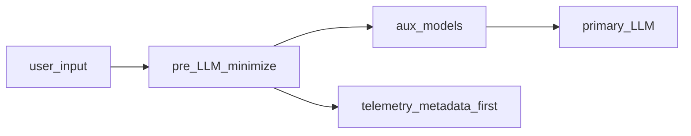

# Основной отчёт: методология внедрения и разработки

**Дата пакета:** 2026-03-25  
**Статус:** утверждённый комплект материалов для руководства (v1)

## Обзор пакета

Этот документ — **каноническое место** для операционной модели, фаз внедрения и производственной методологии без дублирования экономических таблиц: все числа и тарифы — в парном основном отчёте по сайзингу и экономике. Содержание выдержано по сводному материалу «Краткое изложение: методология внедрения и отчуждения ИИ…» (март 2026); темы безопасности и observability вынесены в «Приложение D», отчуждение ИС и кода — в «Приложение B».

## Связанные документы

- «Приложение A: витрина пакета»
- «Основной отчёт: сайзинг и экономика» (канон по цифрам)
- «Приложение B: отчуждение ИС и кода (KT, IP)»
- «Приложение C: имеющиеся наработки CMW»
- «Приложение D: безопасность, комплаенс и observability»

## Назначение документа и границы применения

Документ обобщает **методологию внедрения и отчуждения** решений класса корпоративных ИИ-ассистентов с RAG, локальным или облачным инференсом и агентными сценариями. Названия **cmw-rag**, **cmw-mosec**, **cmw-vllm**, **cmw-platform-agent** используются как **условные обозначения ролей компонентов** иллюстративного референс-стека, а не как коммерческое предложение готового продукта.

**Фокус ценности:** воспроизводимые практики, пакет артефактов для передачи (knowledge transfer), критерии приёмки, комплаенс и управление рисками — материал пригоден для доработки руководством и стейкхолдерами и далее как **ориентир для продаж, передачи знаний и ИС, обучения команд и оценки новых проектов**.

**Сопутствующее резюме:** **Оценка сайзинга, КапЭкс и ОпЭкс для клиентов** — экономика, тарифы, дерево затрат; там же раздел **«Открытые веса и API: влияние на TCO»**.

---

## Резюме для руководства

**Ситуация:** в 2026 году GenAI оценивается по P&L, а в РФ добавляются требования суверенитета данных и регуляторные инициативы по ИИ.

**Осложнение:** без явного **периметра до LLM** (минимизация и обезличивание входа, разделение вспомогательных и основной модели, политика телеметрии) растут риски по 152-ФЗ и стоимость инцидентов; без **офлайн и онлайн eval** невозможно доказуемо связывать смену модели или индекса с качеством и бюджетом.

**Вопрос для решения:** как внедрять и масштабировать ассистентов на стеке **cmw-rag** (RAG и доставка), **cmw-mosec** / **cmw-vllm** (инференс) и **cmw-platform-agent** (при сценариях CMW Platform), и **как отчуждать** экспертизу и артефакты клиенту без потери управляемости.

**Рекомендуемый ответ:** опереться на целевую операционную модель (роли, KPI, риски), поэтапный POC → Pilot → Scale, пакет отчуждения (код, конфигурация, данные, модели, runbook, обучение) и блок комплаенса (152-ФЗ, приказ Роскомнадзора № 140 о методах обезличивания, NIST AI RMF, guardrails), а также на **единую промышленную наблюдаемость** (трассировки и метрики по этапам RAG и агента, учёт токенов) с политикой данных, согласованной с ПДн. Закладывать **три оси гибрида:** резидентность и обработка ПДн, размещение вспомогательных моделей (эмбеддинг, реранг, гард, при необходимости NER/маскирование), размещение основной LLM. Глобальные шлюзы для coding agents (**OpenRouter**, **OpenCode Zen**) относить к **разработке и экспериментам**, а не к подразумеваемому продакшн-API для ПД в РФ без отдельной оценки — см. «Ориентиры для заказчика» и Compliance. Детали — в разделах TOM, внедрение, **Промышленная наблюдаемость**, отчуждение и Compliance ниже.

**Зоны готовности (ориентир для портфеля инициатив):** зелёная — политика данных и телеметрии согласованы с ДПО, eval и SLO зафиксированы; жёлтая — пилот без полного пакета отчуждения или без учёта приказа № 140 в процессах; красная — прод с ПДн без локализации/обезличивания или с полным текстом промптов в недоверенных SaaS.

**Управленческие компромиссы (горизонт 12–24 мес.):**

- **Облако (РФ API)** — быстрый старт и предсказуемый OpEx по токену vs зависимость от тарифов и политики провайдера.
- **On-prem / выделенный GPU** — CapEx и LLMOps vs контроль данных и устойчивость под высокую утилизацию.
- **Гибрид** — баланс затрат vs сложность оркестрации и единая обсервабильность.
- **Открытые веса российских LLM** — Сбер публикует GigaChat-3.1-Ultra и GigaChat-3.1-Lightning под **MIT** ([Hugging Face](https://huggingface.co/collections/ai-sage/gigachat-31), [GitVerse](https://gitverse.ru/GigaTeam/gigachat3.1), [обзор на Хабре](https://habr.com/ru/companies/sberbank/articles/1014146/)): расширяется сценарий **закрытого контура** и пакет отчуждения (веса + лицензия + фиксация версий) при росте доли **CapEx/OpEx GPU** и LLMOps; сравнение с оплатой по токенам — в сопутствующем резюме **Оценка сайзинга, КапЭкс и ОпЭкс для клиентов**.

**Примеры метрик успеха:** экономический эффект кейса (экономия FTE, снижение тикетов), доля ответов с проверяемой цитатой, SLO по задержке, покрытие red teaming / guardrails, готовность пакета отчуждения (чек-лист в конце документа).

**Ключевой инсайт:** успех внедрения на ~70% определяется операционной моделью и качеством данных, ~30% — выбором LLM; для госсектора и КИИ критичен контур **доверенных моделей** и локализация обработки.

- **Инженерия обвязки (harness)** для агентов — **операционный и передаваемый** актив: контекст в репо, инструменты, линтеры, циклы проверки; её тяжесть и декомпозиция задач имеет смысл **пересматривать при смене поколения модели** ([Anthropic — Harness design for long-running application development](https://www.anthropic.com/engineering/harness-design-long-running-apps)).
- **Отчуждение:** в пакет передачи закладывают версионируемые skills, регламенты MCP/CI и рубрики независимой оценки — см. раздел **«Инженерия обвязки для агентов (harness engineering)»** ниже.

---

## Целевая операционная модель (Target Operating Model)

Для масштабирования ИИ-решений рекомендуется переход от централизованного AI CoE к **федеративной модели** с сильным центром компетенций.

### Роли и ответственности
* **AI Product Owner:** Ответственность за бизнес-эффект (ROI), приоритизацию гипотез.
* **LLMOps / AI Architect:** Проектирование инфраструктуры (vLLM/MOSEC), мониторинг качества (RAGAS/DeepEval), целевая архитектура **телеметрии** (трассировки, метрики токенов и латентности, политика сэмплинга и ретенции) и согласование с ИБ при контурах с ПДн; совместно с владельцами разработки — **среда для агентов** (инструменты, линтеры, CI, контуры офлайн/eval и при необходимости мультиагентных циклов разработки — см. **«Инженерия обвязки для агентов»**).
* **AI Security Officer:** Комплаенс с 152-ФЗ и NIST AI RMF, аудит безопасности (Red Teaming).
* **Knowledge Engineer:** Подготовка и актуализация базы знаний (ChromaDB), управление онтологиями.

### Процессы и КПЭ (KPI)
* **Utilization:** % сотрудников, использующих ИИ ежедневно (цель: >60%).
* **Proficiency:** Сокращение времени на решение тикета/задачи (цель: -30-40%).
* **Accuracy:** Точность ответов без галлюцинаций (цель: >95% по результатам LLM-as-a-Judge).
* **Unit Economics:** Стоимость одного успешного ответа (P&L вклад).

**Независимые русскоязычные бенчмарки и методы оценки:** экосистема **MERA** ([mera.a-ai.ru](https://mera.a-ai.ru/)) на площадке **Альянса в сфере искусственного интеллекта** ([a-ai.ru](https://a-ai.ru/)) задаёт открытый контур сравнения фундаментальных моделей на русском языке; участие **MTS AI** и других организаций в таких инициативах иллюстрирует **отраслевую стандартизацию eval**, дополняющую внутренние метрики заказчика (RAGAS, DeepEval, LLM-as-judge). Отдельно как **методологический** (а не коммерческий) референс для настройки взаимной оценки моделей полезен разбор цикла улучшения **Cotype** с опорой на LLM-судей ([Хабр, MTS AI](https://habr.com/ru/companies/mts_ai/articles/892176/)): воспроизводимость на корпоративных данных требует явной фиксации промптов судей, эталонов и регрессионных наборов в пакете отчуждения.

---

## Методология внедрения (Этапы и Качество)

Рекомендуется 4-фазный подход, основанный на практиках **red_mad_robot** и **Just AI**:

### Фаза 1: POC (2-4 недели)
* **Цель:** Проверка технической осуществимости.
* **Артефакты:** Прототип на **cmw-rag** с типовым инференсом через **cmw-mosec**, замер baseline-метрик; при кейсах платформы — задействование **cmw-platform-agent**.
* **Контроль:** Успешное выполнение 10 критических сценариев.

### Фаза 2: Pilot (1-3 месяца)
* **Цель:** Валидация в промышленном окружении на ограниченной группе пользователей.
* **Инструментарий:** Развертывание инференса через **cmw-mosec** (или **cmw-vllm** при высокой нагрузке на LLM), внедрение Guardrails; согласование нагрузки со стороны **cmw-rag** и **cmw-platform-agent**.
* **Контроль:** Замер ROI, сбор обратной связи (Human-in-the-loop).

### Фаза 3: Scale (3-12 месяцев)
* **Цель:** Enterprise-wide внедрение.
* **Архитектура:** Масштабирование LLM через **cmw-vllm**, развитие **cmw-rag** под нагрузкой; для операций с сущностями платформы — **cmw-platform-agent**; при необходимости Multi-Agent Swarm (координатор/воркер).
* **Контроль:** Стабильность под нагрузкой (SLA 99.9%), соответствие бюджету (FinOps).

### Фаза 4: Optimize (Постоянно)
* **Цель:** Снижение TCO и повышение качества.
* **Методы:** DSPy для оптимизации промптов, квантование моделей, кэширование (LMCache).
* **Агентская разработка и сопровождение:** при зрелости команды и контура — регламент **мультиагентных** циклов (план → реализация → независимая проверка) и меры против **энтропии** документации относительно кода (периодическая синхронизация, «сборка мусора» артефактов) в духе отраслевой **инженерии обвязки** ([OpenAI — Harness engineering](https://openai.com/ru-RU/index/harness-engineering/), [Хабр](https://habr.com/ru/articles/1005032/)).

---

## Детальная архитектура внедрения

### Основные компоненты

| Компонент | Проект | Роль | Технология |
|-----------|------------|------|------------|
| **RAG-движок** | **cmw-rag** | Оркестрация поиска, генерации и логики агентов | Python, LangChain, Gradio |
| **Сервер инференса (Унифицированный)** | **cmw-mosec** | Обслуживание моделей эмбеддинга, реранкера и охранника на одном порту | MOSEC, PyTorch |
| **Сервер инференса (Распределенный)** | **cmw-vllm** | Обслуживание LLM и пулинг-моделей через vLLM | vLLM, CUDA |
| **Векторное хранилище** | **cmw-rag** | Постоянное хранение встраиваний документов | ChromaDB (HTTP) |

### Поток данных и конвейер

1.  **Ингестия:**
    *   Документы (Markdown, MkDocs) обрабатываются модулем обработки документов RAG-движка.
    *   Разбиваются на чанки через токен-зависимый чанкер.
    *   Встраиваются через компонент эмбеддинга (FRIDA/Qwen3).
    *   Векторы и метаданные сохраняются в ChromaDB через слой векторного хранилища.

2.  **Поиск (RAG):**
    *   Пользовательский запрос поступает в конвейер ретривера.
    *   **Векторный поиск:** ChromaDB извлекает top-k чанков.
    *   **Реранкинг:** Кросс-энкодер или LLM-реранкер уточняет результаты.
    *   **Сборка контекста:** Статьи восстанавливаются, при необходимости суммируются (модуль суммаризации).

3.  **Генерация:**
    *   **Режим агента (Рекомендуется):** Агент LangChain анализирует запрос, принудительно вызывает инструмент извлечения контекста и генерирует ответ с цитатами.
    *   **Прямой режим:** Менеджер LLM генерирует ответ напрямую из найденного контекста.

4.  **Доставка:**
    *   **Веб-интерфейс:** Gradio ChatInterface в сервисном слое API RAG-движка.
    *   **API:** REST-эндпоинт `/api/query_rag`.
    *   **Виджет:** Встраиваемый HTML/JS виджет для внедрения на сторонние страницы.

### Конфигурация сервера инференса

#### MOSEC, vLLM и репозитории CMW

- **MOSEC** (апстрим, проект [mosecorg/mosec](https://github.com/mosecorg/mosec)) — открытый фреймворк **подачи ML-моделей через HTTP API**: быстрый веб-слой (Rust), логика воркеров на Python, динамическое батчирование запросов, поэтапные пайплайны и облачно-ориентированные практики (прогрев, graceful shutdown, метрики). Подробнее: [документация MOSEC](https://mosecorg.github.io/mosec/index.html).
- **vLLM** — высокопроизводительный **движок инференса** для больших языковых моделей с OpenAI-совместимым API, оптимизациями памяти и пакетной обработкой; описание сервера: [OpenAI-Compatible Server](https://docs.vllm.ai/en/stable/serving/openai_compatible_server.html).

**Репозитории CMW** (прикладные пакеты вокруг MOSEC и vLLM; подробности развёртывания — в публичной документации каждого модуля):

- **cmw-mosec** — прикладной пакет: управление процессом, реестр моделей (YAML), воркеры **эмбеддинга, реранкера и контент-охранника**, OpenAI-совместимые маршруты. **Одна сетевая точка** для вспомогательных моделей RAG — проще политики безопасности и сопровождение.
- **cmw-vllm** — прикладной пакет: жизненный цикл процессов vLLM (загрузка моделей, проверки здоровья, конфигурация), в т.ч. режимы pooling для эмбеддингов/скоринга в поддерживаемых сборках vLLM. Ориентир: **максимальная производительность LLM** и гибкий выбор чекпоинтов под нагрузку.

#### Одна HTTP-точка и несколько серверных процессов

В **cmw-mosec** на **одном HTTP-порту** сосуществуют **разные роли** (эмбеддинг, реранг, модерация) в рамках **одного MOSEC-сервиса** с разными воркерами — это **не** размещение нескольких независимых процессов vLLM за одним портом. У **vLLM** распространённый паттерн — **отдельный серверный процесс на модель/конфигурацию**; несколько моделей обычно означает **несколько инстансов** (часто на разных портах) и маршрутизацию на стороне клиента, API-шлюза или балансировщика. Исключения и тонкости multi-GPU/репликации одной модели — по документации vLLM для выбранной версии.

#### Вариант А: унифицированный сервер (cmw-mosec)

- **Эксплуатация:** запуск объединённого сервиса через CLI пакета **cmw-mosec** (порт и активные модели задаются конфигурацией; типичный порт по умолчанию — 8001, см. README репозитория).
- **Модели:** эмбеддинг, реранкер и охранник могут подключаться динамически в рамках поддержанного набора.
- **Выгоды для внедрения:** меньше сетевых конечных точек, проще обучение эксплуатации и отчуждение runbook-а клиенту; хороший старт для пилотов **cmw-rag**.
- **Сайзинг:** VRAM делится между фактически загруженными моделями на узле; детальные оценки памяти публикуются вместе с пакетом **cmw-mosec** (артефакты замеров и методика — в документации репозитория).
- **Ограничения:** расширение модельного ряда упирается в то, что команда интегрировала в MOSEC-воркеры (меньше «произвольного зоопарка», чем у голого vLLM).

#### Вариант Б: распределённые инстансы vLLM (cmw-vllm)

- **Эксплуатация:** отдельный процесс vLLM на выбранную модель и порт через CLI **cmw-vllm** (точные флаги и примеры — в README **cmw-vllm**).
- **Типичная схема сети:** отдельные порты для LLM, эмбеддинга, реранкера, охранника, если все роли вынесены на vLLM (например, 8100, 8101, 8105 — иллюстративно; фактические значения задаются политикой развёртывания).
- **Выгоды для внедрения:** зрелые GPU-оптимизации vLLM (в т.ч. KV-кэш, непрерывное батчирование), удобное горизонтальное масштабирование реплик под SLA по задержке и пропускной способности.
- **Сайзинг:** выше суммарный оверхед VRAM и число процессов; зато предсказуемее поведение под пиковый чат и длинный контекст при правильном шардировании и профиле **cmw-rag** / **cmw-platform-agent**.
- **Ограничения:** сложнее операционная картина (несколько сервисов); смена модели чаще требует перезапуска процесса по сравнению с динамической загрузкой в **cmw-mosec**.

Команды CLI, примеры портов и переменные окружения собраны в **README** репозиториев **cmw-mosec** и **cmw-vllm**; в этом документе зафиксированы архитектурный выбор, экономика и риски, без повторения пошагового runbook.

#### Три оси гибридного размещения и выбор бэкенда по типу модели

**Ось 1 — данные и ПДн:** где хранятся и обрабатываются исходные сообщения, индекс RAG, журналы; соответствует требованиям локализации и согласий.

**Ось 2 — вспомогательные модели:** эмбеддинг, реранг, контент-охранник, при необходимости слой маскирования/NER до LLM; часто совмещаются на одном унифицированном HTTP-сервисе (**cmw-mosec**) или распределяются по отдельным процессам (**cmw-vllm** и др.) в зависимости от нагрузки и поддерживаемых форматов.

**Ось 3 — основная LLM:** управляемый API в РФ или self-hosted; здесь концентрируется основной счётчик токенов и требования к задержке.

На **оси 2** инженерные замеры на референс-стеке показали, что **разные классы моделей** не всегда допускают один и тот же серверный движок без потери корректности (например, корректный pooling для эмбеддингов и ограничения для генеративного реранкера). Это влияет на **число процессов, фрагментацию GPU и регрессионное тестирование** при обновлениях — количественные ориентиры и строки TCO вынесены в сопутствующее резюме **Оценка сайзинга, КапЭкс и ОпЭкс для клиентов**.



### Российские облачные провайдеры ИИ

Для соответствия требованиям о данных и инфраструктуре в России рекомендуются локальные облачные платформы и/или закрытый контур. **Все количественные тарифы** (₽ за токены, пакеты, ₽/час GPU) собраны в одном месте — раздел **«Тарифы российских облачных провайдеров ИИ»** в сопутствующем резюме **Краткое изложение: Оценка сайзинга, КапЭкс и ОпЭкс для клиентов (российский рынок)**; ниже — **роли провайдеров, состав моделей и правила сверки** без повторения таблиц. Дерево факторов стоимости и сценарный сайзинг — там же.

**Cloud.ru (Evolution Foundation Models)** · [[продукт]](https://cloud.ru/products/evolution-foundation-models) · [[тарифы]](https://cloud.ru/documents/tariffs/evolution/foundation-models)

- **API:** OpenAI-совместимый доступ к моделям в российских ЦОД.

- **Каталог (на [странице продукта](https://cloud.ru/products/evolution-foundation-models) перечислены позиции с идентификаторами Hugging Face `org/repo`):**
  - **GigaChat:** продуктовые имена GigaChat / Lite / Pro / **GigaChat-2-Max** и ветка **`ai-sage/GigaChat3-10B-A1.8B`** (сверка с линейкой 3.0 / 3.1 на Hub — отдельно).
  - **GLM (Zhipu, org `zai-org`):** **`GLM-4.6`**, **`GLM-4.7`**, **`GLM-4.7-Flash`** ([пример карточки](https://huggingface.co/zai-org/GLM-4.7-Flash)); крупное семейство **`GLM-5`** — на [HF](https://huggingface.co/zai-org/GLM-5).
  - **Qwen (Alibaba, org `Qwen`):** **`Qwen3-235B-A22B-Instruct-2507`**, семейства **`Qwen3-Coder-*`**, **`Qwen3-Next-80B-A3B-Instruct`**.
  - **T‑Tech:** линейки **`t-tech/T-lite-it-*`**, **`T-pro-it-*`**.
  - **Прочие текстовые LLM:** **`openai/gpt-oss-120b`**, **`MiniMaxAI/MiniMax-M2`**.
  - **Эмбеддинги и реранкинг:** **`BAAI/bge-m3`**, **`BAAI/bge-reranker-v2-m3`**, **`Qwen/Qwen3-Embedding-0.6B`**, **`Qwen/Qwen3-Reranker-0.6B`**.
  - **Речь и документы:** **`openai/whisper-large-v3`**, **`deepseek-ai/DeepSeek-OCR-2`**.

- **Тарификация:** оплата **по токенам** (входные и генерируемые — отдельно, см. [официальный прайс](https://cloud.ru/documents/tariffs/evolution/foundation-models)). **Все ₽/млн и расшифровка по строкам** (в т.ч. GigaChat3-10B-A1.8B, Qwen3-235B, GigaChat-2-Max, GLM-4.6, MiniMax-M2) — только в сопутствующем резюме, раздел **«Тарифы российских облачных провайдеров ИИ»**; маркетинговый перечень на сайте может быть **шире** прайса на дату сверки.

- **SKU vs Hub:** имя в биллинге **не** гарантирует ту же ревизию весов, что на Hugging Face, без явной проверки.

**Yandex Cloud (Yandex AI Studio / YandexGPT)** · [[модели]](https://aistudio.yandex.ru/docs/ru/ai-studio/concepts/generation/models.html) · [[тарификация]](https://aistudio.yandex.ru/docs/ru/ai-studio/pricing.html)

- **Модели (текст, базовый инстанс):** в обзорах и переговорах часто выделяют **YandexGPT Pro 5.1** и **Alice AI LLM**; полный перечень — [доступные генеративные модели](https://aistudio.yandex.ru/docs/ru/ai-studio/concepts/generation/models.html): Alice AI LLM; YandexGPT Pro 5.1 и Pro 5; YandexGPT Lite 5; DeepSeek V3.2; Qwen3 235B; gpt-oss-120b и gpt-oss-20b; Gemma 3 27B ([условия Gemma](https://ai.google.dev/gemma/terms)); дообученная YandexGPT Lite; YandexART и Realtime.

- **Тарифы:** первоисточник — [правила тарификации AI Studio](https://aistudio.yandex.ru/docs/ru/ai-studio/pricing.html): таблица Model Gallery, ₽ **с НДС** за **1000** токенов (входящие, кеш, инструменты, исходящие); для агентов — отдельно токены инструментов. Эквиваленты **₽/млн** и строки по моделям — в сопутствующем резюме. **Контекст рынка (не договорный прайс):** в публикации [AKM.ru](https://www.akm.ru/eng/press/yandex-b2b-tech-has-opened-access-to-the-largest-language-model-on-the-russian-market/) встречались ориентиры порядка **~0,5 ₽ за 1000** токенов (**~50 коп.**); они полезны как **иллюстрация прессы**, но **не** подменяют официальную таблицу на дату сверки (для сопоставимости с КП см. сопутствующее резюме).

- **Особенности:** **OpenAI-совместимый** доступ к ряду моделей; **интеграция с экосистемой Yandex Cloud** (данные, идентичность, смежные сервисы — по политике заказчика и документации Яндекса); линейка **YandexGPT / Alice** ориентирована в том числе на **русскоязычные** сценарии наряду с мультиязычными моделями в галерее.

**SberCloud (GigaChat API)** [[портал]](https://developers.sber.ru/portal/products/gigachat-api) · [[юридические тарифы]](https://developers.sber.ru/docs/ru/gigachat/tariffs/legal-tariffs)

- **Модели:** GigaChat-2 Lite, Pro, Max.

- **Тарифы:** пакеты токенов по [юридическим тарифам](https://developers.sber.ru/docs/ru/gigachat/tariffs/legal-tariffs); эквиваленты **₽/млн** и размеры пакетов — в таблицах сопутствующего резюме (тот же раздел **«Тарифы российских облачных провайдеров ИИ»**).

**Selectel (Foundation Models Catalog)** [[источник]](https://selectel.ru/services/cloud/foundation-models-catalog)

- Каталог с выделенным endpoint, API **совместим с OpenAI**; оплата за **CPU, GPU, RAM, диски**, не за токены. **Private Preview**, список моделей в панели (ссылки на HF). Свои веса **не** заявлены (FAQ на сайте).

**MWS GPT (МТС Web Services)** [[продукт]](https://mws.ru/mws-gpt/) · [[тарифы]](https://mws.ru/docs/docum/cloud_terms_mwsgpt_pricing.html)

- OpenAI-совместимый API, SLA **99,95%** (для части моделей), режимы **SaaS / hybrid / on-prem**. Прайс **без НДС** за 1000 токенов под внутренними именами; сопоставление с публичными названиями — у поставщика. **Цифры** (лендинг, таблица «Модель N», НДС) — в сопутствующем резюме, подраздел **MWS GPT**.

**VK Cloud (ML)** [[документация]](https://cloud.vk.com/docs/ru/ml)

- **Cloud ML Platform**, Spark, Cloud Voice, Vision — **без** публичного каталога готовых LLM в формате Evolution FM / AI Studio; типичный путь — **своя** модель и MLOps.

#### Матрица: управляемый API в РФ и открытые веса

| Контур | API в РФ | Self-host / HF | Примеры семейств |
| :--- | :--- | :--- | :--- |
| Cloud.ru Evolution FM | Да | Часто те же `org/repo`, что в каталоге FM | GigaChat, GLM‑4.6–4.7‑Flash, Qwen3‑235B / Coder / Next, gpt‑oss, MiniMax‑M2, T‑tech |
| Yandex AI Studio | Да | Отдельные модели на HF (в т.ч. кастомные лицензии) | YandexGPT, Alice, DeepSeek V3.2, Qwen3 235B, gpt‑oss, Gemma 3 |
| Sber GigaChat API | Да | **GigaChat 3.1** MIT на HF ([ai-sage](https://huggingface.co/ai-sage)) | Коммерческий API и открытые веса — разный TCO |
| Selectel FMC | Да (Private Preview) | Каталог → HF; свои веса не заявлены | Оплата **инфраструктура**, не токены |
| MWS GPT | Да | Публичный каталог HF не сведён | Прайс по кодам «Модель N» |
| VK Cloud ML | Нет LLM‑каталога в доке | BYO на ML Platform | Инфраструктура под **cmw-vllm** / **cmw-mosec** |

**Типично только open weights (доставка в РФ — GPU‑облако или on-prem):** ниже — **родственные чекпойнты** на Hugging Face по группам; многие те же `org/repo`, что в каталоге **Cloud.ru Evolution FM** (количественный прайс и SKU — только у провайдера).

| Группа | Репозитории на Hugging Face (родственные модели) | Заметка для заказчика |
| :--- | :--- | :--- |
| **GLM (Zhipu, `zai-org`)** | [GLM-4.6](https://huggingface.co/zai-org/GLM-4.6) · [GLM-4.7](https://huggingface.co/zai-org/GLM-4.7) · [**GLM-4.7-Flash**](https://huggingface.co/zai-org/GLM-4.7-Flash) (более компактная ветка) · [GLM-5](https://huggingface.co/zai-org/GLM-5) (флагман MoE) | Линейка **4.6–4.7** и **GLM-5** — разный масштаб VRAM; **4.7-Flash** — типичный кандидат, когда нужен меньший след по железу при том же бренде |
| **gpt-oss (OpenAI)** | [openai/gpt-oss-20b](https://huggingface.co/openai/gpt-oss-20b) · [openai/gpt-oss-120b](https://huggingface.co/openai/gpt-oss-120b); варианты с фильтрацией: [gpt-oss-safeguard-20b](https://huggingface.co/openai/gpt-oss-safeguard-20b) · [gpt-oss-safeguard-120b](https://huggingface.co/openai/gpt-oss-safeguard-120b) | **Apache-2.0**; те же публичные имена, что у **Yandex AI Studio** и **Cloud.ru** FM, но хостинг и комплаенс — на стороне заказчика |
| **Qwen3 (`Qwen`)** | org [Qwen](https://huggingface.co/Qwen): MoE [Qwen3-235B-A22B-Instruct-2507](https://huggingface.co/Qwen/Qwen3-235B-A22B-Instruct-2507), [Qwen3-Next-80B-A3B-Instruct](https://huggingface.co/Qwen/Qwen3-Next-80B-A3B-Instruct); код: [Qwen3-Coder-30B-A3B-Instruct](https://huggingface.co/Qwen/Qwen3-Coder-30B-A3B-Instruct), [Qwen3-Coder-480B-A35B-Instruct](https://huggingface.co/Qwen/Qwen3-Coder-480B-A35B-Instruct) и др. | Семейство шире перечисления; сверять **лицензию**, **gated** и поддержку **vLLM/SGLang** по карточке |
| **GigaChat (открытые веса Сбера, `ai-sage`)** | [GigaChat3-10B-A1.8B](https://huggingface.co/ai-sage/GigaChat3-10B-A1.8B) (3.0) · [GigaChat3.1-10B-A1.8B](https://huggingface.co/ai-sage/GigaChat3.1-10B-A1.8B); крупный чекпойнт: [GigaChat3.1-702B-A36B](https://huggingface.co/ai-sage/GigaChat3.1-702B-A36B) | **MIT** на публичных весах; **GigaChat API** (SberCloud) и self-host — разный TCO (см. абзац ниже) |
| **MiniMax M2** | [MiniMaxAI/MiniMax-M2](https://huggingface.co/MiniMaxAI/MiniMax-M2) | На HF — **modified MIT** / особая лицензия в карточке; дублируется как SKU **Cloud.ru** FM — сверять прайс и условия |
| **DeepSeek R1 distill** | [DeepSeek-R1-Distill-Qwen-32B](https://huggingface.co/deepseek-ai/DeepSeek-R1-Distill-Qwen-32B) · [DeepSeek-R1-Distill-Llama-70B](https://huggingface.co/deepseek-ai/DeepSeek-R1-Distill-Llama-70B) и др. на `deepseek-ai` | Плотные модели разного размера под локальный инференс; рядом на Hub — полные ветки **DeepSeek-V3 / R1** (другой сайзинг) |
| **NVIDIA Nemotron 3** | [NVIDIA-Nemotron-3-Nano-30B-A3B-FP8](https://huggingface.co/nvidia/NVIDIA-Nemotron-3-Nano-30B-A3B-FP8) и др. в org [nvidia](https://huggingface.co/nvidia) | MoE, заявленный контекст до **1M** токенов ([обзор](https://research.nvidia.com/labs/nemotron/Nemotron-3/)); **не** готовый **API РФ** без своего контура |
| **Kimi (Moonshot)** | [moonshotai/Kimi-K2-Base](https://huggingface.co/moonshotai/Kimi-K2-Base); линейка K2.5 — в org [moonshotai](https://huggingface.co/moonshotai) | Часто IDE и агрегаторы; для КП — **не** baseline без явного контура и лицензии |

Все **числовые** ориентиры по управляемым API — в сопутствующем резюме **Краткое изложение: Оценка сайзинга, КапЭкс и ОпЭкс для клиентов (российский рынок)** (раздел **«Тарифы российских облачных провайдеров ИИ»**). Отдельно Сбер публикует **открытые веса** GigaChat‑3.1‑Ultra и Lightning под **MIT** ([Хабр](https://habr.com/ru/companies/sberbank/articles/1014146/)): экономика смещается в **CapEx/OpEx GPU** — см. **«Открытые веса и API: влияние на TCO»** в том же сопутствующем резюме.

**Паттерн «чекпойнт на Hugging Face + отдельная лицензия»** (не эквивалент permissive open source вроде MIT) меняет пакет отчуждения и учёт: у публичной ветки **YandexGPT-5-Lite-8B** применяется **кастомное лицензионное соглашение**, где при коммерческом использовании при достижении **10 миллионов выходных токенов в месяц** лицензиат в течение **30 календарных дней** после такого месяца обязан связаться с правообладателем для согласования дальнейшего использования, иначе лицензии прекращаются ([полный текст](https://huggingface.co/yandex/YandexGPT-5-Lite-8B-instruct/raw/main/LICENSE)). В том же тексте зафиксированы **применимое право РФ** и требования к **указанию авторства** при распространении — это входит в юридический контур передачи и в **мониторинг объёма генерации**, параллельно со сдвигом TCO в сторону **GPU и эксплуатации**, как у любого self-hosted чекпойнта.

**Идеи из открытой исследовательской публикации (не SLA коммерческих сервисов):** в обзорных материалах лабораторий перечисляются направления вроде **эффективных LLM** и оптимизации ([пример — дайджест за 2025 год](https://research.yandex.com/blog/yandex-research-in-2025)); как **инженерный ориентир** для PoC по памяти при длинном контексте полезен класс работ по **сжатию KV-кеша** ([arXiv:2501.19392](https://arxiv.org/abs/2501.19392), среди [принятых к ICML 2025](https://research.yandex.com/blog/papers-accepted-to-icml-2025)).

---

## Рекомендации по производственной эксплуатации (2026)

На основе исследования «Продвинутые подходы к RAG»:

1.  **Гибридный поиск:** Реализуйте BM25 + Плотный поиск для точности уровня enterprise (4-7,5% прирост).
2.  **Адаптивная маршрутизация:** Используйте анализ сложности запроса для прямой маршрутизации простых запросов в LLM, избегая ненужного поиска.
3.  **Самокоррекция:** Реализуйте механизмы критики для сложных запросов для уменьшения галлюцинаций.
4.  **Мониторинг и наблюдаемость:** Отслеживайте точность поиска, релевантность контекста и частоту галлюцинаций; закрепите **трассировки по этапам RAG/агента** и **метрики токенов и задержек** в духе раздела **«Промышленная наблюдаемость LLM, RAG и агентов»** и [OpenTelemetry GenAI](https://opentelemetry.io/docs/specs/semconv/gen-ai/gen-ai-spans/), с политикой данных для ПДн.
5.  **Длинные ответы и зацикливание:** для продакшена полезно измерять устойчивость генерации (повторы, «хвостовые» циклы). Сбер публично описывает борьбу с зацикливанием и связанные метрики в постобучении MoE-моделей GigaChat 3.1 ([Хабр](https://habr.com/ru/companies/sberbank/articles/1014146/)); на стороне заказчика показатели нужно воспроизводить на **своих** eval-сценариях, а не принимать как гарантию без замеров.

---

## Общие рекомендации

1.  **Для новых внедрений:**
    *   Начните с **cmw-mosec** для простоты (единый сервер).
    *   Используйте режим агента в **cmw-rag** для динамического вызова инструментов.
    *   При сценариях управления CMW Platform подключайте **cmw-platform-agent** и планируйте нагрузку на LLM/API совместно с **cmw-rag**.
    *   Реализуйте гибридный поиск (BM25 + Вектор) для оптимальных результатов.

2.  **Для масштабирования:**
    *   Переходите на **cmw-vllm** для инференса LLM (лучшая производительность).
    *   Масштабируйте **cmw-rag** и **cmw-platform-agent** отдельно по профилю трафика (RAG vs операции платформы).
    *   Используйте отдельные инстансы vLLM для эмбеддинга/реранкера/охранника для распределения нагрузки.
    *   Рассмотрите Kubernetes для оркестрации при масштабировании на несколько узлов.

3.  **Для отчуждения:**
    *   Архивируйте исходные документы перед удалением векторных данных.
    *   Перед выключением выполните диагностику состояния векторного хранилища штатными утилитами сопровождения.

---

## Практики и архитектуры RAG: NeuralDeep и продвинутая ретривальная инженерия

Конвейер **cmw-rag** при отчуждении должен оставаться воспроизводимым: ingestion, чанкинг, эмбеддинги, LLM, реранкинг, выбор фреймворка, agentic-петля, eval и guardrails. Ниже — консолидированная разведка по NeuralDeep и паттернам @ai_archnadzor; первичные ссылки — в разделе «Источники».

### Извлекаемые уроки из публичных материалов OZON Tech (РФ)

Формулировки ниже — **не продвижение компании**, а переносимые управленческие и инженерные идеи с **краткой атрибуцией** первоисточникам Ozon Tech (Хабр, анонсы митапов). **Классический ML в поиске и рекламе, а также сценарные чат-боты с навыками, не тождественны GenAI/RAG**; использовать материалы как **аналогии** для ретривала, платформенного внедрения и MLOps, а не как замену стандартам вроде NIST AI RMF, практикам FinOps и принятому в организации пакету отчуждения.

- **Платформа вместо разовых ботов:** переход от узкой команды сценаристов к **no-code**-конструктору, **масштабирование на организацию** и цель **запуска нового бота за сутки** (против «не менее недели» в прежней модели), плюс поэтапный **MVP на одном боте** с последующим переносом остальных — близко к идее **федеративной TOM** и **платформенного** внедрения множества ассистентов, а не только одного RAG-контура ([Хабр, Ozon Tech](https://habr.com/ru/companies/ozontech/articles/834812/)).
- **Ретривал: не везде «только вектор»:** в задаче подсказок/текстового поиска обсуждаются компромиссы **ANN (эмбеддинги) vs обратный индекс**, фильтрация по бизнес-правилам в рантайме, **латентность и ресурсы**, интерпретируемость выдачи — по смыслу сонаправлено с **гибридным поиском** в RAG и с **FinOps-учётом стоимости и задержки** этапа извлечения ([Хабр, Ozon Tech](https://habr.com/ru/companies/ozontech/articles/990180/)).
- **MLOps-ритм:** в программе публичного митапа описана **ML-инфраструктура**, позволяющая **регулярно тестировать новую функциональность, обучать модели и автоматически выкатывать** их — перекликается с требованиями к **LLMOps, регрессиям и выкатке** в этом документе ([Хабр, Ozon Tech](https://habr.com/ru/companies/ozontech/articles/768734/)).
- **Отчуждение vs открытая инженерия:** публикации статей и **открытые репозитории** на GitHub — пример **обмена практиками** с рынком; это **не эквивалент** полноценному пакету передачи (код, данные, модели, runbook, IP, обучение) из раздела «Детальная методология отчуждения» в этом документе ([организация ozontech на GitHub](https://github.com/ozontech)).

### NeuralDeep: данные, модельный ряд, agentic RAG и безопасность

#### ETL и подготовка данных

*   **markitdown** — конвертация документов в Markdown [[GitHub]](https://github.com/microsoft/markitdown)
*   **marker** — быстрое извлечение текста из PDF [[GitHub]](https://github.com/datalab-to/marker)
*   **docling** — продвинутое извлечение данных из документов [[GitHub]](https://github.com/docling-project/docling)

#### Чанкование (Chunking)

*   **Chonkie** — быстрая и легковесная библиотека для чанкования [[GitHub]](https://github.com/chonkie-inc/chonkie)
*   LangChain text splitters [[GitHub]](https://github.com/langchain-ai/langchain/tree/master/libs/text-splitters)

#### Векторные модели для русского языка

*   **ai-forever/FRIDA** — российская модель, оптимизированная для русского
*   **BAAI/bge-m3** — мультиязычная модель
*   **intfloat/multilingual-e5-large** — мультиязычные эмбеддинги
*   **Qwen3-Embedding-8B** — большая мультиязычная модель

#### Суверенный стек одного вендора (опционально)

Помимо LLM из коллекции [GigaChat 3.1](https://huggingface.co/collections/ai-sage/gigachat-31) на Hugging Face у организации [ai-sage](https://huggingface.co/ai-sage) опубликованы коллекции [GigaEmbeddings](https://huggingface.co/collections/ai-sage/gigaembeddings), [GigaAM](https://huggingface.co/collections/ai-sage/gigaam) (модели для речи) и [GigaChat Lite](https://huggingface.co/collections/ai-sage/gigachat-lite). Их можно рассматривать при цели **единого открытого контура** под одним вендором весов; это **не** обязательная замена рекомендованных для **cmw-rag** эмбеддингов (FRIDA, Qwen3 и т.д.): решение фиксируется в **ADR**, с eval качества RAG и проверкой **лицензии** на каждой карточке модели.

#### LLM и vLLM модели для русского сегмента

**Рекомендации сообщества по соотношению цена/качество:**

*   **t-tech/T-lite-it-1.0** — легкая модель для русского языка
*   **t-tech/T-pro-it-2.0** — продвинутая модель для русского языка
*   **Qwen3-30B-A3B-Instruct-2507** — рекомендуется для Agentic RAG [[GitHub]](https://github.com/vamplabAI/sgr-agent-core/tree/tool-confluence)
*   **RefalMachine/RuadaptQwen2.5-14B-Instruct** — адаптированная для русского

#### Реранкеры

*   **BAAI/bge-reranker-v2-m3** — мультиязычный кросс-энкодер
*   **Qwen3-Reranker-8B** — большая модель для реранкинга

#### Фреймворки для RAG

Одобрено сообществом NeuralDeep:
*   **Dify** — Low-code платформа для AI-приложений [[GitHub]](https://github.com/langgenius/dify/)
*   **AutoRAG** — автоматический RAG оптимизатор [[GitHub]](https://github.com/Marker-Inc-Korea/AutoRAG)
*   **LlamaIndex** — структурированная работа с данными [[GitHub]](https://github.com/run-llama/llama_index)
*   **Mastra** — AI-фреймворк для продакшена [[GitHub]](https://github.com/mastra-ai/mastra)

#### Agentic RAG архитектура

**SGR (Schema-Guided Reasoning)** — фреймворк для агентов от neuraldeep:
*   SGR Agent Core [[GitHub]](https://github.com/vamplabAI/sgr-agent-core) — 1k+ stars
*   Запуск и философия | SGR vs Tools | Бенчмарки
*   Agentic RAG на локальных моделях (Qwen3-30B-A3B)

#### Оценка (Eval)

*   **RAGAS** — метрики для RAG [[Docs]](https://docs.ragas.io/en/stable/)
*   **ARES** — автоматическая оценка RAG [[GitHub]](https://github.com/stanford-futuredata/ARES)

#### Безопасность

*   **NVIDIA NeMo Guardrails** — удержание бота в рамках темы [[GitHub]](https://github.com/NVIDIA-NeMo/Guardrails)
*   **Lakera / Rebuff** — детекторы инъекций [[Platform]](https://platform.lakera.ai/) [[GitHub]](https://github.com/protectai/rebuff)
*   **Garak** — сканер уязвимостей LLM [[GitHub]](https://github.com/NVIDIA/garak)

#### Кейс: RAG для ФСК (Строительная компания)

*   **Задача:** RAG-чат-бот для ФСК (5млн+ токенов) — B2B
*   **Результат:** Снижение нагрузки на команду поддержки на **30–40%**
*   **Архитектура:** Router-компонент + два workflow AI-агента
*   **Фокус:** Предотвращение галлюцинаций для минимизации репутационных рисков

### Продвинутая индексация, качество ответа и экономика ретрива (@ai_archnadzor)

Материалы канала **@ai_archnadzor** задают ориентиры по логике рассуждений, графам, задержке (TTFT) и стоимости индексации; конкретный выбор паттерна для **cmw-rag** фиксируется в ADR и пакете отчуждения.

#### Disco-RAG: Логический анализ вместо «плоского супа» из фактов

**Концепция:** Внедрение теории риторических структур (RST). Модель понимает, где аргумент, где противоречие, где условие.

**Архитектура:**
*   **Intra-chunk RST Trees:** Для каждого чанка строится дерево связей (Nucleus/Satellite)
*   **Inter-chunk Rhetorical Graph:** Анализ отношений между чанками (дополняет/противоречит)
*   **Discourse-Aware Planning:** План ответа на основе графа связей перед генерацией

**Результат:** Превращает RAG из «читателя фактов» в «аналитика логики»

#### REFRAG: Ускорение RAG в 30 раз

**Проблема:** Огромный контекст убивает TTFT и «съедает» KV-Cache

**Решение:** Сжатие «сырых» чанков в компактные эмбеддинги через RoBERTa + селективное расширение через RL-политику

**Для кого:** Tier-1 системы с миллионами запросов, где важна скорость

#### Cog-RAG: Гиперграфы и «тематическое» мышление

**Концепция:** Двойные гиперграфы (темы и сущности) для имитации человеческого подхода «от общего к частному»

**Результат:** Win Rate выше на **84.5%** по сравнению с обычным RAG

**Вердикт:** Мощно, но дорого по индексации. Идеально для медицины и науки

#### HippoRAG 2: Экономим на графах в 12 раз

**Инновация:** Dual-Node архитектура (узлы-сущности + узлы-пассажи)

**Экономика:** Снижение затрат на токены при индексации в **12 раз** (9 млн токенов vs 115 млн)

**Стек:** `pip install hipporag`

#### Topo-RAG: Победа над «табличной слепотой»

**Проблема:** Линеаризация таблиц в один вектор превращает данные в «семантический шум»

**Решение:** Мульти-векторный индекс (каждой ячейке — свой вектор) + умный роутер

**Результат:** Снижение галлюцинаций в цифрах с **45% до 8%**. Маст-хэв для финтеха и логистики

#### DSPy 3 и GEPA: Промышленный промпт-инжиниринг

**DSPy 3:** LLM как вычислительное устройство. Архитектор описывает Signatures, система генерирует и оптимизирует код промпта

**GEPA (Genetic-Pareto Prompt Optimizer):**
*   Генетические алгоритмы для «скрещивания» лучших промптов
*   Языковая рефлексия — модель анализирует свои ошибки текстом
*   **Результат:** В **35 раз быстрее** MIPROv2, промпты в **9 раз короче**, на **10% точнее**

#### Новый «старый» OCR: NEMOTRON-PARSE, Chandra, DOTS.OCR

| Модель | Фокус | Выход | Для кого |
|--------|-------|-------|----------|
| **NVIDIA Nemotron (885M)** | Скорость и Enterprise RAG | Markdown / LaTeX | Высоконагруженные RAG-системы |
| **Chandra (~1B)** | Рукопись и точность | MD / JSON / HTML | Архивы, оцифровка |
| **dots.ocr (1.7B, MIT)** | Агенты и лицензия | MD / HTML | Коммерческие SaaS |

#### BitNet: 1-битные LLM для CPU-инференса

**Концепция:** 1-бит веса для Attention/MLP слоев + 8/16 бит для активаций

**Почему важно:**
*   **Edge AI:** Огромные модели теперь могут жить локально
*   **Снижение TCO:** CPU-инстансы на порядок дешевле GPU
*   **Гибридные кластеры:** Обучаем на GPU, деплоим на CPU

**Вердикт:** Не «убийца GPU» для обучения, но подтачивает монополию GPU на инференс

#### Doc-to-LoRA: Конец «налога на контекст»

**Проблема:** KV-кэш поглощает гигабайты VRAM для длинных контекстов

**Решение:** Гиперсеть генерирует LoRA-адаптер из документа за один проход

**Результаты:**
*   Потребление VRAM: **12 ГБ → 50 МБ** (99% экономия)
*   Скорость усвоения: **<1 секунда** (vs 100+ секунд при дообучении)
*   Требования: **<2 ГБ VRAM** (vs 40+ ГБ для градиентных методов)

---

## Инженерия обвязки для агентов (harness engineering)

**Harness (обвязка)** в смысле отраслевой практики — это не замена сильной модели, а **среда исполнения** агента: что он видит в контексте, какие инструменты доступны, какие **детерминированные** проверки и петли обратной связи окружают генерацию. Подход описан и развивается в публичных материалах OpenAI («harness engineering»), Anthropic (длительные агентские сессии разработки), Thoughtworks / Martin Fowler (интерпретация и пробелы) и обзорах на русском языке (например, Хабр).

### Логические роли: планирование, генерация, оценка

В качестве переносимого шаблона удобно различать три **логические** роли (не обязательно три отдельные команды): **планировщик** формирует или уточняет спецификацию и границы задачи; **генератор** вносит изменения в код и конфигурацию; **оценщик** проверяет результат **независимо** от генератора. Anthropic показывает, что такое разделение снижает типичную для одного агента **самопохвалу** и поверхностное тестирование; при этом сам LLM-оценщик остаётся **склонным к мягким вердиктам**, поэтому критичны **жёсткие пороги по критериям**, few-shot калибровка промптов оценки и **инструментальная** проверка (клики по UI, вызовы API, сверка состояния данных), а не одна только «самооценка» модели ([Anthropic — Harness design for long-running application development](https://www.anthropic.com/engineering/harness-design-long-running-apps)).

Сопоставление с TOM из настоящего документа: планирование — зона **AI Product Owner** и архитектуры; генерация — разработка и coding agents под регламентом; оценка — **QA, приёмочные сценарии и ИБ** плюс регрессионные и e2e тесты. Блоки про MERA, RAGAS, DeepEval и LLM-as-a-judge остаются в силе: **судья по промпту** дополняет, но **не заменяет** согласованные приёмочные критерии и тесты.

### Контекст в репозитории и «карта», а не энциклопедия

OpenAI и независимые обзоры сходятся в том, что **монолитный** сверхдлинный файл правил для агента вытесняет из контекста код и задачу, быстро устаревает и плохо проверяется автоматически. Практичнее держать **короткий** верхнеуровневый регламент (оглавление, куда смотреть) и детали — в структурированном каталоге документации и ADR; правило «для агента не существует того, что не закреплено в репозитории» переносится на знания о продукте и решениях ([OpenAI — Harness engineering](https://openai.com/ru-RU/index/harness-engineering/), [Хабр — обвязка для агентов](https://habr.com/ru/articles/1005032/)).

### Архитектурные ограничения и обратная связь

Детерминированная часть обвязки — **линтеры, структурные тесты, явные границы модулей**; сообщения об ошибках целесообразно формулировать так, чтобы агент (или человек) сразу видел **как исправить** нарушение. Это согласуется с акцентом на **снижение пространства решений** для устойчивого AI-generated кода ([Martin Fowler — Harness Engineering](https://martinfowler.com/articles/exploring-gen-ai/harness-engineering.html)).

### Длительные задачи: handoff, сброс контекста и компакция

На длительных агентских прогонах актуальны **структурированные артефакты передачи** между шагами и сессиями. Anthropic различает **компакцию** истории (сжатие на месте) и **полный сброс** контекста с явным handoff: второй вариант дороже по оркестрации и токенам, но снимает эффект «тревоги по контексту», когда модель преждевременно сворачивает работу; выбор политики — предмет настройки harness, а не замена политики **ретенции** телеметрии и ПДн ([Anthropic — Harness design for long-running application development](https://www.anthropic.com/engineering/harness-design-long-running-apps)).

### Поведение продукта и «разрыв верификации»

Fowler справедливо отмечает, что в публичных описаниях harness сильнее прозвучивают **поддерживаемость** и внутренняя качество кода, а **проверка функционального поведения** перед пользователем должна быть явно заложена в методологию: приёмочные тесты, e2e, согласованные с заказчиком сценарии — в дополнение к обвязке ([Martin Fowler — Harness Engineering](https://martinfowler.com/articles/exploring-gen-ai/harness-engineering.html)).

### Российский контур и ПДн

Если **оценщик** использует браузерную автоматизацию, скриншоты или прогон против стендов с чувствительными данными, действуют те же принципы, что и для телеметрии GenAI: **минимизация**, сроки хранения артефактов, контур хранения и матрица доступа — см. подраздел **«Персональные данные и содержимое в телеметрии»** и **периметр до LLM** выше по документу. Новые нормативные тезисы здесь не вводятся.

### Отчуждение обвязки

При передаче клиенту в пакет имеет смысл включать **версионируемые** skills и playbooks, конфигурацию MCP/CI под согласованный контур, **рубрики и промпты** независимой оценки и регламент периодической синхронизации документации с кодом («сборка мусора» / садовник документации в духе публичных практик) ([OpenAI — Harness engineering](https://openai.com/ru-RU/index/harness-engineering/), [Хабр — обвязка для агентов](https://habr.com/ru/articles/1005032/)).

**Связь с FinOps:** мультиагентные циклы и длительные прогоны разработки увеличивают **токены и wall-clock**; ориентиры по закладке в TCO — в сопутствующем резюме **Оценка сайзинга, КапЭкс и ОпЭкс для клиентов**.

---

## Практический опыт внедрения ИИ (red_mad_robot)

**Источник:** Канал @Redmadnews (red_mad_robot) — российская компания с 17-летним опытом внедрения ИИ [[источник]](https://t.me/Redmadnews)

### Подход к ИИ-коду в бизнесе

По данным CTO AI red_mad_robot Влада Шевченко [[источник]](https://www.vedomosti.ru/technologies/trendsrub/articles/2026/03/11/1181757-ii-uskoril-kod):

> «Вместо построчной проверки компании всё чаще переходят к системе верификации с автоматическими тестами, метриками, регрессионными проверками и оценкой качества. Акцент смещается с контроля действий на контроль результата.»

**Ключевые принципы:**
- Верификация результата, а не контроль действий
- Автоматические тесты и метрики качества
- Регрессионные проверки
- Доверие к AI формируется за счёт среды, где ошибки быстро выявляются

### Оптимизация рассуждений моделей

**Google: Deep-Thinking Ratio (DTR)** [[источник]](https://arxiv.org/pdf/2602.13517)
- Метрика оценивает активность мышления на уровне внутренних слоёв
- Метод Think@n отбирает ответы с высоким DTR
- Снижение вычислительных затрат примерно в 2 раза

**Oppo AI: Search More, Think Less (SMTL)** [[источник]](https://arxiv.org/pdf/2602.22675)
- Разбиение запроса на независимые подзадачи
- Параллельный сбор информации
- Сокращение шагов инференса на 70.7%

### Память и контекст в ИИ-агентах

**Databricks KARL** [[источник]](https://arxiv.org/pdf/2603.05218)
- ИИ-агент для корпоративного поиска
- Обошёл Claude 4.6 и GPT-5.2
- Работает на 33% дешевле и на 47% быстрее

**Accenture Memex(RL)** [[источник]](https://arxiv.org/pdf/2603.04257)
- Индексированная память для агентов
- Успешность выросла с 24.2% до 85.6%
- Пиковое потребление токенов сократилось вдвое

### Инфраструктура навыков ИИ

**SkillNet (Alibaba, Ant, Tencent, Oppo)** [[источник]](https://arxiv.org/pdf/2603.04448)
- Открытая инфраструктура для навыков ИИ
- Трёхуровневая онтология: таксономия → граф связей → модульные наборы
- Средняя награда +40%, количество шагов -30%

### R&D-практики

red_mad_robot запустил публичный R&D-канал @rmr_rnd с фокусом на:
- Reasoning-архитектуры
- RAG-системы
- Агентные пайплайны
- LLM-инфраструктура
- Реальный продакшн AI

### Инструменты для агентов (neuraldeep)

**openapi-to-cli (ocli)** [[источник]](https://github.com/EvilFreelancer/openapi-to-cli)
- Конвертация OpenAPI/Swagger в CLI команды на лету
- BM25-поиск по эндпоинтам за 7мс
- 100 MCP tools (~50K токенов) → 1 CLI tool + поиск

**SGR Agent Core** [[источник]](https://github.com/vamplabAI/sgr-agent-core/)
- Schema-Guided Reasoning для агентов
- RunCommandTool (safe/unsafe режимы)
- WebSearchTool (Tavily, Brave, Perplexity)
- IronAgent для моделей без function calling
- Progressive discovery для 50+ тулов

**SkillsBD.ru** [[источник]](https://skillsbd.ru/)
- База навыков для российских сервисов
- Яндекс, Битрикс24, 1С
- Установка одной командой
- Проверки безопасности

### Engineering Harness (llm_under_hood)

**Структура проекта (логическая, без привязки к каталогам):**
```
Дерево Markdown-документации
Политики и инструкции для агентов (по областям кодовой базы)
Каталог RFC и дизайн-документов
```

**Принципы:**
- Написанному в политиках для агентов — верить
- RFC перед реализацией
- Feedback Loop для оценки качества
- NixOS для отката конфигураций

**DevOps с агентами:**
- Codex настраивает сервер по RFC
- SystemD Socket Activation для zero-downtime
- Cloudflare DNS-01 для wildcard domains

### Практики разработки с AI (virrius_tech_chat)

**Источник:** Артём Лысенко, канал «ITипичные аспекты Артёма» [[источник]](https://t.me/virrius_tech_chat)

**Coding with AI vs Full-Agent:**
- Coding with AI: production уклон, код видишь
- Full-Agent: код в глаза не видишь, нужен feedback loop

**MVP vs Demo:**
- Demo: коленка, морально-волевые решения
- MVP: проработанные бизнес-фичи, стабильный запуск, итерационное развитие

**Критерии выбора технологий:**
1. Решает ли существующую проблему?
2. Насколько интуитивно?
3. Насколько стабильно развивается?

**VectorDB кейс:**
- ChromaDB фокусируется на managed инфре, не на ядре
- Лучше Milvus для RAG-проектов

**Личные базы знаний (ЛБЗ):**
- Слабоструктурированный текст невозможно найти
- Польза стремится к нулю со временем
- Альтернатива: шитпостить в канал

### Новости индустрии (Март 2026)

**Модели:**

- **Cursor Composer 2** — **платный ориентир рынка, не продукт CMW**; код на уровне Opus 4.6 / GPT-5.4; в публичных прайсах фигурирует порядок **~42,5 ₽/млн** входных токенов (эквивалент **~0,5 USD/млн** при пересчёте **85 ₽/USD**). Контекст вспомогательных инструментов заказчика — в подразделе «Ориентиры для заказчика: инструменты ускорения разработки» выше.
- **NVIDIA Nemotron-Cascade 2** — MoE 30B, золото на IMO/IOI/ICPC
- **GLM 5.1** — опенсорс
- **Mamba3** — улучшенное декодирование
- **GPT-5.4 mini/nano** — новые модели от OpenAI

**Инструменты:**

- **[OpenCode](https://opencode.ai/docs)** — открытый AI coding agent; расширения — [Ecosystem](https://opencode.ai/docs/ecosystem/)
- **[OpenWork](https://github.com/different-ai/openwork)** — UI/десктоп для команд поверх OpenCode
- **Unsloth Studio** — no-code LLM комбайн с Triton-ядрами
- **Claude Code Channels** — Telegram/Discord управление агентом
- **Google Stitch** — AI для вайбдизайна интерфейсов
- **Hermes Agent** — агент для длинных проектов (79K слов роман)

**Рынок:**
- OpenAI: 4,500 → 8,000 сотрудников, покупка Astral, суперапп стратегия
- Runway: HD видео в реальном времени (TTFF < 100 мс)
- Claude Code → OpenClaw: Agent Client Protocol (ACP)

### Практики AI Coding (How2AI, Тимур Хахалев)

**Dogfooding:** Практика использования собственного продукта для улучшения.

**OpenClaw/Клешня:**
- Доступ к кодовой базе через чат
- Внесение изменений в репо по запросу
- Agent Client Protocol (ACP) для коммуникации между агентами

**BitGN Challenge:** Челлендж от @llm_under_hood для демонстрации статистики GitHub.

### AI-автоматизация для бизнеса (ROИИ)

**Кейс:** Олег, 15 лет в логистике, digital-агентство по ИИ-автоматизации для SMB.

**Направления:**
- ИИ-агенты для автоматизации звонков
- Решения для малого и среднего бизнеса
- Практические внедрения AI

---

**Заключение:** экосистема ИИ CMW (**cmw-rag**, **cmw-mosec**, **cmw-vllm**, **cmw-platform-agent**) **поддерживает** модульную методологию внедрения и управления производственными RAG-системами и агентными сценариями платформы. Архитектура допускает гибкое развертывание инференса (унифицированное и распределённое) и включает практики обслуживания и отчуждения. Материалы сообщества (NeuralDeep, канал «Эй ай надзор», публикации на Хабре) **согласуются** с широко обсуждаемым сдвигом от «ванильного» RAG к композитным архитектурам; при этом итог внедрения у конкретного заказчика по-прежнему определяется **данными, комплаенсом и эксплуатационной зрелостью**.

---

## Российский рынок ИИ: Текущее состояние и Прогнозы (2024-2026)

### Национальная стратегия развития ИИ

**Указ Президента РФ №124 (февраль 2024):**
- Поправки к Национальной стратегии развития ИИ до 2030 года
- Новые определения: «датасет», «большие генеративные модели», «модель ИИ», «сильный ИИ»
- Федеральный проект «Искусственный интеллект» включен в национальный проект «Экономика данных»
- Цель: более 11 трлн руб. влияния ИИ на ВВП к 2030 году

**Финансирование (2025):**
- 7.7 млрд руб. на федеральный проект «ИИ»
- Фокус: исследовательские центры, обучение специалистов (15 500 к 2030), здравоохранение, кибербезопасность

### Создание офисов внедрения ИИ

**Тренд 2025-2026:**
- Массовое открытие офисов внедрения ИИ в российских компаниях
- Северсталь: ~30 человек в офисе ИИ, платформа DaVinci
- План на 2026: масштабное внедрение, первые автономные ИИ-агенты
- Рост вакансий с ИИ-скиллами: +62% за янв-окт 2024

### Экономический эффект

**Прогноз Yakov Partners (2025):**
- Экономический эффект ИИ в России: **13 трлн руб.** (превышает предыдущие прогнозы 4.2-6.9 трлн)
- Фокус: **60% эффекта** приходится на 5 секторов:
  - E-commerce
  - Телеком и медиа
  - IT и технологии
  - Строительство и недвижимость
  - Здравоохранение
- К 2030: ИИ-внедрение станет вопросом выживания для большинства компаний

**Российские модели:**
- Alice AI (ex-YandexGPT), GigaChat — конкурентоспособные ориентиры в линейке больших диалоговых моделей; у Сбера дополнительно доступны **открытые веса** GigaChat-3.1-Ultra и GigaChat-3.1-Lightning под **MIT** ([Хабр](https://habr.com/ru/companies/sberbank/articles/1014146/), [коллекция на Hugging Face](https://huggingface.co/collections/ai-sage/gigachat-31)).
- **86% компаний** используют open-source модели и fine-tuning

### Применение ИИ-агентов

**Статистика:**
- **46% компаний** уже внедряют или тестируют автономные решения
- Сферы применения: аналитика, логистика, поддержка принятия решений

### Публично описанные паттерны (финсектор)

Ниже — **переносимые идеи** из открытых инженерных и отраслевых материалов, а не рекомендация конкретных поставщиков или продуктов. Их удобно использовать как ориентиры зрелости для внедрений в духе **cmw-rag** и агентных сценариев.

- **Жизненный цикл моделей и дрейф:** закладывать деградацию качества (сдвиг признаков, целевой метки, качество данных) и автоматизировать переобучение и вывод в прод через шаблонизированный MLOps-пайплайн и конфигурируемые сценарии, чтобы портфель моделей не съедал растущую долю времени DS — [Альфа-Банк, Хабр](https://habr.com/ru/companies/alfa/articles/852790/).

- **Высокая кардинальность тем в текстовых каналах:** масштабировать маршрутизацию обращений и разгрузку операторов через ML на большом числе тематик — [классификация диалогов, Хабр](https://habr.com/ru/companies/alfa/articles/900538/).

- **MLOps и каскады моделей:** связывать подготовку данных, обучение и деплой в единый контур; в публикациях как пример стека упоминаются Airflow, Hadoop/Spark, MLflow, Kubernetes — [MLOps и каскады, Хабр](https://habr.com/ru/companies/alfa/articles/801893/).

- **Внутренний RAG над регламентами:** для операционных ролей — поисково-дополненная генерация (RAG) по корпоративным базам знаний (инструкции, тарифы, продукты), выделенный RAG-сервис и регулярное обновление источников — [«Открытые системы», 2025](https://www.osp.ru/articles/2025/0324/13059305).

- **Instruction following и вызов инструментов:** в агентских сценариях критичны соблюдение формата ответа и многошаговый tool calling; публично разобраны синтетические обучающие пайплайны, верифицируемые награды и защита от reward hacking — [обновление LLM, Хабр](https://habr.com/ru/companies/tbank/articles/979650/).

- **Чат-канал под высокой нагрузкой:** фиксировать SLO по латентности и комбинировать векторизацию запроса, классификаторы и извлечение сущностей; расширять генеративный слой поэтапно, с пилотом на ограниченном наборе сценариев при большой матрице тем — [CIO, 2024](https://cio.osp.ru/articles/5455).

### Российские облачные провайдеры для ИИ (экономический срез)

Сводные **цифры по токенам** (Cloud.ru, Yandex AI Studio, пакеты SberCloud, примечания MWS/Selectel) **не дублируются** здесь: единый блок таблиц — в сопутствующем резюме **Краткое изложение: Оценка сайзинга, КапЭкс и ОпЭкс для клиентов (российский рынок)**, раздел **«Тарифы российских облачных провайдеров ИИ»**. Архитектура доступа к моделям и матрица API vs open weights — в подразделе **«Российские облачные провайдеры ИИ»** выше по этому документу.

**Открытые веса** GigaChat‑3.1 (MIT, HF/GitVerse — см. [Хабр](https://habr.com/ru/companies/sberbank/articles/1014146/)) переносят основную стоимость в **инфраструктуру и эксплуатацию**; вилка TCO разобрана в сопутствующем резюме в **«Открытые веса и API: влияние на TCO»**.

### Sovereign AI для предприятий

**Тренды суверенного ИИ:**
- Хранение данных внутри юрисдикции
- Разработка локальных моделей
- Снижение зависимости от иностранных технологий

**Российская специфика:**
- Государственная поддержка ИИ-инициатив
- Инвестиции в внутреннюю инфраструктуру ИИ
- Политики локализации данных
- Платформа SME.Russia: +35% рост предпринимателей, получивших поддержку через ИИ-рекомендации (2024-2025)

---

## Методология Enterprise AI (Global Best Practices)

### От «vibes» к измеримым результатам

**Три измерения ROI:**
1. **Utilization** — кто использует ИИ-инструменты, как часто, для каких задач
2. **Proficiency** — качество использования
3. **Business Value** — связь использования с бизнес-результатами

**Ключевые метрики:**
- AI Leaders: **3-4x лучше** по продуктивности, инновациям, удовлетворенности сотрудников
- Организации с полным набором измерений: **5.2x выше уверенность** в ИИ-инвестициях

### Break-even для инфраструктуры

**TCO Cloud vs On-Prem:**
| Оборудование | Облако (3 года) | On-Prem (амортизация) | Экономия |
|--------------|-----------------|----------------------|----------|
| 8xH100 cloud | ~70 125 000 руб. | ~21 250 000 руб. | **70%** |
| H100 час (cloud) | ~5 525 000 руб./год | — | — |
| H100 покупка | — | 2 550 000 – 2 975 000 руб. | — |

*Оценки пересчитаны из ориентиров в USD по правилу **1 USD = 85 ₽** для сопоставимости с остальным документом; фактический TCO зависит от контракта и курса на дату закупки.*

**Порог утилизации:**
- < 40% нагрузки: облако экономичнее
- > 60-70% нагрузки: собственная инфраструктура выигрывает

### Методология внедрения ИИ (IBM Sovereign Core)

**Ключевые компоненты:**
- In-boundary identity и ключи (все данные остаются в юрисдикции)
Governanced AI inference (локальные GPU, локальный инференс)
- Audit trails и compliance внутри суверенной границы

---

## Практические кейсы из каналов

### AGORA: Industrial AI и Enterprise

**Кейс Норникель:**
- Head of ML Данил Ивашечкин
- Стек: сигналы/SCADA → модели/LLM → агенты/оркестрация
- Поиск value в производстве, снабжении, офисе
- Многомиллионный финансовый эффект

**Кейс Burger King:**
- CDO Александр Кулиев
- Data-driven подход к цифровой трансформации
- ИИ для автоматизации принятия решений

**Кейс МТС Медиа:**
- CPO Вячеслав Карнаушевский
- Экосистема: KION, MTS Music, Строки, MTS Live, TicketLand, Bartello
- AI-first подход к продуктовым решениям

### AI & грабли: Agile-подход к ИИ-внедрению

**Методология проверки гипотез:**
1. Сокращение времени проверки: не 5 идей полгода, а 1 идея → 2 недели
2. Порог чувствительности: 20% премии для мотивации, 5-7 касаний для маркетинга
3. Психологическая безопасность: Google Project Aristotle — ключевой фактор эффективности

### How2AI: Российские ИИ-инструменты

**GigaChat (Сбер) — март 2026:**

- **Open source:** по [материалам Сбера на Хабре](https://habr.com/ru/companies/sberbank/articles/1014146/), выпущены обновлённые **GigaChat-3.1-Ultra** и **GigaChat-3.1-Lightning** под лицензией **MIT**; веса и сопутствующие материалы — в [коллекции на Hugging Face](https://huggingface.co/collections/ai-sage/gigachat-31) и в проекте [на GitVerse](https://gitverse.ru/GigaTeam/gigachat3.1). В статье описаны переход от dense-моделей к **MoE**, переработка постобучения, снижение **зацикливания** генерации, этап **DPO в нативном FP8** и обнаруженный **баг SGLang** при `dp > 1` (исправление — [pull request в SGLang](https://github.com/sgl-project/sglang/pull/18802)); это влияет на выбор версий инференс-стека и на доверие к внутренним бенчмаркам.
- **Продукт GigaChat и открытые веса:** в том же источнике отдельно описываются данные и потребительские сценарии (поисковая выдача, цитирование, персонализация с **памятью о пользователе**). Эти возможности **не следует** автоматически приравнивать к полному набору функций self-hosted развёртывания весов у заказчика без отдельной проработки архитектуры.
- **Карточки Hugging Face (идентификаторы и масштаб):** флагман **Ultra** — [ai-sage/GigaChat3.1-702B-A36B](https://huggingface.co/ai-sage/GigaChat3.1-702B-A36B): **702B** параметров всего, **36B** активных при инференсе, лицензия **MIT**; в карточке зафиксированы сценарии **кластера / крупного on-prem** и пример **многоузлового SGLang** (`nnodes`, `tp`, `ep`) как **ориентир порядка инфраструктуры**, а не готовый сайзинг заказчика.
- **Lightning (3.1 vs 3.0 и API):** актуальная ветка **3.1** — [ai-sage/GigaChat3.1-10B-A1.8B](https://huggingface.co/ai-sage/GigaChat3.1-10B-A1.8B) (**10B** / **1.8B** активных, MIT); линейка **3.0** — [ai-sage/GigaChat3-10B-A1.8B](https://huggingface.co/ai-sage/GigaChat3-10B-A1.8B). SKU **GigaChat3-10B-A1.8B** в тарифах **Cloud.ru** [[источник]](https://cloud.ru/documents/tariffs/evolution/foundation-models) относится к **управляемому API** и может не совпадать один в один с версией чекпойнта на Hub; self-hosted исключает счётчик токенов провайдера, но добавляет **GPU и инженерию** (см. сопутствующее резюме **Оценка сайзинга, КапЭкс и ОпЭкс для клиентов**).
- **cmw-vllm и совместимость:** для [GigaChat3-10B-A1.8B](https://huggingface.co/ai-sage/GigaChat3-10B-A1.8B) в карточке указано **`VLLM_USE_DEEP_GEMM=0`** при работе с vLLM из-за конфликта с размерностью скрытого слоя; для [GigaChat3.1-10B-A1.8B](https://huggingface.co/ai-sage/GigaChat3.1-10B-A1.8B) описаны **MTP** (`speculative-config` в vLLM) и для **function calling** — требования к **минимальным коммитам** vLLM и SGLang (см. карточку). Это включают в runbook и учитывают как **скрытый OpEx** сопровождения и регрессий.

**Исторический контекст:** ранние этапы семейства опирались на суперкомпьютер Christofari Neo и линейку в духе ru-GPT; для закупок и дизайна 2026 года ориентир — публичные релизы 3.x, условия **MIT** на веса и разделение API vs on-prem.

---

## Рекомендации по внедрению ИИ для клиентов

### Методология «двенадцать факторов» для ИИ

1. **Кодовая база:** одна кодовая база — много развёртываний
2. **Зависимости:** явное объявление всех зависимостей
3. **Конфигурация:** все параметры — через переменные окружения
4. **Подключаемые ресурсы:** векторные хранилища, API LLM — как внешние сервисы
5. **Сборка, релиз, запуск:** строгое разделение этапов
6. **Процессы:** процессы без сохранения состояния (stateless)
7. **Привязка к порту:** самодостаточные сервисы
8. **Параллелизм:** масштабирование за счёт процессов
9. **Устраняемость:** быстрый старт и корректное завершение работы
10. **Паритет сред:** минимизация различий между разработкой и эксплуатацией
11. **Логи:** логи как поток событий
12. **Административные задачи:** разовые операции в том же стеке

### Фазы внедрения

| Фаза | Продолжительность | Цель | Результат |
|------|-------------------|------|-----------|
| **POC** | 2-4 недели | Проверка гипотезы | MVP, данные для ROI |
| **Пилот** | 1-3 месяца | Валидация в продуктивной среде | Интеграция, первые пользователи |
| **Масштаб** | 3-12 месяцев | Масштабирование | Внедрение по всей организации |
| **Оптимизация** | Постоянно | Оптимизация совокупной стоимости владения (TCO) | Снижение затрат, повышение ROI |

---

## Рекомендованный план 30/60/90 дней

*   **0-30 дней:** Выбор 2-3 приоритетных бизнес-кейсов; POC на связке **cmw-rag** + **cmw-mosec**; при кейсах платформы — пилот **cmw-platform-agent**; замер базового ROI.
*   **30-60 дней:** Расширение пилота (**cmw-rag**, при необходимости **cmw-platform-agent**) на департамент, внедрение обсервабилити (Arize Phoenix), начало обучения команды клиента.
*   **60-90 дней:** Финализация масштабирования LLM на **cmw-vllm**, стабилизация **cmw-rag** и (при внедрении) **cmw-platform-agent**, подготовка пакета отчуждения, аудит на соответствие новому закону об ИИ.

---

## Обоснование рекомендаций (метод исследования)

Рекомендации в этом резюме формируются как **управленческий синтез**, а не как перечень гипотез без источников. Практический рабочий цикл:

1. **Границы:** зафиксировать вопрос заказчика, допущения по контуру данных и целевые KPI.
2. **Сбор доказательств:** нормативные и отраслевые источники, документация стеков (LangChain, vLLM, MOSEC и др.), публичные кейсы и исследования.
3. **Триангуляция:** на каждый **существенный** тезис — по возможности **не менее трёх** независимых опор, из них **не менее одной** — первого приоритета (регулятор, стандарт, официальная документация вендора/фреймворка). Количественные оценки (ROI, CapEx, эффекты SLA) — с отсылкой к первоисточнику или явной пометкой «оценочная модель».
4. **Синтез:** варианты решений, компромиссы и рекомендации, пригодные для решений руководства.

**Журнал доказательств (шаблон строки):** тезис | источник | тип (норма / стандарт / вендор / исследование / кейс) | дата | надёжность (высокая / средняя / низкая) | комментарий.

**Конфликт источников:** фиксировать расхождение и условия, при которых верна каждая оценка (например, разные границы TCO или дата тарифа).

### Сигналы из открытых каналов и сообществ

Иногда в тексте используются выдержки из **публичных** профессиональных каналов (в том числе мессенджеров). Они показывают **рыночную и инженерную повестку на дату подготовки документа** и по возможности снабжены ссылкой на первоисточник.

**Как этим пользоваться на уровне решений:** считайте такие фрагменты **дополнительным сигналом** — повод уточнить позицию своей команды, юристов и поставщиков. Они **не** являются нормой права, официальным тарифом, обязательством вендора или заменой договору. Перед утверждением бюджета или подписанием контракта **перепроверьте** дату первоисточника, актуальные прайс-листы и соответствие вашим требованиям комплаенса (в том числе 152-ФЗ, режим критической информационной инфраструктуры, реестры программного обеспечения и иные применимые нормы).

### Что передаётся клиенту при отчуждении знаний

В рамках отчуждения заказчик получает **согласованный пакет**: методологию внедрения, перечень передаваемых артефактов (при необходимости — код, эксплуатационная и проектная документация, регламенты, программа обучения под контур заказчика), модель сопровождения и требования по комплаенсу — то, что можно зафиксировать в договоре и передать как часть поставки.

**Смысл для руководства:** учебные подборки, внутренние справочники по стеку и рабочие материалы исполнителя **не входят** в объём передачи **сами по себе**, пока они **отдельно** не перечислены в соглашении. Без явного включения не стоит исходить из того, что «передаётся вся внутренняя база знаний» вместе с решением.

---

## Методология ROI для ИИ-проектов

### Три измерения ROI

**1. Utilization:**
- Кто использует ИИ-инструменты?
- Как часто?
- Для каких задач?

**2. Proficiency:**
- Качество использования
- Глубина применения
- Сокращение времени на задачи

**3. Business Value:**
- Связь использования с бизнес-результатами
- Измеримые метрики
- ROI в денежном выражении

### Метрики успеха

**AI Leaders vs AI Laggards:**
- Продуктивность: **3-4x выше**
- Инновации: **3-4x выше**
- Удовлетворенность сотрудников: **3-4x выше**

**Уверенность в ИИ-инвестициях:**
- Организации с полным набором измерений: **5.2x выше уверенность**

### Экономический эффект ИИ в России

**Прогноз Yakov Partners (2025):**
- Экономический эффект: **13 трлн руб.** (превышает предыдущие прогнозы 4.2-6.9 трлн)
- 60% эффекта — 5 секторов: E-commerce, Телеком, IT, Строительство, Здравоохранение
- К 2030: ИИ-внедрение станет вопросом выживания

**Применение ИИ-агентов:**
- 46% компаний уже внедряют или тестируют автономные решения
- Сферы: аналитика, логистика, поддержка принятия решений

---

## Источники

- Полный реестр источников — см. «Приложение A: витрина пакета».
