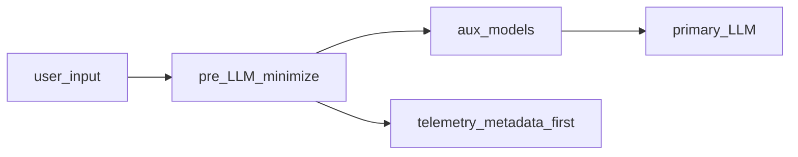

# Основной отчёт: методология внедрения и разработки {: #research_methodology_20260325 }
## Обзор пакета {: #research_methodology_20260325_obzor_paketa }

Этот документ — **каноническое место** для операционной модели, фаз внедрения и производственной методологии без дублирования экономических таблиц: все числа и тарифы — в парном основном отчёте по сайзингу и экономике. Содержание выдержано по сводному материалу «Краткое изложение: методология внедрения и отчуждения ИИ…» (март 2026); темы безопасности и observability вынесены в «Приложение D», отчуждение ИС и кода — в «Приложение B».

## Связанные документы {: #research_methodology_20260325_svyazannye_dokumenty }

- [«Приложение A: обзор и ведомость документов»](./20260325-research-appendix-a-index-ru.md#research_pkg_a_obzor_paketa)
- [«Основной отчёт: сайзинг и экономика»](./20260325-research-report-sizing-economics-main-ru.md#research_sizing_20260325_obzor_paketa) (канон по цифрам)
- [Профиль on-prem GPU в проектах CMW](./20260325-research-report-sizing-economics-main-ru.md#research_sizing_20260325_profil_onprem_gpu_v_proektah_cmw) (реф. GeForce 24 ГБ, кастом 4090 48 ГБ, RTX PRO 6000 Blackwell 96 ГБ)
- [«Приложение B: отчуждение ИС и кода (KT, IP)»](./20260325-research-appendix-b-ip-code-alienation-ru.md#research_pkg_b_obzor_paketa)
- «Приложение C: имеющиеся наработки CMW»
- [«Приложение D: безопасность, комплаенс и observability»](./20260325-research-appendix-d-security-observability-ru.md#research_pkg_d_obzor_paketa)

## Назначение документа и границы применения {: #research_methodology_20260325_naznachenie_dokumenta_i_granitsy_primeneniya }

Документ обобщает **методологию внедрения и отчуждения** решений класса корпоративных ИИ-ассистентов с RAG, локальным или облачным инференсом и агентными сценариями. Названия **корпоративный RAG-контур**, **сервер инференса MOSEC**, **инференс на базе vLLM**, **агентный слой платформы (CMW Platform)** используются как **условные обозначения ролей компонентов** иллюстративного референс-стека, а не как коммерческое предложение готового продукта.

**Фокус ценности:** воспроизводимые практики, пакет артефактов для передачи (knowledge transfer), критерии приёмки, комплаенс и управление рисками — материал пригоден для доработки руководством и стейкхолдерами и далее как **ориентир для продаж, передачи знаний и ИС, обучения команд и оценки новых проектов**.

**Сопутствующее резюме:** **Оценка сайзинга, КапЭкс и ОпЭкс для клиентов** — экономика, тарифы, дерево затрат; там же раздел **«Открытые веса и API: влияние на TCO»**.

---

## Резюме для руководства {: #research_methodology_20260325_rezyume_dlya_rukovodstva }

**Ситуация:** в 2026 году GenAI оценивается по P&L, а в РФ добавляются требования суверенитета данных и регуляторные инициативы по ИИ.

**Осложнение:** без явного **периметра до LLM** (минимизация и обезличивание входа, разделение вспомогательных и основной модели, политика телеметрии) растут риски по 152-ФЗ и стоимость инцидентов; без **офлайн и онлайн eval** невозможно доказуемо связывать смену модели или индекса с качеством и бюджетом.

**Вопрос для решения:** как внедрять и масштабировать ассистентов на стеке **корпоративный RAG-контур** (RAG и доставка), **сервер инференса MOSEC** / **инференс на базе vLLM** (инференс) и **агентный слой платформы (CMW Platform)** (при сценариях CMW Platform), и **как отчуждать** экспертизу и артефакты клиенту без потери управляемости.

**Рекомендуемый ответ:** опереться на целевую операционную модель (роли, KPI, риски), поэтапный POC → Pilot → Scale, пакет отчуждения (код, конфигурация, данные, модели, runbook, обучение) и блок комплаенса (152-ФЗ, приказ Роскомнадзора № 140 о методах обезличивания, NIST AI RMF, guardrails), а также на **единую промышленную наблюдаемость** (трассировки и метрики по этапам RAG и агента, учёт токенов) с политикой данных, согласованной с ПДн. Закладывать **три оси гибрида:** резидентность и обработка ПДн, размещение вспомогательных моделей (эмбеддинг, реранг, гард, при необходимости NER/маскирование), размещение основной LLM. Глобальные шлюзы для coding agents (**OpenRouter**, **OpenCode Zen**) относить к **разработке и экспериментам**, а не к подразумеваемому продакшн-API для ПД в РФ без отдельной оценки — см. «Ориентиры для заказчика» и Compliance. Детали — в разделах TOM, внедрение, **Промышленная наблюдаемость**, отчуждение и Compliance ниже.

**Зоны готовности (ориентир для портфеля инициатив):** зелёная — политика данных и телеметрии согласованы с ДПО, eval и SLO зафиксированы; жёлтая — пилот без полного пакета отчуждения или без учёта приказа № 140 в процессах; красная — прод с ПДн без локализации/обезличивания или с полным текстом промптов в недоверенных SaaS.

**Управленческие компромиссы (горизонт 12–24 мес.):**

- **Облако (РФ API)** — быстрый старт и предсказуемый OpEx по токену vs зависимость от тарифов и политики провайдера.
- **On-prem / выделенный GPU** — CapEx и LLMOps vs контроль данных и устойчивость под высокую утилизацию.
- **Гибрид** — баланс затрат vs сложность оркестрации и единая обсервабильность.
- **Открытые веса российских LLM** — Сбер публикует GigaChat-3.1-Ultra и GigaChat-3.1-Lightning под **MIT** ([Hugging Face](https://huggingface.co/collections/ai-sage/gigachat-31), [GitVerse](https://gitverse.ru/GigaTeam/gigachat3.1), [обзор на Хабре](https://habr.com/ru/companies/sberbank/articles/1014146/)): расширяется сценарий **закрытого контура** и пакет отчуждения (веса + лицензия + фиксация версий) при росте доли **CapEx/OpEx GPU** и LLMOps; сравнение с оплатой по токенам — в сопутствующем резюме **Оценка сайзинга, КапЭкс и ОпЭкс для клиентов**.

**Примеры метрик успеха:** экономический эффект кейса (экономия **эквивалента полных ставок**, снижение числа обращений), доля ответов с проверяемой цитатой, целевой уровень по задержке, покрытие red teaming / guardrails, готовность пакета отчуждения (чек-лист в конце документа).

**Ключевой инсайт:** успех внедрения на ~70% определяется операционной моделью и качеством данных, ~30% — выбором LLM; для госсектора и КИИ критичен контур **доверенных моделей** и локализация обработки.

- **Инженерия обвязки** агентов — **операционный и передаваемый** актив: контекст в репозитории, инструменты, линтеры, циклы проверки; её тяжесть и декомпозиция задач имеет смысл **пересматривать при смене поколения модели** ([Anthropic — Harness design for long-running application development](https://www.anthropic.com/engineering/harness-design-long-running-apps)).
- **Отчуждение:** в пакет передачи закладывают версионируемые skills, регламенты **MCP**, **CI** и **CD**, рубрики и **промпты** для **модели-контролёра** — см. раздел **«Инженерия обвязки для агентов»** ниже.

---

## Источник преимущества в корпоративном ИИ (2026): внутренний контекст и рабочий слой данных {: #research_methodology_20260325_istochnik_preimuschestva_v_korporativnom_ii_2026_vnutrennii_kontekst_i_rabochii_ }

Корпоративный ИИ быстро проходит этап, на котором базовое качество в основном определялось выбором модели.

По мере выравнивания доступа к LLM и агентным фреймворкам источник преимущества смещается **внутрь компании**: в её собственный контекст — датасеты, связи между ними и накопленную операционную логику.

В 2026 году в центре внимания окажется уже не сам факт доступа к данным, а их **пригодность для рабочих процессов**, прежде всего там, где ИИ-агенты принимают решения, передают задачи и выполняют действия сразу в нескольких системах.

Ниже — условия, от которых зависит, сможет ли компания превратить данные в устойчивый **рабочий слой** корпоративного ИИ.

### Семантический слой {: #research_methodology_20260325_semanticheskii_sloi }

Если в данных не описаны связи между объектами, статусами, событиями и правилами, система видит только отдельные фрагменты.

Этого достаточно для поиска или ответа на вопрос, но недостаточно для **исполнения процесса**.

Семантический слой задаёт общую логику: что считается заказом, как клиент связан с договором, в каком статусе допустимо следующее действие, какие исключения требуют отдельного маршрута.

Без такой структуры автоматизация быстро упирается в разрывы логики и ручные проверки.

Gartner относит тему **AI-ready data** к числу быстрорастущих в повестке по ИИ (_«[Gartner — пресс-релиз: нехватка AI-ready data подрывает ИИ-проекты (26.02.2025)](https://www.gartner.com/en/newsroom/press-releases/2025-02-26-lack-of-ai-ready-data-puts-ai-projects-at-risk)»_).

Инженерная проработка баз знаний и онтологий в целевой операционной модели — у роли **Knowledge Engineer** ниже.

### Архитектура доступа {: #research_methodology_20260325_arhitektura_dostupa }

Для рабочих сценариев важно, чтобы в момент действия система получала **полный и согласованный** контекст.

Если нужные сведения распределены по разным системам, расходятся в версиях и подтягиваются с задержкой, точность начинает снижаться уже на уровне базовых операций.

Архитектура доступа влияет на стоимость исполнения, длину сценария, количество проверок и устойчивость процесса при росте нагрузки.

Здесь важен не сам факт интеграции, а способность собрать **единый рабочий слой** для конкретного действия.

Связь с юнит-экономикой и TCO при многошаговых агентских цепочках — в сопутствующем резюме **Оценка сайзинга, КапЭкс и ОпЭкс для клиентов**.

Для **пилотов линии поддержки** полезно опереться на **примерные расчёты расхода токенов**, полученные из доступных данных по публичному корпусу заявок с портала поддержки: таблицы, допущения по переводу слов в токены и разводку **целевой цены за тикет** и **верхней модельной оценки цикла** приведены в [основном отчёте по сайзингу и экономике](./20260325-research-report-sizing-economics-main-ru.md#research_sizing_20260325_primernye_raschety_rashoda_tokenov_na_dostupnyh_dannyh_portal_podderzhki), подраздел **«Примерные расчёты расхода токенов на доступных данных (портал поддержки)»**; здесь цифры не дублируются.

### Исполняемые правила {: #research_methodology_20260325_ispolnyaemye_pravila }

По мере роста автономности правила доступа, ограничения, маршруты согласования и требования соответствия должны работать **автоматически**.

Для промышленного использования нужны исполняемые правила, которые применяются на уровне каждого запроса, перехода и действия: это снижает операционный риск и делает результат воспроизводимым.

Практический контур политик, guardrails и комплаенса — в _«[Приложение D: безопасность, комплаенс и observability](./20260325-research-appendix-d-security-observability-ru.md#research_pkg_d_obzor_paketa)»_.

### Внутренний контур данных {: #research_methodology_20260325_vnutrennii_kontur_dannyh }

Основная прикладная ценность смещается во **внутренний контур данных** компании: бизнес-правила, историю операций, предметную логику и накопленные связи между сущностями.

Этот слой задаёт качество решения в конкретной отрасли, функции и операционной модели.

Чем точнее компания умеет формализовать и поддерживать такой контекст, тем выше качество исполнения, устойчивость сценариев и потенциал тиражирования на соседние процессы.

### Что это значит для бизнеса {: #research_methodology_20260325_chto_eto_znachit_dlya_biznesa }

В 2026 году ключевым фактором для корпоративного ИИ станет **качество внутреннего контекста** компании: от него зависит, сможет ли система работать в реальных процессах, соблюдать логику действий и давать воспроизводимый результат.

Преимущество будет у тех, кто соберёт **связный и управляемый слой** для работы ИИ — так, чтобы встраивать систему в реальные процессы и масштабировать её за пределы локальных сценариев.

---

## Целевая операционная модель (Target Operating Model) {: #research_methodology_20260325_tselevaya_operatsionnaya_model_target_operating_model }

Для масштабирования ИИ-решений рекомендуется переход от централизованного AI CoE к **федеративной модели** с сильным центром компетенций.

### Роли и ответственности {: #research_methodology_20260325_roli_i_otvetstvennosti }
- **AI Product Owner:** Ответственность за бизнес-эффект (ROI), приоритизацию гипотез.
- **LLMOps / AI Architect:** Проектирование инфраструктуры (vLLM/MOSEC), мониторинг качества (RAGAS/DeepEval), целевая архитектура **телеметрии** (трассировки, метрики токенов и латентности, политика сэмплинга и ретенции) и согласование с ИБ при контурах с ПДн; совместно с владельцами разработки — **среда для агентов** (инструменты, линтеры, CI, контуры офлайн/eval и при необходимости мультиагентных циклов разработки — см. **«Инженерия обвязки для агентов»**).
- **AI Security Officer:** Комплаенс с 152-ФЗ и NIST AI RMF, аудит безопасности (Red Teaming).
- **Knowledge Engineer:** Подготовка и актуализация базы знаний (ChromaDB), управление онтологиями.

### Процессы и КПЭ (KPI) {: #research_methodology_20260325_protsessy_i_kpe_kpi }
- **Utilization:** % сотрудников, использующих ИИ ежедневно (цель: >60%).
- **Proficiency:** Сокращение времени на решение тикета/задачи (цель: -30-40%).
- **Accuracy:** Точность ответов без галлюцинаций (цель: >95% по результатам LLM-as-a-Judge).
- **Unit Economics:** Стоимость одного успешного ответа (P&L вклад).

**Независимые русскоязычные бенчмарки и методы оценки:** экосистема **MERA** ([mera.a-ai.ru](https://mera.a-ai.ru/)) на площадке **Альянса в сфере искусственного интеллекта** ([a-ai.ru](https://a-ai.ru/)) задаёт открытый контур сравнения фундаментальных моделей на русском языке; участие **MTS AI** и других организаций в таких инициативах иллюстрирует **отраслевую стандартизацию eval**, дополняющую внутренние метрики заказчика (RAGAS, DeepEval, LLM-as-judge). Отдельно как **методологический** (а не коммерческий) референс для настройки взаимной оценки моделей полезен разбор цикла улучшения **Cotype** с опорой на LLM-судей ([Хабр, MTS AI](https://habr.com/ru/companies/mts_ai/articles/892176/)): воспроизводимость на корпоративных данных требует явной фиксации промптов судей, эталонов и регрессионных наборов в пакете отчуждения.

---

## Методология внедрения (Этапы и Качество) {: #research_methodology_20260325_metodologiya_vnedreniya_etapy_i_kachestvo }

Рекомендуется 4-фазный подход, основанный на практиках **red_mad_robot** и **Just AI**:

### Фаза 1: POC (2-4 недели) {: #research_methodology_20260325_faza_1_poc_2_4_nedeli }
- **Цель:** Проверка технической осуществимости.
- **Артефакты:** Прототип на **корпоративный RAG-контур** с типовым инференсом через **сервер инференса MOSEC**, замер baseline-метрик; при кейсах платформы — задействование **агентный слой платформы (CMW Platform)**.
- **Контроль:** Успешное выполнение 10 критических сценариев.

### Фаза 2: Pilot (1-3 месяца) {: #research_methodology_20260325_faza_2_pilot_1_3_mesyatsa }
- **Цель:** Валидация в промышленном окружении на ограниченной группе пользователей.
- **Инструментарий:** Развертывание инференса через **сервер инференса MOSEC** (или **инференс на базе vLLM** при высокой нагрузке на LLM), внедрение Guardrails; согласование нагрузки со стороны **корпоративный RAG-контур** и **агентный слой платформы (CMW Platform)**.
- **Контроль:** Замер ROI, сбор обратной связи (Human-in-the-loop).

### Фаза 3: Scale (3-12 месяцев) {: #research_methodology_20260325_faza_3_scale_3_12_mesyatsev }
- **Цель:** Enterprise-wide внедрение.
- **Архитектура:** Масштабирование LLM через **инференс на базе vLLM**, развитие **корпоративный RAG-контур** под нагрузкой; для операций с сущностями платформы — **агентный слой платформы (CMW Platform)**; при необходимости Multi-Agent Swarm (координатор/воркер).
- **Контроль:** Стабильность под нагрузкой (SLA 99.9%), соответствие бюджету (FinOps).

### Фаза 4: Optimize (Постоянно) {: #research_methodology_20260325_faza_4_optimize_postoyanno }
- **Цель:** Снижение TCO и повышение качества.
- **Методы:** DSPy для оптимизации промптов, квантование моделей, кэширование (LMCache).
- **Агентская разработка и сопровождение:** при зрелости команды и контура — регламент **мультиагентных** циклов (план → реализация → независимая проверка) и меры против **энтропии** документации относительно кода (периодическая синхронизация, «сборка мусора» артефактов) в духе отраслевой **инженерии обвязки** ([OpenAI — Harness engineering](https://openai.com/ru-RU/index/harness-engineering/), [Хабр](https://habr.com/ru/articles/1005032/)).

---

## Детальная архитектура внедрения {: #research_methodology_20260325_detalnaya_arhitektura_vnedreniya }

### Основные компоненты {: #research_methodology_20260325_osnovnye_komponenty }

| Компонент | Проект | Роль | Технология |
|-----------|------------|------|------------|
| **RAG-движок** | **корпоративный RAG-контур** | Оркестрация поиска, генерации и логики агентов | Python, LangChain, Gradio |
| **Сервер инференса (Унифицированный)** | **сервер инференса MOSEC** | Обслуживание моделей эмбеддинга, реранкера и охранника на одном порту | MOSEC, PyTorch |
| **Сервер инференса (Распределенный)** | **инференс на базе vLLM** | Обслуживание LLM и пулинг-моделей через vLLM | vLLM, CUDA |
| **Векторное хранилище** | **корпоративный RAG-контур** | Постоянное хранение встраиваний документов | ChromaDB (HTTP) |

### Поток данных и конвейер {: #research_methodology_20260325_potok_dannyh_i_konveier }

1.  **Ингестия:**
    -   Документы (Markdown, MkDocs) обрабатываются модулем обработки документов RAG-движка.
    -   Разбиваются на чанки через токен-зависимый чанкер.
    -   Встраиваются через компонент эмбеддинга (FRIDA/Qwen3).
    -   Векторы и метаданные сохраняются в ChromaDB через слой векторного хранилища.

2.  **Поиск (RAG):**
    -   Пользовательский запрос поступает в конвейер ретривера.
    -   **Векторный поиск:** ChromaDB извлекает top-k чанков.
    -   **Реранкинг:** Кросс-энкодер или LLM-реранкер уточняет результаты.
    -   **Сборка контекста:** Статьи восстанавливаются, при необходимости суммируются (модуль суммаризации).

3.  **Генерация:**
    -   **Режим агента (Рекомендуется):** Агент LangChain анализирует запрос, принудительно вызывает инструмент извлечения контекста и генерирует ответ с цитатами.
    -   **Прямой режим:** Менеджер LLM генерирует ответ напрямую из найденного контекста.

4.  **Доставка:**
    -   **Веб-интерфейс:** Gradio ChatInterface в сервисном слое API RAG-движка.
    -   **API:** REST-эндпоинт `/api/query_rag`.
    -   **Виджет:** Встраиваемый HTML/JS виджет для внедрения на сторонние страницы.

### Конфигурация сервера инференса {: #research_methodology_20260325_konfiguratsiya_servera_inferensa }

#### MOSEC, vLLM и репозитории CMW {: #research_methodology_20260325_mosec_vllm_i_repozitorii_cmw }

- **MOSEC** (апстрим, проект [mosecorg/mosec](https://github.com/mosecorg/mosec)) — открытый фреймворк **подачи ML-моделей через HTTP API**: быстрый веб-слой (Rust), логика воркеров на Python, динамическое батчирование запросов, поэтапные пайплайны и облачно-ориентированные практики (прогрев, graceful shutdown, метрики). Подробнее: [документация MOSEC](https://mosecorg.github.io/mosec/index.html).
- **vLLM** — высокопроизводительный **движок инференса** для больших языковых моделей с OpenAI-совместимым API, оптимизациями памяти и пакетной обработкой; описание сервера: [OpenAI-Compatible Server](https://docs.vllm.ai/en/stable/serving/openai_compatible_server.html).

**Репозитории CMW** (прикладные пакеты вокруг MOSEC и vLLM; подробности развёртывания — в публичной документации каждого модуля):

- **сервер инференса MOSEC** — прикладной пакет: управление процессом, реестр моделей (YAML), воркеры **эмбеддинга, реранкера и контент-охранника**, OpenAI-совместимые маршруты. **Одна сетевая точка** для вспомогательных моделей RAG — проще политики безопасности и сопровождение.
- **инференс на базе vLLM** — прикладной пакет: жизненный цикл процессов vLLM (загрузка моделей, проверки здоровья, конфигурация), в т.ч. режимы pooling для эмбеддингов/скоринга в поддерживаемых сборках vLLM. Ориентир: **максимальная производительность LLM** и гибкий выбор чекпоинтов под нагрузку.

#### Одна HTTP-точка и несколько серверных процессов {: #research_methodology_20260325_odna_http_tochka_i_neskolko_servernyh_protsessov }

В **сервер инференса MOSEC** на **одном HTTP-порту** сосуществуют **разные роли** (эмбеддинг, реранг, модерация) в рамках **одного MOSEC-сервиса** с разными воркерами — это **не** размещение нескольких независимых процессов vLLM за одним портом. У **vLLM** распространённый паттерн — **отдельный серверный процесс на модель/конфигурацию**; несколько моделей обычно означает **несколько инстансов** (часто на разных портах) и маршрутизацию на стороне клиента, API-шлюза или балансировщика. Исключения и тонкости multi-GPU/репликации одной модели — по документации vLLM для выбранной версии.

#### Вариант А: унифицированный сервер (сервер инференса MOSEC) {: #research_methodology_20260325_variant_a_unifitsirovannyi_server_server_inferensa_mosec }

- **Эксплуатация:** запуск объединённого сервиса через CLI пакета **сервер инференса MOSEC** (порт и активные модели задаются конфигурацией; типичный порт по умолчанию — 8001, см. поставляемую документацию).
- **Модели:** эмбеддинг, реранкер и охранник могут подключаться динамически в рамках поддержанного набора.
- **Выгоды для внедрения:** меньше сетевых конечных точек, проще обучение эксплуатации и отчуждение runbook-а клиенту; хороший старт для пилотов **корпоративный RAG-контур**.
- **Сайзинг:** VRAM делится между фактически загруженными моделями на узле; детальные оценки памяти публикуются вместе с пакетом **сервер инференса MOSEC** (артефакты замеров и методика — в документации репозитория).
- **Ограничения:** расширение модельного ряда упирается в то, что команда интегрировала в MOSEC-воркеры (меньше «произвольного зоопарка», чем у голого vLLM).

#### Вариант Б: распределённые инстансы vLLM (инференс на базе vLLM) {: #research_methodology_20260325_variant_b_raspredelennye_instansy_vllm_inferens_na_baze_vllm }

- **Эксплуатация:** отдельный процесс vLLM на выбранную модель и порт через CLI **инференс на базе vLLM** (точные флаги и примеры — в поставляемой документации **инференса на базе vLLM**).
- **Типичная схема сети:** отдельные порты для LLM, эмбеддинга, реранкера, охранника, если все роли вынесены на vLLM (например, 8100, 8101, 8105 — иллюстративно; фактические значения задаются политикой развёртывания).
- **Выгоды для внедрения:** зрелые GPU-оптимизации vLLM (в т.ч. KV-кэш, непрерывное батчирование), удобное горизонтальное масштабирование реплик под SLA по задержке и пропускной способности.
- **Сайзинг:** выше суммарный оверхед VRAM и число процессов; зато предсказуемее поведение под пиковый чат и длинный контекст при правильном шардировании и профиле **корпоративный RAG-контур** / **агентный слой платформы (CMW Platform)**.
- **Ограничения:** сложнее операционная картина (несколько сервисов); смена модели чаще требует перезапуска процесса по сравнению с динамической загрузкой в **сервер инференса MOSEC**.

Команды CLI, примеры портов и переменные окружения приведены в поставляемой документации **сервера инференса MOSEC** и **инференса на базе vLLM**; в этом документе зафиксированы архитектурный выбор, экономика и риски, без повторения пошагового runbook.

#### Три оси гибридного размещения и выбор бэкенда по типу модели {: #research_methodology_20260325_tri_osi_gibridnogo_razmescheniya_i_vybor_bekenda_po_tipu_modeli }

**Ось 1 — данные и ПДн:** где хранятся и обрабатываются исходные сообщения, индекс RAG, журналы; соответствует требованиям локализации и согласий.

**Ось 2 — вспомогательные модели:** эмбеддинг, реранг, контент-охранник, при необходимости слой маскирования/NER до LLM; часто совмещаются на одном унифицированном HTTP-сервисе (**сервер инференса MOSEC**) или распределяются по отдельным процессам (**инференс на базе vLLM** и др.) в зависимости от нагрузки и поддерживаемых форматов.

**Ось 3 — основная LLM:** управляемый API в РФ или self-hosted; здесь концентрируется основной счётчик токенов и требования к задержке.

На **оси 2** инженерные замеры на референс-стеке показали, что **разные классы моделей** не всегда допускают один и тот же серверный движок без потери корректности (например, корректный pooling для эмбеддингов и ограничения для генеративного реранкера). Это влияет на **число процессов, фрагментацию GPU и регрессионное тестирование** при обновлениях — количественные ориентиры и строки TCO вынесены в сопутствующее резюме **Оценка сайзинга, КапЭкс и ОпЭкс для клиентов**.



### Российские облачные провайдеры ИИ {: #research_methodology_20260325_rossiiskie_oblachnye_provaidery_ii }

Для соответствия требованиям о данных и инфраструктуре в России рекомендуются локальные облачные платформы и/или закрытый контур. **Все количественные тарифы** (₽ за токены, пакеты, ₽/час GPU) собраны в одном месте — раздел **«Тарифы российских облачных провайдеров ИИ»** в сопутствующем резюме **Краткое изложение: Оценка сайзинга, КапЭкс и ОпЭкс для клиентов (российский рынок)**; ниже — **роли провайдеров, состав моделей и правила сверки** без повторения таблиц. Дерево факторов стоимости и сценарный сайзинг — там же.

**Cloud.ru (Evolution Foundation Models)** · [[продукт]](https://cloud.ru/products/evolution-foundation-models) · [[тарифы]](https://cloud.ru/documents/tariffs/evolution/foundation-models)

- **API:** OpenAI-совместимый доступ к моделям в российских ЦОД.

- **Каталог (на [странице продукта](https://cloud.ru/products/evolution-foundation-models) перечислены позиции с идентификаторами Hugging Face `org/repo`):**
  - **GigaChat:** продуктовые имена GigaChat / Lite / Pro / **GigaChat-2-Max** и ветка **`ai-sage/GigaChat3-10B-A1.8B`** (сверка с линейкой 3.0 / 3.1 на Hub — отдельно).
  - **GLM (Zhipu, org `zai-org`):** **`GLM-4.6`**, **`GLM-4.7`**, **`GLM-4.7-Flash`** ([пример карточки](https://huggingface.co/zai-org/GLM-4.7-Flash)); крупное семейство **`GLM-5`** — на [HF](https://huggingface.co/zai-org/GLM-5).
  - **Qwen (Alibaba, org `Qwen`):** **`Qwen3-235B-A22B-Instruct-2507`**, семейства **`Qwen3-Coder-*`**, **`Qwen3-Next-80B-A3B-Instruct`**; линейка **`Qwen3.5-*`** (в т.ч. MoE) — сверять наличие в [каталоге](https://cloud.ru/products/evolution-foundation-models) и в [прайсе](https://cloud.ru/documents/tariffs/evolution/foundation-models) на дату.
  - **T‑Tech:** линейки **`t-tech/T-lite-it-*`**, **`T-pro-it-*`**.
  - **Прочие текстовые LLM:** **`openai/gpt-oss-120b`**, **`MiniMaxAI/MiniMax-M2`**.
  - **Эмбеддинги и реранкинг:** **`BAAI/bge-m3`**, **`BAAI/bge-reranker-v2-m3`**, **`Qwen/Qwen3-Embedding-0.6B`**, **`Qwen/Qwen3-Reranker-0.6B`**.
  - **Речь и документы:** **`openai/whisper-large-v3`**, **`deepseek-ai/DeepSeek-OCR-2`**.

- **Тарификация:** оплата **по токенам** (входные и генерируемые — отдельно, см. [официальный прайс](https://cloud.ru/documents/tariffs/evolution/foundation-models)). **Все ₽/млн и расшифровка по строкам** (в т.ч. GigaChat3-10B-A1.8B, Qwen3-235B, GigaChat-2-Max, GLM-4.6, MiniMax-M2) — только в сопутствующем резюме, раздел **«Тарифы российских облачных провайдеров ИИ»**; маркетинговый перечень на сайте может быть **шире** прайса на дату сверки.

- **SKU vs Hub:** имя в биллинге **не** гарантирует ту же ревизию весов, что на Hugging Face, без явной проверки.

**Yandex Cloud (Yandex AI Studio / YandexGPT)** · [[модели]](https://aistudio.yandex.ru/docs/ru/ai-studio/concepts/generation/models.html) · [[тарификация]](https://aistudio.yandex.ru/docs/ru/ai-studio/pricing.html)

- **Модели (текст, базовый инстанс):** в обзорах и переговорах часто выделяют **YandexGPT Pro 5.1** и **Alice AI LLM**; полный перечень — [доступные генеративные модели](https://aistudio.yandex.ru/docs/ru/ai-studio/concepts/generation/models.html): Alice AI LLM; YandexGPT Pro 5.1 и Pro 5; YandexGPT Lite 5; DeepSeek V3.2; Qwen3 235B; gpt-oss-120b и gpt-oss-20b; Gemma 3 27B ([условия Gemma](https://ai.google.dev/gemma/terms)); дообученная YandexGPT Lite; YandexART и Realtime.

- **Тарифы:** первоисточник — [правила тарификации AI Studio](https://aistudio.yandex.ru/docs/ru/ai-studio/pricing.html): таблица Model Gallery, ₽ **с НДС** за **1000** токенов (входящие, кеш, инструменты, исходящие); для агентов — отдельно токены инструментов. Эквиваленты **₽/млн** и строки по моделям — в сопутствующем резюме. **Контекст рынка (не договорный прайс):** в публикации [AKM.ru](https://www.akm.ru/eng/press/yandex-b2b-tech-has-opened-access-to-the-largest-language-model-on-the-russian-market/) встречались ориентиры порядка **~0,5 ₽ за 1000** токенов (**~50 коп.**); они полезны как **иллюстрация прессы**, но **не** подменяют официальную таблицу на дату сверки (для сопоставимости с КП см. сопутствующее резюме).

- **Особенности:** **OpenAI-совместимый** доступ к ряду моделей; **интеграция с экосистемой Yandex Cloud** (данные, идентичность, смежные сервисы — по политике заказчика и документации Яндекса); линейка **YandexGPT / Alice** ориентирована в том числе на **русскоязычные** сценарии наряду с мультиязычными моделями в галерее.

**SberCloud (GigaChat API)** [[портал]](https://developers.sber.ru/portal/products/gigachat-api) · [[юридические тарифы]](https://developers.sber.ru/docs/ru/gigachat/tariffs/legal-tariffs)

- **Модели:** GigaChat-2 Lite, Pro, Max.

- **Тарифы:** пакеты токенов по [юридическим тарифам](https://developers.sber.ru/docs/ru/gigachat/tariffs/legal-tariffs); эквиваленты **₽/млн** и размеры пакетов — в таблицах сопутствующего резюме (тот же раздел **«Тарифы российских облачных провайдеров ИИ»**).

**Selectel (Foundation Models Catalog)** [[источник]](https://selectel.ru/services/cloud/foundation-models-catalog)

- Каталог с выделенным endpoint, API **совместим с OpenAI**; оплата за **CPU, GPU, RAM, диски**, не за токены. **Private Preview**, список моделей в панели (ссылки на HF). Свои веса **не** заявлены (FAQ на сайте).

**MWS GPT (МТС Web Services)** [[продукт]](https://mws.ru/mws-gpt/) · [[тарифы]](https://mws.ru/docs/docum/cloud_terms_mwsgpt_pricing.html)

- OpenAI-совместимый API, SLA **99,95%** (для части моделей), режимы **SaaS / hybrid / on-prem**. Прайс **без НДС** за 1000 токенов под внутренними именами; сопоставление с публичными названиями — у поставщика. **Цифры** (лендинг, таблица «Модель N», НДС) — в сопутствующем резюме, подраздел **MWS GPT**.

**VK Cloud (ML)** [[документация]](https://cloud.vk.com/docs/ru/ml)

- **Cloud ML Platform**, Spark, Cloud Voice, Vision — **без** публичного каталога готовых LLM в формате Evolution FM / AI Studio; типичный путь — **своя** модель и MLOps.

#### Матрица: управляемый API в РФ и открытые веса {: #research_methodology_20260325_matritsa_upravlyaemyi_api_v_rf_i_otkrytye_vesa }

| Контур | API в РФ | Self-host / HF | Примеры семейств |
| :--- | :--- | :--- | :--- |
| Cloud.ru Evolution FM | Да | Часто те же `org/repo`, что в каталоге FM | GigaChat, GLM‑4.6–4.7‑Flash, Qwen3‑235B / Coder / Next, gpt‑oss, MiniMax‑M2, T‑tech |
| Yandex AI Studio | Да | Отдельные модели на HF (в т.ч. кастомные лицензии) | YandexGPT, Alice, DeepSeek V3.2, Qwen3 235B, gpt‑oss, Gemma 3 |
| Sber GigaChat API | Да | **GigaChat 3.1** MIT на HF ([ai-sage](https://huggingface.co/ai-sage)) | Коммерческий API и открытые веса — разный TCO |
| Selectel FMC | Да (Private Preview) | Каталог → HF; свои веса не заявлены | Оплата **инфраструктура**, не токены |
| MWS GPT | Да | Публичный каталог HF не сведён | Прайс по кодам «Модель N» |
| VK Cloud ML | Нет LLM‑каталога в доке | BYO на ML Platform | Инфраструктура под **инференс на базе vLLM** / **сервер инференса MOSEC** |

**Типично только open weights (доставка в РФ — GPU‑облако или on-prem):** ниже — **родственные чекпойнты** на Hugging Face по группам; многие те же `org/repo`, что в каталоге **Cloud.ru Evolution FM** (количественный прайс и SKU — только у провайдера).

| Группа | Репозитории на Hugging Face (родственные модели) | Заметка для заказчика |
| :--- | :--- | :--- |
| **GLM (Zhipu, `zai-org`)** | [GLM-4.6](https://huggingface.co/zai-org/GLM-4.6) · [GLM-4.7](https://huggingface.co/zai-org/GLM-4.7) · [**GLM-4.7-Flash**](https://huggingface.co/zai-org/GLM-4.7-Flash) (более компактная ветка) · [GLM-5](https://huggingface.co/zai-org/GLM-5) (флагман MoE) | Линейка **4.6–4.7** и **GLM-5** — разный масштаб VRAM; **4.7-Flash** — типичный кандидат, когда нужен меньший след по железу при том же бренде |
| **gpt-oss (OpenAI)** | [openai/gpt-oss-20b](https://huggingface.co/openai/gpt-oss-20b) · [openai/gpt-oss-120b](https://huggingface.co/openai/gpt-oss-120b); варианты с фильтрацией: [gpt-oss-safeguard-20b](https://huggingface.co/openai/gpt-oss-safeguard-20b) · [gpt-oss-safeguard-120b](https://huggingface.co/openai/gpt-oss-safeguard-120b) | **Apache-2.0**; те же публичные имена, что у **Yandex AI Studio** и **Cloud.ru** FM, но хостинг и комплаенс — на стороне заказчика |
| **Qwen3 / Qwen3.5 (`Qwen`)** | org [Qwen](https://huggingface.co/Qwen): MoE [Qwen3-235B-A22B-Instruct-2507](https://huggingface.co/Qwen/Qwen3-235B-A22B-Instruct-2507), [Qwen3-Next-80B-A3B-Instruct](https://huggingface.co/Qwen/Qwen3-Next-80B-A3B-Instruct); код: [Qwen3-Coder-30B-A3B-Instruct](https://huggingface.co/Qwen/Qwen3-Coder-30B-A3B-Instruct), [Qwen3-Coder-480B-A35B-Instruct](https://huggingface.co/Qwen/Qwen3-Coder-480B-A35B-Instruct); **Qwen3.5:** например [Qwen3.5-35B-A3B](https://huggingface.co/Qwen/Qwen3.5-35B-A3B) и др. на Hub | Семейство шире перечисления; сверять **лицензию**, **gated** и поддержку **vLLM/SGLang** по карточке |
| **GigaChat (открытые веса Сбера, `ai-sage`)** | [GigaChat3-10B-A1.8B](https://huggingface.co/ai-sage/GigaChat3-10B-A1.8B) (3.0) · [GigaChat3.1-10B-A1.8B](https://huggingface.co/ai-sage/GigaChat3.1-10B-A1.8B); крупный чекпойнт: [GigaChat3.1-702B-A36B](https://huggingface.co/ai-sage/GigaChat3.1-702B-A36B) | **MIT** на публичных весах; **GigaChat API** (SberCloud) и self-host — разный TCO (см. абзац ниже) |
| **MiniMax M2** | [MiniMaxAI/MiniMax-M2](https://huggingface.co/MiniMaxAI/MiniMax-M2) | На HF — **modified MIT** / особая лицензия в карточке; дублируется как SKU **Cloud.ru** FM — сверять прайс и условия |
| **DeepSeek R1 distill** | [DeepSeek-R1-Distill-Qwen-32B](https://huggingface.co/deepseek-ai/DeepSeek-R1-Distill-Qwen-32B) · [DeepSeek-R1-Distill-Llama-70B](https://huggingface.co/deepseek-ai/DeepSeek-R1-Distill-Llama-70B) и др. на `deepseek-ai` | Плотные модели разного размера под локальный инференс; рядом на Hub — полные ветки **DeepSeek-V3 / R1** (другой сайзинг) |
| **NVIDIA Nemotron 3** | [NVIDIA-Nemotron-3-Nano-30B-A3B-FP8](https://huggingface.co/nvidia/NVIDIA-Nemotron-3-Nano-30B-A3B-FP8) и др. в org [nvidia](https://huggingface.co/nvidia) | MoE, заявленный контекст до **1M** токенов ([обзор](https://research.nvidia.com/labs/nemotron/Nemotron-3/)); **не** готовый **API РФ** без своего контура |
| **Kimi (Moonshot)** | [moonshotai/Kimi-K2-Base](https://huggingface.co/moonshotai/Kimi-K2-Base); линейка K2.5 — в org [moonshotai](https://huggingface.co/moonshotai) | Часто IDE и агрегаторы; для КП — **не** baseline без явного контура и лицензии |

Все **числовые** ориентиры по управляемым API — в сопутствующем резюме **Краткое изложение: Оценка сайзинга, КапЭкс и ОпЭкс для клиентов (российский рынок)** (раздел **«Тарифы российских облачных провайдеров ИИ»**). Отдельно Сбер публикует **открытые веса** GigaChat‑3.1‑Ultra и Lightning под **MIT** ([Хабр](https://habr.com/ru/companies/sberbank/articles/1014146/)): экономика смещается в **CapEx/OpEx GPU** — см. **«Открытые веса и API: влияние на TCO»** в том же сопутствующем резюме.

**Паттерн «чекпойнт на Hugging Face + отдельная лицензия»** (не эквивалент permissive open source вроде MIT) меняет пакет отчуждения и учёт: у публичной ветки **YandexGPT-5-Lite-8B** применяется **кастомное лицензионное соглашение**, где при коммерческом использовании при достижении **10 миллионов выходных токенов в месяц** лицензиат в течение **30 календарных дней** после такого месяца обязан связаться с правообладателем для согласования дальнейшего использования, иначе лицензии прекращаются ([полный текст](https://huggingface.co/yandex/YandexGPT-5-Lite-8B-instruct/raw/main/LICENSE)). В том же тексте зафиксированы **применимое право РФ** и требования к **указанию авторства** при распространении — это входит в юридический контур передачи и в **мониторинг объёма генерации**, параллельно со сдвигом TCO в сторону **GPU и эксплуатации**, как у любого self-hosted чекпойнта.

**Идеи из открытой исследовательской публикации (не SLA коммерческих сервисов):** в обзорных материалах лабораторий перечисляются направления вроде **эффективных LLM** и оптимизации ([пример — дайджест за 2025 год](https://research.yandex.com/blog/yandex-research-in-2025)); как **инженерный ориентир** для PoC по памяти при длинном контексте полезен класс работ по **сжатию KV-кеша** ([arXiv:2501.19392](https://arxiv.org/abs/2501.19392), среди [принятых к ICML 2025](https://research.yandex.com/blog/papers-accepted-to-icml-2025)).

---

## Рекомендации по производственной эксплуатации (2026) {: #research_methodology_20260325_rekomendatsii_po_proizvodstvennoi_ekspluatatsii_2026 }

На основе исследования «Продвинутые подходы к RAG»:

1.  **Гибридный поиск:** Реализуйте BM25 + Плотный поиск для точности уровня enterprise (4-7,5% прирост).
2.  **Адаптивная маршрутизация:** Используйте анализ сложности запроса для прямой маршрутизации простых запросов в LLM, избегая ненужного поиска.
3.  **Самокоррекция:** Реализуйте механизмы критики для сложных запросов для уменьшения галлюцинаций.
4.  **Мониторинг и наблюдаемость:** Отслеживайте точность поиска, релевантность контекста и частоту галлюцинаций; закрепите **трассировки по этапам RAG/агента** и **метрики токенов и задержек** в духе раздела **«Промышленная наблюдаемость LLM, RAG и агентов»** и [OpenTelemetry GenAI](https://opentelemetry.io/docs/specs/semconv/gen-ai/gen-ai-spans/), с политикой данных для ПДн.
5.  **Длинные ответы и зацикливание:** для продакшена полезно измерять устойчивость генерации (повторы, «хвостовые» циклы). Сбер публично описывает борьбу с зацикливанием и связанные метрики в постобучении MoE-моделей GigaChat 3.1 ([Хабр](https://habr.com/ru/companies/sberbank/articles/1014146/)); на стороне заказчика показатели нужно воспроизводить на **своих** eval-сценариях, а не принимать как гарантию без замеров.

---

## Общие рекомендации {: #research_methodology_20260325_obschie_rekomendatsii }

1.  **Для новых внедрений:**
    -   Начните с **сервер инференса MOSEC** для простоты (единый сервер).
    -   Используйте режим агента в **корпоративный RAG-контур** для динамического вызова инструментов.
    -   При сценариях управления CMW Platform подключайте **агентный слой платформы (CMW Platform)** и планируйте нагрузку на LLM/API совместно с **корпоративный RAG-контур**.
    -   Реализуйте гибридный поиск (BM25 + Вектор) для оптимальных результатов.

2.  **Для масштабирования:**
    -   Переходите на **инференс на базе vLLM** для инференса LLM (лучшая производительность).
    -   Масштабируйте **корпоративный RAG-контур** и **агентный слой платформы (CMW Platform)** отдельно по профилю трафика (RAG vs операции платформы).
    -   Используйте отдельные инстансы vLLM для эмбеддинга/реранкера/охранника для распределения нагрузки.
    -   Рассмотрите Kubernetes для оркестрации при масштабировании на несколько узлов.

3.  **Для отчуждения:**
    -   Архивируйте исходные документы перед удалением векторных данных.
    -   Перед выключением выполните диагностику состояния векторного хранилища штатными утилитами сопровождения.

---

## Практики и архитектуры RAG: NeuralDeep и продвинутая ретривальная инженерия {: #research_methodology_20260325_praktiki_i_arhitektury_rag_neuraldeep_i_prodvinutaya_retrivalnaya_inzheneriya }

Конвейер **корпоративный RAG-контур** при отчуждении должен оставаться воспроизводимым: ingestion, чанкинг, эмбеддинги, LLM, реранкинг, выбор фреймворка, agentic-петля, eval и guardrails. Ниже — консолидированная разведка по NeuralDeep и паттернам @ai_archnadzor; первичные ссылки — в разделе «Источники».

### Извлекаемые уроки из публичных материалов OZON Tech (РФ) {: #research_methodology_20260325_izvlekaemye_uroki_iz_publichnyh_materialov_ozon_tech_rf }

Формулировки ниже — **не продвижение компании**, а переносимые управленческие и инженерные идеи с **краткой атрибуцией** первоисточникам Ozon Tech (Хабр, анонсы митапов). **Классический ML в поиске и рекламе, а также сценарные чат-боты с навыками, не тождественны GenAI/RAG**; использовать материалы как **аналогии** для ретривала, платформенного внедрения и MLOps, а не как замену стандартам вроде NIST AI RMF, практикам FinOps и принятому в организации пакету отчуждения.

- **Платформа вместо разовых ботов:** переход от узкой команды сценаристов к **no-code**-конструктору, **масштабирование на организацию** и цель **запуска нового бота за сутки** (против «не менее недели» в прежней модели), плюс поэтапный **MVP на одном боте** с последующим переносом остальных — близко к идее **федеративной TOM** и **платформенного** внедрения множества ассистентов, а не только одного RAG-контура ([Хабр, Ozon Tech](https://habr.com/ru/companies/ozontech/articles/834812/)).
- **Ретривал: не везде «только вектор»:** в задаче подсказок/текстового поиска обсуждаются компромиссы **ANN (эмбеддинги) vs обратный индекс**, фильтрация по бизнес-правилам в рантайме, **латентность и ресурсы**, интерпретируемость выдачи — по смыслу сонаправлено с **гибридным поиском** в RAG и с **FinOps-учётом стоимости и задержки** этапа извлечения ([Хабр, Ozon Tech](https://habr.com/ru/companies/ozontech/articles/990180/)).
- **MLOps-ритм:** в программе публичного митапа описана **ML-инфраструктура**, позволяющая **регулярно тестировать новую функциональность, обучать модели и автоматически выкатывать** их — перекликается с требованиями к **LLMOps, регрессиям и выкатке** в этом документе ([Хабр, Ozon Tech](https://habr.com/ru/companies/ozontech/articles/768734/)).
- **Отчуждение vs открытая инженерия:** публикации статей и **открытые репозитории** на GitHub — пример **обмена практиками** с рынком; это **не эквивалент** полноценному пакету передачи (код, данные, модели, runbook, IP, обучение) из раздела «Детальная методология отчуждения» в этом документе ([организация ozontech на GitHub](https://github.com/ozontech)).

### NeuralDeep: данные, модельный ряд, agentic RAG и безопасность {: #research_methodology_20260325_neuraldeep_dannye_modelnyi_ryad_agentic_rag_i_bezopasnost }

#### ETL и подготовка данных {: #research_methodology_20260325_etl_i_podgotovka_dannyh }

-   **markitdown** — конвертация документов в Markdown [[GitHub]](https://github.com/microsoft/markitdown)
-   **marker** — быстрое извлечение текста из PDF [[GitHub]](https://github.com/datalab-to/marker)
-   **docling** — продвинутое извлечение данных из документов [[GitHub]](https://github.com/docling-project/docling)

#### Чанкование (Chunking) {: #research_methodology_20260325_chankovanie_chunking }

-   **Chonkie** — быстрая и легковесная библиотека для чанкования [[GitHub]](https://github.com/chonkie-inc/chonkie)
-   LangChain text splitters [[GitHub]](https://github.com/langchain-ai/langchain/tree/master/libs/text-splitters)

#### Векторные модели для русского языка {: #research_methodology_20260325_vektornye_modeli_dlya_russkogo_yazyka }

-   **ai-forever/FRIDA** — российская модель, оптимизированная для русского
-   **BAAI/bge-m3** — мультиязычная модель
-   **intfloat/multilingual-e5-large** — мультиязычные эмбеддинги
-   **Qwen3-Embedding-8B** — большая мультиязычная модель

#### Суверенный стек одного вендора (опционально) {: #research_methodology_20260325_suverennyi_stek_odnogo_vendora_optsionalno }

Помимо LLM из коллекции [GigaChat 3.1](https://huggingface.co/collections/ai-sage/gigachat-31) на Hugging Face у организации [ai-sage](https://huggingface.co/ai-sage) опубликованы коллекции [GigaEmbeddings](https://huggingface.co/collections/ai-sage/gigaembeddings), [GigaAM](https://huggingface.co/collections/ai-sage/gigaam) (модели для речи) и [GigaChat Lite](https://huggingface.co/collections/ai-sage/gigachat-lite). Их можно рассматривать при цели **единого открытого контура** под одним вендором весов; это **не** обязательная замена рекомендованных для **корпоративный RAG-контур** эмбеддингов (FRIDA, Qwen3 и т.д.): решение фиксируется в **ADR**, с eval качества RAG и проверкой **лицензии** на каждой карточке модели.

#### LLM и vLLM модели для русского сегмента {: #research_methodology_20260325_llm_i_vllm_modeli_dlya_russkogo_segmenta }

**Рекомендации сообщества по соотношению цена/качество:**

-   **t-tech/T-lite-it-1.0** — легкая модель для русского языка
-   **t-tech/T-pro-it-2.0** — продвинутая модель для русского языка
-   **Qwen3-30B-A3B-Instruct-2507** — рекомендуется для Agentic RAG [[GitHub]](https://github.com/vamplabAI/sgr-agent-core/tree/tool-confluence)
-   **RefalMachine/RuadaptQwen2.5-14B-Instruct** — адаптированная для русского

#### Реранкеры {: #research_methodology_20260325_rerankery }

-   **BAAI/bge-reranker-v2-m3** — мультиязычный кросс-энкодер
-   **Qwen3-Reranker-8B** — большая модель для реранкинга

#### Фреймворки для RAG {: #research_methodology_20260325_freimvorki_dlya_rag }

Одобрено сообществом NeuralDeep:
-   **Dify** — Low-code платформа для AI-приложений [[GitHub]](https://github.com/langgenius/dify/)
-   **AutoRAG** — автоматический RAG оптимизатор [[GitHub]](https://github.com/Marker-Inc-Korea/AutoRAG)
-   **LlamaIndex** — структурированная работа с данными [[GitHub]](https://github.com/run-llama/llama_index)
-   **Mastra** — AI-фреймворк для продакшена [[GitHub]](https://github.com/mastra-ai/mastra)

#### Agentic RAG архитектура {: #research_methodology_20260325_agentic_rag_arhitektura }

**SGR (Schema-Guided Reasoning)** — фреймворк для агентов от neuraldeep:
-   SGR Agent Core [[GitHub]](https://github.com/vamplabAI/sgr-agent-core) — 1k+ stars
-   Запуск и философия | SGR vs Tools | Бенчмарки
-   Agentic RAG на локальных моделях (Qwen3-30B-A3B)

#### Оценка (Eval) {: #research_methodology_20260325_otsenka_eval }

-   **RAGAS** — метрики для RAG [[Docs]](https://docs.ragas.io/en/stable/)
-   **ARES** — автоматическая оценка RAG [[GitHub]](https://github.com/stanford-futuredata/ARES)

#### Безопасность {: #research_methodology_20260325_bezopasnost }

-   **NVIDIA NeMo Guardrails** — удержание бота в рамках темы [[GitHub]](https://github.com/NVIDIA-NeMo/Guardrails)
-   **Lakera / Rebuff** — детекторы инъекций [[Platform]](https://platform.lakera.ai/) [[GitHub]](https://github.com/protectai/rebuff)
-   **Garak** — сканер уязвимостей LLM [[GitHub]](https://github.com/NVIDIA/garak)

#### Кейс: RAG для ФСК (Строительная компания) {: #research_methodology_20260325_keis_rag_dlya_fsk_stroitelnaya_kompaniya }

-   **Задача:** RAG-чат-бот для ФСК (5млн+ токенов) — B2B
-   **Результат:** Снижение нагрузки на команду поддержки на **30–40%**
-   **Архитектура:** Router-компонент + два workflow AI-агента
-   **Фокус:** Предотвращение галлюцинаций для минимизации репутационных рисков

### Продвинутая индексация, качество ответа и экономика ретрива (@ai_archnadzor) {: #research_methodology_20260325_prodvinutaya_indeksatsiya_kachestvo_otveta_i_ekonomika_retriva_ai_archnadzor }

Материалы канала **@ai_archnadzor** задают ориентиры по логике рассуждений, графам, задержке (TTFT) и стоимости индексации; конкретный выбор паттерна для **корпоративный RAG-контур** фиксируется в ADR и пакете отчуждения.

#### Disco-RAG: Логический анализ вместо «плоского супа» из фактов {: #research_methodology_20260325_disco_rag_logicheskii_analiz_vmesto_ploskogo_supa_iz_faktov }

**Концепция:** Внедрение теории риторических структур (RST). Модель понимает, где аргумент, где противоречие, где условие.

**Архитектура:**
-   **Intra-chunk RST Trees:** Для каждого чанка строится дерево связей (Nucleus/Satellite)
-   **Inter-chunk Rhetorical Graph:** Анализ отношений между чанками (дополняет/противоречит)
-   **Discourse-Aware Planning:** План ответа на основе графа связей перед генерацией

**Результат:** Превращает RAG из «читателя фактов» в «аналитика логики»

#### REFRAG: Ускорение RAG в 30 раз {: #research_methodology_20260325_refrag_uskorenie_rag_v_30_raz }

**Проблема:** Огромный контекст убивает TTFT и «съедает» KV-Cache

**Решение:** Сжатие «сырых» чанков в компактные эмбеддинги через RoBERTa + селективное расширение через RL-политику

**Для кого:** Tier-1 системы с миллионами запросов, где важна скорость

#### Cog-RAG: Гиперграфы и «тематическое» мышление {: #research_methodology_20260325_cog_rag_gipergrafy_i_tematicheskoe_myshlenie }

**Концепция:** Двойные гиперграфы (темы и сущности) для имитации человеческого подхода «от общего к частному»

**Результат:** Win Rate выше на **84.5%** по сравнению с обычным RAG

**Вердикт:** Мощно, но дорого по индексации. Идеально для медицины и науки

#### HippoRAG 2: Экономим на графах в 12 раз {: #research_methodology_20260325_hipporag_2_ekonomim_na_grafah_v_12_raz }

**Инновация:** Dual-Node архитектура (узлы-сущности + узлы-пассажи)

**Экономика:** Снижение затрат на токены при индексации в **12 раз** (9 млн токенов vs 115 млн)

**Стек:** `pip install hipporag`

#### Topo-RAG: Победа над «табличной слепотой» {: #research_methodology_20260325_topo_rag_pobeda_nad_tablichnoi_slepotoi }

**Проблема:** Линеаризация таблиц в один вектор превращает данные в «семантический шум»

**Решение:** Мульти-векторный индекс (каждой ячейке — свой вектор) + умный роутер

**Результат:** Снижение галлюцинаций в цифрах с **45% до 8%**. Маст-хэв для финтеха и логистики

#### DSPy 3 и GEPA: Промышленный промпт-инжиниринг {: #research_methodology_20260325_dspy_3_i_gepa_promyshlennyi_prompt_inzhiniring }

**DSPy 3:** LLM как вычислительное устройство. Архитектор описывает Signatures, система генерирует и оптимизирует код промпта

**GEPA (Genetic-Pareto Prompt Optimizer):**
-   Генетические алгоритмы для «скрещивания» лучших промптов
-   Языковая рефлексия — модель анализирует свои ошибки текстом
-   **Результат:** В **35 раз быстрее** MIPROv2, промпты в **9 раз короче**, на **10% точнее**

#### Новый «старый» OCR: NEMOTRON-PARSE, Chandra, DOTS.OCR {: #research_methodology_20260325_novyi_staryi_ocr_nemotron_parse_chandra_dots_ocr }

| Модель | Фокус | Выход | Для кого |
|--------|-------|-------|----------|
| **NVIDIA Nemotron (885M)** | Скорость и Enterprise RAG | Markdown / LaTeX | Высоконагруженные RAG-системы |
| **Chandra (~1B)** | Рукопись и точность | MD / JSON / HTML | Архивы, оцифровка |
| **dots.ocr (1.7B, MIT)** | Агенты и лицензия | MD / HTML | Коммерческие SaaS |

#### BitNet: 1-битные LLM для CPU-инференса {: #research_methodology_20260325_bitnet_1_bitnye_llm_dlya_cpu_inferensa }

**Концепция:** 1-бит веса для Attention/MLP слоев + 8/16 бит для активаций

**Почему важно:**
-   **Edge AI:** Огромные модели теперь могут жить локально
-   **Снижение TCO:** CPU-инстансы на порядок дешевле GPU
-   **Гибридные кластеры:** Обучаем на GPU, деплоим на CPU

**Вердикт:** Не «убийца GPU» для обучения, но подтачивает монополию GPU на инференс

#### Doc-to-LoRA: Конец «налога на контекст» {: #research_methodology_20260325_doc_to_lora_konets_naloga_na_kontekst }

**Проблема:** KV-кэш поглощает гигабайты VRAM для длинных контекстов

**Решение:** Гиперсеть генерирует LoRA-адаптер из документа за один проход

**Результаты:**
-   Потребление VRAM: **12 ГБ → 50 МБ** (99% экономия)
-   Скорость усвоения: **<1 секунда** (vs 100+ секунд при дообучении)
-   Требования: **<2 ГБ VRAM** (vs 40+ ГБ для градиентных методов)

---

## Инженерия обвязки для агентов {: #research_methodology_20260325_inzheneriya_obvyazki_dlya_agentov }

**Обвязка** в смысле отраслевой практики — это не замена сильной модели, а **среда исполнения** агента: что он видит в контексте, какие инструменты доступны, какие **детерминированные** проверки и петли обратной связи окружают генерацию. Подход описан и развивается в публичных материалах OpenAI (инженерия обвязки), Anthropic (длительные агентские сессии разработки), Thoughtworks / Martin Fowler (интерпретация и пробелы) и обзорах на русском языке (например, Хабр).

Там, где агент может инициировать **исполнение кода**, широкие сетевые вызовы или доступ к чувствительным API, класс **изоляции среды** и политики **сети и удостоверений** задаются по **модели угроз**, а не только по привычному стеку разработки — ориентиры и опора на NIST по границам контейнеров — в _«[Приложение D: безопасность, комплаенс и observability](./20260325-research-appendix-d-security-observability-ru.md#research_pkg_d_spravochno_granitsa_doveriya_set_i_sreda_ispolneniya_agenta)»_. **Паттерны** песочницы под **PR** и **долгоживущую dev-среду**, таблица «вопрос → класс сценария» и **минимальный состав** платформы задач — в _«[Приложение D: безопасность, комплаенс и observability](./20260325-research-appendix-d-security-observability-ru.md#research_pkg_d_spravochno_model_riska_patterny_sredy_i_minimalnyi_sostav_platformy)»_.

### Логические роли: планирование, исполнение, контроль (модель-контролёр) {: #research_methodology_20260325_logicheskie_roli_planirovanie_ispolnenie_kontrol_model_kontroler }

В качестве переносимого шаблона удобно различать три **логические** роли (не обязательно три отдельные команды): **планировщик** формирует или уточняет спецификацию и границы задачи; **исполнитель** вносит изменения в код и конфигурацию; **модель-контролёр** (часто отдельный запуск той же или иной модели по отдельному промпту) оценивает результат **независимо** от исполнителя. Anthropic показывает, что такое разделение снижает типичную для одного агента **самопохвалу** и поверхностное тестирование; при этом **модель-контролёр**, которая только выставляет вердикт по промпту, остаётся **склонной к завышенной оценке**, поэтому критичны **жёсткие пороги по критериям**, **эталонные примеры в промпте** модели-контролёра и **проверка действиями** (клики в интерфейсе, вызовы программного интерфейса, сверка состояния данных), а не одна только «самооценка» модели ([Anthropic — Harness design for long-running application development](https://www.anthropic.com/engineering/harness-design-long-running-apps)).

Сопоставление с TOM из настоящего документа: планирование — зона **владельца продукта с ИИ** и архитектуры; исполнение — разработка и агенты, которые пишут код, под регламентом; проверка — **контроль качества, приёмочные сценарии и информационная безопасность** плюс регрессионные и **сквозные** тесты. Блоки про MERA, RAGAS, DeepEval и **модель-контролёр** остаются в силе: вердикт **по промпту** дополняет, но **не заменяет** согласованные приёмочные критерии и тесты.

### Контекст в репозитории и «карта», а не энциклопедия {: #research_methodology_20260325_kontekst_v_repozitorii_i_karta_a_ne_entsiklopediya }

OpenAI и независимые обзоры сходятся в том, что **монолитный** сверхдлинный файл правил для агента вытесняет из контекста код и задачу, быстро устаревает и плохо проверяется автоматически. Практичнее держать **короткий** верхнеуровневый регламент (оглавление, куда смотреть) и детали — в структурированном каталоге документации и ADR; правило «для агента не существует того, что не закреплено в репозитории» переносится на знания о продукте и решениях ([OpenAI — Harness engineering](https://openai.com/ru-RU/index/harness-engineering/), [Хабр — обвязка для агентов](https://habr.com/ru/articles/1005032/)).

### Архитектурные ограничения и обратная связь {: #research_methodology_20260325_arhitekturnye_ogranicheniya_i_obratnaya_svyaz }

Детерминированная часть обвязки — **линтеры, структурные тесты, явные границы модулей**; сообщения об ошибках целесообразно формулировать так, чтобы агент (или человек) сразу видел **как исправить** нарушение. Это согласуется с акцентом на **снижение пространства решений** для устойчивого AI-generated кода ([Martin Fowler — Harness Engineering](https://martinfowler.com/articles/exploring-gen-ai/harness-engineering.html)).

### Длительные задачи: handoff, сброс контекста и компакция {: #research_methodology_20260325_dlitelnye_zadachi_handoff_sbros_konteksta_i_kompaktsiya }

На длительных агентских прогонах актуальны **структурированные артефакты передачи** между шагами и сессиями. Anthropic различает **компакцию** истории (сжатие на месте) и **полный сброс** контекста с явным handoff: второй вариант дороже по оркестрации и токенам, но снимает эффект «тревоги по контексту», когда модель преждевременно сворачивает работу; выбор политики — предмет настройки обвязки, а не замена политики **ретенции** телеметрии и ПДн ([Anthropic — Harness design for long-running application development](https://www.anthropic.com/engineering/harness-design-long-running-apps), [Anthropic — Effective harnesses for long-running agents](https://www.anthropic.com/engineering/effective-harnesses-for-long-running-agents)).

### Поведение продукта и «разрыв верификации» {: #research_methodology_20260325_povedenie_produkta_i_razryv_verifikatsii }

Fowler справедливо отмечает, что в публичных описаниях обвязки сильнее прозвучивают **поддерживаемость** и внутренняя качество кода, а **проверка функционального поведения** перед пользователем должна быть явно заложена в методологию: приёмочные тесты, **сквозные** сценарии, согласованные с заказчиком, — в дополнение к обвязке ([Martin Fowler — Harness Engineering](https://martinfowler.com/articles/exploring-gen-ai/harness-engineering.html)).

### Российский контур и ПДн {: #research_methodology_20260325_rossiiskii_kontur_i_pdn }

Если **сценарий проверки** использует браузерную автоматизацию, снимки экрана или прогон против стендов с чувствительными данными, действуют те же принципы, что и для телеметрии генеративного ИИ: **минимизация**, сроки хранения артефактов, контур хранения и матрица доступа — см. подраздел **«Персональные данные и содержимое в телеметрии»** и **периметр до языковой модели** выше по документу. Новые нормативные тезисы здесь не вводятся.

### Отчуждение обвязки {: #research_methodology_20260325_otchuzhdenie_obvyazki }

При передаче клиенту в пакет имеет смысл включать **версионируемые** skills и регламенты сценариев, конфигурацию **MCP**, **CI** и **CD** под согласованный контур, **рубрики и промпты** для **модели-контролёра** и регламент периодической синхронизации документации с кодом («сборка мусора» / садовник документации в духе публичных практик) ([OpenAI — Harness engineering](https://openai.com/ru-RU/index/harness-engineering/), [Хабр — обвязка для агентов](https://habr.com/ru/articles/1005032/)).

### Справочно: формализация процессов (BPMN 2.0) и генерация с помощью LLM {: #research_methodology_20260325_spravochno_bpmn_20_i_generatsiya_llm }

Машиночитаемый **BPMN 2.0 XML** уместен в методологическом пакете для передачи знаний, согласования с владельцами процесса и аудита — **рядом с** рубриками и промптами для **модели-контролёра**, а **не вместо** кода и регламентов разработки.

Стандарт BPMN 2.0 разделяет **семантику процесса** и слой диаграммы (**BPMNDI**); при генерации языковой моделью без явных правил в промпте и последующей проверки типичны пропуск визуального слоя, расхождение атрибута `bpmnElement` с `id` узлов и некорректные `sequenceFlow`.

Практично опираться на **детальные шаблоны промптов** (иллюстрация — «_[Генерация BPMN 2.0 XML (промпт-шаблон)](https://github.com/yksi12/prompts/blob/main/generate-bpmn-prompt.md)_») и **обязательную валидацию** открытием в Camunda Modeler, [bpmn.io](https://bpmn.io/) или эквиваленте перед включением артефакта в пакет передачи.

В организациях с **Confluence** схемы процессов нередко остаются в **плагинах** вики; для KT и согласования **вне** страницы вики переносимым артефактом остаётся отдельный **файл BPMN XML**, согласованный с регламентом отчуждения.

**Связь с FinOps:** мультиагентные циклы и длительные прогоны разработки увеличивают **токены и wall-clock**; ориентиры по закладке в TCO — в сопутствующем резюме **Оценка сайзинга, КапЭкс и ОпЭкс для клиентов**.

### Справочно: оценка управляемых песочниц и бенчмарки {: #research_methodology_20260325_spravochno_otsenka_upravlyaemyh_pesochnits_i_benchmarki }

Выбор **управляемой** среды для агента удобно вести по трём осям: **модель сессий** (эфемерность, снимки, время жизни), **модель сети** (дефолт egress и способ задания allowlist) и **модель размещения** (регион, контур заказчика, SaaS). Сравнение платформ и поставщиков **не** заменяет прогона на **реальной** нагрузке (репозиторий, зависимости, тесты, файловый и сетевой периметр); тривиальные микробенчмарки и одна лишь задержка **не** измеряют пригодность для **безопасного** исполнения. Детали, примеры **E2B / Modal / Daytona**, критерии приёмки, метрики прода и ссылки на **gVisor** и академическое исследование trade-off runtime — в _«[Приложение D: безопасность, комплаенс и observability](./20260325-research-appendix-d-security-observability-ru.md#research_pkg_d_spravochno_upravlyaemye_pesochnitsy_sravnenie_modelei_i_benchmarki)»_.

---

## Практический опыт внедрения ИИ (red_mad_robot) {: #research_methodology_20260325_prakticheskii_opyt_vnedreniya_ii_red_mad_robot }

**Источник:** Канал @Redmadnews (red_mad_robot) — российская компания с 17-летним опытом внедрения ИИ [[источник]](https://t.me/Redmadnews)

### Подход к ИИ-коду в бизнесе {: #research_methodology_20260325_podhod_k_ii_kodu_v_biznese }

По данным CTO AI red_mad_robot Влада Шевченко [[источник]](https://www.vedomosti.ru/technologies/trendsrub/articles/2026/03/11/1181757-ii-uskoril-kod):

> «Вместо построчной проверки компании всё чаще переходят к системе верификации с автоматическими тестами, метриками, регрессионными проверками и оценкой качества. Акцент смещается с контроля действий на контроль результата.»

**Ключевые принципы:**
- Верификация результата, а не контроль действий
- Автоматические тесты и метрики качества
- Регрессионные проверки
- Доверие к AI формируется за счёт среды, где ошибки быстро выявляются

### Оптимизация рассуждений моделей {: #research_methodology_20260325_optimizatsiya_rassuzhdenii_modelei }

**Google: Deep-Thinking Ratio (DTR)** [[источник]](https://arxiv.org/pdf/2602.13517)
- Метрика оценивает активность мышления на уровне внутренних слоёв
- Метод Think@n отбирает ответы с высоким DTR
- Снижение вычислительных затрат примерно в 2 раза

**Oppo AI: Search More, Think Less (SMTL)** [[источник]](https://arxiv.org/pdf/2602.22675)
- Разбиение запроса на независимые подзадачи
- Параллельный сбор информации
- Сокращение шагов инференса на 70.7%

### Память и контекст в ИИ-агентах {: #research_methodology_20260325_pamyat_i_kontekst_v_ii_agentah }

**Databricks KARL** [[источник]](https://arxiv.org/pdf/2603.05218)
- ИИ-агент для корпоративного поиска с **обоснованным** многошаговым рассуждением по закрытым корпоративным базам; бенчмарк **KARLBench** (от поиска сущностей до анализа внутренних заметок).
- **Agentic Synthesis:** агент сам исследует корпус, формулирует вопросы и отбирает обучающие примеры; **OAPL** — пост-тренировочный офлайн-RL, в материалах авторов позиционируется как более стабильная и дешёвая альтернатива части схем обучения с подкреплением.
- В отчётах авторов — превосходство над Claude 4.6 и GPT-5.2 на задачах корпоративных знаний при **≈33%** ниже стоимости и **≈47%** быстрее; эти сравнения трактовать как **заявления бенчмарка**, не как норму для КП без **собственного eval** на данных заказчика (см. также MERA и внутренние регрессионные наборы в разделе «Целевая операционная модель»).

**Accenture Memex(RL)** [[источник]](https://arxiv.org/pdf/2603.04257)
- **Индексированная память:** структурированный опыт прошлых действий и результатов с извлечением по запросу; агент через RL решает, когда **разгрузить** контекст, как **озаглавить** запись и когда её **достать** (аналог заметок и закладок при работе с большим объёмом информации).
- В среде **ALFWorld** в материалах авторов успешность выросла с **24,2%** до **85,6%**; **пиковое** потребление токенов контекста сократилось примерно **вдвое** (согласуется с оценкой **−50%** в блоке сайзинга).

**Agent0 (Salesforce Research, Stanford)** [[источник]](https://arxiv.org/pdf/2511.16043)
- Два агента из одной базовой модели: **curriculum** генерирует задачи, **executor** учится решать их с инструментами; ко-эволюция без опоры на фиксированный внешний датасет — ориентир **НИОКР** и будущих контуров дообучения, **не** поставляемый компонент **корпоративный RAG-контур** / **агентный слой платформы (CMW Platform)**.

**General Agentic Memory (GAM)** (BAAI, Peking University, Hong Kong Polytechnic University) [[источник]](https://arxiv.org/pdf/2511.18423)
- **Memorizer** сжимает информацию в «страницы» долговременной памяти; **Researcher** при запросе планирует извлечение, проверяет полноту и итерирует — ближе к **исследовательскому циклу** над накопленным знанием, чем к одному векторному поиску; для заказчика это **соседство** с **корпоративный RAG-контур** и политикой состояния агента, архитектура из исследования, не норма поставки.

### Инфраструктура навыков ИИ {: #research_methodology_20260325_infrastruktura_navykov_ii }

**SkillNet (Alibaba, Ant, Tencent, Oppo)** [[источник]](https://arxiv.org/pdf/2603.04448)
- Открытая инфраструктура для навыков ИИ
- Трёхуровневая онтология: таксономия → граф связей → модульные наборы
- Средняя награда +40%, количество шагов -30%

### R&D-практики {: #research_methodology_20260325_r_d_praktiki }

red_mad_robot запустил публичный R&D-канал @rmr_rnd с фокусом на:
- Reasoning-архитектуры
- RAG-системы
- Агентные пайплайны
- LLM-инфраструктура
- Реальный продакшн AI

Отдельно в открытом контуре той же лаборатории описан **MCP Tool Registry**: центральный реестр MCP-серверов как архитектурный каркас для сборки и управления RAG- и агентными сценариями; код выложен на GitHub. Для методологии передачи заказчику это согласуется с уже зафиксированными строками пакета отчуждения по **конфигурации MCP, allowlist и CI** — реестр можно использовать как **внешний ориентир** при проектировании каталога допустимых серверов, без подмены им корпоративного контура и политики ИБ.

### Исследования марта 2026 (справочно) {: #research_methodology_20260325_issledovaniya_marta_2026_spravochno }

Краткий срез препринтов и продуктовых сигналов (первичные ссылки — в «Источники»):

- **OpenAI** — набор задач для оценки контроля рассуждения при ограничениях на скрытые шаги [[источник]](https://arxiv.org/pdf/2603.05706).
- **Microsoft Research** — фреймворк усиления безопасности ИИ-агентов при многошаговых задачах с **внешними инструментами** [[источник]](https://arxiv.org/pdf/2603.03205).
- **Princeton University** — взаимодействие пользователя с агентом как источник **непрерывного обучения** [[источник]](https://arxiv.org/pdf/2603.10165).
- **Meta (Экстремистская организация, запрещена в РФ) (запрещена в РФ), OpenAI и xAI** — непрерывное улучшение моделей для развлекательных и социальных чатов [[источник]](https://arxiv.org/pdf/2603.01973); для контуров заказчика в РФ материалы с участием **Meta (Экстремистская организация, запрещена в РФ)** использовать только как **зарубежный НИОКР-контекст**, без подмены ими локальных требований по данным и вендорам.
- **Microsoft 365** — **Copilot Cowork**: сценарии делегирования сложных задач в экосистеме Microsoft 365 [[источник]](https://www.microsoft.com/en-us/microsoft-365/blog/2026/03/09/copilot-cowork-a-new-way-of-getting-work-done/) — ориентир по **границам тенанта, ИС и лок-ину**, не как рекомендация стека для суверенного контура без отдельной оценки.

### Инструменты для агентов (neuraldeep) {: #research_methodology_20260325_instrumenty_dlya_agentov_neuraldeep }

**openapi-to-cli (ocli)** [[источник]](https://github.com/EvilFreelancer/openapi-to-cli)
- Конвертация OpenAPI/Swagger в CLI команды на лету
- BM25-поиск по эндпоинтам за 7мс
- 100 MCP tools (~50K токенов) → 1 CLI tool + поиск

**SGR Agent Core** [[источник]](https://github.com/vamplabAI/sgr-agent-core/)
- Schema-Guided Reasoning для агентов
- RunCommandTool (safe/unsafe режимы)
- WebSearchTool (Tavily, Brave, Perplexity)
- IronAgent для моделей без function calling
- Progressive discovery для 50+ тулов

**SkillsBD.ru** [[источник]](https://skillsbd.ru/)
- База навыков для российских сервисов
- Яндекс, Битрикс24, 1С
- Установка одной командой
- Проверки безопасности

### Обвязка разработки (llm_under_hood) {: #research_methodology_20260325_obvyazka_razrabotki_llm_under_hood }

**Структура проекта (логическая, без привязки к каталогам):**
```
Дерево Markdown-документации
Политики и инструкции для агентов (по областям кодовой базы)
Каталог RFC и дизайн-документов
```

**Принципы:**
- Написанному в политиках для агентов — верить
- RFC перед реализацией
- Feedback Loop для оценки качества
- NixOS для отката конфигураций

**DevOps с агентами:**
- Codex настраивает сервер по RFC
- SystemD Socket Activation для zero-downtime
- Cloudflare DNS-01 для wildcard domains

### Практики разработки с AI (virrius_tech_chat) {: #research_methodology_20260325_praktiki_razrabotki_s_ai_virrius_tech_chat }

**Источник:** Артём Лысенко, канал «ITипичные аспекты Артёма» [[источник]](https://t.me/virrius_tech_chat)

**Coding with AI vs Full-Agent:**
- Coding with AI: production уклон, код видишь
- Full-Agent: код в глаза не видишь, нужен feedback loop

**MVP vs Demo:**
- Demo: коленка, морально-волевые решения
- MVP: проработанные бизнес-фичи, стабильный запуск, итерационное развитие

**Критерии выбора технологий:**
1. Решает ли существующую проблему?
2. Насколько интуитивно?
3. Насколько стабильно развивается?

**VectorDB кейс:**
- ChromaDB фокусируется на managed инфре, не на ядре
- Лучше Milvus для RAG-проектов

**Личные базы знаний (ЛБЗ):**
- Слабоструктурированный текст невозможно найти
- Польза стремится к нулю со временем
- Альтернатива: шитпостить в канал

### Новости индустрии (Март 2026) {: #research_methodology_20260325_novosti_industrii_mart_2026 }

**Модели:**

- **Cursor Composer 2** — **платный ориентир рынка, не продукт CMW**; код на уровне Opus 4.6 / GPT-5.4; в публичных прайсах фигурирует порядок **~42,5 ₽/млн** входных токенов (эквивалент **~0,5 USD/млн** при пересчёте **85 ₽/USD**). Контекст вспомогательных инструментов заказчика — в подразделе «Ориентиры для заказчика: инструменты ускорения разработки» выше.
- **NVIDIA Nemotron-Cascade 2** — MoE 30B, золото на IMO/IOI/ICPC
- **GLM 5.1** — опенсорс
- **Mamba3** — улучшенное декодирование
- **GPT-5.4 mini/nano** — новые модели от OpenAI
- **Claude 4.6 (Opus и Sonnet)** — актуальная линейка моделей Anthropic на платформе (март 2026): [Introducing Claude Opus 4.6](https://www.anthropic.com/news/claude-opus-4-6), [Introducing Claude Sonnet 4.6](https://www.anthropic.com/news/claude-sonnet-4-6); API и возможности — [What's new in Claude 4.6](https://platform.claude.com/docs/en/about-claude/models/whats-new-claude-4-6), сводка и прайсинг — [Models overview](https://platform.claude.com/docs/en/about-claude/models/overview); краткий пересказ — [Хабр](https://habr.com/ru/news/993322/). Для интеграций: **adaptive thinking**, параметр **effort**, compaction и длинный контекст (в т.ч. 1M в бете у ряда моделей) влияют на **стоимость и латентность** — сверять с [официальным прайсом](https://www.anthropic.com/pricing) и документацией на дату.
- **Microsoft Fara-7B** [[источник]](https://www.microsoft.com/en-us/research/wp-content/uploads/2025/11/Fara-7B-An-Efficient-Agentic-Model-for-Computer-Use.pdf) — компактная агентная модель для computer-use / GUI; иллюстрация линии **агентные сценарии**, не обязательный стек поставки.
- **MoE на стеке AMD** (AMD, IBM, Zyphra AI) [[источник]](https://arxiv.org/pdf/2511.17127) — **НИОКР** по железу и обучению, не runtime-контур заказчика по умолчанию.
- **Moonshot AI: ускорение синхронного RL** [[источник]](https://arxiv.org/pdf/2511.14617) — **НИОКР** по обучению, к промышленному RAG напрямую не привязано.

**Инструменты:**

- **[OpenCode](https://opencode.ai/docs)** — открытый AI coding agent; расширения — [Ecosystem](https://opencode.ai/docs/ecosystem/)
- **[OpenWork](https://github.com/different-ai/openwork)** — UI/десктоп для команд поверх OpenCode
- **Unsloth Studio** — no-code LLM комбайн с Triton-ядрами
- **Claude Code Channels** — Telegram/Discord управление агентом
- **Google Stitch** — AI для вайбдизайна интерфейсов
- **Hermes Agent** — агент для длинных проектов (79K слов роман)

**Рынок:**
- OpenAI: 4,500 → 8,000 сотрудников, покупка Astral, суперапп стратегия
- Runway: HD видео в реальном времени (TTFF < 100 мс)
- Claude Code → OpenClaw: Agent Client Protocol (ACP)

### Практики AI Coding (How2AI, Тимур Хахалев) {: #research_methodology_20260325_praktiki_ai_coding_how2ai_timur_hahalev }

**Dogfooding:** Практика использования собственного продукта для улучшения.

**OpenClaw/Клешня:**
- Доступ к кодовой базе через чат
- Внесение изменений в репо по запросу
- Agent Client Protocol (ACP) для коммуникации между агентами

**BitGN Challenge:** Челлендж от @llm_under_hood для демонстрации статистики GitHub.

### AI-автоматизация для бизнеса (ROИИ) {: #research_methodology_20260325_ai_avtomatizatsiya_dlya_biznesa_roii }

**Кейс:** Олег, 15 лет в логистике, digital-агентство по ИИ-автоматизации для SMB.

**Направления:**
- ИИ-агенты для автоматизации звонков
- Решения для малого и среднего бизнеса
- Практические внедрения AI

---

**Заключение:** экосистема ИИ CMW (**корпоративный RAG-контур**, **сервер инференса MOSEC**, **инференс на базе vLLM**, **агентный слой платформы (CMW Platform)**) **поддерживает** модульную методологию внедрения и управления производственными RAG-системами и агентными сценариями платформы. Архитектура допускает гибкое развертывание инференса (унифицированное и распределённое) и включает практики обслуживания и отчуждения. Материалы сообщества (NeuralDeep, канал «Эй ай надзор», публикации на Хабре) **согласуются** с широко обсуждаемым сдвигом от «ванильного» RAG к композитным архитектурам; при этом итог внедрения у конкретного заказчика по-прежнему определяется **данными, комплаенсом и эксплуатационной зрелостью**.

---

## Российский рынок ИИ: Текущее состояние и Прогнозы (2024-2026) {: #research_methodology_20260325_rossiiskii_rynok_ii_tekuschee_sostoyanie_i_prognozy_2024_2026 }

### Национальная стратегия развития ИИ {: #research_methodology_20260325_natsionalnaya_strategiya_razvitiya_ii }

**Указ Президента РФ №124 (февраль 2024):**
- Поправки к Национальной стратегии развития ИИ до 2030 года
- Новые определения: «датасет», «большие генеративные модели», «модель ИИ», «сильный ИИ»
- Федеральный проект «Искусственный интеллект» включен в национальный проект «Экономика данных»
- Цель: более 11 трлн руб. влияния ИИ на ВВП к 2030 году

**Финансирование (2025):**
- 7.7 млрд руб. на федеральный проект «ИИ»
- Фокус: исследовательские центры, обучение специалистов (15 500 к 2030), здравоохранение, кибербезопасность

### Создание офисов внедрения ИИ {: #research_methodology_20260325_sozdanie_ofisov_vnedreniya_ii }

**Тренд 2025-2026:**
- Массовое открытие офисов внедрения ИИ в российских компаниях
- Северсталь: ~30 человек в офисе ИИ, платформа DaVinci
- План на 2026: масштабное внедрение, первые автономные ИИ-агенты
- Рост вакансий с ИИ-скиллами: +62% за янв-окт 2024

### Экономический эффект {: #research_methodology_20260325_ekonomicheskii_effekt }

**Прогноз Yakov Partners (2025):**
- Экономический эффект ИИ в России: **13 трлн руб.** (превышает предыдущие прогнозы 4.2-6.9 трлн)
- Фокус: **60% эффекта** приходится на 5 секторов:
  - E-commerce
  - Телеком и медиа
  - IT и технологии
  - Строительство и недвижимость
  - Здравоохранение
- К 2030: ИИ-внедрение станет вопросом выживания для большинства компаний

**Российские модели:**
- Alice AI (ex-YandexGPT), GigaChat — конкурентоспособные ориентиры в линейке больших диалоговых моделей; у Сбера дополнительно доступны **открытые веса** GigaChat-3.1-Ultra и GigaChat-3.1-Lightning под **MIT** ([Хабр](https://habr.com/ru/companies/sberbank/articles/1014146/), [коллекция на Hugging Face](https://huggingface.co/collections/ai-sage/gigachat-31)).
- **86% компаний** используют open-source модели и fine-tuning

### Применение ИИ-агентов {: #research_methodology_20260325_primenenie_ii_agentov }

**Статистика:**
- **46% компаний** уже внедряют или тестируют автономные решения
- Сферы применения: аналитика, логистика, поддержка принятия решений

### Публично описанные паттерны (финсектор) {: #research_methodology_20260325_publichno_opisannye_patterny_finsektor }

Ниже — **переносимые идеи** из открытых инженерных и отраслевых материалов, а не рекомендация конкретных поставщиков или продуктов. Их удобно использовать как ориентиры зрелости для внедрений в духе **корпоративный RAG-контур** и агентных сценариев.

- **Жизненный цикл моделей и дрейф:** закладывать деградацию качества (сдвиг признаков, целевой метки, качество данных) и автоматизировать переобучение и вывод в прод через шаблонизированный MLOps-пайплайн и конфигурируемые сценарии, чтобы портфель моделей не съедал растущую долю времени DS — [Альфа-Банк, Хабр](https://habr.com/ru/companies/alfa/articles/852790/).

- **Высокая кардинальность тем в текстовых каналах:** масштабировать маршрутизацию обращений и разгрузку операторов через ML на большом числе тематик — [классификация диалогов, Хабр](https://habr.com/ru/companies/alfa/articles/900538/).

- **MLOps и каскады моделей:** связывать подготовку данных, обучение и деплой в единый контур; в публикациях как пример стека упоминаются Airflow, Hadoop/Spark, MLflow, Kubernetes — [MLOps и каскады, Хабр](https://habr.com/ru/companies/alfa/articles/801893/).

- **Внутренний RAG над регламентами:** для операционных ролей — поисково-дополненная генерация (RAG) по корпоративным базам знаний (инструкции, тарифы, продукты), выделенный RAG-сервис и регулярное обновление источников — [«Открытые системы», 2025](https://www.osp.ru/articles/2025/0324/13059305).

- **Instruction following и вызов инструментов:** в агентских сценариях критичны соблюдение формата ответа и многошаговый tool calling; публично разобраны синтетические обучающие пайплайны, верифицируемые награды и защита от reward hacking — [обновление LLM, Хабр](https://habr.com/ru/companies/tbank/articles/979650/).

- **Чат-канал под высокой нагрузкой:** фиксировать SLO по латентности и комбинировать векторизацию запроса, классификаторы и извлечение сущностей; расширять генеративный слой поэтапно, с пилотом на ограниченном наборе сценариев при большой матрице тем — [CIO, 2024](https://cio.osp.ru/articles/5455).

### Российские облачные провайдеры для ИИ (экономический срез) {: #research_methodology_20260325_rossiiskie_oblachnye_provaidery_dlya_ii_ekonomicheskii_srez }

Сводные **цифры по токенам** (Cloud.ru, Yandex AI Studio, пакеты SberCloud, примечания MWS/Selectel) **не дублируются** здесь: единый блок таблиц — в сопутствующем резюме **Краткое изложение: Оценка сайзинга, КапЭкс и ОпЭкс для клиентов (российский рынок)**, раздел **«Тарифы российских облачных провайдеров ИИ»**. Архитектура доступа к моделям и матрица API vs open weights — в подразделе **«Российские облачные провайдеры ИИ»** выше по этому документу.

**Открытые веса** GigaChat‑3.1 (MIT, HF/GitVerse — см. [Хабр](https://habr.com/ru/companies/sberbank/articles/1014146/)) переносят основную стоимость в **инфраструктуру и эксплуатацию**; вилка TCO разобрана в сопутствующем резюме в **«Открытые веса и API: влияние на TCO»**.

### Sovereign AI для предприятий {: #research_methodology_20260325_sovereign_ai_dlya_predpriyatii }

**Тренды суверенного ИИ:**
- Хранение данных внутри юрисдикции
- Разработка локальных моделей
- Снижение зависимости от иностранных технологий

**Российская специфика:**
- Государственная поддержка ИИ-инициатив
- Инвестиции в внутреннюю инфраструктуру ИИ
- Политики локализации данных
- Платформа SME.Russia: +35% рост предпринимателей, получивших поддержку через ИИ-рекомендации (2024-2025)

---

## Методология Enterprise AI (Global Best Practices) {: #research_methodology_20260325_metodologiya_enterprise_ai_global_best_practices }

### От «vibes» к измеримым результатам {: #research_methodology_20260325_ot_vibes_k_izmerimym_rezultatam }

**Три измерения ROI:**
1. **Utilization** — кто использует ИИ-инструменты, как часто, для каких задач
2. **Proficiency** — качество использования
3. **Business Value** — связь использования с бизнес-результатами

**Ключевые метрики:**
- AI Leaders: **3-4x лучше** по продуктивности, инновациям, удовлетворенности сотрудников
- Организации с полным набором измерений: **5.2x выше уверенность** в ИИ-инвестициях

### Break-even для инфраструктуры {: #research_methodology_20260325_break_even_dlya_infrastruktury }

**TCO Cloud vs On-Prem:**
| Оборудование | Облако (3 года) | On-Prem (амортизация) | Экономия |
|--------------|-----------------|----------------------|----------|
| 8xH100 cloud | ~70 125 000 руб. | ~21 250 000 руб. | **70%** |
| H100 час (cloud) | ~5 525 000 руб./год | — | — |
| H100 покупка | — | 2 550 000 – 2 975 000 руб. | — |

*Оценки пересчитаны из ориентиров в USD по правилу **1 USD = 85 ₽** для сопоставимости с остальным документом; фактический TCO зависит от контракта и курса на дату закупки.*

**Порог утилизации:**
- < 40% нагрузки: облако экономичнее
- > 60-70% нагрузки: собственная инфраструктура выигрывает

### Методология внедрения ИИ (IBM Sovereign Core) {: #research_methodology_20260325_metodologiya_vnedreniya_ii_ibm_sovereign_core }

**Ключевые компоненты:**
- In-boundary identity и ключи (все данные остаются в юрисдикции)
Governanced AI inference (локальные GPU, локальный инференс)
- Audit trails и compliance внутри суверенной границы

---

## Практические кейсы из каналов {: #research_methodology_20260325_prakticheskie_keisy_iz_kanalov }

### AGORA: Industrial AI и Enterprise {: #research_methodology_20260325_agora_industrial_ai_i_enterprise }

**Кейс Норникель:**
- Head of ML Данил Ивашечкин
- Стек: сигналы/SCADA → модели/LLM → агенты/оркестрация
- Поиск value в производстве, снабжении, офисе
- Многомиллионный финансовый эффект

**Кейс Burger King:**
- CDO Александр Кулиев
- Data-driven подход к цифровой трансформации
- ИИ для автоматизации принятия решений

**Кейс МТС Медиа:**
- CPO Вячеслав Карнаушевский
- Экосистема: KION, MTS Music, Строки, MTS Live, TicketLand, Bartello
- AI-first подход к продуктовым решениям

### AI & грабли: Agile-подход к ИИ-внедрению {: #research_methodology_20260325_ai_grabli_agile_podhod_k_ii_vnedreniyu }

**Методология проверки гипотез:**
1. Сокращение времени проверки: не 5 идей полгода, а 1 идея → 2 недели
2. Порог чувствительности: 20% премии для мотивации, 5-7 касаний для маркетинга
3. Психологическая безопасность: Google Project Aristotle — ключевой фактор эффективности

### How2AI: Российские ИИ-инструменты {: #research_methodology_20260325_how2ai_rossiiskie_ii_instrumenty }

**GigaChat (Сбер) — март 2026:**

- **Open source:** по [материалам Сбера на Хабре](https://habr.com/ru/companies/sberbank/articles/1014146/), выпущены обновлённые **GigaChat-3.1-Ultra** и **GigaChat-3.1-Lightning** под лицензией **MIT**; веса и сопутствующие материалы — в [коллекции на Hugging Face](https://huggingface.co/collections/ai-sage/gigachat-31) и в проекте [на GitVerse](https://gitverse.ru/GigaTeam/gigachat3.1). В статье описаны переход от dense-моделей к **MoE**, переработка постобучения, снижение **зацикливания** генерации, этап **DPO в нативном FP8** и обнаруженный **баг SGLang** при `dp > 1` (исправление — [pull request в SGLang](https://github.com/sgl-project/sglang/pull/18802)); это влияет на выбор версий инференс-стека и на доверие к внутренним бенчмаркам.
- **Продукт GigaChat и открытые веса:** в том же источнике отдельно описываются данные и потребительские сценарии (поисковая выдача, цитирование, персонализация с **памятью о пользователе**). Эти возможности **не следует** автоматически приравнивать к полному набору функций self-hosted развёртывания весов у заказчика без отдельной проработки архитектуры.
- **Карточки Hugging Face (идентификаторы и масштаб):** флагман **Ultra** — [ai-sage/GigaChat3.1-702B-A36B](https://huggingface.co/ai-sage/GigaChat3.1-702B-A36B): **702B** параметров всего, **36B** активных при инференсе, лицензия **MIT**; в карточке зафиксированы сценарии **кластера / крупного on-prem** и пример **многоузлового SGLang** (`nnodes`, `tp`, `ep`) как **ориентир порядка инфраструктуры**, а не готовый сайзинг заказчика.
- **Lightning (3.1 vs 3.0 и API):** актуальная ветка **3.1** — [ai-sage/GigaChat3.1-10B-A1.8B](https://huggingface.co/ai-sage/GigaChat3.1-10B-A1.8B) (**10B** / **1.8B** активных, MIT); линейка **3.0** — [ai-sage/GigaChat3-10B-A1.8B](https://huggingface.co/ai-sage/GigaChat3-10B-A1.8B). SKU **GigaChat3-10B-A1.8B** в тарифах **Cloud.ru** [[источник]](https://cloud.ru/documents/tariffs/evolution/foundation-models) относится к **управляемому API** и может не совпадать один в один с версией чекпойнта на Hub; self-hosted исключает счётчик токенов провайдера, но добавляет **GPU и инженерию** (см. сопутствующее резюме **Оценка сайзинга, КапЭкс и ОпЭкс для клиентов**).
- **инференс на базе vLLM и совместимость:** для [GigaChat3-10B-A1.8B](https://huggingface.co/ai-sage/GigaChat3-10B-A1.8B) в карточке указано **`VLLM_USE_DEEP_GEMM=0`** при работе с vLLM из-за конфликта с размерностью скрытого слоя; для [GigaChat3.1-10B-A1.8B](https://huggingface.co/ai-sage/GigaChat3.1-10B-A1.8B) описаны **MTP** (`speculative-config` в vLLM) и для **function calling** — требования к **минимальным коммитам** vLLM и SGLang (см. карточку). Это включают в runbook и учитывают как **скрытый OpEx** сопровождения и регрессий.

**Исторический контекст:** ранние этапы семейства опирались на суперкомпьютер Christofari Neo и линейку в духе ru-GPT; для закупок и дизайна 2026 года ориентир — публичные релизы 3.x, условия **MIT** на веса и разделение API vs on-prem.

---

## Рекомендации по внедрению ИИ для клиентов {: #research_methodology_20260325_rekomendatsii_po_vnedreniyu_ii_dlya_klientov }

### Методология «двенадцать факторов» для ИИ {: #research_methodology_20260325_metodologiya_dvenadtsat_faktorov_dlya_ii }

1. **Кодовая база:** одна кодовая база — много развёртываний
2. **Зависимости:** явное объявление всех зависимостей
3. **Конфигурация:** все параметры — через переменные окружения
4. **Подключаемые ресурсы:** векторные хранилища, API LLM — как внешние сервисы
5. **Сборка, релиз, запуск:** строгое разделение этапов
6. **Процессы:** процессы без сохранения состояния (stateless)
7. **Привязка к порту:** самодостаточные сервисы
8. **Параллелизм:** масштабирование за счёт процессов
9. **Устраняемость:** быстрый старт и корректное завершение работы
10. **Паритет сред:** минимизация различий между разработкой и эксплуатацией
11. **Логи:** логи как поток событий
12. **Административные задачи:** разовые операции в том же стеке

### Фазы внедрения {: #research_methodology_20260325_fazy_vnedreniya }

| Фаза | Продолжительность | Цель | Результат |
|------|-------------------|------|-----------|
| **POC** | 2-4 недели | Проверка гипотезы | MVP, данные для ROI |
| **Пилот** | 1-3 месяца | Валидация в продуктивной среде | Интеграция, первые пользователи |
| **Масштаб** | 3-12 месяцев | Масштабирование | Внедрение по всей организации |
| **Оптимизация** | Постоянно | Оптимизация совокупной стоимости владения (TCO) | Снижение затрат, повышение ROI |

---

## Рекомендованный план 30/60/90 дней {: #research_methodology_20260325_rekomendovannyi_plan_30_60_90_dnei }

-   **0-30 дней:** Выбор 2-3 приоритетных бизнес-кейсов; POC на связке **корпоративный RAG-контур** + **сервер инференса MOSEC**; при кейсах платформы — пилот **агентный слой платформы (CMW Platform)**; замер базового ROI.
-   **30-60 дней:** Расширение пилота (**корпоративный RAG-контур**, при необходимости **агентный слой платформы (CMW Platform)**) на департамент, внедрение обсервабилити (Arize Phoenix), начало обучения команды клиента.
-   **60-90 дней:** Финализация масштабирования LLM на **инференс на базе vLLM**, стабилизация **корпоративный RAG-контур** и (при внедрении) **агентный слой платформы (CMW Platform)**, подготовка пакета отчуждения, аудит на соответствие новому закону об ИИ.

### Справочно: узкий безопасный MVP контура исполнения агента (ориентир ~30 дней) {: #research_methodology_20260325_spravochno_uzkii_bezopasn_mvp_kontura_ispolneniya_agenta_orientir_30_dnei }

Если в фокусе **исполнение кода** или широкие **инструменты** агента, первый месяц разумно трактовать как вывод **безопасного MVP** под **один** узкий сценарий (например, только PR-агент или только аналитика), а не как строительство универсальной платформы. Поэтапный ориентир по неделям (модель угроз → брокер секретов, тип среды, deny-by-default сеть → снимки, артефакты, аудит → враждебные сценарии и пилот), **критерии готовности**, **вопросы для дискуссии** о двух классах сред и **выводы** по доверию к исполнению в инфраструктуре — в _«[Приложение D: безопасность, комплаенс и observability](./20260325-research-appendix-d-security-observability-ru.md#research_pkg_d_spravochno_bezopasnyi_mvp_kontura_ispolneniya_diskussiya_sredy_vyvody)»_.

---

## Обоснование рекомендаций (метод исследования) {: #research_methodology_20260325_obosnovanie_rekomendatsii_metod_issledovaniya }

Рекомендации в этом резюме формируются как **управленческий синтез**, а не как перечень гипотез без источников. Практический рабочий цикл:

1. **Границы:** зафиксировать вопрос заказчика, допущения по контуру данных и целевые KPI.
2. **Сбор доказательств:** нормативные и отраслевые источники, документация стеков (LangChain, vLLM, MOSEC и др.), публичные кейсы и исследования.
3. **Триангуляция:** на каждый **существенный** тезис — по возможности **не менее трёх** независимых опор, из них **не менее одной** — первого приоритета (регулятор, стандарт, официальная документация вендора/фреймворка). Количественные оценки (ROI, CapEx, эффекты SLA) — с отсылкой к первоисточнику или явной пометкой «оценочная модель».
4. **Синтез:** варианты решений, компромиссы и рекомендации, пригодные для решений руководства.

**Журнал доказательств (шаблон строки):** тезис | источник | тип (норма / стандарт / вендор / исследование / кейс) | дата | надёжность (высокая / средняя / низкая) | комментарий.

**Конфликт источников:** фиксировать расхождение и условия, при которых верна каждая оценка (например, разные границы TCO или дата тарифа).

### Сигналы из открытых каналов и сообществ {: #research_methodology_20260325_signaly_iz_otkrytyh_kanalov_i_soobschestv }

Иногда в тексте используются выдержки из **публичных** профессиональных каналов (в том числе мессенджеров). Они показывают **рыночную и инженерную повестку на дату подготовки документа** и по возможности снабжены ссылкой на первоисточник.

**Как этим пользоваться на уровне решений:** считайте такие фрагменты **дополнительным сигналом** — повод уточнить позицию своей команды, юристов и поставщиков. Они **не** являются нормой права, официальным тарифом, обязательством вендора или заменой договору. Перед утверждением бюджета или подписанием контракта **перепроверьте** дату первоисточника, актуальные прайс-листы и соответствие вашим требованиям комплаенса (в том числе 152-ФЗ, режим критической информационной инфраструктуры, реестры программного обеспечения и иные применимые нормы).

### Что передаётся клиенту при отчуждении знаний {: #research_methodology_20260325_chto_peredaetsya_klientu_pri_otchuzhdenii_znanii }

В рамках отчуждения заказчик получает **согласованный пакет**: методологию внедрения, перечень передаваемых артефактов (при необходимости — код, эксплуатационная и проектная документация, регламенты, программа обучения под контур заказчика), модель сопровождения и требования по комплаенсу — то, что можно зафиксировать в договоре и передать как часть поставки.

**Смысл для руководства:** учебные подборки, внутренние справочники по стеку и рабочие материалы исполнителя **не входят** в объём передачи **сами по себе**, пока они **отдельно** не перечислены в соглашении. Без явного включения не стоит исходить из того, что «передаётся вся внутренняя база знаний» вместе с решением.

---

## Методология ROI для ИИ-проектов {: #research_methodology_20260325_metodologiya_roi_dlya_ii_proektov }

### Три измерения ROI {: #research_methodology_20260325_tri_izmereniya_roi }

**1. Utilization:**
- Кто использует ИИ-инструменты?
- Как часто?
- Для каких задач?

**2. Proficiency:**
- Качество использования
- Глубина применения
- Сокращение времени на задачи

**3. Business Value:**
- Связь использования с бизнес-результатами
- Измеримые метрики
- ROI в денежном выражении

### Метрики успеха {: #research_methodology_20260325_metriki_uspeha }

**AI Leaders vs AI Laggards:**
- Продуктивность: **3-4x выше**
- Инновации: **3-4x выше**
- Удовлетворенность сотрудников: **3-4x выше**

**Уверенность в ИИ-инвестициях:**
- Организации с полным набором измерений: **5.2x выше уверенность**

### Экономический эффект ИИ в России {: #research_methodology_20260325_ekonomicheskii_effekt_ii_v_rossii }

**Прогноз Yakov Partners (2025):**
- Экономический эффект: **13 трлн руб.** (превышает предыдущие прогнозы 4.2-6.9 трлн)
- 60% эффекта — 5 секторов: E-commerce, Телеком, IT, Строительство, Здравоохранение
- К 2030: ИИ-внедрение станет вопросом выживания

**Применение ИИ-агентов:**
- 46% компаний уже внедряют или тестируют автономные решения
- Сферы: аналитика, логистика, поддержка принятия решений

---

## Источники {: #research_methodology_20260325_istochniki }

- Полный консолидированный реестр — см. [Приложение A: обзор и ведомость документов](./20260325-research-appendix-a-index-ru.md#research_pkg_a_polnyi_reestr_ispolzovannyh_istochnikov_tochnaya_konsolidatsiya).

### Инженерия обвязки и мультиагентная разработка {: #research_methodology_20260325_inzheneriya_obvyazki_i_multiagentnaya_razrabotka }

- [OpenAI — Harness engineering](https://openai.com/ru-RU/index/harness-engineering/)
- [Anthropic — Harness design for long-running application development](https://www.anthropic.com/engineering/harness-design-long-running-apps)
- [Anthropic — Effective harnesses for long-running agents](https://www.anthropic.com/engineering/effective-harnesses-for-long-running-agents)
- [Martin Fowler — Harness Engineering (Thoughtworks)](https://martinfowler.com/articles/exploring-gen-ai/harness-engineering.html)
- [Хабр — Инженер будущего строит обвязку для агентов](https://habr.com/ru/articles/1005032/)

### BPMN 2.0 и шаблоны промптов (справочно) {: #research_methodology_20260325_bpmn_20_i_shablony_promptov_spravochno }

- [GitHub — yksi12/prompts: generate-bpmn-prompt.md](https://github.com/yksi12/prompts/blob/main/generate-bpmn-prompt.md)

### Управляемые песочницы и бенчмарки (справочно) {: #research_methodology_20260325_upravlyaemye_pesochnitsy_i_benchmarki_spravochno }

- [Приложение D — управляемые песочницы, сравнение моделей и бенчмарки](./20260325-research-appendix-d-security-observability-ru.md#research_pkg_d_spravochno_upravlyaemye_pesochnitsy_sravnenie_modelei_i_benchmarki)

### OWASP GenAI Security, тестирование и адаптации на русском {: #research_methodology_20260325_owasp_genai_security_testirovanie_i_adaptatsii_na_russkom }

- [OWASP Gen AI Security Project — Introduction](https://genai.owasp.org/introduction-genai-security-project/)
- [OWASP — проект Top 10 for Large Language Model Applications](https://owasp.org/www-project-top-10-for-large-language-model-applications/)
- [GenAI Security — OWASP Top 10 for LLM Applications 2025](https://genai.owasp.org/resource/owasp-top-10-for-llm-applications-2025/)
- [GenAI Security — OWASP Top 10 for Agentic Applications for 2026](https://genai.owasp.org/resource/owasp-top-10-for-agentic-applications-for-2026/)
- [OWASP — Web Security Testing Guide (WSTG), stable](https://owasp.org/www-project-web-security-testing-guide/stable/)
- [GitHub — OWASP Application Security Verification Standard 5.0.0 (PDF, RU)](https://github.com/OWASP/ASVS/blob/master/5.0/OWASP_Application_Security_Verification_Standard_5.0.0_ru.pdf)
- [GitHub — OWASP www-project-ai-testing-guide](https://github.com/OWASP/www-project-ai-testing-guide)
- [Habr — OWASP: LLM TOP 10 2025 (адаптация)](https://habr.com/ru/companies/owasp/articles/893712/)
- [Habr — OWASP (вводные по тестированию и материалам сообщества)](https://habr.com/ru/companies/owasp/articles/817241/)
- [Habr — OWASP (смежные публикации сообщества)](https://habr.com/ru/companies/owasp/articles/896328/)
- [Habr — OWASP (смежные публикации сообщества)](https://habr.com/ru/companies/owasp/articles/900276/)

### Угрозы GenAI и иллюстративные материалы третьих лиц (не реклама) {: #research_methodology_20260325_ugrozy_genai_i_illyustrativnye_materialy_tretih_lits_ne_reklama }

- [Kaspersky Resource Center — What Is Prompt Injection?](https://www.kaspersky.com/resource-center/threats/prompt-injection)
- [Kaspersky Blog — How LLMs can be compromised in 2025](https://www.kaspersky.com/blog/new-llm-attack-vectors-2025/54323/)
- [Kaspersky Blog — Agentic AI security measures and OWASP ASI Top 10](https://www.kaspersky.com/blog/top-agentic-ai-risks-2026/29988/)
- [Securelist — webinar: AI agents vs. prompt injections](https://securelist.com/webinars/ai-agents-vs-prompt-injections/)
- [Kaspersky — press release: training Large Language Models Security (описание программы)](https://www.kaspersky.com/about/press-releases/kaspersky-introduces-a-new-training-large-language-models-security)
- [CodeWall — How we hacked McKinsey’s AI platform (разбор red team)](https://codewall.ai/blog/how-we-hacked-mckinseys-ai-platform)

### Нормативные и стратегические материалы {: #research_methodology_20260325_normativnye_i_strategicheskie_materialy }

- [ISO/IEC 42001:2023 — Artificial intelligence management system](https://www.iso.org/standard/81230.html)
- [NIST — AI RMF to ISO/IEC 42001 Crosswalk (PDF)](https://airc.nist.gov/docs/NIST_AI_RMF_to_ISO_IEC_42001_Crosswalk.pdf)
- [NIST — AI RMF: Generative AI Profile (NIST.AI.600-1, 2024)](https://www.nist.gov/publications/artificial-intelligence-risk-management-framework-generative-artificial-intelligence)
- [NIST AIRC — Roadmap for the AI Risk Management Framework](https://airc.nist.gov/airmf-resources/roadmap)
- [Официальное опубликование — Приказ Роскомнадзора от 19.06.2025 № 140 (обезличивание ПДн)](http://publication.pravo.gov.ru/document/0001202508010002)
- [Фонтанка — проект закона о госрегулировании ИИ (Минцифры, 18.03.2026)](https://www.fontanka.ru/2026/03/18/76318717/)
- [ACSOUR — обязанность операторов передавать анонимизированные ПД в ГИС (152-ФЗ)](https://acsour.com/en/news-and-articles/tpost/2g13ahnab1-mandatory-anonymized-personal-data-shari)
- [DataGuidance — поправки к национальной стратегии развития ИИ РФ](https://www.dataguidance.com/news/russia-president-issues-amendments-national-ai)
- [Известия (EN) — создание офисов внедрения ИИ](https://en.iz.ru/en/node/1985740)

### Данные и стратегические сигналы {: #research_methodology_20260325_dannye_i_strategicheskie_signaly }

- [Gartner — пресс-релиз: нехватка AI-ready data подрывает ИИ-проекты (26.02.2025)](https://www.gartner.com/en/newsroom/press-releases/2025-02-26-lack-of-ai-ready-data-puts-ai-projects-at-risk)

### Стек инференса (MOSEC, vLLM) и открытая документация {: #research_methodology_20260325_stek_inferensa_mosec_vllm_i_otkrytaya_dokumentatsiya }

- [MOSEC — документация](https://mosecorg.github.io/mosec/index.html)
- [mosecorg/mosec (GitHub)](https://github.com/mosecorg/mosec)
- [vLLM — OpenAI-Compatible Server](https://docs.vllm.ai/en/stable/serving/openai_compatible_server.html)
- [сервер инференса MOSEC — README проекта (пример публичного зеркала)](https://github.com/arterm-sedov/cmw-mosec)

### Экономика, рынок, enterprise AI {: #research_methodology_20260325_ekonomika_rynok_enterprise_ai }

- [Yakov & Partners — публикация AI 2025](https://yakovpartners.com/publications/ai-2025/)
- [MarketsandMarkets — Russia AI Inference PaaS Market](https://www.marketsandmarkets.com/ResearchInsight/russia-ai-inference-platform-as-a-service-paas-market.asp)
- [Larridin — State of Enterprise AI in 2025](https://larridin.com/blog/state-of-enterprise-ai-in-2025)
- [ITNext — GPU infrastructure as foundational to enterprise AI strategy](https://itnext.io/why-gpu-infrastructure-is-foundational-to-an-enterprise-ai-strategy-5b574ef1eebc)
- [РБК Education — во сколько обойдётся ИИ-агент: подсчёты экспертов (2026)](https://www.rbc.ru/education/05/02/2026/697162269a794772c9cf9991)
- [FinOps Foundation — Generative AI / Unit Economics](https://www.finops.org/wg/generative-ai/)
- [FinOps Foundation — Framework: Unit Economics (Capability)](https://www.finops.org/framework/capabilities/unit-economics/)
- [Anthropic — Introducing Claude Opus 4.6](https://www.anthropic.com/news/claude-opus-4-6)
- [Anthropic — Introducing Claude Sonnet 4.6](https://www.anthropic.com/news/claude-sonnet-4-6)
- [Claude Docs — What's new in Claude 4.6](https://platform.claude.com/docs/en/about-claude/models/whats-new-claude-4-6)
- [Claude Docs — Models overview](https://platform.claude.com/docs/en/about-claude/models/overview)
- [Хабр — Релиз Claude Opus 4.6 (новость)](https://habr.com/ru/news/993322/)
- [Microsoft Research — Fara-7B: An Efficient Agentic Model for Computer Use (PDF)](https://www.microsoft.com/en-us/research/wp-content/uploads/2025/11/Fara-7B-An-Efficient-Agentic-Model-for-Computer-Use.pdf)

### Оценка качества и мониторинг (LangSmith) {: #research_methodology_20260325_otsenka_kachestva_i_monitoring_langsmith }

- [LangChain Docs — Evaluation concepts (LangSmith)](https://docs.langchain.com/langsmith/evaluation-concepts)
- [LangSmith — Online evaluations (how-to)](https://docs.smith.langchain.com/observability/how_to_guides/online_evaluations)

### OpenTelemetry: семантические соглашения для генеративного ИИ {: #research_methodology_20260325_opentelemetry_semanticheskie_soglasheniya_dlya_generativnogo_ii }

- [OpenTelemetry — Semantic conventions for generative client AI spans](https://opentelemetry.io/docs/specs/semconv/gen-ai/gen-ai-spans/)

### Исследования (edge–cloud routing, агентная память и обучение; ориентиры НИОКР) {: #research_methodology_20260325_issledovaniya_edge_cloud_routing_agentnaya_pamyat_i_obuchenie_orientiry_niokr }

- [arXiv — HybridFlow: Resource-Adaptive Subtask Routing for Edge-Cloud LLM Inference](https://arxiv.org/html/2512.22137v4)
- [arXiv — PRISM: Privacy-Aware Routing for Cloud-Edge LLM Inference](https://arxiv.org/html/2511.22788v1)
- [arXiv — Agent0: co-evolving curriculum and executor agents](https://arxiv.org/pdf/2511.16043)
- [arXiv — General Agentic Memory (GAM)](https://arxiv.org/pdf/2511.18423)
- [arXiv — MoE на стеке AMD (IBM, Zyphra и др.)](https://arxiv.org/pdf/2511.17127)
- [arXiv — Moonshot AI: ускорение синхронного RL](https://arxiv.org/pdf/2511.14617)

### Облачные провайдеры и тарифы (РФ) {: #research_methodology_20260325_oblachnye_provaidery_i_tarify_rf }

- [Cloud.ru — Evolution Foundation Models (продукт)](https://cloud.ru/products/evolution-foundation-models)
- [Cloud.ru — тарифы Evolution Foundation Models](https://cloud.ru/documents/tariffs/evolution/foundation-models)
- [Yandex AI Studio — доступные генеративные модели](https://aistudio.yandex.ru/docs/ru/ai-studio/concepts/generation/models.html)
- [Yandex AI Studio — прайсинг](https://aistudio.yandex.ru/docs/ru/ai-studio/pricing.html)
- [AKM.ru — Yandex B2B Tech и языковые модели на рынке РФ](https://www.akm.ru/eng/press/yandex-b2b-tech-has-opened-access-to-the-largest-language-model-on-the-russian-market/)
- [Сбер — портал GigaChat API](https://developers.sber.ru/portal/products/gigachat-api)
- [Сбер — юридические тарифы GigaChat](https://developers.sber.ru/docs/ru/gigachat/tariffs/legal-tariffs)
- [Selectel — Foundation Models Catalog](https://selectel.ru/services/cloud/foundation-models-catalog)
- [MWS — MWS GPT (продукт)](https://mws.ru/mws-gpt/)
- [MWS — тарифы MWS GPT](https://mws.ru/docs/docum/cloud_terms_mwsgpt_pricing.html)
- [VK Cloud — машинное обучение в облаке (документация)](https://cloud.vk.com/docs/ru/ml)
- [Google — условия использования Gemma](https://ai.google.dev/gemma/terms)
- [NVIDIA — Nemotron 3 (обзор семейства)](https://research.nvidia.com/labs/nemotron/Nemotron-3/)
- [Hugging Face — nvidia/NVIDIA-Nemotron-3-Nano-30B-A3B-FP8](https://huggingface.co/nvidia/NVIDIA-Nemotron-3-Nano-30B-A3B-FP8)
- [Hugging Face — zai-org/GLM-4.6](https://huggingface.co/zai-org/GLM-4.6)
- [Hugging Face — zai-org/GLM-4.7](https://huggingface.co/zai-org/GLM-4.7)
- [Hugging Face — zai-org/GLM-4.7-Flash](https://huggingface.co/zai-org/GLM-4.7-Flash)
- [Hugging Face — zai-org/GLM-5](https://huggingface.co/zai-org/GLM-5)
- [Hugging Face — openai/gpt-oss-20b](https://huggingface.co/openai/gpt-oss-20b)
- [Hugging Face — openai/gpt-oss-120b](https://huggingface.co/openai/gpt-oss-120b)
- [Hugging Face — MiniMaxAI/MiniMax-M2](https://huggingface.co/MiniMaxAI/MiniMax-M2)
- [Hugging Face — moonshotai/Kimi-K2-Base](https://huggingface.co/moonshotai/Kimi-K2-Base)
- [Hugging Face — организация moonshotai](https://huggingface.co/moonshotai)
- [Hugging Face — deepseek-ai/DeepSeek-R1-Distill-Qwen-32B](https://huggingface.co/deepseek-ai/DeepSeek-R1-Distill-Qwen-32B)
- [Hugging Face — deepseek-ai/DeepSeek-R1-Distill-Llama-70B](https://huggingface.co/deepseek-ai/DeepSeek-R1-Distill-Llama-70B)
- [Hugging Face — организация Qwen](https://huggingface.co/Qwen)
- [Hugging Face — организация nvidia](https://huggingface.co/nvidia)
- [Hugging Face — openai/gpt-oss-safeguard-20b](https://huggingface.co/openai/gpt-oss-safeguard-20b)
- [Hugging Face — openai/gpt-oss-safeguard-120b](https://huggingface.co/openai/gpt-oss-safeguard-120b)
- [Hugging Face — Qwen/Qwen3-235B-A22B-Instruct-2507](https://huggingface.co/Qwen/Qwen3-235B-A22B-Instruct-2507)
- [Hugging Face — Qwen/Qwen3-Next-80B-A3B-Instruct](https://huggingface.co/Qwen/Qwen3-Next-80B-A3B-Instruct)
- [Hugging Face — Qwen/Qwen3-Coder-30B-A3B-Instruct](https://huggingface.co/Qwen/Qwen3-Coder-30B-A3B-Instruct)
- [Hugging Face — Qwen/Qwen3-Coder-480B-A35B-Instruct](https://huggingface.co/Qwen/Qwen3-Coder-480B-A35B-Instruct)
- [Hugging Face — Qwen/Qwen3.5-35B-A3B](https://huggingface.co/Qwen/Qwen3.5-35B-A3B)
- [Medium — Qwen 3.5 35B A3B (AgentNativeDev)](https://agentnativedev.medium.com/qwen-3-5-35b-a3b-why-your-800-gpu-just-became-a-frontier-class-ai-workstation-63cc4d4ebac1)
- [apxml.com — VRAM calculator](https://apxml.com/tools/vram-calculator)

### Публичные веса с нестандартной лицензией {: #research_methodology_20260325_publichnye_vesa_s_nestandartnoi_litsenziei }

- [Hugging Face — LICENSE (YandexGPT-5-Lite-8B), сырой текст соглашения](https://huggingface.co/yandex/YandexGPT-5-Lite-8B-instruct/raw/main/LICENSE)
- [Hugging Face — карточка модели YandexGPT-5-Lite-8B-instruct](https://huggingface.co/yandex/YandexGPT-5-Lite-8B-instruct)
- [Yandex Research — обзор направлений работ (2025)](https://research.yandex.com/blog/yandex-research-in-2025)
- [Yandex Research — принятые к ICML 2025 (список, в т.ч. KV-cache)](https://research.yandex.com/blog/papers-accepted-to-icml-2025)
- [arXiv — Cache Me If You Must (KV-quantization), 2501.19392](https://arxiv.org/abs/2501.19392)

### Открытые модели ai-sage (GigaChat и спутники) {: #research_methodology_20260325_otkrytye_modeli_ai_sage_gigachat_i_sputniki }

- [Хабр — GigaChat-3.1: большое обновление больших моделей (блог Сбера)](https://habr.com/ru/companies/sberbank/articles/1014146/)
- [Hugging Face — организация ai-sage](https://huggingface.co/ai-sage)
- [Hugging Face — коллекция GigaChat 3.1](https://huggingface.co/collections/ai-sage/gigachat-31)
- [Hugging Face — ai-sage/GigaChat3.1-702B-A36B (Ultra)](https://huggingface.co/ai-sage/GigaChat3.1-702B-A36B)
- [Hugging Face — ai-sage/GigaChat3.1-10B-A1.8B (Lightning 3.1)](https://huggingface.co/ai-sage/GigaChat3.1-10B-A1.8B)
- [Hugging Face — ai-sage/GigaChat3-10B-A1.8B (Lightning 3.0)](https://huggingface.co/ai-sage/GigaChat3-10B-A1.8B)
- [Hugging Face — коллекция GigaEmbeddings](https://huggingface.co/collections/ai-sage/gigaembeddings)
- [Hugging Face — коллекция GigaAM](https://huggingface.co/collections/ai-sage/gigaam)
- [Hugging Face — коллекция GigaChat Lite](https://huggingface.co/collections/ai-sage/gigachat-lite)
- [GitVerse — GigaTeam/gigachat3.1](https://gitverse.ru/GigaTeam/gigachat3.1)
- [GitHub — sgl-project/sglang, PR #18802](https://github.com/sgl-project/sglang/pull/18802)

### Публичные материалы Ozon Tech {: #research_methodology_20260325_publichnye_materialy_ozon_tech }

- [Хабр — Ozon Tech: пересборка конструктора чат-ботов (Bots Factory, no-code, масштаб)](https://habr.com/ru/companies/ozontech/articles/834812/)
- [Хабр — Ozon Tech: Query Prediction, ANN и обратный индекс](https://habr.com/ru/companies/ozontech/articles/990180/)
- [Хабр — Ozon Tech: анонс ML&DS Meetup (MLOps, программа докладов)](https://habr.com/ru/companies/ozontech/articles/768734/)
- [GitHub — организация ozontech (открытые репозитории)](https://github.com/ozontech)

### Методологии внедрения и отраслевые практики {: #research_methodology_20260325_metodologii_vnedreniya_i_otraslevye_praktiki }

- [Just AI — корпоративный GenAI (упоминается как практикующий вендор)](https://just-ai.com/ru/)
- [Luxoft — модель Build–Operate–Transfer (BOT)](https://www.luxoft.com/blog/master-the-build-operate-transfer-bot-model-with-luxoft)
- [InOrg — seamless handover в модели BOT](https://inorg.com/blog/from-build-to-transfer-key-success-factors-a-seamless-bot-model-transition)
- [Habr — red_mad_robot: кейс RAG для ФСК](https://habr.com/ru/companies/redmadrobot/articles/892882/)
- [Habr — red_mad_robot: MCP Tool Registry и автоматизация RAG](https://habr.com/ru/companies/redmadrobot/articles/982004/)
- [GitHub — redmadrobot-rnd/mcp-registry](https://github.com/redmadrobot-rnd/mcp-registry)
- [Ведомости — CTO AI red_mad_robot (Влад Шевченко)](https://www.vedomosti.ru/technologies/trendsrub/articles/2026/03/11/1181757-ii-uskoril-kod)

### Публичные материалы MWS / MTS AI (референс рынка РФ, без рекламы) {: #research_methodology_20260325_publichnye_materialy_mws_mts_ai_referens_rynka_rf_bez_reklamy }

- [Хабр — МТС: RAG для поддержки (Confluence, Jira, гибридный поиск)](https://habr.com/ru/companies/ru_mts/articles/970476/)
- [Хабр — МТС: RAG-помощник для саппорта (смежная публикация)](https://habr.com/ru/companies/ru_mts/articles/970392/)
- [Хабр — MTS AI: граф в RAG](https://habr.com/ru/companies/mts_ai/articles/915276/)
- [Хабр — МТС: MWS Octapi и AI-агенты](https://habr.com/ru/companies/ru_mts/articles/932382/)
- [Хабр — МТС: архитектура LLM-платформы MWS GPT](https://habr.com/ru/companies/ru_mts/articles/967478/)
- [Хабр — MTS AI: взаимная оценка LLM при улучшении Cotype](https://habr.com/ru/companies/mts_ai/articles/892176/)
- [MWS — MWS Octapi (продукт)](https://mws.ru/dev-tools/octapi/)
- [MWS — новость: Octapi и создание ИИ-агентов](https://mws.ru/news/mts-web-services-na-30-uskorila-sozdanie-ii-agentov-pri-pomoshhi-platformy-mws-octapi/)
- [MWS AI — MWS AI Agents Platform (описание модулей)](https://mts.ai/product/ai-agents-platform/)
- [MERA — бенчмарк русскоязычных моделей](https://mera.a-ai.ru/)
- [Альянс в сфере искусственного интеллекта](https://a-ai.ru/)
- [MWS Docs — лицензионные условия ПО «MWS GPT»](https://mws.ru/docs/docum/lic_terms_mwsgpt.html)
- [МТС Cloud — IaaS 152-ФЗ УЗ-1](https://cloud.mts.ru/services/iaas-152-fz/)
- [MWS Docs — условия облачного сегмента 152-ФЗ](https://mws.ru/docs/docum/cloud_terms_152fz.html)
- [MWS — новость: хранение персональных данных в облаке](https://mws.ru/news/mts-web-services-zapustila-servis-dlya-hraneniya-personalnyh-dannyh-v-oblake/)

### Публичные материалы финсектора (паттерны внедрения, без рекламы) {: #research_methodology_20260325_publichnye_materialy_finsektora_patterny_vnedreniya_bez_reklamy }

- [Хабр — автоматизация обучения и обновления моделей](https://habr.com/ru/companies/alfa/articles/852790/)
- [Хабр — классификация текстов диалогов на большом числе классов](https://habr.com/ru/companies/alfa/articles/900538/)
- [Хабр — MLOps и каскады моделей](https://habr.com/ru/companies/alfa/articles/801893/)
- [Хабр — обновление LLM: instruction following и tool calling](https://habr.com/ru/companies/tbank/articles/979650/)
- [CIO — интервью: чат-бот, масштаб обращений и сценарии](https://cio.osp.ru/articles/5455)
- [«Открытые системы» — RAG и LLM для поддержки операционистов](https://www.osp.ru/articles/2025/0324/13059305)

### Telegram-каналы {: #research_methodology_20260325_telegram_kanaly }

- [NeuralDeep](https://t.me/neuraldeep)
- [@ai_archnadzor](https://t.me/ai_archnadzor)
- [@Redmadnews (red_mad_robot)](https://t.me/Redmadnews)
- [@rmr_rnd — R&D red_mad_robot](https://t.me/rmr_rnd)
- [AGORA — Industrial AI](https://t.me/AGORA)
- [«ITипичные аспекты Артёма» (Артём Лысенко)](https://t.me/virrius_tech_chat)

### Посты NeuralDeep {: #research_methodology_20260325_posty_neuraldeep }

- [ETL, эмбеддинги, реранкеры, фреймворки RAG, eval, безопасность](https://t.me/neuraldeep/1758)
- [Agentic RAG / SGR](https://t.me/neuraldeep/1605)

### Посты @ai_archnadzor {: #research_methodology_20260325_posty_ai_archnadzor }

- [GraphOS для RAG](https://t.me/ai_archnadzor/151)
- [Semantic Gravity Framework](https://t.me/ai_archnadzor/155)
- [Nested Learning](https://t.me/ai_archnadzor/157)
- [LEANN](https://t.me/ai_archnadzor/161)
- [OpenClaw (ex-Moltbot)](https://t.me/ai_archnadzor/165)
- [Perplexica](https://t.me/ai_archnadzor/166)
- [Guardrails как архитектурный паттерн](https://t.me/ai_archnadzor/168)
- [EffGen / agentic SLM](https://t.me/ai_archnadzor/171)
- [Типы AI-агентов](https://t.me/ai_archnadzor/173)
- [GenAI в продакшене: технологический манифест](https://t.me/ai_archnadzor/175)
- [Локальный стек обсервабильности](https://t.me/ai_archnadzor/177)
- [REFRAG](https://t.me/ai_archnadzor/178)
- [Cog-RAG](https://t.me/ai_archnadzor/179)
- [HippoRAG 2](https://t.me/ai_archnadzor/180)
- [Topo-RAG](https://t.me/ai_archnadzor/182)
- [Disco-RAG](https://t.me/ai_archnadzor/183)
- [DSPy 3 и GEPA](https://t.me/ai_archnadzor/184)
- [OCR: NEMOTRON-PARSE, Chandra, DOTS.OCR](https://t.me/ai_archnadzor/185)
- [BitNet](https://t.me/ai_archnadzor/189)
- [CLI вместо MCP](https://t.me/ai_archnadzor/190)
- [Doc-to-LoRA; память агентов (пост /191)](https://t.me/ai_archnadzor/191)
- [Multimodal LLM](https://t.me/ai_archnadzor/192)

### Habr и статьи по инженерии RAG {: #research_methodology_20260325_habr_i_stati_po_inzhenerii_rag }

- [Raft на Habr — чанкование](https://habr.com/ru/companies/raft/articles/954158/)

### Препринты (arXiv) по оптимизации рассуждений {: #research_methodology_20260325_preprinty_arxiv_po_optimizatsii_rassuzhdenii }

- [Google — Deep-Thinking Ratio (DTR), 2602.13517](https://arxiv.org/pdf/2602.13517)
- [Oppo AI — Search More, Think Less (SMTL), 2602.22675](https://arxiv.org/pdf/2602.22675)
- [Meta (Экстремистская организация, запрещена в РФ), OpenAI, xAI — непрерывное улучшение моделей (чаты), 2603.01973](https://arxiv.org/pdf/2603.01973)
- [Microsoft Research — безопасность агентов с внешними инструментами, 2603.03205](https://arxiv.org/pdf/2603.03205)
- [Accenture — Memex(RL), 2603.04257](https://arxiv.org/pdf/2603.04257)
- [SkillNet, 2603.04448](https://arxiv.org/pdf/2603.04448)
- [Databricks — KARL, 2603.05218](https://arxiv.org/pdf/2603.05218)
- [OpenAI — контроль рассуждения со скрытыми шагами (бенчмарк), 2603.05706](https://arxiv.org/pdf/2603.05706)
- [Princeton — непрерывное обучение из взаимодействия пользователя с агентом, 2603.10165](https://arxiv.org/pdf/2603.10165)

### Продукты и анонсы (март 2026, справочно) {: #research_methodology_20260325_produkty_i_anonsy_mart_2026_spravochno }

- [Microsoft — Copilot Cowork (блог Microsoft 365)](https://www.microsoft.com/en-us/microsoft-365/blog/2026/03/09/copilot-cowork-a-new-way-of-getting-work-done/)

### Открытые проекты третьих сторон (исходный код, документация, платформы) {: #research_methodology_20260325_otkrytye_proekty_tretih_storon_ishodnyi_kod_dokumentatsiya_platformy }

- [microsoft/markitdown](https://github.com/microsoft/markitdown)
- [datalab-to/marker](https://github.com/datalab-to/marker)
- [docling-project/docling](https://github.com/docling-project/docling)
- [chonkie-inc/chonkie](https://github.com/chonkie-inc/chonkie)
- [langchain-ai/langchain — text-splitters](https://github.com/langchain-ai/langchain/tree/master/libs/text-splitters)
- [vamplabAI/sgr-agent-core](https://github.com/vamplabAI/sgr-agent-core) (ветка [tool-confluence](https://github.com/vamplabAI/sgr-agent-core/tree/tool-confluence))
- [langgenius/dify](https://github.com/langgenius/dify/)
- [Marker-Inc-Korea/AutoRAG](https://github.com/Marker-Inc-Korea/AutoRAG)
- [run-llama/llama_index](https://github.com/run-llama/llama_index)
- [mastra-ai/mastra](https://github.com/mastra-ai/mastra)
- [RAGAS — документация](https://docs.ragas.io/en/stable/)
- [stanford-futuredata/ARES](https://github.com/stanford-futuredata/ARES)
- [NVIDIA-NeMo/Guardrails](https://github.com/NVIDIA-NeMo/Guardrails)
- [Lakera — платформа](https://platform.lakera.ai/)
- [protectai/rebuff](https://github.com/protectai/rebuff)
- [NVIDIA/garak](https://github.com/NVIDIA/garak)
- [Shubhamsaboo/awesome-llm-apps](https://github.com/Shubhamsaboo/awesome-llm-apps)
- [EvilFreelancer/openapi-to-cli](https://github.com/EvilFreelancer/openapi-to-cli)
- [SkillsBD.ru](https://skillsbd.ru/)
- [OpenCode](https://opencode.ai/)
- [OpenCode — документация (Intro)](https://opencode.ai/docs)
- [OpenCode — Ecosystem](https://opencode.ai/docs/ecosystem/)
- [OpenCode Zen](https://opencode.ai/docs/zen)
- [OpenWork (different-ai/openwork)](https://github.com/different-ai/openwork)
- [OpenRouter](https://openrouter.ai/)
- [OpenRouter — Logging и политики провайдеров](https://openrouter.ai/docs/guides/privacy/logging)

### Регулирование (проектный контур 2026) {: #research_methodology_20260325_regulirovanie_proektnyi_kontur_2026 }

- [Портал НПА — проект федерального закона (ID 166424)](https://regulation.gov.ru/projects#npa=166424)

### Рынок, ROI и эффект для экономики {: #research_methodology_20260325_rynok_roi_i_effekt_dlya_ekonomiki }

- [IMARC — Russia Artificial Intelligence Market](https://www.imarcgroup.com/russia-artificial-intelligence-market)
- [Dataoorts — GPU cloud providers in Russia](https://dataoorts.com/top-5-plus-gpu-cloud-providers-in-russia/)
