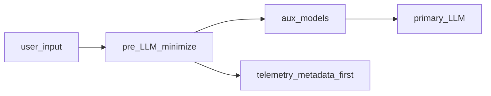

## Детальная архитектура внедрения

### Основные компоненты

| Компонент | Проект | Роль | Технология |
|-----------|------------|------|------------|
| **RAG-движок** | **корпоративный RAG-контур** | Оркестрация поиска, генерации и логики агентов | Python, LangChain, Gradio |
| **Сервер инференса (Унифицированный)** | **сервер инференса MOSEC** | Обслуживание моделей эмбеддинга, реранкера и охранника на одном порту | MOSEC, PyTorch |
| **Сервер инференса (Распределенный)** | **инференс на базе vLLM** | Обслуживание LLM и пулинг-моделей через vLLM | vLLM, CUDA |
| **Векторное хранилище** | **корпоративный RAG-контур** | Постоянное хранение встраиваний документов | ChromaDB (HTTP) |

### Поток данных и конвейер

1.  **Ингестия:**
    *   Документы (Markdown, MkDocs) обрабатываются модулем обработки документов RAG-движка.
    *   Разбиваются на чанки через токен-зависимый чанкер.
    *   Встраиваются через компонент эмбеддинга (FRIDA/Qwen3).
    *   Векторы и метаданные сохраняются в ChromaDB через слой векторного хранилища.

2.  **Поиск (RAG):**
    *   Пользовательский запрос поступает в конвейер ретривера.
    *   **Векторный поиск:** ChromaDB извлекает top-k чанков.
    *   **Реранкинг:** Кросс-энкодер или LLM-реранкер уточняет результаты.
    *   **Сборка контекста:** Статьи восстанавливаются, при необходимости суммируются (модуль суммаризации).

3.  **Генерация:**
    *   **Режим агента (Рекомендуется):** Агент LangChain анализирует запрос, принудительно вызывает инструмент извлечения контекста и генерирует ответ с цитатами.
    *   **Прямой режим:** Менеджер LLM генерирует ответ напрямую из найденного контекста.

4.  **Доставка:**
    *   **Веб-интерфейс:** Gradio ChatInterface в сервисном слое API RAG-движка.
    *   **API:** REST-эндпоинт `/api/query_rag`.
    *   **Виджет:** Встраиваемый HTML/JS виджет для внедрения на сторонние страницы.

### Конфигурация сервера инференса

#### MOSEC, vLLM и репозитории CMW

- **MOSEC** (апстрим, проект [mosecorg/mosec](https://github.com/mosecorg/mosec)) — открытый фреймворк **подачи ML-моделей через HTTP API**: быстрый веб-слой (Rust), логика воркеров на Python, динамическое батчирование запросов, поэтапные пайплайны и облачно-ориентированные практики (прогрев, graceful shutdown, метрики). Подробнее: [документация MOSEC](https://mosecorg.github.io/mosec/index.html).
- **vLLM** — высокопроизводительный **движок инференса** для больших языковых моделей с OpenAI-совместимым API, оптимизациями памяти и пакетной обработкой; описание сервера: [OpenAI-Compatible Server](https://docs.vllm.ai/en/stable/serving/openai_compatible_server.html).

**Репозитории CMW** (прикладные пакеты вокруг MOSEC и vLLM; подробности развёртывания — в публичной документации каждого модуля):

- **сервер инференса MOSEC** — прикладной пакет: управление процессом, реестр моделей (YAML), воркеры **эмбеддинга, реранкера и контент-охранника**, OpenAI-совместимые маршруты. **Одна сетевая точка** для вспомогательных моделей RAG — проще политики безопасности и сопровождение.
- **инференс на базе vLLM** — прикладной пакет: жизненный цикл процессов vLLM (загрузка моделей, проверки здоровья, конфигурация), в т.ч. режимы pooling для эмбеддингов/скоринга в поддерживаемых сборках vLLM. Ориентир: **максимальная производительность LLM** и гибкий выбор чекпоинтов под нагрузку.

#### Одна HTTP-точка и несколько серверных процессов

В **сервер инференса MOSEC** на **одном HTTP-порту** сосуществуют **разные роли** (эмбеддинг, реранг, модерация) в рамках **одного MOSEC-сервиса** с разными воркерами — это **не** размещение нескольких независимых процессов vLLM за одним портом. У **vLLM** распространённый паттерн — **отдельный серверный процесс на модель/конфигурацию**; несколько моделей обычно означает **несколько инстансов** (часто на разных портах) и маршрутизацию на стороне клиента, API-шлюза или балансировщика. Исключения и тонкости multi-GPU/репликации одной модели — по документации vLLM для выбранной версии.

#### Вариант А: унифицированный сервер (сервер инференса MOSEC)

- **Эксплуатация:** запуск объединённого сервиса через CLI пакета **сервер инференса MOSEC** (порт и активные модели задаются конфигурацией; типичный порт по умолчанию — 8001, см. поставляемую документацию).
- **Модели:** эмбеддинг, реранкер и охранник могут подключаться динамически в рамках поддержанного набора.
- **Выгоды для внедрения:** меньше сетевых конечных точек, проще обучение эксплуатации и отчуждение runbook-а клиенту; хороший старт для пилотов **корпоративный RAG-контур**.
- **Сайзинг:** VRAM делится между фактически загруженными моделями на узле; детальные оценки памяти публикуются вместе с пакетом **сервер инференса MOSEC** (артефакты замеров и методика — в документации репозитория).
- **Ограничения:** расширение модельного ряда упирается в то, что команда интегрировала в MOSEC-воркеры (меньше «произвольного зоопарка», чем у голого vLLM).

#### Вариант Б: распределённые инстансы vLLM (инференс на базе vLLM)

- **Эксплуатация:** отдельный процесс vLLM на выбранную модель и порт через CLI **инференс на базе vLLM** (точные флаги и примеры — в поставляемой документации **инференса на базе vLLM**).
- **Типичная схема сети:** отдельные порты для LLM, эмбеддинга, реранкера, охранника, если все роли вынесены на vLLM (например, 8100, 8101, 8105 — иллюстративно; фактические значения задаются политикой развёртывания).
- **Выгоды для внедрения:** зрелые GPU-оптимизации vLLM (в т.ч. KV-кэш, непрерывное батчирование), удобное горизонтальное масштабирование реплик под SLA по задержке и пропускной способности.
- **Сайзинг:** выше суммарный оверхед VRAM и число процессов; зато предсказуемее поведение под пиковый чат и длинный контекст при правильном шардировании и профиле **корпоративный RAG-контур** / **агентный слой платформы (CMW Platform)**.
- **Ограничения:** сложнее операционная картина (несколько сервисов); смена модели чаще требует перезапуска процесса по сравнению с динамической загрузкой в **сервер инференса MOSEC**.

Команды CLI, примеры портов и переменные окружения приведены в поставляемой документации **сервера инференса MOSEC** и **инференса на базе vLLM**; в этом документе зафиксированы архитектурный выбор, экономика и риски, без повторения пошагового runbook.

#### Три оси гибридного размещения и выбор бэкенда по типу модели

**Ось 1 — данные и ПДн:** где хранятся и обрабатываются исходные сообщения, индекс RAG, журналы; соответствует требованиям локализации и согласий.

**Ось 2 — вспомогательные модели:** эмбеддинг, реранг, контент-охранник, при необходимости слой маскирования/NER до LLM; часто совмещаются на одном унифицированном HTTP-сервисе (**сервер инференса MOSEC**) или распределяются по отдельным процессам (**инференс на базе vLLM** и др.) в зависимости от нагрузки и поддерживаемых форматов.

**Ось 3 — основная LLM:** управляемый API в РФ или self-hosted; здесь концентрируется основной счётчик токенов и требования к задержке.

На **оси 2** инженерные замеры на референс-стеке показали, что **разные классы моделей** не всегда допускают один и тот же серверный движок без потери корректности (например, корректный pooling для эмбеддингов и ограничения для генеративного реранкера). Это влияет на **число процессов, фрагментацию GPU и регрессионное тестирование** при обновлениях — количественные ориентиры и строки TCO вынесены в сопутствующее резюме **Оценка сайзинга, КапЭкс и ОпЭкс для клиентов**.

### Российские облачные провайдеры ИИ

Для соответствия требованиям о данных и инфраструктуре в России рекомендуются локальные облачные платформы и/или закрытый контур. **Все количественные тарифы** (₽ за токены, пакеты, ₽/час GPU) собраны в одном месте — раздел **«Тарифы российских облачных провайдеров ИИ»** в сопутствующем резюме **Краткое изложение: Оценка сайзинга, КапЭкс и ОпЭкс для клиентов (российский рынок)**; ниже — **роли провайдеров, состав моделей и правила сверки** без повторения таблиц. Дерево факторов стоимости и сценарный сайзинг — там же.

**Cloud.ru (Evolution Foundation Models)** · [[продукт]](https://cloud.ru/products/evolution-foundation-models) · [[тарифы]](https://cloud.ru/documents/tariffs/evolution/foundation-models)

- **API:** OpenAI-совместимый доступ к моделям в российских ЦОД.

- **Каталог (на [странице продукта](https://cloud.ru/products/evolution-foundation-models) перечислены позиции с идентификаторами Hugging Face `org/repo`):**
  - **GigaChat:** продуктовые имена GigaChat / Lite / Pro / **GigaChat-2-Max** и ветка **`ai-sage/GigaChat3-10B-A1.8B`** (сверка с линейкой 3.0 / 3.1 на Hub — отдельно).
  - **GLM (Zhipu, org `zai-org`):** **`GLM-4.6`**, **`GLM-4.7`**, **`GLM-4.7-Flash`** ([пример карточки](https://huggingface.co/zai-org/GLM-4.7-Flash)); крупное семейство **`GLM-5`** — на [HF](https://huggingface.co/zai-org/GLM-5).
  - **Qwen (Alibaba, org `Qwen`):** **`Qwen3-235B-A22B-Instruct-2507`**, семейства **`Qwen3-Coder-*`**, **`Qwen3-Next-80B-A3B-Instruct`**.
  - **T‑Tech:** линейки **`t-tech/T-lite-it-*`**, **`T-pro-it-*`**.
  - **Прочие текстовые LLM:** **`openai/gpt-oss-120b`**, **`MiniMaxAI/MiniMax-M2`**.
  - **Эмбеддинги и реранкинг:** **`BAAI/bge-m3`**, **`BAAI/bge-reranker-v2-m3`**, **`Qwen/Qwen3-Embedding-0.6B`**, **`Qwen/Qwen3-Reranker-0.6B`**.
  - **Речь и документы:** **`openai/whisper-large-v3`**, **`deepseek-ai/DeepSeek-OCR-2`**.

- **Тарификация:** оплата **по токенам** (входные и генерируемые — отдельно, см. [официальный прайс](https://cloud.ru/documents/tariffs/evolution/foundation-models)). **Все ₽/млн и расшифровка по строкам** (в т.ч. GigaChat3-10B-A1.8B, Qwen3-235B, GigaChat-2-Max, GLM-4.6, MiniMax-M2) — только в сопутствующем резюме, раздел **«Тарифы российских облачных провайдеров ИИ»**; маркетинговый перечень на сайте может быть **шире** прайса на дату сверки.

- **SKU vs Hub:** имя в биллинге **не** гарантирует ту же ревизию весов, что на Hugging Face, без явной проверки.

**Yandex Cloud (Yandex AI Studio / YandexGPT)** · [[модели]](https://aistudio.yandex.ru/docs/ru/ai-studio/concepts/generation/models.html) · [[тарификация]](https://aistudio.yandex.ru/docs/ru/ai-studio/pricing.html)

- **Модели (текст, базовый инстанс):** в обзорах и переговорах часто выделяют **YandexGPT Pro 5.1** и **Alice AI LLM**; полный перечень — [доступные генеративные модели](https://aistudio.yandex.ru/docs/ru/ai-studio/concepts/generation/models.html): Alice AI LLM; YandexGPT Pro 5.1 и Pro 5; YandexGPT Lite 5; DeepSeek V3.2; Qwen3 235B; gpt-oss-120b и gpt-oss-20b; Gemma 3 27B ([условия Gemma](https://ai.google.dev/gemma/terms)); дообученная YandexGPT Lite; YandexART и Realtime.

- **Тарифы:** первоисточник — [правила тарификации AI Studio](https://aistudio.yandex.ru/docs/ru/ai-studio/pricing.html): таблица Model Gallery, ₽ **с НДС** за **1000** токенов (входящие, кеш, инструменты, исходящие); для агентов — отдельно токены инструментов. Эквиваленты **₽/млн** и строки по моделям — в сопутствующем резюме. **Контекст рынка (не договорный прайс):** в публикации [AKM.ru](https://www.akm.ru/eng/press/yandex-b2b-tech-has-opened-access-to-the-largest-language-model-on-the-russian-market/) встречались ориентиры порядка **~0,5 ₽ за 1000** токенов (**~50 коп.**); они полезны как **иллюстрация прессы**, но **не** подменяют официальную таблицу на дату сверки (для сопоставимости с КП см. сопутствующее резюме).

- **Особенности:** **OpenAI-совместимый** доступ к ряду моделей; **интеграция с экосистемой Yandex Cloud** (данные, идентичность, смежные сервисы — по политике заказчика и документации Яндекса); линейка **YandexGPT / Alice** ориентирована в том числе на **русскоязычные** сценарии наряду с мультиязычными моделями в галерее.

**SberCloud (GigaChat API)** [[портал]](https://developers.sber.ru/portal/products/gigachat-api) · [[юридические тарифы]](https://developers.sber.ru/docs/ru/gigachat/tariffs/legal-tariffs)

- **Модели:** GigaChat-2 Lite, Pro, Max.

- **Тарифы:** пакеты токенов по [юридическим тарифам](https://developers.sber.ru/docs/ru/gigachat/tariffs/legal-tariffs); эквиваленты **₽/млн** и размеры пакетов — в таблицах сопутствующего резюме (тот же раздел **«Тарифы российских облачных провайдеров ИИ»**).

**Selectel (Foundation Models Catalog)** [[источник]](https://selectel.ru/services/cloud/foundation-models-catalog)

- Каталог с выделенным endpoint, API **совместим с OpenAI**; оплата за **CPU, GPU, RAM, диски**, не за токены. **Private Preview**, список моделей в панели (ссылки на HF). Свои веса **не** заявлены (FAQ на сайте).

**MWS GPT (МТС Web Services)** [[продукт]](https://mws.ru/mws-gpt/) · [[тарифы]](https://mws.ru/docs/docum/cloud_terms_mwsgpt_pricing.html)

- OpenAI-совместимый API, SLA **99,95%** (для части моделей), режимы **SaaS / hybrid / on-prem**. Прайс **без НДС** за 1000 токенов под внутренними именами; сопоставление с публичными названиями — у поставщика. **Цифры** (лендинг, таблица «Модель N», НДС) — в сопутствующем резюме, подраздел **MWS GPT**.

**VK Cloud (ML)** [[документация]](https://cloud.vk.com/docs/ru/ml)

- **Cloud ML Platform**, Spark, Cloud Voice, Vision — **без** публичного каталога готовых LLM в формате Evolution FM / AI Studio; типичный путь — **своя** модель и MLOps.

#### Матрица: управляемый API в РФ и открытые веса

| Контур | API в РФ | Self-host / HF | Примеры семейств |
| :--- | :--- | :--- | :--- |
| Cloud.ru Evolution FM | Да | Часто те же `org/repo`, что в каталоге FM | GigaChat, GLM‑4.6–4.7‑Flash, Qwen3‑235B / Coder / Next, gpt‑oss, MiniMax‑M2, T‑tech |
| Yandex AI Studio | Да | Отдельные модели на HF (в т.ч. кастомные лицензии) | YandexGPT, Alice, DeepSeek V3.2, Qwen3 235B, gpt‑oss, Gemma 3 |
| Sber GigaChat API | Да | **GigaChat 3.1** MIT на HF ([ai-sage](https://huggingface.co/ai-sage)) | Коммерческий API и открытые веса — разный TCO |
| Selectel FMC | Да (Private Preview) | Каталог → HF; свои веса не заявлены | Оплата **инфраструктура**, не токены |
| MWS GPT | Да | Публичный каталог HF не сведён | Прайс по кодам «Модель N» |
| VK Cloud ML | Нет LLM‑каталога в доке | BYO на ML Platform | Инфраструктура под **инференс на базе vLLM** / **сервер инференса MOSEC** |

**Типично только open weights (доставка в РФ — GPU‑облако или on-prem):** ниже — **родственные чекпойнты** на Hugging Face по группам; многие те же `org/repo`, что в каталоге **Cloud.ru Evolution FM** (количественный прайс и SKU — только у провайдера).

| Группа | Репозитории на Hugging Face (родственные модели) | Заметка для заказчика |
| :--- | :--- | :--- |
| **GLM (Zhipu, `zai-org`)** | [GLM-4.6](https://huggingface.co/zai-org/GLM-4.6) · [GLM-4.7](https://huggingface.co/zai-org/GLM-4.7) · [**GLM-4.7-Flash**](https://huggingface.co/zai-org/GLM-4.7-Flash) (более компактная ветка) · [GLM-5](https://huggingface.co/zai-org/GLM-5) (флагман MoE) | Линейка **4.6–4.7** и **GLM-5** — разный масштаб VRAM; **4.7-Flash** — типичный кандидат, когда нужен меньший след по железу при том же бренде |
| **gpt-oss (OpenAI)** | [openai/gpt-oss-20b](https://huggingface.co/openai/gpt-oss-20b) · [openai/gpt-oss-120b](https://huggingface.co/openai/gpt-oss-120b); варианты с фильтрацией: [gpt-oss-safeguard-20b](https://huggingface.co/openai/gpt-oss-safeguard-20b) · [gpt-oss-safeguard-120b](https://huggingface.co/openai/gpt-oss-safeguard-120b) | **Apache-2.0**; те же публичные имена, что у **Yandex AI Studio** и **Cloud.ru** FM, но хостинг и комплаенс — на стороне заказчика |
| **Qwen3 (`Qwen`)** | org [Qwen](https://huggingface.co/Qwen): MoE [Qwen3-235B-A22B-Instruct-2507](https://huggingface.co/Qwen/Qwen3-235B-A22B-Instruct-2507), [Qwen3-Next-80B-A3B-Instruct](https://huggingface.co/Qwen/Qwen3-Next-80B-A3B-Instruct); код: [Qwen3-Coder-30B-A3B-Instruct](https://huggingface.co/Qwen/Qwen3-Coder-30B-A3B-Instruct), [Qwen3-Coder-480B-A35B-Instruct](https://huggingface.co/Qwen/Qwen3-Coder-480B-A35B-Instruct) и др. | Семейство шире перечисления; сверять **лицензию**, **gated** и поддержку **vLLM/SGLang** по карточке |
| **GigaChat (открытые веса Сбера, `ai-sage`)** | [GigaChat3-10B-A1.8B](https://huggingface.co/ai-sage/GigaChat3-10B-A1.8B) (3.0) · [GigaChat3.1-10B-A1.8B](https://huggingface.co/ai-sage/GigaChat3.1-10B-A1.8B); крупный чекпойнт: [GigaChat3.1-702B-A36B](https://huggingface.co/ai-sage/GigaChat3.1-702B-A36B) | **MIT** на публичных весах; **GigaChat API** (SberCloud) и self-host — разный TCO (см. абзац ниже) |
| **MiniMax M2** | [MiniMaxAI/MiniMax-M2](https://huggingface.co/MiniMaxAI/MiniMax-M2) | На HF — **modified MIT** / особая лицензия в карточке; дублируется как SKU **Cloud.ru** FM — сверять прайс и условия |
| **DeepSeek R1 distill** | [DeepSeek-R1-Distill-Qwen-32B](https://huggingface.co/deepseek-ai/DeepSeek-R1-Distill-Qwen-32B) · [DeepSeek-R1-Distill-Llama-70B](https://huggingface.co/deepseek-ai/DeepSeek-R1-Distill-Llama-70B) и др. на `deepseek-ai` | Плотные модели разного размера под локальный инференс; рядом на Hub — полные ветки **DeepSeek-V3 / R1** (другой сайзинг) |
| **NVIDIA Nemotron 3** | [NVIDIA-Nemotron-3-Nano-30B-A3B-FP8](https://huggingface.co/nvidia/NVIDIA-Nemotron-3-Nano-30B-A3B-FP8) и др. в org [nvidia](https://huggingface.co/nvidia) | MoE, заявленный контекст до **1M** токенов ([обзор](https://research.nvidia.com/labs/nemotron/Nemotron-3/)); **не** готовый **API РФ** без своего контура |
| **Kimi (Moonshot)** | [moonshotai/Kimi-K2-Base](https://huggingface.co/moonshotai/Kimi-K2-Base); линейка K2.5 — в org [moonshotai](https://huggingface.co/moonshotai) | Часто IDE и агрегаторы; для КП — **не** baseline без явного контура и лицензии |

Все **числовые** ориентиры по управляемым API — в сопутствующем резюме **Краткое изложение: Оценка сайзинга, КапЭкс и ОпЭкс для клиентов (российский рынок)** (раздел **«Тарифы российских облачных провайдеров ИИ»**). Отдельно Сбер публикует **открытые веса** GigaChat‑3.1‑Ultra и Lightning под **MIT** ([Хабр](https://habr.com/ru/companies/sberbank/articles/1014146/)): экономика смещается в **CapEx/OpEx GPU** — см. **«Открытые веса и API: влияние на TCO»** в том же сопутствующем резюме.

**Паттерн «чекпойнт на Hugging Face + отдельная лицензия»** (не эквивалент permissive open source вроде MIT) меняет пакет отчуждения и учёт: у публичной ветки **YandexGPT-5-Lite-8B** применяется **кастомное лицензионное соглашение**, где при коммерческом использовании при достижении **10 миллионов выходных токенов в месяц** лицензиат в течение **30 календарных дней** после такого месяца обязан связаться с правообладателем для согласования дальнейшего использования, иначе лицензии прекращаются ([полный текст](https://huggingface.co/yandex/YandexGPT-5-Lite-8B-instruct/raw/main/LICENSE)). В том же тексте зафиксированы **применимое право РФ** и требования к **указанию авторства** при распространении — это входит в юридический контур передачи и в **мониторинг объёма генерации**, параллельно со сдвигом TCO в сторону **GPU и эксплуатации**, как у любого self-hosted чекпойнта.

**Идеи из открытой исследовательской публикации (не SLA коммерческих сервисов):** в обзорных материалах лабораторий перечисляются направления вроде **эффективных LLM** и оптимизации ([пример — дайджест за 2025 год](https://research.yandex.com/blog/yandex-research-in-2025)); как **инженерный ориентир** для PoC по памяти при длинном контексте полезен класс работ по **сжатию KV-кеша** ([arXiv:2501.19392](https://arxiv.org/abs/2501.19392), среди [принятых к ICML 2025](https://research.yandex.com/blog/papers-accepted-to-icml-2025)).

---
