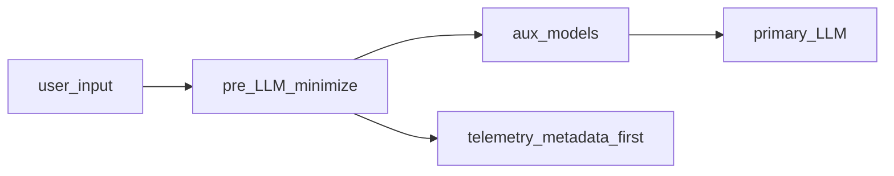

# Отчёт. Методология разработки и внедрения ИИ {: #method }

## Описание документа {: #method_intro_and_summary }

### Роль документа в комплекте {: #method_pack_overview }

Документ задаёт **операционную модель, фазы внедрения и производственную методологию** для корпоративных ИИ-контуров с RAG, инференсом и агентами в **резидентной** логике РФ.

### Назначение {: #method_purpose_and_scope }

Документ обобщает **методологию внедрения и отчуждения** решений класса корпоративных ИИ-ассистентов с RAG, локальным или облачным инференсом и агентными сценариями. Названия **корпоративный RAG-контур**, **сервер инференса MOSEC**, **инференс на базе vLLM** и **агентный слой Comindware Platform** используются как **условные обозначения ролей компонентов** иллюстративного референс-стека, а не как коммерческое обещание готового SKU.

**Практический смысл документа:** согласовать решение о внедрении, оценить зрелость организации и зафиксировать условия передачи контура заказчику без потери управляемости. Финальное инвестиционное обязательство подтверждается на этапе коммерческого согласования по актуальным параметрам сделки.

### Связанные материалы {: #method_related_docs }

- [Обзор и ведомость документов](./20260325-research-appendix-a-index-ru.md#app_a_pack_overview)
- [Курс USD и правила для смет](./20260325-research-appendix-a-index-ru.md#app_a_fx_policy)
- [Отчёт «Сайзинг и экономика (CapEx / OpEx / TCO)»](./20260325-research-report-sizing-economics-main-ru.md#sizing_pack_overview) (детализированные цифры и TCO)
- [Профиль on-prem-GPU в проектах Comindware](./20260325-research-report-sizing-economics-main-ru.md#sizing_onprem_gpu_profile_cmw) (RTX 4090 24 ГБ, RTX 4090 48 ГБ, RTX PRO 6000 Blackwell 96 ГБ)
- [Приложение B. Отчуждение ИС и кода (KT, IP)](./20260325-research-appendix-b-ip-code-alienation-ru.md#app_b_pack_overview)
- [Приложение C. Имеющиеся наработки **Comindware** (состав, границы, артефакты)](./20260325-research-appendix-c-cmw-existing-work-ru.md#app_c_pack_overview)
- [Приложение D. Безопасность, комплаенс и наблюдаемость](./20260325-research-appendix-d-security-observability-ru.md)
- [Приложение E. Рыночные и технические сигналы (справочно)](./20260325-research-appendix-e-market-technical-signals-ru.md#app_e_root)
- [Приложение F. Дополнительное чтение и расширенные ориентиры](./20260325-research-appendix-f-extended-reading-ru.md#app_f_root) (внешние бенчмарки и расширенный круг чтения)

### Как использовать для управленческих решений {: #method_how_to_use }

Используйте документ как канонический источник по TOM, фазам внедрения, критериям приёмки и модели передачи. Для бюджета и TCO опирайтесь на парный отчёт по сайзингу; для переговоров с C-level переносите из этого отчёта этапность, роли и условия передачи способности заказчику.

!!! warning "Ограничения"

    Не используйте отчёт как:

    - Готовое КП без адаптации под профиль нагрузки заказчика (цифры — в парном отчёте по сайзингу).
    - Норму для резидентного контура без отдельной правовой оценки (глобальные бенчмарки — контекст, не норма).

### Логика решения (SCQA) {: #method_scqa }

**SCQA (Situation–Complication–Question–Answer)** — ситуация → проблема → вопрос → ответ.

- **Ситуация:** в 2026 году GenAI оценивается по P&L, а в РФ добавляются требования суверенитета данных и регуляторные инициативы по ИИ.
- **Проблема:** без явного **периметра до LLM** (минимизация и обезличивание входа, разделение вспомогательных и основной модели, политика телеметрии) растут риски по 152-ФЗ и стоимость инцидентов; без **офлайн- и онлайн-оценки качества** невозможно доказуемо связывать смену модели или индекса с качеством и бюджетом.
- **Вопрос для решения:** как внедрять и масштабировать ассистентов на стеке **корпоративный RAG‑контур**, **сервер инференса MOSEC/vLLM** и **агентный слой Comindware Platform**, и **как отчуждать** экспертизу и артефакты клиенту без потери управляемости.
- **Рекомендуемый ответ:**
    - опереться на целевую операционную модель (роли, KPI, риски), поэтапный PoC → Пилот → Масштабирование, комплект отчуждения (код, конфигурация, данные, модели, эксплуатационный регламент, обучение) и блок комплаенса (152-ФЗ, приказ Роскомнадзора № 140, NIST AI RMF, защитные механизмы), а также на единую промышленную наблюдаемость (трассировки, метрики, учёт токенов);
    - глобальные отчёты экосистемных вендоров задают **фон по темпу внедрения**, но **не** норму для резидентного КП без отдельной правовой и тарифной оценки. Закладывать **три оси гибрида:** резидентность и обработка ПДн, размещение вспомогательных моделей (эмбеддинг, реранк, гард), размещение основной LLM;
    - **собственная** инженерная практика **Comindware** (четыре проекта экосистемы: RAG‑контур, MOSEC, vLLM, платформенный агент) отделяется от **открытых** отраслевых материалов.

### Ключевые регуляторные вехи (2025–2027) {: #method_regulatory_timeline }

При планировании ИИ-проектов учитывать:

| Дата | Событие | Что изменилось |
|------|---------|----------------|
| **Июль 2025** | Поправки к 152-ФЗ | Ужесточение локализации: запрет на обработку ПДн российских граждан через зарубежные базы данных |
| **Сентябрь 2025** | Отдельное согласие на ПДн | Согласие должно быть получено как отдельный документ, а не в составе договора |
| **Сентябрь 2027** | Ожидаемый закон об ИИ |Категории AI-моделей (суверенные, национальные, доверенные); требования к локализации для сервисов с >500К пользователей |

Подробнее — см. _Приложение D «[Безопасность, комплаенс и наблюдаемость](./20260325-research-appendix-d-security-observability-ru.md)»_.

### Реестр согласованных опор для решений {: #method_decision_anchor_registry }

| Опора | Что это значит для решения | Источник | Статус |
| :--- | :--- | :--- | :--- |
| Этапность внедрения PoC → Пилот → Масштабирование | Формирует единые точки go/no-go и управляемый переход между фазами внедрения | [Методология внедрения](#method_implementation_methodology) | Проверено 2026-03-31 |
| Порог утилизации для оценки on-prem | Запускает пересмотр модели владения при устойчивой нагрузке | [Логика решения (SCQA) в отчёте по экономике](./20260325-research-report-sizing-economics-main-ru.md#sizing_scqa) | Проверено 2026-03-31 |
| Критерии передачи (KT/BOT) | Подтверждает готовность заказчика к самостоятельной эксплуатации после передачи | [Критерии приёмки передачи (Приложение B)](./20260325-research-appendix-b-ip-code-alienation-ru.md#app_b_transfer_acceptance_criteria_checklist) | Проверено 2026-03-31 |

Политика применения: решения по модели внедрения и передаче контура принимаются по этим опорам; отклонения допустимы только при явной фиксации причины и даты пересмотра.

## Источник преимущества в корпоративном ИИ {: #method_corporate_ai_advantage_source }

Корпоративный ИИ быстро проходит этап, на котором базовое качество в основном определялось выбором модели.

По мере выравнивания доступа к LLM и агентным фреймворкам источник преимущества смещается **внутрь компании**: в её собственный контекст — датасеты, связи между ними и накопленную операционную логику.

В 2026 году в центре внимания окажется уже не сам факт доступа к данным, а их **пригодность для рабочих процессов**, прежде всего там, где ИИ-агенты принимают решения, передают задачи и выполняют действия сразу в нескольких системах.

Ниже — условия, от которых зависит, сможет ли компания превратить данные в устойчивый **рабочий слой** корпоративного ИИ.

### Семантический слой {: #method_semantic_layer }

Если в данных не описаны связи между объектами, статусами, событиями и правилами, система видит только отдельные фрагменты.

Этого достаточно для поиска или ответа на вопрос, но недостаточно для **исполнения процесса**.

Семантический слой задаёт общую логику: что считается заказом, как клиент связан с договором, в каком статусе допустимо следующее действие, какие исключения требуют отдельного маршрута.

Без такой структуры автоматизация быстро упирается в разрывы логики и ручные проверки.

Gartner относит тему **AI-ready data** к числу быстрорастущих в повестке по ИИ (_«[Gartner — пресс-релиз: нехватка AI-ready data подрывает ИИ-проекты (26.02.2025)](https://www.gartner.com/en/newsroom/press-releases/2025-02-26-lack-of-ai-ready-data-puts-ai-projects-at-risk)»_).

Инженерная проработка баз знаний и онтологий в целевой операционной модели — у роли **Knowledge Engineer** ниже.

### Архитектура доступа {: #method_access_architecture }

Для рабочих сценариев важно, чтобы в момент действия система получала **полный и согласованный** контекст.

Если нужные сведения распределены по разным системам, расходятся в версиях и подтягиваются с задержкой, точность начинает снижаться уже на уровне базовых операций.

Архитектура доступа влияет на стоимость исполнения, длину сценария, количество проверок и устойчивость процесса при росте нагрузки.

Здесь важен не сам факт интеграции, а способность собрать **единый рабочий слой** для конкретного действия.

Связь с юнит-экономикой и TCO при многошаговых агентских цепочках — см. в параграфе _«[FinOps и юнит-экономика нагрузки](./20260325-research-report-sizing-economics-main-ru.md#sizing_finops_unit_economics)»_ отчёта «Сайзинг и экономика (CapEx / OpEx / TCO)».

Для **пилотов линии поддержки** полезно опереться на **примерные расчёты расхода токенов**, полученные из доступных данных по публичному корпусу заявок с портала поддержки: таблицы, допущения по переводу слов в токены и разводку **целевой цены за тикет** и **верхней модельной оценки одного «толстого» цикла** приведены в параграфе _«[Примерные расчёты расхода токенов по данным корпуса заявок (портал поддержки)](./20260325-research-report-sizing-economics-main-ru.md#sizing_token_consumption_estimates)»_ отчёта «Сайзинг и экономика (CapEx / OpEx / TCO)».

### Исполняемые правила {: #method_executable_rules }

По мере роста автономности правила доступа, ограничения, маршруты согласования и требования соответствия должны работать **автоматически**.

Для промышленного использования нужны исполняемые правила, которые применяются на уровне каждого запроса, перехода и действия: это снижает операционный риск и делает результат воспроизводимым.

Практический контур политик, защитных механизмов и комплаенса — в _Приложении D «[Безопасность, комплаенс и наблюдаемость](./20260325-research-appendix-d-security-observability-ru.md)»_.

### Внутренний контур данных {: #method_internal_data_circuit }

Основная прикладная ценность смещается во **внутренний контур данных** компании: бизнес-правила, историю операций, предметную логику и накопленные связи между сущностями.

Этот слой задаёт качество решения в конкретной отрасли, функции и операционной модели.

Чем точнее компания умеет формализовать и поддерживать такой контекст, тем выше качество исполнения, устойчивость сценариев и потенциал тиражирования на соседние процессы.

### Что это значит для бизнеса {: #method_business_implications }

В 2026 году ключевым фактором для корпоративного ИИ станет **качество внутреннего контекста** компании: от него зависит, сможет ли система работать в реальных процессах, соблюдать логику действий и давать воспроизводимый результат.

Это уже отражается и в внешней статистике: Gartner указывает, что **63%** организаций либо не имеют, либо не уверены, что имеют корректные практики управления данными для ИИ, и прогнозирует отказ от **60%** ИИ-проектов без **AI-ready data** до 2026 года (_«[Gartner — lack of AI-ready data puts AI projects at risk](https://www.gartner.com/en/newsroom/press-releases/2025-02-26-lack-of-ai-ready-data-puts-ai-projects-at-risk)»_).

Преимущество будет у тех, кто соберёт **связный и управляемый слой** для работы ИИ — так, чтобы встраивать систему в реальные процессы и масштабировать её за пределы локальных сценариев.

## Структурированное рассуждение по схеме (SGR) в практике Comindware {: #method_sgr_practice_cmw }

**Концепция:** Schema-Guided Reasoning (структурированное рассуждение по схеме) — техника принудительного структурирования рассуждений LLM через предопределённые схемы. По отраслевым бенчмаркам — 5–10&nbsp;% улучшение точности по сравнению с неструктурированными промптами (_«[Schema-Guided Reasoning (SGR)](https://abdullin.com/schema-guided-reasoning/)»_).

**Применение в Comindware:** SGR используется в нескольких точках конвейеров — для анализа запросов, критики ответов агентов, планирования после фазы гарда и детерминированного управления любым мышлением. Генерирует оценку спама, уверенность намерения, подзапросы для поиска, план действий.

**Бизнес-смысл:** предсказуемость ответов, аудит каждого шага, возможность отклонить спам до ресурсоёмкого поиска.

## План разрешения инцидента {: #method_srp_practice_cmw }

**Концепция:** после генерации ответа отдельный вызов LLM формирует план для инженеров — нужна ли эскалация, краткое содержание проблемы, рекомендации.

**Реализация в Comindware:** встроенный инструмент формирования плана анализирует ответ и контекст, возвращает структурированный план.

**Бизнес-смысл:** автоматическая триажа обращений, снижение нагрузки на инженеров, документирование каждого случая.

## Стратегия внедрения ИИ и организационная зрелость {: #method_ai_strategy_org_maturity }

Предыдущий раздел фиксирует **данные и рабочий слой** как источник преимущества; ниже — **организационная** сторона: без неё доступ к моделям и пилоты редко переходят в устойчивый эффект в P&L. Это согласуется с правилом **10-20-70**, которое BCG использует для AI-трансформаций: около **10%** эффекта определяют алгоритмы, **20%** — данные и технологии, **70%** — люди, процессы и организационные изменения (_«[BCG — Closing the AI Impact Gap](https://www.bcg.com/publications/2025/closing-the-ai-impact-gap)»_). Для управленческого решения это означает, что центр трансформации — способность компании **переобучать команды, пересобирать роли и закреплять новые практики** в ежедневной работе, а не только выбор стека.

Ту же мысль подтверждает и разрыв между внедрением и экономическим эффектом: по данным McKinsey AI уже регулярно используется хотя бы в одной функции у **88%** организаций, но лишь **39%** сообщают об эффекте на уровне enterprise EBIT; BCG фиксирует, что AI входит в top-3 приоритетов у **75%** руководителей, тогда как значимую ценность от AI-инициатив видят только **25%** (_«[McKinsey — The state of AI](https://www.mckinsey.com/capabilities/quantumblack/our-insights/the-state-of-ai)»_, _«[BCG — Closing the AI Impact Gap](https://www.bcg.com/publications/2025/closing-the-ai-impact-gap)»_).

Типичный **разрыв зрелости:** интерес к ИИ и сами инструменты уже есть, а **системные процессы внедрения, обучения и поддержки команд** ещё не выстроены — это стыкуется с фазами **PoC → Пилот → Масштабирование** ниже, с комплектом отчуждения и обучением (см. _Приложение B «[Отчуждение ИС и кода](./20260325-research-appendix-b-ip-code-alienation-ru.md#app_b_pack_overview)»_).

**Барьеры внедрения** (управленческий ориентир): недоверие к результатам при отсутствии **контура оценки качества** и **исходного уровня**; дефицит компетенций; сопротивление команд; отсутствие **ясной модели использования**; ожидание «гарантированного эффекта» без измеримости; слабые **публичные примеры** со стороны топ-менеджмента; страх ошибки и страх **потери контроля**. Ответ в архитектуре и процессах — **человек в контуре**, матрица ролей, обучение и политики; поведенческий слой раскрыт в _Приложении D, параграф «[Организационные и поведенческие факторы риска](./20260325-research-appendix-d-security-observability-ru.md#app_d__org_behavioral_risk_factors)»_.

**Стратегический горизонт (ориентир 3–5 лет):** на таких горизонтах ИИ рационально рассматривать не как отдельный инструмент, а как часть **системы стратегической аналитики**: мониторинг технологий, отраслей, конкурентов и регулирования; внутренние бизнес-метрики; карта целевых клиентов; портфель гипотез по новым направлениям.

**Управленческая рамка** после привязки ИИ к **стратегическим целям** и к **измеримости влияния** на продукт и бизнес:

- интеграция ИИ в бизнес-процессы;
- распределение ответственности за внедрение;
- закрепление новых практик в **операционной модели**.

**Люди и менеджмент:** особенно ценны специалисты на **стыке функций**, способные быстро переводить технологию в рабочие сценарии и доводить их до измеримого эффекта; для управления командами усиливаются требования к **обучению**, **внутренней мобильности**, **поддержке экспериментов** и роли руководителей в **масштабировании** практик.

Подборка сигналов рынка по каналу **@Redmadnews** внутри целевой операционной модели приведена в подразделе _«[Публичные ориентиры рынка (@Redmadnews, 2026)](./20260325-research-report-methodology-main-ru.md#method_market_benchmarks_2026)»_; здесь список постов **не** повторяется. Иллюстративная программа повышения квалификации руководителей по внедрению ИИ в процессы — _«[Переход в ИИ: трансформация бизнес-процессов — Школа управления СКОЛКОВО](https://www.skolkovo.ru/programmes/cdto/)»_ (структура модулей, сроки, заявленные результаты обучения и диплом переподготовки — по странице программы на дату обращения); **не** часть поставки референс-стека **корпоративный RAG-контур** / **сервер инференса MOSEC/vLLM** / **агентный слой Comindware Platform**.

## Целевая операционная модель (Target Operating Model) {: #method_target_operating_model }

Для масштабирования ИИ-решений рекомендуется переход от централизованного AI CoE к **федеративной модели** с сильным центром компетенций.

### Матрица аргументов по ролям ЛПР заказчика {: #method_c_role_decisions }

| Роль | Что важно | Фокус аргумента | Аргумент из комплекта |
| :--- | :--- | :--- | :--- |
| **CEO** | P&L, капитализация и независимость | Го/нет-го на PoC → Пилот → Масштабирование | ИИ как нематериальный актив: рост стоимости компании за счёт владения уникальными моделями и защищённым контуром. |
| **CFO** | Бюджет, TCO и владение активами | CapEx / OpEx границ | При устойчивой высокой утилизации и горизонте владения в несколько лет собственный или гибридный контур может стать выгоднее внешнего SaaS. |
| **CRO** | Упаковка для клиента и продажи | Выбор типового проектного пакета (PoC / Пилот / Масштабирование / BOT) | Отчуждение как ценность: клиент получает суверенный актив и экспертизу, а не только доступ к API. |
| **CPO** | Roadmap, качество продукта и ROI | Утверждение TOM | Работающий контур с RAG, приоритизация сценариев по измеримому бизнес-эффекту. |
| **CIO / CTO** | Архитектура и управляемость | Облако РФ / on-prem / гибрид | Технологический суверенитет, наблюдаемость, интеграции и контроль жизненного цикла знаний. |
| **CISO** | Периметр, комплаенс и безопасность | Политика телеметрии и данных | Соответствие 152-ФЗ, OWASP LLM Top 10 и NIST AI RMF; контроль за обработкой ПДн. |

### Роли и ответственности {: #method_roles_responsibilities }
- **AI Product Owner:** Ответственность за бизнес-эффект (ROI), приоритизацию гипотез.
- **LLMOps / AI Architect:** Проектирование инфраструктуры (vLLM/MOSEC), мониторинг качества (RAGAS/DeepEval), целевая архитектура **телеметрии** (трассировки, метрики токенов и латентности, политика сэмплирования и ретенции) и согласование с ИБ при контурах с ПДн; совместно с владельцами разработки — **среда для агентов** (инструменты, линтеры, CI, контуры офлайн-оценки качества и при необходимости мультиагентных циклов разработки — см. _«[Инженерия обвязки для агентов](./20260325-research-report-methodology-main-ru.md#method_agent_wrapper_engineering)»_).
- **AI Security Officer:** Комплаенс с 152-ФЗ и NIST AI RMF, аудит безопасности (Red Teaming).
- **Knowledge Engineer:** Подготовка и актуализация базы знаний (ChromaDB), управление онтологиями.

### Процессы и KPI {: #method_processes_kpis }

- **Утилизация:** % сотрудников, использующих ИИ ежедневно (цель: >60 %).
- **Эффективность:** сокращение времени на решение тикета/задачи (цель: 30–40 %).
- **Качество по внутренней рубрике (LLM-as-judge):** целевой порог **>95 %** зачёта по **зафиксированной** рубрике и **регрессионному** набору сценариев.

!!! note "Бизнес-интерпретация порога качества >95%"

    Порог >95% — это **внутренний операционный барьер** для релиза/масштабирования, **не** эквивалент внешней разметки человеком, **не** юридическая гарантия отсутствия ошибок и **не** «точность» в смысле научного бенчмарка без оговорки методики.

- **Юнит-экономика:** Стоимость одного успешного ответа (P&L вклад).

!!! example "Пример KPI доверия и эскалаций (для линии поддержки)"

    - **Доля ответов с проверяемой цитатой на источник** (бизнес-KPI доверия): измеряется по политике заказчика; рост доли снижает спорные обращения и эскалации.
    - **Доля обращений, ушедших на эскалацию** (или снижение их числа при росте объёма): прямой сигнал для P&L линии поддержки.

**Независимые русскоязычные бенчмарки и методы оценки для принятия бизнес-решений:**

- **Внешний эталон для русскоязычных моделей:** экосистема **MERA** ([mera.a-ai.ru](https://mera.a-ai.ru/)) на площадке **Альянса в сфере искусственного интеллекта** ([a-ai.ru](https://a-ai.ru/)) даёт открытый контур сравнения фундаментальных моделей и снижает риск «оценки в вакууме» только внутренними метриками.
- **Аргумент для продаж и закупки:** участие **MTS AI** и других игроков показывает, что отрасль движется к стандартизации оценки качества; это усиливает обоснование выбора моделей для заказчика в цикле PoC → Пилот → Масштабирование.
- **Как использовать в проекте:** внешние ориентиры (MERA) должны дополнять, а не заменять внутренний контур оценки заказчика (RAGAS, DeepEval, LLM-as-judge) при фиксации KPI качества в проектной документации.
- **Требование к отчуждению и воспроизводимости:** разбор цикла улучшения **Cotype** с опорой на LLM-судей (_«[Хабр, MTS AI](https://habr.com/ru/companies/mts_ai/articles/892176/)»_) используем как методологический референс; в пакет передачи необходимо включать промпты судей, эталоны и регрессионные наборы.

### Публичные рыночные сигналы и коммерческие выводы {: #method_market_benchmarks_2026 }

Материалы канала лаборатории **red_mad_robot** **[@Redmadnews](https://t.me/Redmadnews)** используем как внешний индикатор рыночного спроса для решений C-level и приоритизации сценариев внедрения/отчуждения ИИ.

!!! warning "Границы применения"

    Публикации в каналах и подкастах используйте как рыночный сигнал для приоритизации гипотез и форматов сделки.

    Для утверждения бюджета, SLA, состава поставки и ответственности сторон опирайтесь только на первичные документы: договор, приложения, тарифы и юридические заключения на дату согласования.

- **Сигнал 1 — «фабрика ИИ-агентов» и СП (Билайн/ВымпелКом):**
  бизнес подтверждает спрос на масштабируемые, промышленно управляемые ИИ-контуры.

    **Вывод для Comindware:** усиливать позиционирование продажи через модель **PoC → Пилот → Масштабирование** и заранее предлагать формат **совместной разработки/поэтапной передачи**.

  Источник: «_[СП и фабрика агентов (пост канала)](https://t.me/Redmadnews/5145)_».

- **Сигнал 2 — ожидания ведущей роли R&D и измеримости эффекта:**
  рынок требует не «витринного ИИ», а управляемого центра компетенций с доказуемым бизнес-эффектом.

    **Вывод для Comindware:** в коммерческих диалогах фиксировать KPI перехода **PoC → Пилот → Масштабирование** и связывать их с SLA/экономикой проекта.

    Контекст публикации: **Т-Банк**, **Авито**, **MWS AI**, **ВкусВилл**, **red_mad_robot**.

- **Сигнал 3 — постоянный поток инженерных новинок и R&D-дайджестов:**
  технологический горизонт меняется быстрее типового цикла закупки.

    **Вывод для Comindware:** использовать такие материалы как вход в методический радар, но не как замену продуктовым требованиям, архитектурным ограничениям и составу поставки по КП.

    Источник: «_[R&D в AI в 2026 (пост канала)](https://t.me/Redmadnews/5146)_».

- **Сигнал 4 — AI-first организационная модель:**
  зрелые игроки перестраивают продуктовые и корпоративные процессы вокруг ИИ.

    **Вывод для Comindware:** усиливать направление передачи экспертизы (KT, role-based enablement, операционные регламенты) как часть коммерческого предложения, а не как опциональную активность.

    Источники: «_[AI-first стратегия: подкаст (пост канала)](https://t.me/Redmadnews/5170)_», «_[Подкаст «Ноосфера» #129 (YouTube)](https://www.youtube.com/watch?v=jTKhg1jqF_M)_».

## Методология внедрения (Этапы и Качество) {: #method_implementation_methodology }

Рекомендуется 4-фазный подход, основанный на практиках **red_mad_robot** и **Just AI**:

### Фаза 1. PoC (2-4 недели) {: #method_phase1_poc }

- **Цель:** проверка технической осуществимости.
- **Инструментарий:** базовый корпоративный RAG-контур, базовый инференс; при платформенных сценариях — **агентный слой Comindware Platform**.
- **Наблюдаемость:** базовые трассировки и учёт токенов (ориентир OpenTelemetry GenAI; при необходимости **Phoenix/OpenInference** в песочнице) — _Приложение D «[Промышленная наблюдаемость LLM, RAG и агентов](./20260325-research-appendix-d-security-observability-ru.md#app_d__llm_rag_agent_observability)»_.
- **Артефакты:** прототип, базовые метрики (латентность, качество, стоимость), перечень ограничений для перехода в пилот.
- **Контроль:** успешное выполнение 10 критических сценариев.

### Фаза 2. Пилот (1-3 месяца) {: #method_phase2_pilot }

- **Цель:** Валидация в промышленном окружении на ограниченной группе пользователей.
- **Инструментарий:** оптимизированный инференс, внедрение защитных механизмов, согласование нагрузки со стороны корпоративного RAG-контура и **агентного слоя Comindware Platform**.
- **Наблюдаемость:** продакшн-телеметрия с политикой сэмплирования и ретенции; связка трасс с офлайн-метриками качества — _Приложение D «[Связь с контуром оценки качества](./20260325-research-appendix-d-security-observability-ru.md#app_d__quality_eval_connection)»_.
- **Артефакты:** пилотный контур в промышленной среде, отчёт по ROI и качеству, backlog доработок перед масштабированием.
- **Контроль:** замер ROI, сбор обратной связи (Human-in-the-loop).

### Фаза 3. Масштабирование (3-12 месяцев) {: #method_phase3_scale }

- **Цель:** Enterprise-wide внедрение.
- **Инструментарий:** масштабирование инференса, развитие корпоративного RAG-контура под нагрузкой; для операций с сущностями платформы — **агентный слой Comindware Platform**; при необходимости рой агентов (координатор/воркер).
- **Наблюдаемость:** единый контур FinOps (токены, задержки, ошибки) и регрессии после смены модели или индекса по связке трасс с **офлайн- и онлайн-оценкой качества** — _Приложение D «[Рынок РФ, наблюдаемость LLM и референс-стек Comindware](./20260325-research-appendix-d-security-observability-ru.md#app_d__russia_llm_observability_phoenix_reference)»_.
- **Артефакты:** тиражируемый продакшн-контур, регламенты эксплуатации и мониторинга, утверждённая модель масштабирования по доменам.
- **Контроль:** Стабильность под нагрузкой (SLA 99.9%), соответствие бюджету (FinOps).

### Фаза 4. Оптимизация (Постоянно) {: #method_phase4_optimize }

- **Цель:** Снижение TCO и повышение качества.
- **Инструментарий:** DSPy для оптимизации промптов, квантование моделей, кэширование (LMCache); при зрелости команды — регламент мультиагентных циклов (план → реализация → независимая проверка) и меры против энтропии документации относительно кода (периодическая синхронизация, «сборка мусора» артефактов) в духе отраслевой инженерии обвязки ([OpenAI — Harness engineering](https://openai.com/ru-RU/index/harness-engineering/), [Хабр](https://habr.com/ru/articles/1005032/)).
- **Артефакты:** контур непрерывного улучшения качества/стоимости, обновляемый реестр оптимизаций и проверенный цикл сопровождения.
- **Контроль:** устойчивое снижение TCO, отсутствие регрессий качества на контрольных наборах, соблюдение целевых SLA/FinOps.

## Детальная архитектура внедрения {: #method_implementation_architecture }

!!! note "Область применимости архитектуры"

    Ниже описан **универсальный** архитектурный паттерн для корпоративных сценариев (поддержка, сервис-деск, внутренние ассистенты, обработка регламентов и др.), в которых используются корпоративные данные.
    
    Примеры метрик/процессов даны для сценария линии поддержки в иллюстративных целях и не ограничивают область применения.

### Основные компоненты {: #method_core_components }

| Компонент | Проект | Роль | Технология |
|-----------|------------|------|------------|
| **RAG-движок** | **Корпоративный RAG-контур** | Оркестрация поиска, генерации и логики агентов, получающих корпоративные данные | Python, LangChain, Gradio |
| **Сервер инференса (унифицированный)** | **Сервер инференса MOSEC** | Обслуживание специализированных моделей: эмбеддинга, реранкера и охранника | MOSEC, PyTorch |
| **Сервер инференса (универсальный)** | **Инференс на базе vLLM** | Обслуживание LLM | vLLM, CUDA |
| **Векторное хранилище** | **Корпоративный RAG-контур** | Постоянное хранение эмбеддингов документов | ChromaDB (HTTP) |

### Поток данных и конвейер {: #method_data_flow_pipeline }

1. **Загрузка данных:**

    - Документы (Markdown, MkDocs) обрабатываются модулем обработки документов RAG-движка.
    - Разбиваются на чанки через токен-зависимый чанкер.
    - Векторизуются через компонент эмбеддинга (FRIDA/Qwen3).
    - Векторы и метаданные сохраняются в ChromaDB через слой векторного хранилища.

2. **Поиск (RAG):**

    - Пользовательский запрос поступает в поисковый конвейер.
    - **Векторный поиск:** ChromaDB извлекает top-k чанков.
    - **Реранкинг:** кросс-энкодер или LLM-реранкер уточняет результаты.
    - **Сборка контекста:** статьи восстанавливаются, при необходимости суммируются (модуль суммаризации).

3. **Генерация:**

    - **Режим агента (Рекомендуется):** Агент LangChain анализирует запрос, принудительно вызывает инструмент извлечения контекста и генерирует ответ с цитатами.
    - **Прямой режим:** менеджер LLM генерирует ответ напрямую из найденного контекста.

4. **Доставка:**

    - **Веб-интерфейс:** Gradio ChatInterface для работы с RAG-движком в чате.
    - **API:** REST-эндпоинт `/api/query_rag`.
    - **Виджет:** встраиваемый HTML/JS виджет для внедрения на любые сайты.

### Конфигурация сервера инференса {: #method_inference_server_config }

### MOSEC, vLLM и наработки **Comindware** {: #method_mosec_vllm_cmw_repos }

**Базовые технологии (апстрим)** — открытые проекты для инференса больших языковых и специализированных моделей:

- **MOSEC** — открытый фреймворк **подачи ML-моделей через HTTP API**: быстрый веб-слой (Rust), логика воркеров на Python, динамическая пакетная обработка запросов, поэтапные пайплайны и облачно-ориентированные практики (прогрев, корректное завершение работы после активных запросов, метрики).
    - [Репозиторий](https://github.com/mosecorg/mosec)
    - [Документация](https://mosecorg.github.io/mosec/index.html).
- **vLLM** — высокопроизводительный **движок инференса** для больших языковых моделей с OpenAI-совместимым API, оптимизациями памяти и комплектной обработкой.
    - [Репозиторий](https://github.com/vllm-project/vllm)
    - [Документация](https://docs.vllm.ai/en/stable/serving/openai_compatible_server.html).

**Наработки Comindware** — прикладные комплекты обвязки вокруг MOSEC и vLLM:

- **сервер инференса MOSEC** — прикладной комплект: управление процессом, реестр моделей (YAML), воркеры **эмбеддинга, реранкера и контент-охранника**, OpenAI-совместимые маршруты. **Одна сетевая точка** для вспомогательных моделей RAG — проще политики безопасности и сопровождение. YAML-реестр моделей с проверенными конфигурациями для эмбеддингов, реранкеров, гардов и LLM. v2 dynamic server: без генерации скриптов, конфигурация загружается из YAML во время выполнения. CLI-утилиты: установка зависимостей, запуск, проверка статуса, остановка, список серверов, тестирование.
- **инференс на базе vLLM** — прикладной комплект: жизненный цикл процессов vLLM (загрузка моделей, проверки здоровья, конфигурация), в т.ч. режимы pooling для эмбеддингов/скоринга в поддерживаемых сборках vLLM. Ориентир: **максимальная производительность LLM** и гибкий выбор чекпоинтов под нагрузку. YAML-реестр моделей с проверенными конфигурациями. Выгрузка KV-кэша через LMCache для vLLM v1.

### Одна HTTP-точка и несколько серверных процессов {: #method_http_endpoint_multi_process }

В **сервер инференса MOSEC** на **одном HTTP-порту** сосуществуют **разные роли** (эмбеддинг, реранг, модерация) в рамках **одного MOSEC-сервиса** с разными воркерами — это **не** размещение нескольких независимых процессов vLLM за одним портом. У **vLLM** распространённый паттерн — **отдельный серверный процесс на модель/конфигурацию**; несколько моделей обычно означает **несколько инстансов** (часто на разных портах) и маршрутизацию на стороне клиента, API-шлюза или балансировщика. Исключения и тонкости multi-GPU/репликации одной модели — по документации vLLM для выбранной версии.

### Вариант А: унифицированный сервер (сервер инференса MOSEC) {: #method_option_a_unified_mosec }

- **Эксплуатация:** запуск объединённого сервиса через CLI комплекта **сервер инференса MOSEC** (порт и активные модели задаются конфигурацией; типичный порт по умолчанию — 8001, см. поставляемую документацию).
- **Модели:** эмбеддинг, реранкер и охранник могут подключаться динамически в рамках поддержанного набора.
- **Выгоды для внедрения:** меньше сетевых конечных точек, проще обучение эксплуатации и отчуждение эксплуатационного регламента клиенту; хороший старт для пилотов **корпоративный RAG-контур**.
- **Сайзинг:** VRAM делится между фактически загруженными моделями на узле; детальные оценки памяти публикуются вместе с комплектом **сервер инференса MOSEC** (артефакты замеров и методика — в документации репозитория).
- **Ограничения:** расширение модельного ряда упирается в то, что команда интегрировала в MOSEC-воркеры (меньше «произвольного зоопарка», чем у голого vLLM).

### Вариант Б: распределённые инстансы vLLM (инференс на базе vLLM) {: #method_option_b_distributed_vllm }

- **Эксплуатация:** отдельный процесс vLLM на выбранную модель и порт через CLI **инференс на базе vLLM** (точные флаги и примеры — в поставляемой документации **инференса на базе vLLM**).
- **Типичная схема сети:** отдельные порты для LLM, эмбеддинга, реранкера, охранника, если все роли вынесены на vLLM (например, 8100, 8101, 8105 — иллюстративно; фактические значения задаются политикой развёртывания).
- **Выгоды для внедрения:** зрелые GPU-оптимизации vLLM (в т.ч. KV-кэш, непрерывная пакетная обработка), удобное горизонтальное масштабирование реплик под SLA по задержке и пропускной способности.
- **Сайзинг:** выше суммарный оверхед VRAM и число процессов; зато предсказуемее поведение под пиковый чат и длинный контекст при правильном шардировании и профиле **корпоративный RAG-контур** / **агентный слой Comindware Platform**.
- **Ограничения:** сложнее операционная картина (несколько сервисов); смена модели чаще требует перезапуска процесса по сравнению с динамической загрузкой в **сервер инференса MOSEC**.

Команды CLI, примеры портов и переменные окружения — в поставляемой документации **сервера инференса MOSEC** и **инференса на базе vLLM**; в этом документе — архитектурный выбор, экономика и риски.

### Ассистент аналитика как проверенный агентный паттерн {: #method_analyst_assistant_pattern }

**Ассистент аналитика Comindware** — проверенный агент для прямого взаимодействия с Comindware Platform на естественном языке.

- Инструменты для BPM-платформы
- Мультипровайдер LLM
- Сессионная изоляция: каждый пользователь получает отдельный экземпляр агента и LLM
- Наблюдаемость: LangSmith (трассировка) + Langfuse (наблюдение) + Arize Phoenix (мониторинг) + учёт токенов и стоимости
- Варианты развёртывания: замкнутый контур, VPN, облачная LLM, MCP-server mode
- Обработчик ошибок с классификацией TF‑IDF (частотно-обратная индексная частота): адаптация на ходу

### Три оси гибридного размещения и выбор бэкенда по типу модели {: #method_hybrid_placement_backend_selection }

**Ось 1 — данные и ПДн:** где хранятся и обрабатываются исходные сообщения, индекс RAG, журналы; соответствует требованиям локализации и согласий.

**Ось 2 — вспомогательные модели:** эмбеддинг, реранг, контент-охранник, при необходимости слой маскирования/NER до LLM; часто совмещаются на одном унифицированном HTTP-сервисе (**сервер инференса MOSEC**) или распределяются по отдельным процессам (**инференс на базе vLLM** и др.) в зависимости от нагрузки и поддерживаемых форматов.

**Ось 3 — основная LLM:** управляемый API в РФ или self-hosted; здесь концентрируется основной счётчик токенов и требования к задержке.

На **оси 2** инженерные замеры на референс-стеке показали, что **разные классы моделей** не всегда допускают один и тот же серверный движок без потери корректности (например, корректный pooling для эмбеддингов и ограничения для генеративного реранкера). Это влияет на **число процессов, фрагментацию GPU и регрессионное тестирование** при обновлениях — количественные ориентиры и строки TCO — в параграфе _«[Пре-LLM слой и режимы нагрузки (ориентиры для модели затрат)](./20260325-research-report-sizing-economics-main-ru.md#sizing_pre_llm_layer_load_modes)» отчёта «Сайзинг и экономика (CapEx / OpEx / TCO)»_ (пре-LLM слой, мульти-бэкенд, регрессии).

### Российские облачные провайдеры ИИ {: #method_russian_ai_cloud_providers }

Этот раздел предназначен для руководителей, которые принимают решение о том, как упаковать предложение **Comindware** по внедрению и отчуждению ИИ-экспертизы в контуре заказчика: приоритет — РФ-резидентность данных, управляемый риск комплаенса и предсказуемая экономика владения.

- **Управленческая цель:** быстро выбрать модель поставки (локальный managed API, гибрид, закрытый контур) под требования заказчика к данным, SLA и передаче компетенций.
- **Коммерческая цель:** использовать единый набор проверяемых аргументов в пресейле и в переговорах о передаче (KT/IP), согласовывая тарифные цифры с параграфом _«[Тарифы российских облачных провайдеров ИИ](./20260325-research-report-sizing-economics-main-ru.md#sizing_russian_ai_cloud_tariffs)» отчёта «Сайзинг и экономика (CapEx / OpEx / TCO)»_ (без расхождений между материалами комплекта).
- **Принцип чтения блока:** здесь фиксируются роли провайдеров, составы модельных линеек и правила сверки SKU; расчётные значения и сценарный сайзинг — в параграфе _«[Тарифы российских облачных провайдеров ИИ](./20260325-research-report-sizing-economics-main-ru.md#sizing_russian_ai_cloud_tariffs)»_ отчёта «Сайзинг и экономика (CapEx / OpEx / TCO)».

!!! tip "Тарифы и сценарный сайзинг для переговоров"

    Для расчётов и ценовых сравнений опирайтесь на параграф _«[Тарифы российских облачных провайдеров ИИ](./20260325-research-report-sizing-economics-main-ru.md#sizing_russian_ai_cloud_tariffs)» отчёта «Сайзинг и экономика (CapEx / OpEx / TCO)»_: количественные тарифы (руб. за токены, комплекты, руб./час GPU), дерево факторов стоимости и сценарный сайзинг.

    Дополнительные ориентиры по аренде GPU (IaaS РФ) для поставщиков вне основной сводной таблицы — в параграфе _«[Цены на GPU-оборудование (покупка и аренда)](./20260325-research-report-sizing-economics-main-ru.md#sizing_gpu_hardware_pricing_all)»_ отчёта «Сайзинг и экономика (CapEx / OpEx / TCO)».

**Cloud.ru (Evolution Foundation Models)** · [продукт](https://cloud.ru/products/evolution-foundation-models) · [тарифы](https://cloud.ru/documents/tariffs/evolution/foundation-models)

- **API:** OpenAI-совместимый доступ к моделям в российских ЦОД.

- **Каталог (на [странице продукта](https://cloud.ru/products/evolution-foundation-models) перечислены позиции с идентификаторами Hugging Face `org/repo`):**

  - **GigaChat:** коммерческие SKU `GigaChat`, `GigaChat Lite`, `GigaChat Pro`, `GigaChat-2-Max` и ветка `ai-sage/GigaChat3-10B-A1.8B` (для SKU-to-Hub мэппинга проверять соответствие по официальному каталогу и карточке модели).
  - **GLM (Zhipu, org `zai-org`):** `GLM-4.6`, `GLM-4.7`, `GLM-4.7-Flash` ([пример карточки](https://huggingface.co/zai-org/GLM-4.7-Flash)); крупное семейство `GLM-5` — на [HF](https://huggingface.co/zai-org/GLM-5).
  - **Qwen (Alibaba, org `Qwen`):** `Qwen3-235B-A22B-Instruct-2507`, семейства `Qwen3-Coder-*`, `Qwen3-Next-80B-A3B-Instruct`; линейка `Qwen3.5-*` (в т.ч. MoE) — сверять наличие в [каталоге](https://cloud.ru/products/evolution-foundation-models) и в [прайсе](https://cloud.ru/documents/tariffs/evolution/foundation-models) на дату.
  - **T‑Tech:** линейки `t-tech/T-lite-it-*`, `T-pro-it-*`.
  - **Прочие текстовые LLM:** `openai/gpt-oss-120b`, `MiniMaxAI/MiniMax-M2`.
  - **Эмбеддинги и реранкинг:** `BAAI/bge-m3`, `BAAI/bge-reranker-v2-m3`, `Qwen/Qwen3-Embedding-0.6B`, `Qwen/Qwen3-Reranker-0.6B`.
  - **Речь и документы:** `openai/whisper-large-v3`, `deepseek-ai/DeepSeek-OCR-2`.

- **Тарификация:** оплата **по токенам** (входные и генерируемые — отдельно, см. [официальный прайс](https://cloud.ru/documents/tariffs/evolution/foundation-models)). **Все ₽/млн и расшифровка по строкам** (в т.ч. GigaChat3-10B-A1.8B, Qwen3-235B, GigaChat-2-Max, GLM-4.6, MiniMax-M2) — в параграфе _«[Тарифы российских облачных провайдеров ИИ](./20260325-research-report-sizing-economics-main-ru.md#sizing_russian_ai_cloud_tariffs)» отчёта «Сайзинг и экономика (CapEx / OpEx / TCO)»_; маркетинговый перечень на сайте может быть **шире** прайса.

- **SKU vs Hub:** имя в биллинге **не** гарантирует ту же ревизию весов, что на Hugging Face, без явной проверки.

**Yandex Cloud (Yandex AI Studio / YandexGPT)** · [модели](https://aistudio.yandex.ru/docs/ru/ai-studio/concepts/generation/models.html) · [тарификация](https://aistudio.yandex.ru/docs/ru/ai-studio/pricing.html)

- **Модели (текст, базовый инстанс):** в обзорах и переговорах часто выделяют **YandexGPT Pro 5.1** и **Alice AI LLM**; полный перечень — [доступные генеративные модели](https://aistudio.yandex.ru/docs/ru/ai-studio/concepts/generation/models.html): Alice AI LLM; YandexGPT Pro 5.1 и Pro 5; YandexGPT Lite 5; DeepSeek V3.2; Qwen3 235B; gpt-oss-120b и gpt-oss-20b; Gemma 3 27B ([условия Gemma](https://ai.google.dev/gemma/terms)); дообученная YandexGPT Lite; YandexART и Realtime.

- **Тарифы:** первоисточник — [правила тарификации AI Studio](https://aistudio.yandex.ru/docs/ru/ai-studio/pricing.html): таблица Model Gallery, ₽ **с НДС** за **1000** токенов (входящие, кеш, инструменты, исходящие); для агентов — отдельно токены инструментов. Эквиваленты **₽/млн** и строки по моделям — в параграфе _«[Тарифы российских облачных провайдеров ИИ](./20260325-research-report-sizing-economics-main-ru.md#sizing_russian_ai_cloud_tariffs)»_ отчёта «Сайзинг и экономика (CapEx / OpEx / TCO)». Публикации СМИ (например, ориентиры порядка ~0,5 ₽ за 1000 токенов) — для справки; для КП использовать только официальный прайс.

- **Особенности:** **OpenAI-совместимый** доступ к ряду моделей; **интеграция с экосистемой Yandex Cloud** (данные, идентичность, смежные сервисы — по политике заказчика и документации Яндекса); линейка **YandexGPT / Alice** ориентирована в том числе на **русскоязычные** сценарии наряду с мультиязычными моделями в галерее.

**SberCloud (GigaChat API)** · [портал](https://developers.sber.ru/portal/products/gigachat-api) · [юридические тарифы](https://developers.sber.ru/docs/ru/gigachat/tariffs/legal-tariffs)

- **Модели:** GigaChat-2 Lite, Pro, Max.

- **Тарифы:** комплекты токенов по [юридическим тарифам](https://developers.sber.ru/docs/ru/gigachat/tariffs/legal-tariffs); эквиваленты **₽/млн** и размеры комплектов — в параграфе _«[Тарифы российских облачных провайдеров ИИ](./20260325-research-report-sizing-economics-main-ru.md#sizing_russian_ai_cloud_tariffs)»_ отчёта «Сайзинг и экономика (CapEx / OpEx / TCO)».

**Selectel (Foundation Models Catalog)** [источник](https://selectel.ru/services/cloud/foundation-models-catalog)

- Каталог с выделенным endpoint, API **совместим с OpenAI**; оплата за **CPU, GPU, RAM, диски**, не за токены. **Private Preview**, список моделей в панели (ссылки на HF). Свои веса **не** заявлены (FAQ на сайте).

**MWS GPT (МТС Web Services)** · [продукт](https://mws.ru/mws-gpt/) · [тарифы](https://mws.ru/docs/docum/cloud_terms_mwsgpt_pricing.html)

- OpenAI-совместимый API, SLA **99,95%** (для части моделей), режимы **SaaS / hybrid / on-prem**. Прайс **без НДС** за 1000 токенов под внутренними именами; сопоставление с публичными названиями — у поставщика. **Цифры** (лендинг, таблица «Модель N», НДС) — в параграфе _«[Тарифы российских облачных провайдеров ИИ](./20260325-research-report-sizing-economics-main-ru.md#sizing_russian_ai_cloud_tariffs)» отчёта «Сайзинг и экономика (CapEx / OpEx / TCO)»_ (блок **MWS GPT**).

**VK Cloud (ML)** [документация](https://cloud.vk.com/docs/ru/ml)

- **Cloud ML Platform**, Spark, Cloud Voice, Vision — **без** публичного каталога готовых LLM в формате Evolution FM / AI Studio; типичный путь — **своя** модель и MLOps.

### Матрица: управляемый API в РФ и открытые веса {: #method_managed_api_open_weights_matrix }

| Контур | API в РФ | Self-host / HF | Примеры семейств |
| :--- | :--- | :--- | :--- |
| Cloud.ru Evolution FM | Да | Часто те же `org/repo`, что в каталоге FM | GigaChat, GLM‑4.6–4.7‑Flash, Qwen3‑235B / Coder / Next, gpt‑oss, MiniMax‑M2, T‑tech |
| Yandex AI Studio | Да | Отдельные модели на HF (в т.ч. кастомные лицензии) | YandexGPT, Alice, DeepSeek V3.2, Qwen3 235B, gpt‑oss, Gemma 3 |
| Sber GigaChat API | Да | **GigaChat 3.1** MIT на HF ([ai-sage](https://huggingface.co/ai-sage)) | Коммерческий API и открытые веса — разный TCO |
| Selectel FMC | Да (Private Preview) | Каталог → HF; свои веса не заявлены | Оплата **инфраструктура**, не токены |
| MWS GPT | Да | Публичный каталог HF не сведён | Прайс по кодам «Модель N» |
| VK Cloud ML | Нет LLM‑каталога в доке | BYO на ML Platform | Инфраструктура под **инференс на базе vLLM** / **сервер инференса MOSEC** |

**Типично только open weights (доставка в РФ — GPU-облако или on-prem):** в следующей таблице — **родственные чекпойнты** на Hugging Face по группам; многие те же `org/repo`, что в каталоге **Cloud.ru Evolution FM** (количественный прайс и SKU — только у провайдера).

| Группа | Репозитории на Hugging Face (родственные модели) | Заметка для заказчика |
| :--- | :--- | :--- |
| **GLM (Zhipu, `zai-org`)** | [GLM-4.6](https://huggingface.co/zai-org/GLM-4.6) · [GLM-4.7](https://huggingface.co/zai-org/GLM-4.7) · [**GLM-4.7-Flash**](https://huggingface.co/zai-org/GLM-4.7-Flash) (более компактная ветка) · [GLM-5](https://huggingface.co/zai-org/GLM-5) (флагман MoE) | Линейка **4.6–4.7** и **GLM-5** — разный масштаб VRAM; **4.7-Flash** — типичный кандидат, когда нужен меньший след по железу при том же бренде |
| **gpt-oss (OpenAI)** | [openai/gpt-oss-20b](https://huggingface.co/openai/gpt-oss-20b) · [openai/gpt-oss-120b](https://huggingface.co/openai/gpt-oss-120b); варианты с фильтрацией: [gpt-oss-safeguard-20b](https://huggingface.co/openai/gpt-oss-safeguard-20b) · [gpt-oss-safeguard-120b](https://huggingface.co/openai/gpt-oss-safeguard-120b) | **Apache-2.0**; те же публичные имена, что у **Yandex AI Studio** и **Cloud.ru** FM, но хостинг и комплаенс — на стороне заказчика |
| **Qwen3 / Qwen3.5 (`Qwen`)** | org [Qwen](https://huggingface.co/Qwen): MoE [Qwen3-235B-A22B-Instruct-2507](https://huggingface.co/Qwen/Qwen3-235B-A22B-Instruct-2507), [Qwen3-Next-80B-A3B-Instruct](https://huggingface.co/Qwen/Qwen3-Next-80B-A3B-Instruct); код: [Qwen3-Coder-30B-A3B-Instruct](https://huggingface.co/Qwen/Qwen3-Coder-30B-A3B-Instruct), [Qwen3-Coder-480B-A35B-Instruct](https://huggingface.co/Qwen/Qwen3-Coder-480B-A35B-Instruct); **Qwen3.5:** например [Qwen3.5-35B-A3B](https://huggingface.co/Qwen/Qwen3.5-35B-A3B) и др. на Hub | Семейство шире перечисления; сверять **лицензию**, **gated** и поддержку **vLLM/SGLang** по карточке |
| **GigaChat (открытые веса Сбера, `ai-sage`)** | [GigaChat3-10B-A1.8B](https://huggingface.co/ai-sage/GigaChat3-10B-A1.8B) (3.0) · [GigaChat3.1-10B-A1.8B](https://huggingface.co/ai-sage/GigaChat3.1-10B-A1.8B); крупный чекпойнт: [GigaChat3.1-702B-A36B](https://huggingface.co/ai-sage/GigaChat3.1-702B-A36B) | **MIT** на публичных весах; **GigaChat API** (SberCloud) и self-host — разный TCO (см. абзац ниже) |
| **MiniMax M2** | [MiniMaxAI/MiniMax-M2](https://huggingface.co/MiniMaxAI/MiniMax-M2) | На HF — **modified MIT** / особая лицензия в карточке; дублируется как SKU **Cloud.ru** FM — сверять прайс и условия |
| **DeepSeek R1 distill** | [DeepSeek-R1-Distill-Qwen-32B](https://huggingface.co/deepseek-ai/DeepSeek-R1-Distill-Qwen-32B) · [DeepSeek-R1-Distill-Llama-70B](https://huggingface.co/deepseek-ai/DeepSeek-R1-Distill-Llama-70B) и др. на `deepseek-ai` | Плотные модели разного размера под локальный инференс; рядом на Hub — полные ветки **DeepSeek-V3 / R1** (другой сайзинг) |
| **NVIDIA Nemotron 3** | [NVIDIA-Nemotron-3-Nano-30B-A3B-FP8](https://huggingface.co/nvidia/NVIDIA-Nemotron-3-Nano-30B-A3B-FP8) и др. в org [nvidia](https://huggingface.co/nvidia) | MoE, заявленный контекст до **1M** токенов ([обзор](https://research.nvidia.com/labs/nemotron/Nemotron-3/)); **не** готовый **API РФ** без своего контура |
| **Kimi (Moonshot)** | [moonshotai/Kimi-K2-Base](https://huggingface.co/moonshotai/Kimi-K2-Base); линейка K2.5 — в org [moonshotai](https://huggingface.co/moonshotai) | Часто в IDE и агрегаторах; для КП требуется явный контур и лицензия |

Все **числовые** ориентиры по управляемым API — в параграфе _«[Тарифы российских облачных провайдеров ИИ](./20260325-research-report-sizing-economics-main-ru.md#sizing_russian_ai_cloud_tariffs)»_ отчёта «Сайзинг и экономика (CapEx / OpEx / TCO)». Отдельно Сбер публикует **открытые веса** GigaChat‑3.1‑Ultra и Lightning под **MIT** ([Хабр](https://habr.com/ru/companies/sberbank/articles/1014146/)): экономика смещается в **CapEx/OpEx GPU** — см. параграф _«[Открытые веса и API: влияние на TCO](./20260325-research-report-sizing-economics-main-ru.md#sizing_open_weights_api_tco_impact)»_ отчёта «Сайзинг и экономика (CapEx / OpEx / TCO)».

**Паттерн «чекпойнт на Hugging Face + отдельная лицензия»** (не эквивалент permissive open source вроде MIT) меняет комплект отчуждения и учёт: у публичной ветки **YandexGPT-5-Lite-8B** применяется **кастомное лицензионное соглашение**, где при коммерческом использовании при достижении **10 миллионов выходных токенов в месяц** лицензиат в течение **30 календарных дней** после такого месяца обязан связаться с правообладателем для согласования дальнейшего использования, иначе лицензии прекращаются ([полный текст](https://huggingface.co/yandex/YandexGPT-5-Lite-8B-instruct/raw/main/LICENSE)). В том же тексте зафиксированы **применимое право РФ** и требования к **указанию авторства** при распространении — это входит в юридический контур передачи и в **мониторинг объёма генерации**, параллельно со сдвигом TCO в сторону **GPU и эксплуатации**, как у любого self-hosted чекпойнта.

**Исследовательские публикации** лабораторий перечисляют направления вроде **эффективных LLM** и оптимизации ([пример — дайджест за 2025 год](https://research.yandex.com/blog/yandex-research-in-2025)); как **инженерный ориентир** для PoC по памяти при длинном контексте полезен класс работ по **сжатию KV-кэша** ([arXiv:2501.19392](https://arxiv.org/abs/2501.19392), среди [принятых к ICML 2025](https://research.yandex.com/blog/papers-accepted-to-icml-2025)).

## Рекомендации по производственной эксплуатации (2026) {: #method_production_recommendations_2026 }

На основе исследования «Продвинутые подходы к RAG»:

1. **Гибридный поиск:** Реализуйте BM25 + Плотный поиск для точности уровня enterprise (4-7,5% прирост).
2. **Адаптивная маршрутизация:** Используйте анализ сложности запроса для прямой маршрутизации простых запросов в LLM, избегая ненужного поиска.
3. **Самокоррекция:** Реализуйте механизмы критики для сложных запросов для уменьшения галлюцинаций.
4. **Мониторинг и наблюдаемость:** Отслеживайте точность поиска, релевантность контекста и частоту галлюцинаций; закрепите **трассировки по этапам RAG и агента** и **метрики токенов и задержек** в духе параграфа _«[Промышленная наблюдаемость LLM, RAG и агентов](./20260325-research-appendix-d-security-observability-ru.md#app_d__llm_rag_agent_observability)»_ Приложения D и статьи _«[OpenTelemetry GenAI](https://opentelemetry.io/docs/specs/semconv/gen-ai/gen-ai-spans/)»_, учитывая, что GenAI semconv на момент подготовки документа имеют статус **Development**, с политикой данных для ПДн.
5. **Длинные ответы и зацикливание:** для продакшна полезно измерять устойчивость генерации (повторы, «хвостовые» циклы). Сбер публично описывает борьбу с зацикливанием и связанные метрики в постобучении MoE-моделей GigaChat 3.1 ([Хабр](https://habr.com/ru/companies/sberbank/articles/1014146/)); на стороне заказчика показатели нужно воспроизводить на **своих** сценариях оценки качества, а не принимать как гарантию без замеров.

## Общие рекомендации {: #method_general_recommendations }

1. **Для новых внедрений:**

    - Начните с **сервер инференса MOSEC** для простоты (единый сервер).
    - Используйте режим агента в **корпоративный RAG-контур** для динамического вызова инструментов.
    - При сценариях управления **Comindware Platform** подключайте **агентный слой Comindware Platform** и планируйте нагрузку на LLM/API совместно с **корпоративный RAG-контур**.
    - Реализуйте гибридный поиск (BM25 + Вектор) для оптимальных результатов.

2. **Для масштабирования:**

    - Переходите на **инференс на базе vLLM** для инференса LLM (лучшая производительность).
    - Масштабируйте **корпоративный RAG-контур** и **агентный слой Comindware Platform** отдельно по профилю трафика (RAG vs операции платформы).
    - Используйте отдельные инстансы vLLM для применяемых моделей (эмбеддинга/реранкера/охранника/анонимизатора/большой языковой модели), а также вспомогательных сервисов для распределения нагрузки.
    - Рассмотрите Kubernetes для оркестрации при масштабировании на несколько узлов.

3. **Для отчуждения:**

    - Архивируйте исходные документы перед удалением векторных данных.
    - Перед выключением выполните диагностику состояния векторного хранилища штатными утилитами сопровождения.

## Практики и архитектуры RAG: NeuralDeep и продвинутая поисковая инженерия {: #method_rag_practices_neuraldeep_retrieval }

Конвейер **корпоративный RAG-контур** при отчуждении должен оставаться воспроизводимым: ingestion, чанкинг, эмбеддинги, LLM, реранкинг, выбор фреймворка, agentic-петля, контур оценки качества и защитные механизмы. Ниже — консолидированная разведка по NeuralDeep и паттернам @ai_archnadzor; первичные ссылки — в разделе _«[Источники](#method_sources)»_.

### Извлекаемые уроки из публичных материалов OZON Tech (РФ) {: #method_ozon_tech_lessons_learned }

Формулировки ниже — **не продвижение компании**, а переносимые управленческие и инженерные идеи по материалам **Ozon Tech** (Хабр, анонсы митапов). **Классический ML в поиске и рекламе, а также сценарные чат-боты с навыками, не тождественны GenAI/RAG**; использовать материалы как **аналогии** для поискового слоя, платформенного внедрения и MLOps, а не как замену стандартам вроде NIST AI RMF, практикам FinOps и принятому в организации комплекту отчуждения.

- **Платформа вместо разовых ботов:** переход от узкой команды сценаристов к **no-code**-конструктору, **масштабирование на организацию** и цель **запуска нового бота за сутки** (против «не менее недели» в прежней модели), плюс поэтапный **MVP на одном боте** с последующим переносом остальных — близко к идее **федеративной TOM** и **платформенного** внедрения множества ассистентов, а не только одного RAG-контура ([Хабр, Ozon Tech](https://habr.com/ru/companies/ozontech/articles/834812/)).
- **Поисковый слой: не везде «только вектор»:** в задаче подсказок/текстового поиска обсуждаются компромиссы **ANN (эмбеддинги) vs обратный индекс**, фильтрация по бизнес-правилам в рантайме, **латентность и ресурсы**, интерпретируемость выдачи — по смыслу сонаправлено с **гибридным поиском** в RAG и с **FinOps-учётом стоимости и задержки** этапа извлечения ([Хабр, Ozon Tech](https://habr.com/ru/companies/ozontech/articles/990180/)).
- **MLOps-ритм:** в программе публичного митапа описана **ML-инфраструктура**, позволяющая **регулярно тестировать новую функциональность, обучать модели и автоматически выкатывать** их — перекликается с требованиями к **LLMOps, регрессиям и выкатке** в этом документе ([Хабр, Ozon Tech](https://habr.com/ru/companies/ozontech/articles/768734/)).
- **Отчуждение vs открытая инженерия:** публикации статей и **открытые репозитории** на GitHub — пример **обмена практиками** с рынком; это **не эквивалент** полноценному комплекту передачи (код, данные, модели, эксплуатационный регламент, IP, обучение) из раздела _«[Что передаётся клиенту при отчуждении знаний](#method_knowledge_transfer_content)»_ в этом документе ([организация ozontech на GitHub](https://github.com/ozontech)).

### NeuralDeep: данные, модельный ряд, agentic RAG и безопасность {: #method_neuraldeep_data_models_security }

### ETL и подготовка данных {: #method_etl_data_preparation }

- **markitdown** — конвертация документов в Markdown [GitHub](https://github.com/microsoft/markitdown)
- **marker** — быстрое извлечение текста из PDF [GitHub](https://github.com/datalab-to/marker)
- **docling** — продвинутое извлечение данных из документов [GitHub](https://github.com/docling-project/docling)

### Чанкование (Chunking) {: #method_chunking }

- **Chonkie** — быстрая и легковесная библиотека для чанкования [GitHub](https://github.com/chonkie-inc/chonkie)
- LangChain text splitters [GitHub](https://github.com/langchain-ai/langchain/tree/master/libs/text-splitters)

### Векторные модели для русского языка {: #method_russian_embedding_models }

- **ai-forever/FRIDA** — российская модель, оптимизированная для русского
- **BAAI/bge-m3** — мультиязычная модель
- **intfloat/multilingual-e5-large** — мультиязычные эмбеддинги
- **Qwen3-Embedding-8B** — большая мультиязычная модель

### Суверенный стек одного вендора (опционально) {: #method_sovereign_vendor_stack }

Помимо LLM из коллекции [GigaChat 3.1](https://huggingface.co/collections/ai-sage/gigachat-31) на Hugging Face у организации [ai-sage](https://huggingface.co/ai-sage) опубликованы коллекции [GigaEmbeddings](https://huggingface.co/collections/ai-sage/gigaembeddings), [GigaAM](https://huggingface.co/collections/ai-sage/gigaam) (модели для речи) и [GigaChat Lite](https://huggingface.co/collections/ai-sage/gigachat-lite). Их можно рассматривать при цели **единого открытого контура** под одним вендором весов; это **не** обязательная замена рекомендованных для **корпоративный RAG-контур** эмбеддингов (FRIDA, Qwen3 и т.д.): решение фиксируется в **ADR**, с оценкой качества RAG и проверкой **лицензии** на каждой карточке модели.

### LLM и vLLM модели для русского сегмента {: #method_llm_vllm_russian_models }

**Рекомендации сообщества по соотношению цена/качество:**

- **t-tech/T-lite-it-1.0** — легкая модель для русского языка
- **t-tech/T-pro-it-2.0** — продвинутая модель для русского языка
- **Qwen3-30B-A3B-Instruct-2507** — рекомендуется для Agentic RAG [GitHub](https://github.com/vamplabAI/sgr-agent-core/tree/tool-confluence)
- **RefalMachine/RuadaptQwen2.5-14B-Instruct** — адаптированная для русского

### Реранкеры {: #method_rerankers }

- **BAAI/bge-reranker-v2-m3** — мультиязычный кросс-энкодер
- **Qwen3-Reranker-8B** — большая модель для реранкинга

### Фреймворки для RAG {: #method_rag_frameworks }

Одобрено сообществом NeuralDeep:
- **Dify** — Low-code платформа для AI-приложений [GitHub](https://github.com/langgenius/dify/)
- **AutoRAG** — автоматический RAG оптимизатор [GitHub](https://github.com/Marker-Inc-Korea/AutoRAG)
- **LlamaIndex** — структурированная работа с данными [GitHub](https://github.com/run-llama/llama_index)
- **Mastra** — AI-фреймворк для продакшна [GitHub](https://github.com/mastra-ai/mastra)

### Agentic RAG архитектура {: #method_agentic_rag_architecture }

**SGR (Schema-Guided Reasoning)** — фреймворк для агентов от neuraldeep:
- SGR Agent Core [GitHub](https://github.com/vamplabAI/sgr-agent-core) — 1k+ stars
- Запуск и философия | SGR vs Tools | Бенчмарки
- Agentic RAG на локальных моделях (Qwen3-30B-A3B)

**Рыночные RAG-цепочки интеграторов** — в открытых обзорах и кейсах встречаются собственные конвейеры: декомпозиция запроса (query decomposition), гипотетические документы для улучшения извлечения контекста (HyDE), двойной вызов с порогом сходства (DCD), schema-guided рассуждения (SGR), извлечение структуры из PDF (Marker, Docling), хранение метаданных в PostgreSQL и векторный слой (Qdrant, Chroma). Это иллюстрация зрелости рынка интеграции, а не требование воспроизвести все приёмы; пересечение с референс-стеком **Comindware** оценивают по целевому threat model и TOM.

### Кейс: RAG для ФСК (Строительная компания) {: #method_rag_case_fsk_construction }

По _«[Хабр — red_mad_robot: кейс RAG для ФСК](https://habr.com/ru/companies/redmadrobot/articles/892882/)»_:

- **Задача:** RAG-чат-бот для ФСК — B2B
- **Срок:** внедрение за **2 месяца**
- **Масштаб:** корпус **> 1 млн токенов знаний**
- **Результат:** снижение нагрузки на команду поддержки и коммерческий департамент на **30–40%**
- **Архитектура:** Router-компонент + два workflow AI-агента
- **Фокус:** предотвращение галлюцинаций для минимизации репутационных рисков

Кейс полезен как публичный ориентир по архитектуре и диапазону эффекта; целевые KPI для заказчика фиксируются после пилота и замеров в его контуре.

Для руководства в этом блоке важны три контура контроля: **оценка качества до запуска**, **наблюдаемость в проде** и **безопасность / защитные механизмы** для снижения репутационных и комплаенс-рисков. Ниже — примеры инструментов для этих ролей.
### Контур оценки качества {: #method_evaluation }

- **RAGAS** — метрики для RAG [Docs](https://docs.ragas.io/en/stable/)
- **ARES** — автоматическая оценка RAG [GitHub](https://github.com/stanford-futuredata/ARES)

### Безопасность {: #method_security }

- **NVIDIA NeMo Guardrails** — удержание бота в рамках темы [GitHub](https://github.com/NVIDIA-NeMo/Guardrails)
- **Lakera / Rebuff** — детекторы инъекций [Platform](https://platform.lakera.ai/), [GitHub](https://github.com/protectai/rebuff)
- **Garak** — сканер уязвимостей LLM [GitHub](https://github.com/NVIDIA/garak)

### Продвинутая индексация, качество ответа и экономика поискового слоя (@ai_archnadzor) {: #method_advanced_indexing_retrieval_economics }

Материалы канала **@ai_archnadzor** задают ориентиры по логике рассуждений, графам, задержке (TTFT) и стоимости индексации; конкретный выбор паттерна для **корпоративный RAG-контур** фиксируется в ADR и комплекте отчуждения.

### Disco-RAG: Логический анализ вместо «плоского супа» из фактов {: #method_disco_rag_logical_analysis }

**Концепция:** Внедрение теории риторических структур (RST). Модель понимает, где аргумент, где противоречие, где условие.

**Архитектура:**

- **Intra-chunk RST Trees:** Для каждого чанка строится дерево связей (Nucleus/Satellite)
- **Inter-chunk Rhetorical Graph:** Анализ отношений между чанками (дополняет/противоречит)
- **Discourse-Aware Planning:** План ответа на основе графа связей перед генерацией

**Результат:** Превращает RAG из «читателя фактов» в «аналитика логики»

### REFRAG: Ускорение RAG в 30 раз {: #method_refrag_acceleration }

**Проблема:** Огромный контекст убивает TTFT и «съедает» KV-кэш

**Решение:** Сжатие «сырых» чанков в компактные эмбеддинги через RoBERTa + селективное расширение через RL-политику

**Для кого:** Tier-1 системы с миллионами запросов, где важна скорость

### Cog-RAG: Гиперграфы и «тематическое» мышление {: #method_cog_rag_hypergraphs }

**Концепция:** Двойные гиперграфы (темы и сущности) для имитации человеческого подхода «от общего к частному»

**Результат:** Win Rate выше на **84.5%** по сравнению с обычным RAG

**Вердикт:** Мощно, но дорого по индексации. Идеально для медицины и науки

### HippoRAG 2: Экономим на графах в 12 раз {: #method_hipporag2_graph_efficiency }

**Инновация:** Dual-Node архитектура (узлы-сущности + узлы-пассажи)

**Экономика:** Снижение затрат на токены при индексации в **12 раз** (9 млн токенов vs 115 млн)

**Стек:** `pip install hipporag`

### Topo-RAG: Победа над «табличной слепотой» {: #method_topo_rag_table_handling }

**Проблема:** Линеаризация таблиц в один вектор превращает данные в «семантический шум»

**Решение:** Мульти-векторный индекс (каждой ячейке — свой вектор) + умный роутер

**Результат:** Снижение галлюцинаций в цифрах с **45% до 8%**. Маст-хэв для финтеха и логистики

### DSPy 3 и GEPA: Промышленный промпт-инжиниринг {: #method_dspy3_prompt_engineering }

**DSPy 3:** LLM как вычислительное устройство. Архитектор описывает Signatures, система генерирует и оптимизирует код промпта

**GEPA (Genetic-Pareto Prompt Optimizer):**

- Генетические алгоритмы для «скрещивания» лучших промптов
- Языковая рефлексия — модель анализирует свои ошибки текстом
- **Результат:** В **35 раз быстрее** MIPROv2, промпты в **9 раз короче**, на **10% точнее**

### Новый «старый» OCR: NEMOTRON-PARSE, Chandra, DOTS.OCR {: #method_ocr_tools_nemotron_dots }

| Модель | Фокус | Выход | Для кого |
|--------|-------|-------|----------|
| **NVIDIA Nemotron (885M)** | Скорость и Enterprise RAG | Markdown / LaTeX | Высоконагруженные RAG-системы |
| **Chandra (~1B)** | Рукопись и точность | MD / JSON / HTML | Архивы, оцифровка |
| **dots.ocr (1.7B, MIT)** | Агенты и лицензия | MD / HTML | Коммерческие SaaS |

### BitNet: 1-битные LLM для CPU-инференса {: #method_bitnet_cpu_inference }

**Концепция:** 1-бит веса для Attention/MLP слоев + 8/16 бит для активаций

**Почему важно:**

- **Edge AI:** Огромные модели теперь могут жить локально
- **Снижение TCO:** CPU-инстансы на порядок дешевле GPU
- **Гибридные кластеры:** Обучаем на GPU, деплоим на CPU

**Вердикт:** Не «убийца GPU» для обучения, но подтачивает монополию GPU на инференс

### Doc-to-LoRA: Конец «налога на контекст» {: #method_doc_to_lora_end_context_tax }

**Проблема:** KV-кэш поглощает гигабайты VRAM для длинных контекстов

**Решение:** Гиперсеть генерирует LoRA-адаптер из документа за один проход

**Результаты:**

- Потребление VRAM: **12 ГБ → 50 МБ** (99% экономия)
- Скорость усвоения: **<1 секунда** (vs 100+ секунд при дообучении)
- Требования: **<2 ГБ VRAM** (vs 40+ ГБ для градиентных методов)

## Инженерия обвязки для агентов {: #method_agent_wrapper_engineering }

**Обвязка** в смысле отраслевой практики — это не замена сильной модели, а **среда исполнения** агента: что он видит в контексте, какие инструменты доступны, какие **детерминированные** проверки и петли обратной связи окружают генерацию. Подход описан и развивается в публичных материалах OpenAI (инженерия обвязки), Anthropic (длительные агентские сессии разработки), Thoughtworks / Martin Fowler (интерпретация и пробелы) и обзорах на русском языке (например, Хабр).

Там, где агент может инициировать **исполнение кода**, широкие сетевые вызовы или доступ к чувствительным API, класс **изоляции среды** и политики **сети и удостоверений** задаются по **модели угроз**, а не только по привычному стеку разработки — ориентиры и опора на NIST по границам контейнеров, **паттерны** песочницы под **PR** и **долгоживущую dev-среду**, таблица «вопрос → класс сценария» и **минимальный состав** платформы задач — в Приложении D, параграфы _«[Граница доверия, сеть и среда исполнения агента](./20260325-research-appendix-d-security-observability-ru.md#app_d__trust_boundary_agent_environment)»_, _«[Модель риска, паттерны среды и минимальный состав платформы](./20260325-research-appendix-d-security-observability-ru.md#app_d__risk_model_platform_patterns)»_.

### Логические роли: планирование, исполнение, контроль (модель-контролёр) {: #method_logical_roles_planning_execution_control }

В качестве переносимого шаблона удобно различать три **логические** роли (не обязательно три отдельные команды): **планировщик** формирует или уточняет спецификацию и границы задачи; **исполнитель** вносит изменения в код и конфигурацию; **модель-контролёр** (часто отдельный запуск той же или иной модели по отдельному промпту) оценивает результат **независимо** от исполнителя. Anthropic показывает, что такое разделение снижает типичную для одного агента **самопохвалу** и поверхностное тестирование; при этом **модель-контролёр**, которая только выставляет вердикт по промпту, остаётся **склонной к завышенной оценке**, поэтому критичны **жёсткие пороги по критериям**, **эталонные примеры в промпте** модели-контролёра и **проверка действиями** (клики в интерфейсе, вызовы программного интерфейса, сверка состояния данных), а не одна только «самооценка» модели ([Anthropic — Harness design for long-running application development](https://www.anthropic.com/engineering/harness-design-long-running-apps)).

Сопоставление с TOM из настоящего документа: планирование — зона **владельца продукта с ИИ** и архитектуры; исполнение — разработка и агенты, которые пишут код, под регламентом; проверка — **контроль качества, приёмочные сценарии и информационная безопасность** плюс регрессионные и **сквозные** тесты. Блоки про MERA, RAGAS, DeepEval и **модель-контролёр** остаются в силе: вердикт **по промпту** дополняет, но **не заменяет** согласованные приёмочные критерии и тесты.

### Контекст в репозитории и «карта», а не энциклопедия {: #method_context_repository_map_not_encyclopedia }

OpenAI и независимые обзоры сходятся в том, что **монолитный** сверхдлинный файл правил для агента вытесняет из контекста код и задачу, быстро устаревает и плохо проверяется автоматически. Практичнее держать **короткий** верхнеуровневый регламент (оглавление, куда смотреть) и детали — в структурированном каталоге документации и ADR; правило «для агента не существует того, что не закреплено в репозитории» переносится на знания о продукте и решениях ([OpenAI — Harness engineering](https://openai.com/ru-RU/index/harness-engineering/), [Хабр — обвязка для агентов](https://habr.com/ru/articles/1005032/)).

### Архитектурные ограничения и обратная связь {: #method_architectural_constraints_feedback }

Детерминированная часть обвязки — **линтеры, структурные тесты, явные границы модулей**; сообщения об ошибках целесообразно формулировать так, чтобы агент (или человек) сразу видел **как исправить** нарушение. Это согласуется с акцентом на **снижение пространства решений** для устойчивого AI-generated кода ([Martin Fowler — Harness Engineering](https://martinfowler.com/articles/exploring-gen-ai/harness-engineering.html)).

### Длительные задачи: handoff, сброс контекста и компакция {: #method_long_tasks_handoff_context_compaction }

На длительных агентских прогонах актуальны **структурированные артефакты передачи** между шагами и сессиями. Anthropic различает **компакцию** истории (сжатие на месте) и **полный сброс** контекста с явным handoff: второй вариант дороже по оркестрации и токенам, но снимает эффект «тревоги по контексту», когда модель преждевременно сворачивает работу; выбор политики — предмет настройки обвязки, а не замена политики **ретенции** телеметрии и ПДн ([Anthropic — Harness design for long-running application development](https://www.anthropic.com/engineering/harness-design-long-running-apps), [Anthropic — Effective harnesses for long-running agents](https://www.anthropic.com/engineering/effective-harnesses-for-long-running-agents)).

### Поведение продукта и «разрыв верификации» {: #method_product_behavior_verification_gap }

Fowler справедливо отмечает, что в публичных описаниях обвязки сильнее прозвучивают **поддерживаемость** и внутренняя качество кода, а **проверка функционального поведения** перед пользователем должна быть явно заложена в методологию: приёмочные тесты, **сквозные** сценарии, согласованные с заказчиком, — в дополнение к обвязке ([Martin Fowler — Harness Engineering](https://martinfowler.com/articles/exploring-gen-ai/harness-engineering.html)).

### Российский контур и ПДн {: #method_russian_segment_personal_data }

Если **сценарий проверки** использует браузерную автоматизацию, снимки экрана или прогон против стендов с чувствительными данными, действуют те же принципы, что и для телеметрии генеративного ИИ: **минимизация**, сроки хранения артефактов, контур хранения и матрица доступа — см. в Приложении D, параграфы _«[Периметр до LLM](./20260325-research-appendix-d-security-observability-ru.md#app_d__llm_perimeter_data_minimization)»_, _«[Персональные данные и содержимое в телеметрии](./20260325-research-appendix-d-security-observability-ru.md#app_d__personal_data_telemetry_152fz)»_. Новые нормативные тезисы здесь не вводятся.

### Отчуждение обвязки {: #method_wrapper_detachment }

При передаче клиенту в комплект имеет смысл включать **версионируемые** skills и регламенты сценариев, конфигурацию **MCP**, **CI** и **CD** под согласованный контур, **рубрики и промпты** для **модели-контролёра** и регламент периодической синхронизации документации с кодом («сборка мусора» / садовник документации в духе публичных практик) ([OpenAI — Harness engineering](https://openai.com/ru-RU/index/harness-engineering/), [Хабр — обвязка для агентов](https://habr.com/ru/articles/1005032/)).

### Справочно: формализация процессов (BPMN 2.0) и генерация с помощью LLM {: #method_bpmn_process_formalization_llm }

Машиночитаемый **BPMN 2.0 XML** уместен в методологическом комплекте для передачи знаний, согласования с владельцами процесса и аудита — **рядом с** рубриками и промптами для **модели-контролёра**, а **не вместо** кода и регламентов разработки.

Стандарт BPMN 2.0 разделяет **семантику процесса** и слой диаграммы (**BPMNDI**); при генерации языковой моделью без явных правил в промпте и последующей проверки типичны пропуск визуального слоя, расхождение атрибута `bpmnElement` с `id` узлов и некорректные `sequenceFlow`.

Практично опираться на **детальные шаблоны промптов** (иллюстрация — «_[Генерация BPMN 2.0 XML (промпт-шаблон)](https://github.com/yksi12/prompts/blob/main/generate-bpmn-prompt.md)_») и **обязательную валидацию** открытием в Camunda Modeler, [bpmn.io](https://bpmn.io/) или эквиваленте перед включением артефакта в комплект передачи.

В организациях с **Confluence** схемы процессов нередко остаются в **плагинах** вики; для KT и согласования **вне** страницы вики переносимым артефактом остаётся отдельный **файл BPMN XML**, согласованный с регламентом отчуждения.

**Связь с FinOps:** мультиагентные циклы и длительные прогоны разработки увеличивают **токены и wall-clock**; ориентиры по закладке в TCO — в параграфе _«[FinOps и юнит-экономика нагрузки](./20260325-research-report-sizing-economics-main-ru.md#sizing_finops_unit_economics)»_ отчёта «Сайзинг и экономика (CapEx / OpEx / TCO)».

### Справочно: оценка управляемых песочниц и бенчмарки {: #method_sandbox_evaluation_benchmarks }

Выбор **управляемой** среды для агента удобно вести по трём осям: **модель сессий** (эфемерность, снимки, время жизни), **модель сети** (дефолт egress и способ задания allowlist) и **модель размещения** (регион, контур заказчика, SaaS). Сравнение платформ и поставщиков **не** заменяет прогона на **реальной** нагрузке (репозиторий, зависимости, тесты, файловый и сетевой периметр); тривиальные микробенчмарки и одна лишь задержка **не** измеряют пригодность для **безопасного** исполнения. Детали, примеры **E2B / Modal / Daytona**, критерии приёмки, метрики прода и ссылки на **gVisor** и академическое исследование trade-off runtime — в _Приложении D, параграф «[Управляемые песочницы, сравнение моделей и бенчмарки](./20260325-research-appendix-d-security-observability-ru.md#app_d__managed_sandboxes_benchmarks)»_.

## Практический опыт внедрения ИИ (red_mad_robot) {: #method_ai_implementation_red_mad_robot }

Инженерные сигналы и практики внедрения для оценки технологических рисков — см. [Приложение E](./20260325-research-appendix-e-market-technical-signals-ru.md#app_e_ai_implementation_red_mad_robot).

## Российский рынок ИИ: Текущее состояние и Прогнозы (2024-2026) {: #method_russian_ai_market_state_forecasts }

### Национальная стратегия развития ИИ {: #method_national_ai_development_strategy }

**Указ Президента РФ №124 (февраль 2024):**

- Поправки к Национальной стратегии развития ИИ до 2030 года
- Новые определения: «датасет», «большие генеративные модели», «модель ИИ», «сильный ИИ»
- Федеральный проект «Искусственный интеллект» включен в национальный проект «Экономика данных»
- Цель: более 11 трлн руб. влияния ИИ на ВВП к 2030 году

**Финансирование (2025):**

- 7.7 млрд руб. на федеральный проект «ИИ»
- Фокус: исследовательские центры, обучение специалистов (15 500 к 2030), здравоохранение, кибербезопасность

### Создание офисов внедрения ИИ {: #method_ai_implementation_offices }

**Тренд 2025–2026:**

- Массовое открытие офисов внедрения ИИ в российских компаниях
- Северсталь: ~30 человек в офисе ИИ, платформа DaVinci
- План на 2026: масштабное внедрение, первые автономные ИИ-агенты
- Рост вакансий с ИИ-навыками: **+89%** в 2025 и **+170%** YoY в I кв. 2026 к I кв. 2025 ([hh.ru × PR DEV](https://rb.ru/news/kolichestvo-vakansij-s-trebovaniem-k-vladeniyu-ii-vyroslo-vtroe-chashe-vsego-u-menedzherov-po-rabote-s-klientami/); таблица — _Приложение E «[Общая картина рынка GenAI (red_mad_robot)](./20260325-research-appendix-e-market-technical-signals-ru.md#app_e_rmr_market_map_2025)»_)

### Экономический эффект {: #method_economic_effect }

**Прогноз Yakov Partners (2025):**

- Экономический эффект ИИ в РФ к 2030: ориентир **~8–13 трлн руб.** в год (по материалам Яндекса и Yakov Partners).
- Фокус: **60% эффекта** приходится на 5 секторов:
  - E-commerce
  - Телеком и медиа
  - IT и технологии
  - Строительство и недвижимость
  - Здравоохранение
- К 2030: ИИ-внедрение станет вопросом выживания для большинства компаний

**Российские модели:**

- Alice AI (ex-YandexGPT), GigaChat — конкурентоспособные ориентиры в линейке больших диалоговых моделей; у Сбера дополнительно доступны **открытые веса** GigaChat-3.1-Ultra и GigaChat-3.1-Lightning под **MIT** ([Хабр](https://habr.com/ru/companies/sberbank/articles/1014146/), [коллекция на Hugging Face](https://huggingface.co/collections/ai-sage/gigachat-31)).
- **86% компаний** используют open-source модели и fine-tuning

### Применение ИИ-агентов {: #method_ai_agents_application }

**Статистика:**

- **46% компаний** уже внедряют или тестируют автономные решения
- Сферы применения: аналитика, логистика, поддержка принятия решений

### Карта российского рынка GenAI (обзор red_mad_robot, публичные материалы 2025) {: #method_russian_genai_market_map }

Лаборатория **red_mad_robot** публикует линейку открытых исследований рынка GenAI ([листинг «Исследования»](https://redmadrobot.ru/issledovaniya-1/)). **Февраль 2025** — тренд-репорт и публичное мероприятие: [страница события на сайте red_mad_robot](https://redmadrobot.ru/meropriyatiya/trend-report-rynok-gen-ai-v-2025-godu/), [анонс на Хабре](https://habr.com/ru/companies/redmadrobot/articles/879750/), описание встречи — [Сколково](https://www.skolkovo.ru/events/120225-sostoyanie-rynka-genai-v-rossii-i-v-mire/). Отдельным выпуском (в т.ч. **ноябрь 2025**, PDF в материалах автора обзора) выходит **карта сегментов** российского рынка GenAI — ниже сопоставлены её опорные элементы с разборами рынка и методологией комплекта (без подмены коммерческими KPI заказчика).

**Онтология сегментов (управленческая сетка):** при чтении отраслевых обзоров разделять **инфраструктуру и вычисления** (облако GPU, on-prem кластеры), **базовые и прикладные модели**, **продукты и сервисы** поверх моделей, **интеграцию и внедрение** — для чёткого учёта CapEx на железо, OpEx на API и проектного бюджета на изменение процессов.

### Сводка по карте GenAI (ноябрь 2025) {: #method_genai_map_nov2025_metrics_extract }

Опорные элементы публичной **карты сегментов** GenAI (red_mad_robot, ноябрь 2025) ниже сопоставлены с разборами **ИИ-рынка России** в параграфе _«[ИИ-рынок России](./20260325-research-report-sizing-economics-main-ru.md#sizing_russia_ai_market_stats_forecasts)» отчёта «Сайзинг и экономика (CapEx / OpEx / TCO)»_ и с блоками **«Российские модели»** и **«Применение ИИ-агентов»** выше в этом документе. Колонка **«Источник и граница применимости»** фиксирует основание для процентных ориентиров и условия, при которых они могут расходиться с PDF карты при иной выборке или формулировке метрики.

| Метрика / сегмент | Как отражено в комплекте | Уверенность | Источник и граница применимости |
| --- | --- | --- | --- |
| Онтология сегментов (инфраструктура / модели / продукты / интеграция) | _«[Онтология сегментов (управленческая сетка)](./20260325-research-report-methodology-main-ru.md#method_russian_genai_market_map)»_, абзац выше в этом разделе | высокая | Сводка по публичным материалам red_mad_robot и смежным отраслевым обзорам 2025 |
| Сценарный контур до 2030 | три логические ветки стресс-теста, без базового сценария КП | средняя | обзорные материалы red_mad_robot; количественные ряды — в параграфе _«[ИИ-рынок России](./20260325-research-report-sizing-economics-main-ru.md#sizing_russia_ai_market_stats_forecasts)» отчёта «Сайзинг и экономика (CapEx / OpEx / TCO)»_ |
| Доля компаний с open-source и fine-tuning | **86%** (блок «Российские модели» выше) | средняя | первичный источник и формулировка метрики — в том же блоке; в PDF карты (ноябрь 2025) доля может отличаться по выборке и формулировке вопроса |
| Внедрение / тесты автономных решений | **46%** (блок «Применение ИИ-агентов» выше) | средняя | тот же тип источника, что для доли **86%** — см. блок «Применение ИИ-агентов» выше |

**Сценарный контур до 2030:** три логические ветки для стресс-теста портфеля — (1) **консервативный** рост при ограниченном доступе к ускорителям и усилении регулирования; (2) **консолидация** вокруг ограниченного числа экосистемных игроков; (3) **ускоренная индустриализация** при снятии узких мест по железу и кадрам. Для заказчика это **шаблон стресс-теста** портфеля (PoC → Пилот → Масштабирование). Количественные ряды — в параграфе _«[ИИ-рынок России](./20260325-research-report-sizing-economics-main-ru.md#sizing_russia_ai_market_stats_forecasts)»_ отчёта «Сайзинг и экономика (CapEx / OpEx / TCO)».

**Управление изменениями:** крупные отраслевые обзоры подчёркивают, что **организационный** контур (процессы, данные, компетенции, измеримость) часто определяет итог сильнее, чем выбор одной модели — см. [McKinsey — The state of AI](https://www.mckinsey.com/capabilities/quantumblack/our-insights/the-state-of-ai). Поведенческие и организационные риски — в параграфе _«[Стратегия внедрения ИИ и организационная зрелость](./20260325-research-report-methodology-main-ru.md#method_ai_strategy_org_maturity)»_ отчёта «Методология разработки и внедрения ИИ» и _Приложении D, параграф «[Организационные и поведенческие факторы риска](./20260325-research-appendix-d-security-observability-ru.md#app_d__org_behavioral_risk_factors)»_. Термин **AI TRiSM** (доверие к ИИ-системам) и сметные последствия — в параграфе _«[AI TRiSM и управление доверием](./20260325-research-appendix-d-security-observability-ru.md#app_d__ai_trism_trust_management)»_ Приложения D и в параграфе _«[OpEx безопасности GenAI и агентов (переменная статья)](./20260325-research-report-sizing-economics-main-ru.md#sizing_genai_security_opex)»_ отчёта «Сайзинг и экономика (CapEx / OpEx / TCO)».

### GenAI в маркетинговых командах крупных брендов РФ (опрос CMO, 2025) {: #method_genai_marketing_teams }

Открытые материалы исследования **red_mad_robot × CMO Club Russia** описывают **массовое тактическое** использование GenAI при **низкой доле** системной интеграции и сильном разрыве между личной цифровой зрелостью маркетологов и корпоративными ограничениями (инфраструктура, ИБ, регламенты). Для корпоративного RAG и агентов это означает: владельцы маркетингового бюджета уже «прогреты» инструментами, но **управляемый контур** (данные, политики, оценка качества, телеметрия) остаётся полем конкуренции поставщиков платформы.

- **PoC → Пилот → Масштабирование:** публичный нарратив совпадает с логикой комплекта — от точечных сценариев к **оркестрации** процессов; при этом **отсутствие стратегии и прозрачного ROI** в открытых выжимках названо главным тормозом системного масштабирования.
- **РФ vs глобальная практика:** по тем же материалам, **ежедневное** использование GenAI у маркетинговых команд в РФ **выше**, чем в приведённых глобальных ориентирах, тогда как **event-, бренд- и бюджетные** сценарии отстают от мировых ориентиров — сигнал для **пилотов без ожидания мгновенного эффекта** и для явного плана обучения и гайдлайнов.
- **Роль CMO как оператора-оркестратора:** в исследовании подчёркивается сдвиг от «исполнителя» к связке **данные + технологии + креатив**; для **Target Operating Model** это стыкуется с выделением владельцев данных, промышленной обвязкой и **Utilization** как KPI зрелости — при этом отраслевые **доли ежедневного использования** из опроса маркетинга не подменяют целевые метрики TOM заказчика, а задают **сегментный ориентир спроса**.
- **Ключевые доли и формулировки опроса** — в _«[Сайзинг и экономика](./20260325-research-report-sizing-economics-main-ru.md#sizing_russian_market)»_ (раздел «Российский рынок»); риски **утечки** vs **галлюцинаций** там разведены по разным пунктам опроса — см. _Приложении D, параграф «[Организационные барьеры и восприятие рисков (опрос CMO × red_mad_robot, 2025)](./20260325-research-appendix-d-security-observability-ru.md#app_d__org_barriers_risk_survey_2025)»_ (связка с LLM02 и минимизацией телеметрии).

### Публично описанные паттерны (финсектор) {: #method_financial_sector_patterns }

Ниже — **переносимые идеи** из открытых инженерных и отраслевых материалов, а не рекомендация конкретных поставщиков или продуктов. Их удобно использовать как ориентиры зрелости для внедрений в духе **корпоративный RAG-контур** и агентных сценариев.

- **Жизненный цикл моделей и дрейф:** закладывать деградацию качества (сдвиг признаков, целевой метки, качество данных) и автоматизировать переобучение и вывод в прод через шаблонизированный MLOps-пайплайн и конфигурируемые сценарии, чтобы портфель моделей не съедал растущую долю времени DS — [Альфа-Банк, Хабр](https://habr.com/ru/companies/alfa/articles/852790/).

- **Высокая кардинальность тем в текстовых каналах:** масштабировать маршрутизацию обращений и разгрузку операторов через ML на большом числе тематик — [классификация диалогов, Хабр](https://habr.com/ru/companies/alfa/articles/900538/).

- **MLOps и каскады моделей:** связывать подготовку данных, обучение и деплой в единый контур; в публикациях как пример стека упоминаются Airflow, Hadoop/Spark, MLflow, Kubernetes — [MLOps и каскады, Хабр](https://habr.com/ru/companies/alfa/articles/801893/).

- **Внутренний RAG над регламентами:** для операционных ролей — поисково-дополненная генерация (RAG) по корпоративным базам знаний (инструкции, тарифы, продукты), выделенный RAG-сервис и регулярное обновление источников — [«Открытые системы», 2025](https://www.osp.ru/articles/2025/0324/13059305).

- **Instruction following и вызов инструментов:** в агентских сценариях критичны соблюдение формата ответа и многошаговый вызов инструментов; публично разобраны синтетические обучающие пайплайны, верифицируемые награды и защита от reward hacking — [обновление LLM, Хабр](https://habr.com/ru/companies/tbank/articles/979650/).

- **Чат-канал под высокой нагрузкой:** фиксировать SLO по латентности и комбинировать векторизацию запроса, классификаторы и извлечение сущностей; расширять генеративный слой поэтапно, с пилотом на ограниченном наборе сценариев при большой матрице тем — [CIO, 2024](https://cio.osp.ru/articles/5455).

### Российские облачные провайдеры для ИИ (экономический срез) {: #method_russian_ai_cloud_providers_2 }

Сводные **цифры по токенам** (Cloud.ru, Yandex AI Studio, комплекты SberCloud, примечания MWS/Selectel) собраны в параграфе _«[Тарифы российских облачных провайдеров ИИ](./20260325-research-report-sizing-economics-main-ru.md#sizing_russian_ai_cloud_tariffs)» отчёта «Сайзинг и экономика (CapEx / OpEx / TCO)»_; в этом документе — роли провайдеров, архитектура доступа к моделям и матрица API vs open weights (подраздел **Российские облачные провайдеры ИИ** выше).

**Открытые веса** GigaChat‑3.1 (MIT, HF/GitVerse — см. [Хабр](https://habr.com/ru/companies/sberbank/articles/1014146/)) переносят основную стоимость в **инфраструктуру и эксплуатацию**; вилка TCO — в параграфе _«[Открытые веса и API: влияние на TCO](./20260325-research-report-sizing-economics-main-ru.md#sizing_open_weights_api_tco_impact)»_ отчёта «Сайзинг и экономика (CapEx / OpEx / TCO)».

### Sovereign AI для предприятий {: #method_sovereign_ai_enterprise }

**Тренды суверенного ИИ:**

- Хранение данных внутри юрисдикции
- Разработка локальных моделей
- Снижение зависимости от иностранных технологий

**Российская специфика:**

- Государственная поддержка ИИ-инициатив
- Инвестиции в внутреннюю инфраструктуру ИИ
- Политики локализации данных
- Платформа SME.Russia: +35% рост предпринимателей, получивших поддержку через ИИ-рекомендации (2024-2025)

## Методология Enterprise AI (Global Best Practices) {: #method_enterprise_ai_methodology }

### От «vibes» к измеримым результатам {: #method_vibes_to_measurable_results }

**Три измерения ROI:**

1. **Вовлечённость** (Utilization) — кто использует ИИ-инструменты, как часто, для каких задач
2. **Компетентность** (Proficiency) — качество использования
3. **Бизнес-результат** (Business Value) — связь использования с бизнес-результатами

**Ключевые метрики:**

- AI Leaders: **3-4x лучше** по продуктивности, инновациям, удовлетворенности сотрудников
- Организации с полным набором измерений: **5.2x выше уверенность** в ИИ-инвестициях

### Эмпирика корпоративного внедрения (отчёт OpenAI, 2025; оговорки по выборке) {: #method_openai_implementation_report }

В «_[The state of enterprise AI (OpenAI)](https://openai.com/index/the-state-of-enterprise-ai-2025-report)_» (декабрь 2025; полный PDF — в разделе «Источники» этого документа) OpenAI обобщает корпоративное внедрение по двум каналам: агрегированная телеметрия **enterprise-клиентов** и опрос **9 000** сотрудников в почти **100** организациях (данные обезличены и агрегированы, как заявлено на странице отчёта).

По формулировкам первоисточника, внедрение ускоряется в **ширину и глубину**: за год еженедельные сообщения в ChatGPT Enterprise выросли примерно **в 8 раз**, средний работник отправляет **на 30%** больше сообщений; использование структурированных сценариев (Projects, Custom GPTs) выросло **в 19 раз** с начала года — как сдвиг от разовых запросов к повторяемым процессам. Среднее потребление **токенов рассуждения** на организацию за **12** месяцев выросло примерно **в 320 раз** — сигнал для учёта **дорогих** режимов инференса в FinOps.

Отдельно фиксируется **разрыв** между «передовыми» и медианой: у работников около **95-го** перцентиля **в 6 раз** больше сообщений, чем у медианного сотрудника; у «передовых» организаций **в 2 раза** больше сообщений на место и более глубокое **межкомандное взаимодействие**. Для заказчиков в РФ — ориентир неравенства внедрения.

Указанные в отчёте **самооценки** эффективности (например, **75%** респондентов — улучшение скорости или качества, **40–60** минут экономии в день, разрез по департаментам на лендинге) относятся к **опросу** и не заменяют внутренний ROI-контур заказчика.

OpenAI также заявляет о высоком темпе новых возможностей продукта (порядка **одной** примерно **каждые три дня**) и о том, что основные ограничения для организаций смещаются к **готовности и внедрению**, а не к качеству модели или инструментам как таковым. Это согласуется с акцентом настоящего документа на TOM, оценке качества и наблюдаемости — см. _«[Инженерия обвязки для агентов](./20260325-research-report-methodology-main-ru.md#method_agent_wrapper_engineering)»_ и _Приложении D «[Безопасность, комплаенс и наблюдаемость](./20260325-research-appendix-d-security-observability-ru.md)»_.

**Оговорки:** материал отражает экосистему OpenAI; для применения в РФ требуется учёт 152-ФЗ, суверенитета данных и выбора контура. Отраслевые и географические акценты полезны для приоритизации гипотез.

### Точка безубыточности инфраструктуры (break-even) {: #method_infrastructure_breakeven }

Количественное сравнение **TCO** для **GPU** (облако РФ vs закупка ускорителей), воспроизводимые допущения, формулы и таблица ориентиров — в в параграфе _«[TCO GPU: облако РФ против закупки](./20260325-research-report-sizing-economics-main-ru.md#sizing_gpu_cloud_onprem_tco_breakeven)»_ отчёта «Сайзинг и экономика (CapEx / OpEx / TCO)». Там же — вилки по провайдерам и оговорка, что **полный** on-prem TCO включает ЦОД, сеть, персонал и налоговую амортизацию, а не только цену карт.

**Порог утилизации (управленческий ориентир):** при **низкой** или сильно **пиковой** нагрузке выгоднее **аренда** облака; при **устойчивой высокой** утилизации (**порядка 60–70 %** и выше) и горизонте **нескольких лет** экономика чаще смещается к **собственной** инфраструктуре или colocation — см. _«[TCO облако vs on-prem для ИИ (литература)](./20260325-research-report-sizing-economics-main-ru.md#sizing_tco_cloud_onprem_literature)»_. Для КП пересчитывайте по **фактическому** прайсу провайдера и курсу на дату сметы _«[валютная политика комплекта](./20260325-research-appendix-a-index-ru.md#app_a_fx_policy)»_.

### Методология внедрения ИИ (IBM Sovereign Core) {: #method_ibm_ai_implementation_methodology }

**Ключевые компоненты:**

- In-boundary identity и ключи (все данные остаются в юрисдикции)
- Governed AI inference (локальные GPU, локальный инференс)
- Audit trails и compliance внутри суверенной границы

## Практические кейсы из каналов {: #method_practical_channel_cases }

Практические кейсы внедрения и пользовательские сценарии для обоснования ROI — см. [Приложение E](./20260325-research-appendix-e-market-technical-signals-ru.md#app_e_practical_channel_cases).

## Рекомендации по внедрению ИИ для клиентов {: #method_client_implementation_recommendations }

### Методология «двенадцать факторов» для ИИ {: #method_twelve_factor_ai_methodology }

1. **Кодовая база:** одна кодовая база — много развёртываний
2. **Зависимости:** явное объявление всех зависимостей
3. **Конфигурация:** все параметры — через переменные окружения
4. **Подключаемые ресурсы:** векторные хранилища, API LLM — как внешние сервисы
5. **Сборка, релиз, запуск:** строгое разделение этапов
6. **Процессы:** процессы без сохранения состояния (stateless)
7. **Привязка к порту:** самодостаточные сервисы
8. **Параллелизм:** масштабирование за счёт процессов
9. **Устраняемость:** быстрый старт и корректное завершение работы
10. **Паритет сред:** минимизация различий между разработкой и эксплуатацией
11. **Журналирование:** поток событий как единый источник для эксплуатации и разбора инцидентов
12. **Административные задачи:** разовые операции в том же стеке

### Фазы внедрения {: #method_implementation_phases }

| Фаза | Продолжительность | Цель | Результат |
|------|-------------------|------|-----------|
| **PoC** | 2-4 недели | Проверка гипотезы | MVP, данные для ROI |
| **Пилот** | 1-3 месяца | Валидация в продуктивной среде | Интеграция, первые пользователи |
| **Масштаб** | 3-12 месяцев | Масштабирование | Внедрение по всей организации |
| **Оптимизация** | Постоянно | Оптимизация совокупной стоимости владения (TCO) | Снижение затрат, повышение ROI |

## Рекомендованный план 30/60/90 дней {: #method_thirty_sixty_ninety_day_plan }

- **0-30 дней:** Выбор 2-3 приоритетных бизнес-кейсов; PoC на связке **корпоративный RAG-контур** + **сервер инференса MOSEC**; при кейсах платформы — пилот **агентного слоя Comindware Platform**; замер базового ROI.
- **30-60 дней:** Расширение пилота (**корпоративный RAG-контур**, при необходимости **агентный слой Comindware Platform**) на департамент, внедрение наблюдаемости (ориентир по стеку — **Arize Phoenix**), начало обучения команды клиента.
- **60-90 дней:** Финализация масштабирования LLM на **инференс на базе vLLM**, стабилизация **корпоративный RAG-контур** и (при внедрении) **агентный слой Comindware Platform**, подготовка комплекта отчуждения, аудит на соответствие новому закону об ИИ.

### Справочно: узкий безопасный MVP контура исполнения агента (ориентир ~30 дней) {: #method_agent_execution_mvp }

Если в фокусе **исполнение кода** или широкие **инструменты** агента, первый месяц разумно трактовать как вывод **безопасного MVP** под **один** узкий сценарий (например, только PR-агент или только аналитика), а не как строительство универсальной платформы. Поэтапный ориентир по неделям (модель угроз → брокер секретов, тип среды, deny-by-default сеть → снимки, артефакты, аудит → враждебные сценарии и пилот), **критерии готовности**, **вопросы для дискуссии** о двух классах сред и **выводы** по доверию к исполнению в инфраструктуре — в _Приложении D, параграф «[Безопасный MVP контура исполнения за 30 дней, дискуссия по средам и выводы](./20260325-research-appendix-d-security-observability-ru.md#app_d__secure_mvp_execution_environment)»_.

## Обоснование рекомендаций (метод исследования) {: #method_research_methodology }

Рекомендации в этом резюме формируются как **управленческий синтез**, а не как перечень гипотез без источников. Практический рабочий цикл:

1. **Границы:** зафиксировать вопрос заказчика, допущения по контуру данных и целевые KPI.
2. **Сбор доказательств:** нормативные и отраслевые источники, документация стеков (LangChain, vLLM, MOSEC и др.), публичные кейсы и исследования.
3. **Триангуляция:** на каждый **существенный** тезис — по возможности **не менее трёх** независимых опор, из них **не менее одной** — первого приоритета (регулятор, стандарт, официальная документация вендора/фреймворка). Количественные оценки (ROI, CapEx, эффекты SLA) — с отсылкой к первоисточнику или явной пометкой «оценочная модель».
4. **Синтез:** варианты решений, компромиссы и рекомендации, пригодные для решений руководства.

**Журнал доказательств (шаблон строки):** тезис | источник | тип (норма / стандарт / вендор / исследование / кейс) | дата | надёжность (высокая / средняя / низкая) | комментарий.

**Конфликт источников:** фиксировать расхождение и условия, при которых верна каждая оценка (например, разные границы TCO или дата тарифа).

### Сигналы из открытых каналов и сообществ {: #method_community_signals }

Иногда в тексте используются выдержки из **публичных** профессиональных каналов (в том числе мессенджеров). Они показывают **рыночную и инженерную повестку** и по возможности снабжены ссылкой на первоисточник.

**Как этим пользоваться на уровне решений:** считайте такие фрагменты **дополнительным сигналом** — повод уточнить позицию своей команды, юристов и поставщиков. Они **не** являются нормой права, официальным тарифом, обязательством вендора или заменой договору. Перед утверждением бюджета или подписанием контракта **перепроверьте** дату первоисточника, актуальные прайс-листы и соответствие вашим требованиям комплаенса (в том числе 152-ФЗ, режим критической информационной инфраструктуры, реестры программного обеспечения и иные применимые нормы).

### Что передаётся клиенту при отчуждении знаний {: #method_knowledge_transfer_content }

В рамках отчуждения заказчик получает **согласованный комплект**: методологию внедрения, перечень передаваемых артефактов (при необходимости — код, эксплуатационная и проектная документация, регламенты, программа обучения под контур заказчика), модель сопровождения и требования по комплаенсу — то, что можно зафиксировать в договоре и передать как часть поставки.

**Три измерения отчуждения (модель BOT):**

| Измерение | Состав | Типичный срок |
|-----------|--------|---------------|
| **Техническое** | Исходный код, конфигурации, модели, IaC | 18–42 мес. |
| **Методологическое** | Эксплуатационные регламенты, процессы, тестирование, оценка качества | 12–24 мес. |
| **Человеческое** | Обучение, сертификация, передача компетенций | После масштабирования |

!!! note "Примечание"

    Для сложных агентных AI-систем типичный горизонт полного BOT-цикла составляет **24–60 месяцев**.

    Модель Build–Operate–Transfer обеспечивает поэтапную передачу: от  проектирования через эксплуатацию к полному владению активом.

**Смысл для руководства:** учебные подборки, внутренние справочники по стеку и рабочие материалы исполнителя **не входят** в объём передачи **сами по себе**, пока они **отдельно** не перечислены в соглашении. Без явного включения не стоит исходить из того, что «передаётся вся внутренняя база знаний» вместе с решением.

## Методология ROI для ИИ-проектов {: #method_ai_roi_methodology }

### Три измерения ROI {: #method_roi_dimensions }

**1. Utilization:**

- Кто использует ИИ-инструменты?
- Как часто?
- Для каких задач?

**2. Proficiency:**

- Качество использования
- Глубина применения
- Сокращение времени на задачи

**3. Business Value:**

- Связь использования с бизнес-результатами
- Измеримые метрики
- ROI в денежном выражении

### Метрики успеха {: #method_success_metrics }

**AI Leaders vs AI Laggards:**

- Продуктивность: **3-4x выше**

- Инновации: **3-4x выше**

- Удовлетворенность сотрудников: **3-4x выше**

**Уверенность в ИИ-инвестициях:**

- Организации с полным набором измерений: **5.2x выше уверенность**

### Экономический эффект ИИ в РФ {: #method_russia_ai_economic_impact }

**Прогноз Yakov Partners (2025):**

- Экономический эффект к 2030: ориентир **~8–13 трлн руб.** в год.
- 60% эффекта — 5 секторов: E-commerce, Телеком, IT, Строительство, Здравоохранение
- К 2030: ИИ-внедрение станет вопросом выживания

**Применение ИИ-агентов:**

- 46% компаний уже внедряют или тестируют автономные решения
- Сферы: аналитика, логистика, поддержка принятия решений

## Источники {: #method_sources }

- Полный консолидированный реестр — см. [Обзор и ведомость документов](./20260325-research-appendix-a-index-ru.md#app_a_sources_registry).

### Инженерия обвязки и мультиагентная разработка {: #method_wiring_engineering_multiagent_dev }

- [BCG — AI Transformation Is a Workforce Transformation](https://www.bcg.com/publications/2026/ai-transformation-is-a-workforce-transformation)
- [OpenAI — Harness engineering](https://openai.com/ru-RU/index/harness-engineering/)
- [Anthropic — Harness design for long-running application development](https://www.anthropic.com/engineering/harness-design-long-running-apps)
- [Anthropic — Effective harnesses for long-running agents](https://www.anthropic.com/engineering/effective-harnesses-for-long-running-agents)
- [Martin Fowler — Harness Engineering (Thoughtworks)](https://martinfowler.com/articles/exploring-gen-ai/harness-engineering.html)
- [Хабр — Инженер будущего строит обвязку для агентов](https://habr.com/ru/articles/1005032/)

### BPMN 2.0 и шаблоны промптов (справочно) {: #method_bpmn_prompt_templates_reference }

- [GitHub — yksi12/prompts: generate-bpmn-prompt.md](https://github.com/yksi12/prompts/blob/main/generate-bpmn-prompt.md)

### Управляемые песочницы и бенчмарки (справочно) {: #method_sandboxes_benchmarks_reference }

- [Приложение D — управляемые песочницы, сравнение моделей и бенчмарки](./20260325-research-appendix-d-security-observability-ru.md#app_d__managed_sandboxes_benchmarks)

### OWASP GenAI Security, тестирование и адаптации на русском {: #method_owasp_genai_security_testing_ru }

- [OWASP Gen AI Security Project — Introduction](https://genai.owasp.org/introduction-genai-security-project/)
- [OWASP — проект Top 10 for Large Language Model Applications](https://owasp.org/www-project-top-10-for-large-language-model-applications/)
- [GenAI Security — OWASP Top 10 for LLM Applications 2025](https://genai.owasp.org/resource/owasp-top-10-for-llm-applications-2025/)
- [GenAI Security — OWASP Top 10 for Agentic Applications for 2026](https://genai.owasp.org/resource/owasp-top-10-for-agentic-applications-for-2026/)
- [OWASP — Web Security Testing Guide (WSTG), stable](https://owasp.org/www-project-web-security-testing-guide/stable/)
- [GitHub — OWASP Application Security Verification Standard 5.0.0 (PDF, RU)](https://github.com/OWASP/ASVS/blob/master/5.0/OWASP_Application_Security_Verification_Standard_5.0.0_ru.pdf)
- [GitHub — OWASP www-project-ai-testing-guide](https://github.com/OWASP/www-project-ai-testing-guide)
- [Habr — OWASP: LLM TOP 10 2025 (адаптация)](https://habr.com/ru/companies/owasp/articles/893712/)
- [Habr — OWASP (вводные по тестированию и материалам сообщества)](https://habr.com/ru/companies/owasp/articles/817241/)
- [Habr — OWASP (смежные публикации сообщества)](https://habr.com/ru/companies/owasp/articles/896328/)
- [Habr — OWASP (смежные публикации сообщества)](https://habr.com/ru/companies/owasp/articles/900276/)

### Угрозы GenAI и иллюстративные материалы третьих лиц (не реклама) {: #method_genai_threats_third_party_materials }

- [Kaspersky Resource Center — What Is Prompt Injection?](https://www.kaspersky.com/resource-center/threats/prompt-injection)
- [Kaspersky Blog — How LLMs can be compromised in 2025](https://www.kaspersky.com/blog/new-llm-attack-vectors-2025/54323/)
- [Kaspersky Blog — Agentic AI security measures and OWASP ASI Top 10](https://www.kaspersky.com/blog/top-agentic-ai-risks-2026/29988/)
- [Securelist — webinar: AI agents vs. prompt injections](https://securelist.com/webinars/ai-agents-vs-prompt-injections/)
- [Kaspersky — press release: training Large Language Models Security (описание программы)](https://www.kaspersky.com/about/press-releases/kaspersky-introduces-a-new-training-large-language-models-security)
- [CodeWall — How we hacked McKinsey’s AI platform (разбор red team)](https://codewall.ai/blog/how-we-hacked-mckinseys-ai-platform)

### Нормативные и стратегические материалы {: #method_regulatory_strategic_materials }

- [ISO/IEC 42001:2023 — Artificial intelligence management system](https://www.iso.org/standard/81230.html)
- [NIST — AI RMF to ISO/IEC 42001 Crosswalk (PDF)](https://airc.nist.gov/docs/NIST_AI_RMF_to_ISO_IEC_42001_Crosswalk.pdf)
- [NIST — AI RMF: Generative AI Profile (NIST.AI.600-1, 2024)](https://www.nist.gov/publications/artificial-intelligence-risk-management-framework-generative-artificial-intelligence)
- [NIST AIRC — Roadmap for the AI Risk Management Framework](https://airc.nist.gov/airmf-resources/roadmap)
- [Официальное опубликование — Приказ Роскомнадзора от 19.06.2025 № 140 (обезличивание ПДн)](http://publication.pravo.gov.ru/document/0001202508010002)
- [Фонтанка — проект закона о госрегулировании ИИ (Минцифры, 18.03.2026)](https://www.fontanka.ru/2026/03/18/76318717/)
- [ACSOUR — обязанность операторов передавать анонимизированные ПДн в ГИС (152-ФЗ)](https://acsour.com/en/news-and-articles/tpost/2g13ahnab1-mandatory-anonymized-personal-data-shari)
- [DataGuidance — поправки к национальной стратегии развития ИИ РФ](https://www.dataguidance.com/news/russia-president-issues-amendments-national-ai)
- [Известия (EN) — создание офисов внедрения ИИ](https://en.iz.ru/en/node/1985740)

### Данные и стратегические сигналы {: #method_data_strategic_signals }

- [Gartner — пресс-релиз: нехватка AI-ready data подрывает ИИ-проекты (26.02.2025)](https://www.gartner.com/en/newsroom/press-releases/2025-02-26-lack-of-ai-ready-data-puts-ai-projects-at-risk)

### Стратегия внедрения и обучение руководителей (вне поставки **Comindware**) {: #method_implementation_strategy_manager_training }

- [Сколково — программа «Переход в ИИ: трансформация бизнес-процессов» (CDTO)](https://www.skolkovo.ru/programmes/cdto/)

### Зрелость GenAI в маркетинге РФ (CMO Club × red_mad_robot, 2025) {: #method_genai_marketing_maturity_russia_2025 }

- [Telegram — CMO Club Russia: анонс исследования GenAI в маркетинге (пост 197)](https://t.me/cmoclub/197)
- [RB.RU — 93% команд в маркетинге используют ИИ (обзор исследования CMO Club × red_mad_robot, 2025)](https://rb.ru/news/93-komand-v-marketinge-ispolzuyut-ii-nejroseti-pomogayut-s-kontentom-no-im-pochti-ne-doveryayut-strategiyu-i-byudzhety/)

### Публичные материалы @Redmadnews (ориентиры управления) {: #method_redmadnews_management_guidelines }

- [Redmadnews — СП с «ВымпелКом», фабрика ИИ-агентов](https://t.me/Redmadnews/5145)
- [Redmadnews — R&D в AI в 2026](https://t.me/Redmadnews/5146)
- [Redmadnews — AI-first стратегия: подкаст](https://t.me/Redmadnews/5170)
- [YouTube — подкаст «Ноосфера» #129: Илья Самофеев (red_mad_robot), AI-First / AI-Native (полная запись)](https://www.youtube.com/watch?v=jTKhg1jqF_M)

### Стек инференса (MOSEC, vLLM) и открытая документация {: #method_inference_stack_mosec_vllm_docs }

- [MOSEC — документация](https://mosecorg.github.io/mosec/index.html)
- [mosecorg/mosec (GitHub)](https://github.com/mosecorg/mosec)
- [vLLM — OpenAI-Compatible Server](https://docs.vllm.ai/en/stable/serving/openai_compatible_server.html)
- [сервер инференса MOSEC — README проекта (пример публичного зеркала)](https://github.com/arterm-sedov/cmw-mosec)

### Экономика, рынок, enterprise AI {: #method_economics_market_enterprise_ai }

- [Yakov & Partners — публикация AI 2025](https://yakovpartners.com/publications/ai-2025/)
- [MarketsandMarkets — Russia AI Inference PaaS Market](https://www.marketsandmarkets.com/ResearchInsight/russia-ai-inference-platform-as-a-service-paas-market.asp)
- [OpenAI — The state of enterprise AI (обзор, декабрь 2025)](https://openai.com/index/the-state-of-enterprise-ai-2025-report)
- [OpenAI — The state of enterprise AI 2025 (PDF)](https://cdn.openai.com/pdf/7ef17d82-96bf-4dd1-9df2-228f7f377a29/the-state-of-enterprise-ai_2025-report.pdf)
- [Larridin — State of Enterprise AI in 2025 (независимый обзор, не первоисточник OpenAI)](https://larridin.com/blog/state-of-enterprise-ai-in-2025)
- [ITNext — GPU infrastructure as foundational to enterprise AI strategy](https://itnext.io/why-gpu-infrastructure-is-foundational-to-an-enterprise-ai-strategy-5b574ef1eebc)
- [РБК Education — во сколько обойдётся ИИ-агент: подсчёты экспертов (2026)](https://www.rbc.ru/education/05/02/2026/697162269a794772c9cf9991)
- [FinOps Foundation — Generative AI / Unit Economics](https://www.finops.org/wg/generative-ai/)
- [FinOps Foundation — Framework: Unit Economics (Capability)](https://www.finops.org/framework/capabilities/unit-economics/)
- [Anthropic — Introducing Claude Opus 4.6](https://www.anthropic.com/news/claude-opus-4-6)
- [Anthropic — Introducing Claude Sonnet 4.6](https://www.anthropic.com/news/claude-sonnet-4-6)
- [Claude Docs — What's new in Claude 4.6](https://platform.claude.com/docs/en/about-claude/models/whats-new-claude-4-6)
- [Claude Docs — Models overview](https://platform.claude.com/docs/en/about-claude/models/overview)
- [Хабр — Релиз Claude Opus 4.6 (новость)](https://habr.com/ru/news/993322/)
- [Microsoft Research — Fara-7B: An Efficient Agentic Model for Computer Use (PDF)](https://www.microsoft.com/en-us/research/wp-content/uploads/2025/11/Fara-7B-An-Efficient-Agentic-Model-for-Computer-Use.pdf)

### Оценка качества и мониторинг (LangSmith) {: #method_quality_assessment_monitoring_langsmith }

- [LangChain Docs — Evaluation concepts (LangSmith)](https://docs.langchain.com/langsmith/evaluation-concepts)
- [LangSmith — Online evaluations (how-to)](https://docs.smith.langchain.com/observability/how_to_guides/online_evaluations)

### OpenTelemetry: семантические соглашения для генеративного ИИ {: #method_opentelemetry_semantic_conventions_genai }

- [OpenTelemetry — Semantic conventions for generative client AI spans](https://opentelemetry.io/docs/specs/semconv/gen-ai/gen-ai-spans/)

### Исследования (edge–cloud routing, агентная память и обучение; ориентиры НИОКР) {: #method_research_edge_cloud_routing_agent_memory }

- [arXiv — HybridFlow: Resource-Adaptive Subtask Routing for Edge-Cloud LLM Inference](https://arxiv.org/html/2512.22137v4)
- [arXiv — PRISM: Privacy-Aware Routing for Cloud-Edge LLM Inference](https://arxiv.org/html/2511.22788v1)
- [arXiv — Agent0: co-evolving curriculum and executor agents](https://arxiv.org/pdf/2511.16043)
- [arXiv — General Agentic Memory (GAM)](https://arxiv.org/pdf/2511.18423)
- [arXiv — MoE на стеке AMD (IBM, Zyphra и др.)](https://arxiv.org/pdf/2511.17127)
- [arXiv — Moonshot AI: ускорение синхронного RL](https://arxiv.org/pdf/2511.14617)

### Облачные провайдеры и тарифы (РФ) {: #method_cloud_providers_tariffs_russia }

- [Cloud.ru — Evolution Foundation Models (продукт)](https://cloud.ru/products/evolution-foundation-models)
- [Cloud.ru — тарифы Evolution Foundation Models](https://cloud.ru/documents/tariffs/evolution/foundation-models)
- [Yandex AI Studio — доступные генеративные модели](https://aistudio.yandex.ru/docs/ru/ai-studio/concepts/generation/models.html)
- [Yandex AI Studio — прайсинг](https://aistudio.yandex.ru/docs/ru/ai-studio/pricing.html)
- [AKM.ru — Yandex B2B Tech и языковые модели на рынке РФ](https://www.akm.ru/eng/press/yandex-b2b-tech-has-opened-access-to-the-largest-language-model-on-the-russian-market/)
- [Сбер — портал GigaChat API](https://developers.sber.ru/portal/products/gigachat-api)
- [Сбер — юридические тарифы GigaChat](https://developers.sber.ru/docs/ru/gigachat/tariffs/legal-tariffs)
- [Selectel — Foundation Models Catalog](https://selectel.ru/services/cloud/foundation-models-catalog)
- [MWS — MWS GPT (продукт)](https://mws.ru/mws-gpt/)
- [MWS — тарифы MWS GPT](https://mws.ru/docs/docum/cloud_terms_mwsgpt_pricing.html)
- [VK Cloud — машинное обучение в облаке (документация)](https://cloud.vk.com/docs/ru/ml)
- [Google — условия использования Gemma](https://ai.google.dev/gemma/terms)
- [NVIDIA — Nemotron 3 (обзор семейства)](https://research.nvidia.com/labs/nemotron/Nemotron-3/)
- [Hugging Face — nvidia/NVIDIA-Nemotron-3-Nano-30B-A3B-FP8](https://huggingface.co/nvidia/NVIDIA-Nemotron-3-Nano-30B-A3B-FP8)
- [Hugging Face — zai-org/GLM-4.6](https://huggingface.co/zai-org/GLM-4.6)
- [Hugging Face — zai-org/GLM-4.7](https://huggingface.co/zai-org/GLM-4.7)
- [Hugging Face — zai-org/GLM-4.7-Flash](https://huggingface.co/zai-org/GLM-4.7-Flash)
- [Hugging Face — zai-org/GLM-5](https://huggingface.co/zai-org/GLM-5)
- [Hugging Face — openai/gpt-oss-20b](https://huggingface.co/openai/gpt-oss-20b)
- [Hugging Face — openai/gpt-oss-120b](https://huggingface.co/openai/gpt-oss-120b)
- [Hugging Face — MiniMaxAI/MiniMax-M2](https://huggingface.co/MiniMaxAI/MiniMax-M2)
- [Hugging Face — moonshotai/Kimi-K2-Base](https://huggingface.co/moonshotai/Kimi-K2-Base)
- [Hugging Face — организация moonshotai](https://huggingface.co/moonshotai)
- [Hugging Face — deepseek-ai/DeepSeek-R1-Distill-Qwen-32B](https://huggingface.co/deepseek-ai/DeepSeek-R1-Distill-Qwen-32B)
- [Hugging Face — deepseek-ai/DeepSeek-R1-Distill-Llama-70B](https://huggingface.co/deepseek-ai/DeepSeek-R1-Distill-Llama-70B)
- [Hugging Face — организация Qwen](https://huggingface.co/Qwen)
- [Hugging Face — организация nvidia](https://huggingface.co/nvidia)
- [Hugging Face — openai/gpt-oss-safeguard-20b](https://huggingface.co/openai/gpt-oss-safeguard-20b)
- [Hugging Face — openai/gpt-oss-safeguard-120b](https://huggingface.co/openai/gpt-oss-safeguard-120b)
- [Hugging Face — Qwen/Qwen3-235B-A22B-Instruct-2507](https://huggingface.co/Qwen/Qwen3-235B-A22B-Instruct-2507)
- [Hugging Face — Qwen/Qwen3-Next-80B-A3B-Instruct](https://huggingface.co/Qwen/Qwen3-Next-80B-A3B-Instruct)
- [Hugging Face — Qwen/Qwen3-Coder-30B-A3B-Instruct](https://huggingface.co/Qwen/Qwen3-Coder-30B-A3B-Instruct)
- [Hugging Face — Qwen/Qwen3-Coder-480B-A35B-Instruct](https://huggingface.co/Qwen/Qwen3-Coder-480B-A35B-Instruct)
- [Hugging Face — Qwen/Qwen3.5-35B-A3B](https://huggingface.co/Qwen/Qwen3.5-35B-A3B)
- [Medium — Qwen 3.5 35B A3B (AgentNativeDev)](https://agentnativedev.medium.com/qwen-3-5-35b-a3b-why-your-800-gpu-just-became-a-frontier-class-ai-workstation-63cc4d4ebac1)
- [apxml.com — VRAM calculator](https://apxml.com/tools/vram-calculator)

### Публичные веса с нестандартной лицензией {: #method_public_weights_nonstandard_license }

- [Hugging Face — LICENSE (YandexGPT-5-Lite-8B), сырой текст соглашения](https://huggingface.co/yandex/YandexGPT-5-Lite-8B-instruct/raw/main/LICENSE)
- [Hugging Face — карточка модели YandexGPT-5-Lite-8B-instruct](https://huggingface.co/yandex/YandexGPT-5-Lite-8B-instruct)
- [Yandex Research — обзор направлений работ (2025)](https://research.yandex.com/blog/yandex-research-in-2025)
- [Yandex Research — принятые к ICML 2025 (список, в т.ч. KV-кэш)](https://research.yandex.com/blog/papers-accepted-to-icml-2025)
- [arXiv — Cache Me If You Must (KV-quantization), 2501.19392](https://arxiv.org/abs/2501.19392)

### Открытые модели ai-sage (GigaChat и спутники) {: #method_open_models_aisage_gigachat }

- [Хабр — GigaChat-3.1: большое обновление больших моделей (блог Сбера)](https://habr.com/ru/companies/sberbank/articles/1014146/)
- [Hugging Face — организация ai-sage](https://huggingface.co/ai-sage)
- [Hugging Face — коллекция GigaChat 3.1](https://huggingface.co/collections/ai-sage/gigachat-31)
- [Hugging Face — ai-sage/GigaChat3.1-702B-A36B (Ultra)](https://huggingface.co/ai-sage/GigaChat3.1-702B-A36B)
- [Hugging Face — ai-sage/GigaChat3.1-10B-A1.8B (Lightning 3.1)](https://huggingface.co/ai-sage/GigaChat3.1-10B-A1.8B)
- [Hugging Face — ai-sage/GigaChat3-10B-A1.8B (Lightning 3.0)](https://huggingface.co/ai-sage/GigaChat3-10B-A1.8B)
- [Hugging Face — коллекция GigaEmbeddings](https://huggingface.co/collections/ai-sage/gigaembeddings)
- [Hugging Face — коллекция GigaAM](https://huggingface.co/collections/ai-sage/gigaam)
- [Hugging Face — коллекция GigaChat Lite](https://huggingface.co/collections/ai-sage/gigachat-lite)
- [GitVerse — GigaTeam/gigachat3.1](https://gitverse.ru/GigaTeam/gigachat3.1)
- [GitHub — sgl-project/sglang, PR #18802](https://github.com/sgl-project/sglang/pull/18802)

### Публичные материалы Ozon Tech {: #method_ozon_tech_public_materials }

- [Хабр — Ozon Tech: пересборка конструктора чат-ботов (Bots Factory, no-code, масштаб)](https://habr.com/ru/companies/ozontech/articles/834812/)
- [Хабр — Ozon Tech: Query Prediction, ANN и обратный индекс](https://habr.com/ru/companies/ozontech/articles/990180/)
- [Хабр — Ozon Tech: анонс ML&DS Meetup (MLOps, программа докладов)](https://habr.com/ru/companies/ozontech/articles/768734/)
- [GitHub — организация ozontech (открытые репозитории)](https://github.com/ozontech)

### Обзор рынка GenAI (red_mad_robot, публичные материалы 2025) {: #method_genai_market_overview_2025 }

- [red_mad_robot — раздел «Исследования»](https://redmadrobot.ru/issledovaniya-1/)
- [red_mad_robot — мероприятие: тренд-репорт рынка GenAI (2025)](https://redmadrobot.ru/meropriyatiya/trend-report-rynok-gen-ai-v-2025-godu/)
- [Хабр — red_mad_robot: анонс тренд-репорта и события в Сколково](https://habr.com/ru/companies/redmadrobot/articles/879750/)
- [Сколково — событие «Состояние рынка GenAI в России и в мире» (12.02.2025)](https://www.skolkovo.ru/events/120225-sostoyanie-rynka-genai-v-rossii-i-v-mire/)
- [McKinsey — The state of AI](https://www.mckinsey.com/capabilities/quantumblack/our-insights/the-state-of-ai)
- [BCG — Closing the AI Impact Gap](https://www.bcg.com/publications/2025/closing-the-ai-impact-gap)
- [Gartner — AI TRiSM (глоссарий)](https://www.gartner.com/en/information-technology/glossary/ai-trism)

### Методологии внедрения и отраслевые практики {: #method_implementation_methodologies_industry_practices }

- [Just AI — корпоративный GenAI (упоминается как практикующий вендор)](https://just-ai.com/ru/)
- [Luxoft — модель Build–Operate–Transfer (BOT)](https://www.luxoft.com/blog/master-the-build-operate-transfer-bot-model-with-luxoft)
- [InOrg — бесшовная передача (seamless handover) в модели BOT](https://inorg.com/blog/from-build-to-transfer-key-success-factors-a-seamless-bot-model-transition)
- [Habr — red_mad_robot: кейс RAG для ФСК](https://habr.com/ru/companies/redmadrobot/articles/892882/)
- [Habr — red_mad_robot: MCP Tool Registry и автоматизация RAG](https://habr.com/ru/companies/redmadrobot/articles/982004/)
- [GitHub — redmadrobot-rnd/mcp-registry](https://github.com/redmadrobot-rnd/mcp-registry)
- [Ведомости — CTO AI red_mad_robot (Влад Шевченко)](https://www.vedomosti.ru/technologies/trendsrub/articles/2026/03/11/1181757-ii-uskoril-kod)

### Публичные материалы MWS / MTS AI (референс рынка РФ, без рекламы) {: #method_mws_mts_ai_russia_market_reference }

- [Хабр — МТС: RAG для поддержки (Confluence, Jira, гибридный поиск)](https://habr.com/ru/companies/ru_mts/articles/970476/)
- [Хабр — МТС: RAG-помощник для саппорта (смежная публикация)](https://habr.com/ru/companies/ru_mts/articles/970392/)
- [Хабр — MTS AI: граф в RAG](https://habr.com/ru/companies/mts_ai/articles/915276/)
- [Хабр — МТС: MWS Octapi и AI-агенты](https://habr.com/ru/companies/ru_mts/articles/932382/)
- [Хабр — МТС: архитектура LLM-платформы MWS GPT](https://habr.com/ru/companies/ru_mts/articles/967478/)
- [Хабр — MTS AI: взаимная оценка LLM при улучшении Cotype](https://habr.com/ru/companies/mts_ai/articles/892176/)
- [MWS — MWS Octapi (продукт)](https://mws.ru/dev-tools/octapi/)
- [MWS — новость: Octapi и создание ИИ-агентов](https://mws.ru/news/mts-web-services-na-30-uskorila-sozdanie-ii-agentov-pri-pomoshhi-platformy-mws-octapi/)
- [MWS AI — MWS AI Agents Platform (описание модулей)](https://mts.ai/product/ai-agents-platform/)
- [MERA — бенчмарк русскоязычных моделей](https://mera.a-ai.ru/)
- [Альянс в сфере искусственного интеллекта](https://a-ai.ru/)
- [MWS Docs — лицензионные условия ПО «MWS GPT»](https://mws.ru/docs/docum/lic_terms_mwsgpt.html)
- [МТС Cloud — IaaS 152-ФЗ УЗ-1](https://cloud.mts.ru/services/iaas-152-fz/)
- [MWS Docs — условия облачного сегмента 152-ФЗ](https://mws.ru/docs/docum/cloud_terms_152fz.html)
- [MWS — новость: хранение персональных данных в облаке](https://mws.ru/news/mts-web-services-zapustila-servis-dlya-hraneniya-personalnyh-dannyh-v-oblake/)

### Публичные материалы финсектора (паттерны внедрения, без рекламы) {: #method_financial_sector_implementation_patterns }

- [Хабр — автоматизация обучения и обновления моделей](https://habr.com/ru/companies/alfa/articles/852790/)
- [Хабр — классификация текстов диалогов на большом числе классов](https://habr.com/ru/companies/alfa/articles/900538/)
- [Хабр — MLOps и каскады моделей](https://habr.com/ru/companies/alfa/articles/801893/)
- [Хабр — обновление LLM: instruction following и tool calling](https://habr.com/ru/companies/tbank/articles/979650/)
- [CIO — интервью: чат-бот, масштаб обращений и сценарии](https://cio.osp.ru/articles/5455)
- [«Открытые системы» — RAG и LLM для поддержки операционистов](https://www.osp.ru/articles/2025/0324/13059305)

### Telegram-каналы {: #method_telegram_channels }

- [NeuralDeep](https://t.me/neuraldeep)
- [@ai_archnadzor](https://t.me/ai_archnadzor)
- [@Redmadnews (red_mad_robot)](https://t.me/Redmadnews)
- [@rmr_rnd — R&D red_mad_robot](https://t.me/rmr_rnd)
- [AGORA — Industrial AI](https://t.me/AGORA)
- [«ITипичные аспекты Артёма» (Артём Лысенко)](https://t.me/virrius_tech_chat)

### Посты NeuralDeep {: #method_neuraldeep_posts }

- [ETL, эмбеддинги, реранкеры, фреймворки RAG, eval, безопасность](https://t.me/neuraldeep/1758)
- [Agentic RAG / SGR](https://t.me/neuraldeep/1605)

### Посты @ai_archnadzor {: #method_ai_archnadzor_posts }

- [GraphOS для RAG](https://t.me/ai_archnadzor/151)
- [Semantic Gravity Framework](https://t.me/ai_archnadzor/155)
- [Nested Learning](https://t.me/ai_archnadzor/157)
- [LEANN](https://t.me/ai_archnadzor/161)
- [OpenClaw (ex-Moltbot)](https://t.me/ai_archnadzor/165)
- [Perplexica](https://t.me/ai_archnadzor/166)
- [Guardrails как архитектурный паттерн](https://t.me/ai_archnadzor/168)
- [EffGen / agentic SLM](https://t.me/ai_archnadzor/171)
- [Типы AI-агентов](https://t.me/ai_archnadzor/173)
- [GenAI в продакшне: технологический манифест](https://t.me/ai_archnadzor/175)
- [Обзор локального стека наблюдаемости (канал @ai_archnadzor)](https://t.me/ai_archnadzor/177)
- [REFRAG](https://t.me/ai_archnadzor/178)
- [Cog-RAG](https://t.me/ai_archnadzor/179)
- [HippoRAG 2](https://t.me/ai_archnadzor/180)
- [Topo-RAG](https://t.me/ai_archnadzor/182)
- [Disco-RAG](https://t.me/ai_archnadzor/183)
- [DSPy 3 и GEPA](https://t.me/ai_archnadzor/184)
- [OCR: NEMOTRON-PARSE, Chandra, DOTS.OCR](https://t.me/ai_archnadzor/185)
- [BitNet](https://t.me/ai_archnadzor/189)
- [CLI вместо MCP](https://t.me/ai_archnadzor/190)
- [Doc-to-LoRA; память агентов (пост /191)](https://t.me/ai_archnadzor/191)
- [Multimodal LLM](https://t.me/ai_archnadzor/192)

### Habr и статьи по инженерии RAG {: #method_habr_rag_engineering_articles }

- [Raft на Habr — чанкование](https://habr.com/ru/companies/raft/articles/954158/)

### Препринты (arXiv) по оптимизации рассуждений {: #method_arxiv_reasoning_optimization_preprints }

- [Google — Deep-Thinking Ratio (DTR), 2602.13517](https://arxiv.org/pdf/2602.13517)
- [Oppo AI — Search More, Think Less (SMTL), 2602.22675](https://arxiv.org/pdf/2602.22675)
- [Meta (Экстремистская организация, запрещена в РФ), OpenAI, xAI — непрерывное улучшение моделей (чаты), 2603.01973](https://arxiv.org/pdf/2603.01973)
- [Microsoft Research — безопасность агентов с внешними инструментами, 2603.03205](https://arxiv.org/pdf/2603.03205)
- [Accenture — Memex(RL), 2603.04257](https://arxiv.org/pdf/2603.04257)
- [SkillNet, 2603.04448](https://arxiv.org/pdf/2603.04448)
- [Databricks — KARL, 2603.05218](https://arxiv.org/pdf/2603.05218)
- [OpenAI — контроль рассуждения со скрытыми шагами (бенчмарк), 2603.05706](https://arxiv.org/pdf/2603.05706)
- [Princeton — непрерывное обучение из взаимодействия пользователя с агентом, 2603.10165](https://arxiv.org/pdf/2603.10165)

### Продукты и анонсы (март 2026, справочно) {: #method_products_announcements_march_2026 }

- [Microsoft — Copilot Cowork (блог Microsoft 365)](https://www.microsoft.com/en-us/microsoft-365/blog/2026/03/09/copilot-cowork-a-new-way-of-getting-work-done/)

### Открытые проекты (исходный код, документация, платформы) {: #method_third_party_open_projects }

- [microsoft/markitdown](https://github.com/microsoft/markitdown)
- [datalab-to/marker](https://github.com/datalab-to/marker)
- [docling-project/docling](https://github.com/docling-project/docling)
- [chonkie-inc/chonkie](https://github.com/chonkie-inc/chonkie)
- [langchain-ai/langchain — text-splitters](https://github.com/langchain-ai/langchain/tree/master/libs/text-splitters)
- [vamplabAI/sgr-agent-core](https://github.com/vamplabAI/sgr-agent-core) (ветка [tool-confluence](https://github.com/vamplabAI/sgr-agent-core/tree/tool-confluence))
- [langgenius/dify](https://github.com/langgenius/dify/)
- [Marker-Inc-Korea/AutoRAG](https://github.com/Marker-Inc-Korea/AutoRAG)
- [run-llama/llama_index](https://github.com/run-llama/llama_index)
- [mastra-ai/mastra](https://github.com/mastra-ai/mastra)
- [RAGAS — документация](https://docs.ragas.io/en/stable/)
- [stanford-futuredata/ARES](https://github.com/stanford-futuredata/ARES)
- [NVIDIA-NeMo/Guardrails](https://github.com/NVIDIA-NeMo/Guardrails)
- [Lakera — платформа](https://platform.lakera.ai/)
- [protectai/rebuff](https://github.com/protectai/rebuff)
- [NVIDIA/garak](https://github.com/NVIDIA/garak)
- [Shubhamsaboo/awesome-llm-apps](https://github.com/Shubhamsaboo/awesome-llm-apps)
- [EvilFreelancer/openapi-to-cli](https://github.com/EvilFreelancer/openapi-to-cli)
- [Neuraldeep.ru - база навыков для российских сервисов](https://neuraldeep.ru/)

### AI-агенты для программирования

- [OpenCode](https://opencode.ai/)
- [OpenWork](https://github.com/different-ai/openwork)
- [SourceCraft](https://cloud.yandex.ru/services/sourcecraft)
- [GigaCode 2.0](https://sbertech.ru/)
- [GigaIDE](https://gigacloud.ru/ide)
- [Koda](https://koda.ai/)
- [Tabnine](https://tabnine.com/)
- [Sourcegraph Cody](https://sourcegraph.com/cody)

### Регулирование (проектный контур 2026) {: #method_regulation_project_context_2026 }

- [Портал НПА — проект федерального закона (ID 166424)](https://regulation.gov.ru/projects#npa=166424)

### Рынок, ROI и эффект для экономики {: #method_market_roi_economic_impact }

- [IMARC — Russia Artificial Intelligence Market](https://www.imarcgroup.com/russia-artificial-intelligence-market)
- [Ведомости — рынок облачных сервисов с GPU (МНИАП)](https://www.vedomosti.ru/technology/articles/2024/12/11/1080600-rinok-oblachnih-servisov-s-gpu-virastet)
- [РБК — объём рынка B2B LLM в России (MTS AI)](https://www.rbc.ru/technology_and_media/26/11/2024/67449d909a79478a2052d490)
- [Dataoorts — GPU cloud providers in Russia](https://dataoorts.com/top-5-plus-gpu-cloud-providers-in-russia/)
