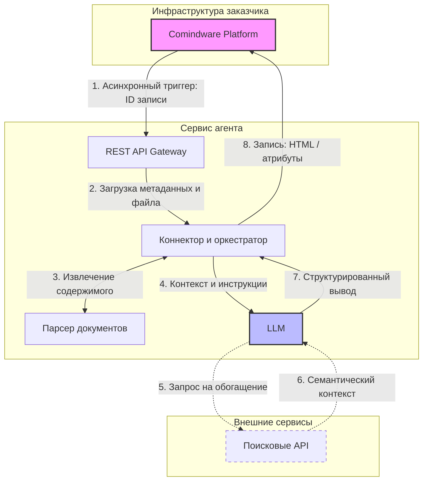

# Архитектура агента обработки документов {: #doc_agent_architecture }

## Резюме {: #executive_summary }

- **Ситуация:** в **Comindware Platform** создаются записи, содержащие вложенные документы. Операторы осуществляют ручное извлечение данных из документов (контрагенты, даты, финансовые показатели, условия). При росте объёма данных возрастают частота ошибок и операционные издержки.
- **Вызов:** низкая масштабируемость ручной обработки и отсутствие стандартизации извлечения целевых данных.
- **Задача:** внедрение автономного агента, способного принимать документы из **Comindware Platform**, осуществлять семантический анализ, при необходимости обогащать данные через поисковые запросы и возвращать структурированный результат.
- **Решение:** развернуть автономный агент с функцией глубокого веб-поиска, интегрированный с **Comindware Platform**. Агент считывает значения атрибутов, выполняет вычисления на Python, создаёт связанные записи и генерирует HTML-отчёты. Платформа асинхронно делегирует задачу агенту, который автономно возвращает итоговый результат.
- **Результат:** цикл обработки составляет 15–120 секунд (зависит от скорости работы языковой модели, объёма документов, скорости и объёма веб-поиска). Полная автоматизация исключает необходимость ручного вмешательства.

## Архитектура системы {: #system_architecture }

Агент обработки документов состоит из четырёх слоёв:

- **Слой интеграции с Comindware Platform:** взаимодействие с платформой посредством REST API. Агент считывает запись с прикреплённым документом и транслирует обработанный результат в целевые атрибуты.
- **Слой извлечения содержимого:** конвертация исходных форматов (PDF, DOCX, XLSX) в машиночитаемый текст.
- **Слой интеллектуальной обработки:** языковая модель (LLM), оснащённая инструментами для вызова внешних поисковых систем, определения даты и времени, вычислений (в том числе на Python). Модель автономно определяет необходимость обращения к внешним источникам для валидации или обогащения контекста.
- **Слой коммуникации:** защищённый шлюз REST API для инициализации конвейера с обязательной верификацией API-ключа.

### Компоненты

| Компонент | Назначение | Примечания |
| :--- | :--- | :--- |
| **Comindware Platform** | Источник данных и получатель результатов | Бизнес-приложение |
| **Точка входа** | Инициализация цикла обработки по идентификатору записи | REST API |
| **Коннектор** | Извлечение объектов из **Comindware Platform** | Чтение бинарных файлов на стороне агента |
| **Конвертер** | Конвертация исходных форматов в машиночитаемое текстовое представление | Универсальный модуль парсинга |
| **Языковая модель** | Синтез структурированного ответа на основе семантического анализа | Доступ через доверенных российских провайдеров |
| **Внешние интеграции** | ФНС, 1С, Консультант+, веб-поиск (Yandex, Tavily, Exa) | Обогащение данные через API |
| **Вывод** | Трансляция итоговых данных в атрибуты целевой записи | Форматирование HTML, приведение типов данных между агентом и платформой |

### Поток данных



**Алгоритм работы:**

1. **Асинхронный триггер:** **Comindware Platform** передаёт ID записи агенту и продолжает работу.
2. **Загрузка:** агент получает метаданные записи и загружает документ.
3. **Извлечение:** парсер конвертирует PDF/DOCX/XLSX в текст.
4. **Анализ:** LLM получает текст с инструкцией и формирует ответ. При необходимости запрашивает обогащение из внешних систем.
5. **Запись:** агент записывает результат в атрибуты записи **Comindware Platform**.

## Инфраструктура {: #infrastructure }

| Параметр | Значение |
| :--- | :--- |
| **Сервер агента** | Linux, Python 3.12+ |
| **Инференс** | Российские облачные провайдеры |
| **Документы** | PDF, DOCX, XLSX |
| **Время обработки** | 15–120 секунд |
| **Аутентификация** | Заголовок X-API-Key |
| **Платформа** | **Comindware Platform** с атрибутами для записи результата |

!!! note "Как работает языковая модель"

    Языковая модель функционирует на основе предиктивной генерации токенов, вычисляя вероятности последовательностей. Модель **не взаимодействует с файловой системой**, **не выполняет математических операций** и **не обладает прямым доступом к сети** — ее функция ограничена исключительно текстовой генерацией.

    **Для реализации агентной логики необходима детерминированный инструментарий (оснастка):**

    - **Файлы** → модель воспринимает текст; прямая обработка бинарных форматов (PDF/DOCX) обычно невозможна (за исключением таких моделей, как Google Gemini; остальные «модели» с поддержкой обработки файлов — обычно агенты на стороне провайдера).
    - **Поиск** → требует интеграции с внешними API (Yandex, Tavily, Exa, 1С, ФНС, Консультант+). Модель формулирует запрос, а агент выполняет его и возвращает ответ.
    - **Вычисления** → LLM подвержены галлюцинациям при строгих расчетах. Детерминированные операции делегируются профильным библиотекам Python (например, `datetime`, `math`, `pandas`).

    Таким образом, агент представляет собой комбинацию LLM и инструментальной оснастки. Без инструментов модель остается исключительно генератором текста, лишённым дееспособности.

## Асинхронная модель {: #async_model }

Ключевая особенность **агентного контура Comindware** — **асинхронное взаимодействие** агента с **Comindware Platform**.

**Архитектурное решение:** YAML-схемы находятся на стороне агента, а не платформы. Это позволяет агенту самостоятельно обращаться к **Comindware Platform** за данными по ID записи.

Дублирование схем обмена данными на стороне платформы (пути передачи данных) и агента (схема парсинга API-запроса) было бы избыточным. Принятая архитектура делегирует агенту автономное получение данных:

- Платформа передаёт агенту только ID записи.
- Агент автономно извлекает целевой документ, контекстные инструкции и любые данные, заданные в его схеме и доступные его роли модели в **Comindware Platform**.
- Агент фиксирует результат в платформе посредством прямого API-вызова.

**Асинхронный паттерн:** платформа инициирует вызов агента и продолжает выполнение бизнес-процессов. Агент асинхронно агрегирует данные, проводит аналитику и возвращает результат в платформу.

При проектировании критически важно **определить зоны ответственности**:

- **Comindware Platform** выполняет детерминированные бизнес-процессы (строгая валидация, маршрутизация, вычисления).
- Агент активируется на участках, требующих эвристического анализа, семантической обработки неструктурированных документов и динамической нечётко формализуемой маршрутизации запросов к внешним системам.

## Интеграция с внешними системами {: #external_systems }

Агент может подключаться к внешним системам для обогащения данных:

- **ФНС (ЕГРЮЛ/ИП):** проверка статуса контрагента, получение выписок, мониторинг изменений.
- **1С (Предприятие 8.3+):** остатки на складе, заказы, справочники контрагентов.
- **Консультант+/Гарант:** актуальные редакции документов, судебная практика.
- **Веб-поиск (Yandex, Tavily, Exa):** уточнение информации при недостатке контекста.

Все интеграции реализуются через API. Модель на стороне агента определяет по контексту необходимость обращения к внешней системе и вызывает соответствующий инструмент.

## Интеграция с **Comindware Platform** {: #cmw_integration }

### Принцип интеграции

YAML-конфигурации задают декларативные схемы интеграции:

- Системные имена целевого приложения и шаблонов.
- Маппинг входных и выходных атрибутов.
- Системные и пользовательские промпты для LLM.

Управление бизнес-логикой осуществляется декларативно, что снижает необходимость модификаций исходного кода агента.

### Атрибуты записи

**Входные атрибуты:**

- Атрибут, содержащий бинарное вложение (документ).
- Атрибут с контекстным промптом (задаёт конкретную бизнес-задачу для LLM).

**Выходные атрибуты:**

- Текстовый атрибут для итогового резюме.
- Дополнительные атрибуты: даты, статусы, вычисляемые значения (сложные вычисления на стороне агента с помощью Python, pandas и т. п.), ссылки на связанные записи.

### Возможности агента

Агент оперирует записями в **Comindware Platform**, минуя экранные формы. Прямое взаимодействие обеспечивается посредством API:

- **даты** — извлечь сроки из документа, рассчитать промежуточные даты;
- **расчётные значения** — вычислить суммы, проценты, разницу на основе данных документа и **Comindware Platform**;
- **структурированные данные** — извлечь табличные данные из документа в отдельные атрибуты;
- **статусы** — выставить статус записи на основе анализа;
- **связанные записи** — создать дочерние записи (например, отдельные задачи по каждому пункту документа);
- **HTML-отчёты** — сформировать форматированный отчёт с таблицами и разметкой. **Comindware Platform** принимает HTML в текстовых атрибутах — агент формирует корректную разметку.

YAML-конфигурация определяет все атрибуты и типы данных, агент опирается на эту схему.

### Управление доступом

!!! warning "Доступ агента к Comindware Platform"

    - Для агента необходимо создать отдельный аккаунт в **Comindware Platform** так же как для человека-исполнителея. Эти учётные данные агент будет использовать для работы с платформой через API.
    - Для аккаунта агента необходимо создать **отдельную роль в целевом приложении** с разрешениями на чтение и запись ресурсов в соответствии с его бизнес-задачами. Эту роль следует настраивать так, чтобы агент не мог совершать нежелательные действия, но мог выполнять все необходимые операции с платформой.
    - Аккаунт агента необходимо добавить в **отдельную системную роль** с разрешением на **использование API**.
    - Нежелательно давать агенту роль системного администратора во избежание инцидентов с безопасностью. Агент обладает мощными инструментами работы с **Comindware Platform** и его доступ должен быть ограничен минимально необходимым.

Агент работает под собственной учётной записью в **Comindware Platform** с гранулярными правами доступа:

- Агенту разрешены чтение и запись исключительно тех записей и атрибутов, которые явно заданы в его роли **Comindware Platform** и в YAML-конфигурации на стороне агента.
- Платформа обеспечивает непрерывный аудит транзакций агента с фиксацией в системных журналах.
- Благодаря отдельной роли агента возможны сквозной мониторинг и трассировка API-вызовов администратором.

### Гибкость промптов

Архитектура поддерживает гибридную модель формирования системных и пользовательских промптов:

- **Динамические (на стороне платформы)** — аналитик составляет контекстные системный и пользовательский промпт для конкретной записи, в том числе с подстановкой контекстных вычисляемых данных. Оптимально для ad-hoc задач с вариативным контекстом.
- **Статические (на стороне агента)** — администратор фиксирует системный и пользовательский промпт в YAML-конфигурации. Эффективно для стандартизированных конвейеров.

### Что требуется на стороне агента

**Сервер агента:**

- Linux или Windows + Python
- Доступ к API **Comindware Platform** (URL, учётные данные)
- Доступ к API LLM (OpenRouter, Yandex Cloud, GigaChat и т. п.)

**Настройка:**

- URL **Comindware Platform** и идентификаторы приложения и шаблонов
- Системные имена атрибутов для чтения и записи

### Программный интерфейс

Эндпоинт принимает JSON:

```json
{
    "request_id": "<идентификатор-записи>"
}
```

Ответ:

```json
{
    "success": true,
    "summary": "<HTML-результат>",
    "message": "Результат сформирован",
    "error": null
}
```

### Пример вызова

```bash
curl -X POST http://localhost:7860/api/v1/cmw/summarize-document \
  -H "Content-Type: application/json" \
  -H "X-API-Key: <ключ>" \
  -d '{"request_id": "<идентификатор-записи>"}'
```

!!! tip "Время обработки"

    Обработка занимает 15–120 секунд в зависимости от скорости обработки запроса моделю, размера файла, необходимости и скорости веб-поиска.