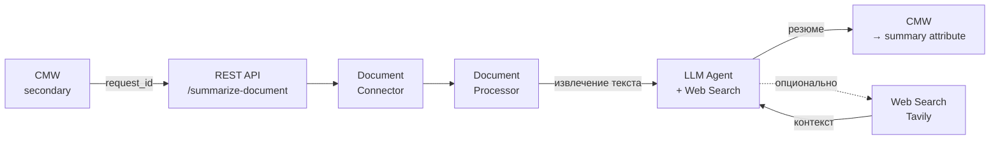

# Архитектура агента обработки документов {: #doc_agent_architecture }

## Резюме {: #executive_summary }

- **Ситуация:** Заказчик присылает коммерческое предложение в формате PDF или DOCX. Менеджер тратит 15–20 минут на извлечение ключевой информации: отправитель, получатель, даты, цены, условия, сроки. При больших объёмах — ошибки из-за ручного переписывания данных.
- **Вызов:** Ручная обработка документов не масштабируется. Каждый новый документ — повторение тех же действий. Нет стандартизации: один менеджер извлекает одни поля, другой — другие.
- **Решение:** Автономный ИИ-агент, который принимает документ из системы, генерирует структурированное резюме и пишет результат обратно в платформу. Менеджер видит готовый результат — ни одной ручной операции.
- **Результат:** 99% автоматизация, 15–60 секунд время обработки, консистентный формат вывода.

## Архитектура системы {: #system_architecture }

Агент обработки документов строится на четырёх слоях:

- **Слой интеграции с платформой:** подключение к вторичному инстансу Comindware Platform через REST API. Чтение записи с документом, запись результата обратно в атрибут.
- **Слой извлечения文档:** преобразование документов различных форматов в текст. Поддерживаются PDF, DOCX, XLSX, ZIP.
- **Слой ИИ-агента:** языковая модель с доступом к инструменту веб-поиска. Модель самостоятельно решает, когда нужен поиск актуальной информации (цены конкурентов, погода), а когда достаточно документа.
- **Слой коммуникации:** REST API эндпоинт для триггирования обработки. Аутентификация по API-ключу.

### Компоненты

| Компонент | Роль | notes |
| :--- | :--- | :--- |
| **CMW Platform (secondary)** | Источник документов и получатель результата | secondary instance с отдельными credentials |
| **REST API эндпоинт** | `/api/v1/cmw/summarize-document` | Принимает request_id |
| **Document Connector** | Извлекает документ из CMW | Base64 → текст |
| **Document Processor** | Конвертирует PDF/DOCX/XLSX → Markdown | PyMuPDF4LLM, python-docx, openpyxl |
| **LLM Agent (glm-5)** | Генерирует структурированное резюме | Z-AI GLM-5 через OpenRouter |
| **Web Search (Tavily)** | Конкурентная разведка: цены, погода, статистика | Автоматический вызов при необходимости |
| **Output** | Резюме → атрибут `summary` в CMW | Markdown или HTML |

### Поток данных



**Алгоритм работы:**

1. **Триггер:** внешняя система вызывает REST API `/api/v1/cmw/summarize-document` с ID записи.
2. **Извлечение:** агент читает запись, получает ссылку на документ, качает документ.
3. **Конвертация:** документ преобразуется в текст (Markdown для PDF, текст для Word/Excel).
4. **Генерация:** LLM анализирует текст, формирует структурированное резюме. При необходимости автоматически вызывает веб-поиск для актуальных данных (цены конкурентов, погода).
5. **Запись:** результат пишется в атрибут `summary` записи.

!!! note "Автономность"

    Агент работает полностью автономно. После триггера от внешней системы вмешательство человека не требуется. Агент сам читает, обрабатывает и записывает результат.

## Инфраструктура {: #infrastructure }

### Требования

| Параметр | Значение |
| :--- | :--- |
| **Где работает** | Единый сервер с RAG-движком (`localhost:7860`) |
| **Модель** | Z-AI GLM-5 через OpenRouter |
| **Эмбеддинги** | Qwen3-8B (локально) |
| **Векторная БД** | ChromaDB (локально) |
| **Поиск** | Tavily API |
| **Документы** | PDF, DOCX, XLSX, ZIP |
| **Время обработки** | 15–60 сек/документ |
| **API Key защита** | X-API-Key header |

### Развёртывание

Агент развёрнут как часть **единого Gradio-приложения**:

- **Веб-интерфейс:** UI для чата с RAG-ассистентом (основной интерфейс)
- **API-эндпоинт:** встроенный FastAPI для автоматической обработки

Это **единый серверный процесс** — не отдельный микросервис. При запуске `rag_engine/scripts/start_app.sh` стартует Gradio-блок с встроенным FastAPI-роутером.

### Переменные окружения

```
CMW2_BASE_URL      # URL вторичного инстанса Comindware
CMW2_LOGIN         # Логин для secondary instance
CMW2_PASSWORD     # Пароль для secondary instance
CMW2_API_KEY      # API-ключ для защиты эндпоинта
OPENROUTER_API_KEY # API-ключ OpenRouter для GLM-5
TAVILY_API_KEY    # API-ключ Tavily для веб-поиска
```

## Интеграция с CMW Platform {: #cmw_integration }

### Входные данные

| Параметр | Описание | notes |
| :--- | :--- | :--- |
| **Template** | `ArchitectureManagement.Zaprosinarazrabotky` | Запрос в разработку |
| **Атрибут `Commerpredloshenie`** | Ссылка на вложенный документ | PDF/DOCX/XLSX |
| **Атрибут `promt`** | Инструкция пользователя | Что делать с ��окументом |

### Выходные данные

| Параметр | Описание | notes |
| :--- | :--- | :--- |
| **Атрибут `summary`** | Сгенерированное резюме | Markdown или HTML |
| **Автоматическая запись** | Агент пишет сам | Без действий пользователя |

### Пример вызова

```bash
curl -X POST http://localhost:7860/api/v1/cmw/summarize-document \
  -H "Content-Type: application/json" \
  -H "X-API-Key: <key>" \
  -d '{"request_id": "<record-id>"}'
```

### Ответ

```json
{
    "success": true,
    "summary": "# Анализ коммерческого предложения\n\n## Резюме документа\n\n| Параметр | Значение |...",
    "message": "Summary generated for document.143.docx",
    "error": null
}
```

## Демонстрация и следующие шаги {: #demo_next_steps }

### Как демонстрировать

1. **Шаг 1:** Показать запись в CMW Platform с прикреплённым документом.
2. **Шаг 2:** Вызвать curl к эндпоинту с ID записи.
3. **Шаг 3:** Показать автоматическую генерацию резюме — агент сам извлекает документ, анализирует, при необходимости ищет дополнительную информацию.
4. **Шаг 4:** Показать заполненный атрибут `summary` в интерфейсе CMW.

### Ключевые показатели

| Метрика | До | После |
| :--- | :--- | :--- |
| Время обработки | 15–20 мин | 15–60 сек |
| Автоматизация | 0% | 99% |
| Консистентность формата | Ручная | Автоматическая |

### Следующие шаги

- **Расширение типов документов:** счета, акты, договоры — тот же конвейер, другие промпты
- **Поддержка других шаблонов:** настройка CMW2-конфигурации без изменения кода
- **Несколько инстансов CMW:** один агент, mehrere платформ — через YAML-конфигурацию
- **Оптимизация стоимости:** переход на локальный инференс при росте объёмов

!!! tip "Масштабируемость"

    Архитектура декларативная: добавление нового типа документов — изменение YAML-конфигурации и промпта, без переписывания кода.