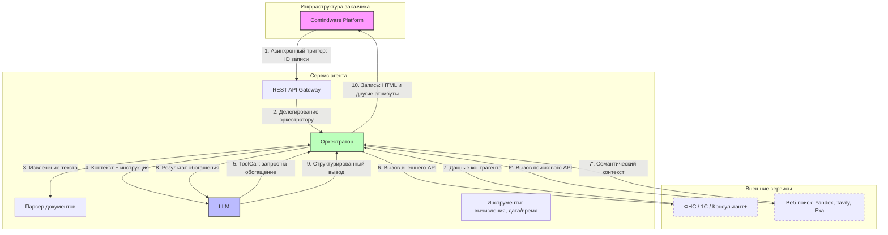

# Архитектура агента обработки документов {: #doc_agent_architecture }

## Резюме {: #executive_summary }

- **Ситуация:** в **Comindware Platform** создаются записи с вложенными документами. Операторы вручную извлекают данные (контрагенты, даты, финансовые показатели, условия). С ростом объёма учащаются ошибки и растут издержки.
- **Вызов:** масштабирование ручной обработки экономически нецелесообразно; способы извлечения данных не стандартизированы.
- **Задача:** внедрить автономный агент, принимающий документы из **Comindware Platform**, выполняющий семантический анализ, при необходимости проверяющий, исправляющий и обогащающий данные через внешние источники и возвращающий структурированный результат.
- **Решение:** аналитический агент с глубоким веб-поиском, интегрированный с **Comindware Platform** на уровне записей. Платформа асинхронно передаёт ID записи; агент автономно извлекает документы, анализирует, при необходимости обращается к внешним источникам, формирует HTML-отчёт и записывает результат в атрибуты записи на стороне **Comindware Platform**.
- **Результат:** цикл обработки — 15–120 секунд (зависит от модели, объёма документов и веб-поиска). Полная асинхронная автоматизация без ручного вмешательства.

## Архитектура {: #system_architecture }

### Компоненты агента

Агент состоит из оркестратора и инструментальной оснастки. Оркестратор координирует конвейер обработки данных, вызывает LLM для принятия решений и выполняет инструментальные операции для модели, а также выполняет операции с **Comindware Platform**.

| Компонент | Слой | Ответственность | Технологии |
| :--- | :--- | :--- | :--- |
| **Comindware Platform** | Внешний | Источник документов и получатель результатов | Бизнес-приложение на основе low-code и REST API |
| **REST API Gateway** | Коммуникация | Приём ID записи, верификация API-ключа | REST API |
| **Оркестратор** | Координация | Управление конвейером, вызов инструментов, обработка ошибок | Python, LangChain/LangGraph |
| **Парсер документов** | Извлечение | Конвертация PDF/DOCX/XLSX в машиночитаемый текст | Библиотеки Python для обработки файлов |
| **LLM** | Принятие решений | Семантический анализ, структурированный вывод, выбор инструментов | Доверенные российские провайдеры |
| **Вывод** | Трансляция | Запись итоговых данных в атрибуты, форматирование HTML, приведение типов между агентом и платформой | Python и REST API |
| **Внешние API** | Обогащение | ФНС, 1С, Консультант+, веб-поиск (Yandex, Tavily, Exa) | REST API |

### Граница ответственности: LLM и оркестратор

Языковая модель — предиктивный генератор токенов. Она **не** читает файлы, **не** выполняет вычисления и **не** обращается к сети.

Агентные возможности обеспечивает детерминированная программная оснастка.

Модель формулирует запрос к внешнему источнику; оркестратор выполняет вызов необходимых инструментов и возвращает результат модели для дальнейшего анализа:

| Компонент | Решение | Операции |
| :--- | :--- | :--- |
| **LLM** | Какой инструмент вызвать, с какими параметрами | Только текстовая генерация |
| **Оркестратор** | Какой шаг следующий, обработка ошибок, повторы | Все инструментальные вызовы, API-запросы, вычисления |

### Взаимодействие компонентов



!!! question "LLM — не имеет памяти и связи с внешним миром"

    Ключевой принцип: LLM не имеет прямой связи с внешними сервисами, а также не хранит контекст диалога или обработки данных.
    
    Все инструментальные вызовы идут через оркестратор (шаги 5→6→7→8).

    Контекст и память сеанса поддерживает оркестратор, а не LLM.
    
    Модель принимает решения; оркестратор их исполняет.

### Конвейер обработки

1. **Триггер:** **Comindware Platform** передаёт ID записи и продолжает работу.
2. **Загрузка:** оркестратор получает данные записи (включая динамические пропты и любой необходимый контекст) и загружает документ.
3. **Извлечение:** парсер конвертирует PDF/DOCX/XLSX в текст.
4. **Анализ:** оркестратор передаёт текст документа, необходимый контекст и инструкции по его обработке в LLM. Если контекста недостаточно, LLM формирует `ToolCall`; оркестратор выполняет вызов и возвращает результат.
5. **Запись:** оркестратор записывает структурированный результат в атрибуты записи **Comindware Platform**.

### Внешние интеграции

Агент подключается к внешним системам через инструментарий оркестратора:

- **ФНС (ЕГРЮЛ/ИП):** проверка статуса контрагента, выписки, мониторинг изменений.
- **1С (Предприятие 8.3+):** остатки на складе, заказы, справочники контрагентов.
- **Консультант+/Гарант:** актуальные редакции документов, судебная практика.
- **Веб-поиск (Yandex, Tavily, Exa):** уточнение информации при недостатке контекста.

Модель определяет по контексту необходимость обращения; оркестратор формирует и выполняет API-запрос.

## Интеграция с **Comindware Platform** {: #cmw_integration }

### Асинхронная модель взаимодействия

Схемы взаимодействия (YAML) находятся на стороне агента, а не **Comindware Platform**.

Платформа  инициирует вызов агента, передаёт ему только ID записи и продолжает выполнение бизнес-процессов.

Агент автономно извлекает документ, инструкции и контекстные данные, доступные его роли в **Comindware Platform**, проводит аналитику и любые необходимые операции (например, обращается к сторонним сервисам или базам данных), и возвращает итоговый результат в платформу прямым вызовом API.

**Зоны ответственности:**

- **Comindware Platform** — детерминированные бизнес-процессы: валидация, маршрутизация, вычисления, работа с пользователями.
- **Агент** — эвристический анализ, семантическая обработка неструктурированных документов, динамическая маршрутизация запросов к внешним системам, сложные вычисления и аналитика данных (например, на `pandas`).

### Декларативная конфигурация

Схемы интеграции задаются декларативно на стороне агента:

- Системные имена целевого приложения и шаблонов.
- Маппинг входных и выходных атрибутов.
- Системные и пользовательские промпты для LLM.

!!! tip "Одна схема взаимодействия вместо двух"

    Автономный агент с инструментами для работы с *Comindware Platform** позволяет использовать один набор схем вместо двух.

    Если бы мы настраивали полный маппинг атрибутов в HTTP-запросы на стороне **Comindware Platform** в путях передачи данных, нам всё равно пришлось бы настроить такуюже схему взаимодействия на стороне агента.
    
    Но благодаря тому, что агент может работать с платформой напрямую, достаточно одной схемы на стороне агента.

    Декларативное управление бизнес-логикой сокращает (но не исключает) необходимость модификации исходного кода агента.

### Атрибуты записи

**Входные атрибуты:**

- Атрибут с бинарным вложением (документ).
- Атрибут с контекстным промптом (задаёт бизнес-задачу для LLM).

**Выходные атрибуты:**

- Текстовый атрибут для итогового резюме (HTML).
- Дополнительные атрибуты: даты, статусы, вычисляемые значения (сложные вычисления — на стороне агента через Python, `pandas` и т. п.), ссылки на связанные записи.

### Возможности агента

Агент оперирует записями **Comindware Platform** напрямую через API, минуя экранные формы:

- **даты** — извлечь сроки из документа, рассчитать промежуточные даты;
- **расчётные значения** — вычислить суммы, проценты, разницу на основе данных документа и **Comindware Platform**;
- **структурированные данные** — извлечь табличные данные в отдельные атрибуты;
- **аналитика** — считать любые исходные данные из **Comindware Platform** и выставить статусы и иные значения в целевой записи на основе анализа;
- **связанные записи** — создать дочерние записи (например, отдельные задачи по каждому пункту документа);
- **HTML-отчёты** — сформировать форматированный отчёт и поместить его в текстовый атрибут.

Декларативная YAML-конфигурация определяет все атрибуты и типы данных; агент опирается на эту схему.

### Управление доступом

Агенту необходимы отдельный аккаунт и отдельная отдельная роль для обеспечения атрибуции действий в **Comindware Platform**, непрерывнОго аудита транзакций агента и сквозной трассировки API-вызовов.

- Создайте отдельный аккаунт в **Comindware Platform** так же, как для человека-исполнителя. Агент использует эти учётные данные для работы через API.
- Назначьте аккаунту **отдельную роль в целевом приложении** с разрешениями на чтение и запись только тех ресурсов, которые необходимы для решения бизнес-задач агентом. Настройте роль так, чтобы исключить нежелательные операции.
- Добавьте аккаунт в **отдельную системную роль** с разрешением на **использование API**.
- **Не** назначайте агенту роль системного администратора — доступ должен быть ограничен минимально необходимым.

### Гибкость промптов

Архитектура поддерживает гибридную модель формирования промптов:

- **Динамические (на стороне платформы)** — аналитик составляет контекстные системный и пользовательский промпт для конкретной записи, в том числе с подстановкой вычисляемых данных. Оптимально для ad-hoc задач с вариативным контекстом.
- **Статические (на стороне агента)** — администратор фиксирует промпты в YAML-конфигурации. Эффективно для стандартизированных конвейеров.

## Операционные характеристики {: #operational_characteristics }

| Параметр | Значение |
| :--- | :--- |
| **Время обработки** | 15–120 секунд (зависит от модели, объёма документа и веб-поиска) |
| **Сервер агента** | Linux / Windows, Python 3.12+ |
| **Инференс** | Российские облачные провайдеры (OpenRouter, Yandex Cloud, GigaChat) |
| **Документы** | PDF, DOCX, XLSX |
| **Аутентификация** | Заголовок X-API-Key |
| **Платформа** | **Comindware Platform** с атрибутами для записи результата |

### Программный интерфейс

Эндпоинт принимает JSON:

```json
{
    "request_id": "<идентификатор-записи>"
}
```

Ответ:

```json
{
    "success": true,
    "summary": "<HTML-результат>",
    "message": "Результат сформирован",
    "error": null
}
```

### Пример вызова

```bash
curl -X POST http://localhost:7860/api/v1/cmw/summarize-document \
  -H "Content-Type: application/json" \
  -H "X-API-Key: <ключ>" \
  -d '{"request_id": "<идентификатор-записи>"}'
```
