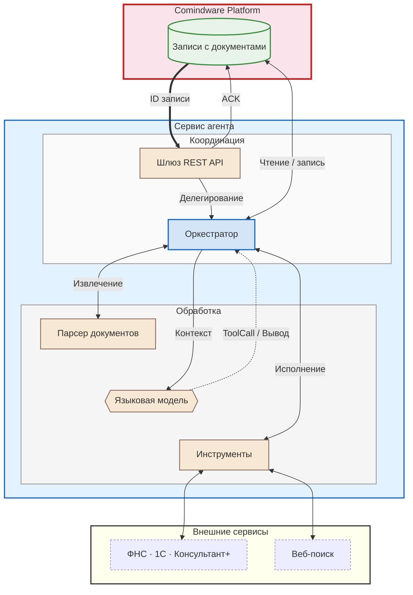

# Архитектура агента обработки документов {: #doc_agent_architecture }

## Резюме {: #doc_agent_executive_summary }

- **Ситуация:** в **Comindware Platform** создаются записи с вложенными документами. Операторы вручную извлекают данные (контрагенты, даты, финансовые показатели, условия). С ростом объёма учащаются ошибки и растут издержки.
- **Вызов:** масштабирование ручной обработки экономически нецелесообразно; способы извлечения данных не стандартизированы.
- **Задача:** внедрить автономный агент, принимающий документы из **Comindware Platform**, выполняющий семантический анализ, при необходимости проверяющий, исправляющий и обогащающий данные через внешние источники и возвращающий структурированный результат.
- **Решение:** аналитический агент с глубоким веб-поиском, интегрированный с **Comindware Platform**. Платформа асинхронно передаёт ID записи; агент автономно извлекает документы, анализирует, при необходимости обращается к внешним источникам, формирует HTML-отчёт и записывает результат в атрибуты на стороне платформы. Полная асинхронная автоматизация без ручного вмешательства.

<div class="admonition question" markdown="block">

## Определения {: .admonition-title #definitions}

- **LLM** — большая языковая модель (БЯМ). Это алгоритм, построенный на основе нейронных сетей и моделирующий общение на естественном языке. LLM предсказывает наиболее вероятный ответ на входной запрос (промпт), основываясь на данных, заложенных в неё на этапе обучения.
- **Токен** — минимальная единица текста, которую обрабатывает LLM. Токен может быть целым словом, частью слова, отдельным символом или знаком препинания. Токенизатор (алгоритм разбиения текста на токены) преобразует текст в числовые ID — **модель оперирует только числами**, никогда не видит фактический текст и не знает букв и слов как таковых. 1 токен ≈ 0,75 слова в английском языке.
- **Промпт** — запрос к LLM на естественном языке с инструкциями и данными для обработки.
- **Агент** — программный слой, обеспечивающий взаимодействие пользователя, **Comindware Platform** и LLM.
- **Оркестратор** — компонент агента, который управляет конвейером обработки и вызовов LLM, обрабатывает ошибки и повторы.

</div>

## Архитектура агента {: #doc_agent_agent_architecture }

### Компоненты агента {: #doc_agent_architecture_components }

Агент состоит из шлюза API, оркестратора и инструментальной оснастки.

Оркестратор выполняет высокоуровневый цикл обработки данных, вызовы LLM для принятия решений и инструментальные операции для модели, а также осуществляет за взаимодействие с **Comindware Platform** и другими системами.

| Компонент | Слой | Ответственность | Технологии |
| :--- | :--- | :--- | :--- |
| **Шлюз REST API с Comindware Platform** | Коммуникация | Приём ID записей, верификация API-ключа, чтение и запись данных | Библиотека FastAPI для Python |
| **Оркестратор** | Координация | Управление конвейером, вызов инструментов и API, обработка ошибок | Python, LangChain/LangGraph |
| **Парсер документов** | Извлечение | Конвертация PDF/DOCX/XLSX в машиночитаемый текст | Библиотеки Python для обработки файлов |
| **LLM** | Принятие решений | Семантический анализ, структурированный вывод, выбор инструментов | Доверенные российские провайдеры |
| **Вывод** | Трансляция | Запись итоговых данных в атрибуты, форматирование HTML, приведение типов между агентом и платформой | Python, FastAPI |
| **Внешние API** | Обогащение | ФНС, 1С, Консультант+, веб-поиск (Yandex, Tavily, Exa) | FastAPI |

### Граница ответственности: LLM и агент {: #doc_agent_llm_orchestrator_boundary }

!!! tip "Ключевой принцип: LLM не имеет памяти и связи с внешним миром"

    LLM — предиктивный генератор токенов. Модель **не** читает файлы, **не** выполняет вычисления и **не** обращается к сети. У неё нет никакого внутреннего представления о текущем бизнес-контексте. Более того, модель **не** знает даже текущее время или год — ей необходимы внешние контекстные данные для решения любых бизнес-задач.

    Агентные возможности (дееспособность модели) обеспечивает детерминированная программная оснастка — все операции выполняет агент программным способом.
    
    Модель принимает решения; агент их исполняет.
    
    Контекст и память сеанса поддерживает агент, а **не LLM**.

LLM формулирует запросы к внешним источникам данных или вычислений; агент выполняет вызов необходимых инструментов и возвращает результаты модели для дальнейшего анализа:

| Компонент | Решение | Операции |
| :--- | :--- | :--- |
| **LLM** | Какой инструмент вызвать, с какими параметрами | Только текстовая генерация |
| **Агент** | Какой шаг следующий, обработка ошибок, повторы | Все инструментальные вызовы, API-запросы, вычисления |

### Взаимодействие компонентов {: #doc_agent_component_interaction }







### Конвейер обработки {: #doc_agent_processing_pipeline }

1. **Запуск:** **Comindware Platform** передаёт ID записи через REST API и продолжает работу. Платформа не ждёт финального результата от агента, а лишь получает краткое подтверждение, что агент принял запрос.
2. **ACK:** агент немедленно подтверждает приём (если удалось считать запись) и продолжает работу в фоновом режиме.
3. **Загрузка:** агент получает данные записи (включая динамические промпты и любой необходимый контекст) и загружает документ.
4. **Извлечение:** парсер конвертирует PDF/DOCX/XLSX в текст.
5. **Анализ:** агент передаёт текст документа, необходимый контекст и инструкции по его обработке в LLM. Если контекста недостаточно, LLM формирует один или несколько вызовов инструментов (`ToolCall`) для обогащения и аналитики данных; агент выполняет вызовы и возвращает результаты в цикле или параллельно.
6. **Запись результата:** агент записывает структурированный результат в атрибуты **Comindware Platform** через API.

### Внешние интеграции {: #doc_agent_external_integrations }

Агент подключается к внешним системам через инструментарий агента.

Модель определяет по контексту необходимость обращения; агент формирует и выполняет API-запрос:

- **ФНС (ЕГРЮЛ/ИП):** проверка статуса контрагента, выписки, мониторинг изменений;
- **1С (Предприятие 8.3+):** остатки на складе, заказы, справочники контрагентов;
- **Консультант+/Гарант:** актуальные редакции документов, судебная практика;
- **Веб-поиск (Yandex, Tavily, Exa):** уточнение информации при недостатке контекста.

## Интеграция с Comindware Platform {: #doc_agent_cmw_integration }

### Асинхронная модель взаимодействия {: #doc_agent_async_interaction_model }

Платформа инициирует вызов агента, передаёт ему только ID записи и продолжает выполнение бизнес-процессов.

Агент автономно извлекает документ, инструкции и контекстные данные, доступные его роли, проводит аналитику, выполняет любые необходимые операции (например, обращается к сторонним сервисам, базам данных, ФНС, 1С или веб-поиску) и возвращает итоговый результат в платформу прямым вызовом API.

**Зоны ответственности:**

- **Comindware Platform** — детерминированные бизнес-процессы: валидация, маршрутизация, вычисления, работа с пользователями.
- **Агент** — эвристический анализ, семантическая обработка неструктурированных документов, динамическая маршрутизация запросов к внешним системам, сложные вычисления и аналитика данных (например, на `pandas`).

### Декларативная конфигурация {: #doc_agent_declarative_config }

Схемы интеграции и взаимодействия (YAML) мы задаём декларативно на стороне агента, а не в путях передачи данных **Comindware Platform**:

- системные имена целевого приложения и шаблонов;
- маппинг входных и выходных атрибутов;
- системные и пользовательские промпты для LLM.

!!! tip "Одна схема взаимодействия вместо двух"

    Автономный агент с инструментами для работы с *Comindware Platform** позволяет использовать один набор схем вместо двух.

    Если бы мы настраивали полное сопоставление атрибутов в HTTP-запросы на стороне **Comindware Platform** в путях передачи данных, нам всё равно пришлось бы настроить аналогичную зеркальную схему взаимодействия на стороне агента.
    
    Но благодаря тому, что агент может работать с платформой напрямую, достаточно одной схемы на стороне агента.

    Декларативное управление бизнес-логикой сокращает (но не исключает) необходимость модификации исходного кода агента и перенастройки платформы.

### Возможности агента {: #doc_agent_business_operations .pageBreakBefore }

Агент оперирует данными в **Comindware Platform** напрямую через API, минуя экранные формы.

Декларативная YAML-конфигурация определяет доступные агенту приложения, шаблоны и атрибуты. См. также _[«правление доступом](#cmw_integration_access_control)»_.

Агент может вычислять и заполнять любые значения по сложным недетерминированным бизнес-правилам:

- **динамическое формирование промптов** — получить из **Comindware Platform** требуемые системные и пользовательские промпты для текущего контекста;
- **извлечение данных** — получить и считать бинарные файлы в любых форматах, распознать и выделить даты, метрики, табличные данные из вложений;
- **вычисления и аналитика** — рассчитать промежуточные сроки, суммы, проценты на основе извлечённых данных (например, с помощью `pandas` и SQL, используя все возможности Python для вычислений, не предусмотренных в **Comindware Platform**, в том числе самостоятельно составлять и исполнять код в защищённом контейнере);
- **изменение данных в Comindware Platform** — изменять значения атрибутов, изменять и создавать связанные записи в платформе (например, отдельные задачи по каждому пункту документа);
- **формирование отчётов** — собрать HTML-отчёт и поместить его в целевой текстовый атрибут.

### Управление доступом {: #doc_agent_cmw_integration_access_control .pageBreakBefore }

Декларативная YAML-конфигурация определяет все атрибуты, которыми должен оперировать агент. Но агент ограничен ролевой моделью на стороне **Comindware Platform**.

Агенту необходимы отдельный аккаунт и отдельная роль для выполнения и атрибуции действий в **Comindware Platform**, непрерывного аудита транзакций и сквозной трассировки API-вызовов.

- Создайте отдельный аккаунт в **Comindware Platform** так же, как для человека-исполнителя. Агент использует эти учётные данные для работы через API.
- Назначьте аккаунту **отдельную роль в целевом приложении** с разрешениями на чтение и запись только тех ресурсов, которые необходимы для решения бизнес-задач агентом. Настройте роль так, чтобы исключить нежелательные операции.
- Добавьте аккаунт в **отдельную системную роль** с разрешением на **использование API**.
- **Не** назначайте агенту роль системного администратора — доступ должен быть ограничен минимально необходимым.

### Гибкость промптов {: #doc_agent_prompt_flexibility .pageBreakBefore }

Архитектура агента поддерживает гибридную модель формирования промптов:

- **Динамические (на стороне Comindware Platform)** — аналитик составляет контекстные системный и пользовательский промпт для конкретной записи или по иной логике, в том числе с подстановкой вычисляемых данных. Оптимально для задач с вариативным контекстом и адаптивной логикой.
- **Статические (на стороне агента)** — администратор фиксирует промпты в YAML-конфигурации. Эффективно для стандартизированных конвейеров со статической логикой.

## Операционные характеристики {: #doc_agent_operational_characteristics }

| Параметр | Значение |
| :--- | :--- |
| **Время обработки** | 15–120 секунд (зависит от модели, объёма документов и веб-поиска) |
| **Сервер агента** | Linux / Windows, Python |
| **Инференс** | Российские облачные провайдеры (Yandex Cloud, Cloud.ru, GigaChat), OpenRouter и аналоги |
| **Документы** | PDF, DOCX, XLSX и любые форматы, поддерживаемые библиотеками Python |
| **Аутентификация** | Заголовок X-API-Key или иные механизмы, поддерживаемые библиотекой FastAPI |
| **Интеграции** | **Comindware Platform** и любые иные системы с API для чтения и записи данных |

### Программный интерфейс {: #doc_agent_api_interface .pageBreakBefore }

Агент использует асинхронную модель «запустил и забыл»: **Comindware Platform** получает подтверждение немедленно, а агент выполняет обработку в фоновом потоке и записывает результат в атрибуты записи по завершении.

**Входящий запрос:**

```json
{
    "request_id": "<идентификатор-записи>"
}
```

**Немедленный ответ:**

```json
{
    "success": true,
    "message": "Начата обработка данных",
    "error": null
}
```

**Запись результата** — агент вызывает API **Comindware Platform** для обновления атрибутов записи по завершении обработки. Формат и состав атрибутов определяются YAML-конфигурацией.

### Пример вызова агента со стороны Comindware Platform {: #doc_agent_api_example }

```bash
curl -X POST http://<agent-host>/api/v1/cmw/summarize-document \
  -H "Content-Type: application/json" \
  -H "X-API-Key: <ключ>" \
  -d '{"request_id": "<идентификатор-записи>"}'
```
