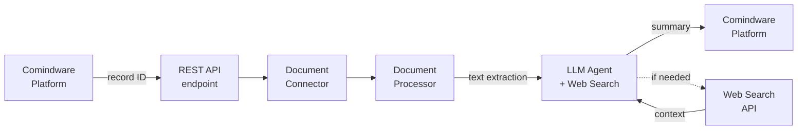

# Архитектура агента обработки документов {: #doc_agent_architecture }

## Резюме {: #executive_summary }

- **Ситуация:** Заказчик присылает коммерческое предложение в формате PDF или DOCX. Менеджер тратит 15–20 минут на извлечение ключевой информации: отправитель, получатель, даты, цены, условия, сроки. При больших объёмах — ошибки из-за ручного переписывания данных.
- **Вызов:** Ручная обработка документов не масштабируется. Каждый новый документ — повторение тех же действий. Нет стандартизации: один менеджер извлекает одни поля, другой — другие.
- **Решение:** Автономный ИИ-агент, который принимает документ из системы, генерирует структурированное резюме и пишет результат обратно в платформу. Менеджер видит готовый результат — ни одной ручной операции.
- **Результат:** 99% автоматизация, 15–60 секунд время обработки, консистентный формат вывода.

## Архитектура системы {: #system_architecture }

Агент обработки документов строится на четырёх слоях:

- **Слой интеграции с платформой:** подключение к **Comindware Platform** через REST API. Чтение записи с документом, запись результата обратно в атрибут.
- **Слой извлечения документа:** преобразование документов различных форматов в текст. Поддерживаются PDF, DOCX, XLSX, ZIP.
- **Слой ИИ-агента:** языковая модель с доступом к инструменту веб-поиска. Модель самостоятельно решает, когда нужен поиск актуальной информации (цены конкурентов, погода), а когда достаточно документа.
- **Слой коммуникации:** REST API эндпоинт для триггирования обработки. Аутентификация по API-ключу.

### Компоненты

| Компонент | Роль | notes |
| :--- | :--- | :--- |
| **CMW Platform** | Источник документов и получатель результата | **Comindware Platform** с API |
| **REST API эндпоинт** | Точка входа для автоматизации | Принимает ID записи |
| **Document Connector** | Извлекает документ из **Comindware Platform** | Читает вложение по ссылке |
| **Document Processor** | Конвертирует PDF/DOCX/XLSX → Markdown | Универсальный парсер |
| **LLM Agent** | Генерирует структурированное резюме | Любая LLM (GPT-4, Claude, GLM, GigaChat) — выбирается по задаче |
| **Web Search** | Конкурентная разведка: цены, погода, статистика | Автоматический вызов при необходимости |
| **Output** | Резюме → атрибут в **Comindware Platform** | Markdown или HTML |

### Поток данных



**Алгоритм работы:**

1. **Триггер:** внешняя система вызывает REST API с ID записи.
2. **Извлечение:** агент читает запись, получает ссылку на документ, качает документ.
3. **Конвертация:** документ преобразуется в текст (Markdown для PDF, текст для Word/Excel).
4. **Генерация:** LLM анализирует текст, формирует структурированное резюме. При необходимости автоматически вызывает веб-поиск для актуальных данных.
5. **Запись:** результат пишется в атрибут записи.

!!! note "Автономность"

    Агент работает полностью автономно. После триггера от внешней системы вмешательство человека не требуется. Агент сам читает, обрабатывает и записывает результат.

## Инфраструктура {: #infrastructure }

### Где работает система

Агент развёрнут как часть **единого серверного приложения** на базе Gradio + FastAPI:

- **Веб-интерфейс:** UI для чата (опционально)
- **API-эндпоинт:** встроенный FastAPI для автоматизации

Это **единый серверный процесс** — один демон обслуживает и веб-интерфейс, и API-запросы. При запуске стартует Gradio-блок с встроенным FastAPI-роутером.

### Требования

| Параметр | Значение |
| :--- | :--- |
| **Сервер** | Linux, Python 3.12+ |
| **LLM** | Любая современная LLM (GPT-4, Claude, GLM, GigaChat) — через API или локально |
| **Эмбеддинги** | Локальные (bge, Qwen) или облачные |
| **Векторная БД** | ChromaDB (локально) |
| **Веб-поиск** | Tavily API (опционально) |
| **Документы** | PDF, DOCX, XLSX, ZIP |
| **Время обработки** | 15–60 сек/документ (без веб-поиска); 30–90 сек (с веб-поиском) |
| **Аутентификация** | X-API-Key header |

### Асинхронная модель

Агент использует **асинхронную модель**:

1. **Fire-and-forget:** вызывающая сторона отправляет request_id и получает подтверждение "started"
2. **Background processing:** агент работает в фоновом режиме
3. **Callback:** результат записывается обратно в платформу без участия человека

Это позволяет платформе не ждать завершения обработки — агент сам вернёт результат.

## Интеграция с **Comindware Platform** {: #cmw_integration }

### Принцип интеграции

Интеграция построена на **декларативных схемах** — YAML-конфигурациях, которые определяют:

- Какой template и application использовать
- Какие атрибуты читать на вход
- В какой атрибут писать на выход
- Системный промпт ��ля LLM

Это позволяет менять логику без изменения кода — достаточно изменить YAML.

### Входные данные

| Параметр | Описание |
| :--- | :--- |
| **Application** | Приложение **Comindware Platform** (настраивается в YAML) |
| **Template** | Шаблон записи (настраивается в YAML) |
| **Document field** | Атрибут с ссылкой на вложение |
| **Prompt field** | Атрибут с инструкцией пользователя |

### Выходные данные

| Параметр | Описание |
| :--- | :--- |
| **Result field** | Атрибут для записи результата |
| **Format** | Markdown или HTML (настраивается в YAML) |

### REST API интерфейс

Эндпоинт `/api/v1/cmw/summarize-document` принимает JSON:

```json
{
    "request_id": "<record-id>"
}
```

Ответ:

```json
{
    "success": true,
    "summary": "# Анализ документа\n\n## Резюме\n\n| Параметр | Значение |...",
    "message": "Summary generated",
    "error": null
}
```

### Пример вызова

```bash
curl -X POST http://localhost:7860/api/v1/cmw/summarize-document \
  -H "Content-Type: application/json" \
  -H "X-API-Key: <secure-key>" \
  -d '{"request_id": "<record-id>"}'
```

!!! tip "Время обработки"

    Обработка занимает 15–60 секунд в зависимости от размера документа и необходимости веб-поиска. Веб-поиск добавляет 10–30 секунд. Это можно протестировать на реальных документах.

## Демонстрация и следующие шаги {: #demo_next_steps }

### Как демонстрировать

1. **Шаг 1:** Показать запись в **Comindware Platform** с прикреплённым документом.
2. **Шаг 2:** Вызвать curl к эндпоинту с ID записи.
3. **Шаг 3:** Показать автоматическую генерацию — агент сам извлекает документ, анализирует, при необходимости ищет дополнительную информацию.
4. **Шаг 4:** Показать заполненный атрибут резюме в интерфейсе **Comindware Platform**.

### Ключевые показатели

| Метрика | До | После |
| :--- | :--- | :--- |
| Время обработки | 15–20 мин | 15–60 сек |
| Автоматизация | 0% | 99% |
| Консистентность формата | Ручная | Автоматическая |

### Гибкость архитектуры

Архитектура **декларативная** — добавление нового типа документов или нового интеграционного сценария:

- Изменение YAML-конфигурации (какие поля читать/писать)
- Изменение промпта (как обрабатывать документ)
- Без переписывания кода

### Следующие шаги

- **Другие типы документов:** счета, акты, договоры — тот же конвейер, другие промпты
- **Несколько инстансов **Comindware Platform**:** один агент, несколько платформ — через YAML
- **Оптимизация стоимости:** переход на локальный инференс при росте объёмов

!!! tip "Масштабируемость"

    Архитектура позволяет расширят�� сценарии без изменения кода — через декларативные схемы и промпты.