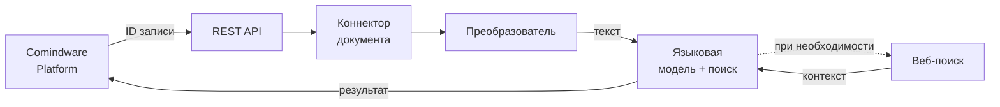

# Архитектура агента обработки документов {: #doc_agent_architecture }

## Резюме {: #executive_summary }

- **Ситуация:** в **Comindware Platform** появляются записи с документами. Менеджер вручную извлекает данные из вложений: отправитель, получатель, даты, цены, условия, сроки. При больших объёмах — ошибки и потери времени.
- **Вызов:** ручная обработка не масштабируется. Нет стандартизации: каждый менеджер извлекает данные по-разному.
- **Задача:** запустить автономный агент, который принимает документ из **Comindware Platform**, анализирует его, при необходимости ищет актуальные данные в интернете и записывает структурированный результат обратно.
- **Решение:** агент с глубоким поиском, интегрированный в **Comindware Platform** на уровне записей. Читает атрибуты, выполняет вычисления на Python, создаёт связанные записи, формирует HTML-отчёты. **Comindware Platform** инициирует обработку и продолжает работу — агент самостоятельно возвращает результат.
- **Результат:** 15–60 секунд (без веб-поиска); 30–90 секунд (с веб-поиском). Менеджер получает готовый результат без ручных операций.

## Архитектура системы {: #system_architecture }

Агент обработки документов состоит из четырёх слоёв:

- **Слой интеграции с платформой:** подключение к **Comindware Platform** через REST API. Агент читает запись с документом и записывает результат обратно в атрибуты.
- **Слой извлечения документа:** преобразование документов различных форматов в текст. Агент поддерживает PDF, DOCX, XLSX.
- **Слой интеллектуальной обработки:** языковая модель с доступом к поиску. Модель самостоятельно решает, когда нужен поиск актуальной информации, а когда достаточно документа.
- **Слой коммуникации:** REST API эндпоинт для запуска обработки. Агент проверяет API-ключ.

### Компоненты

| Компонент | Назначение | Примечания |
| :--- | :--- | :--- |
| **Comindware Platform** | Источник документов и получатель результата | Система заказчика |
| **Точка входа (API)** | Запуск обработки по ID записи | REST API |
| **Коннектор** | Извлечение документа из **Comindware Platform** | Чтение вложения |
| **Преобразователь** | Конвертация документов → текст | Универсальный парсер |
| **Языковая модель** | Генерация структурированного результата | Российские облачные провайдеры |
| **Поиск** | Актуальные данные (цены, погода) | Опционально |
| **Вывод** | Запись в атрибуты записи | HTML |

### Поток данных



**Алгоритм работы:**

1. **Запуск:** внешняя система отправляет идентификатор записи через REST API.
2. **Извлечение:** агент читает запись, получает ссылку на документ, загружает документ.
3. **Преобразование:** агент конвертирует документ в текст.
4. **Генерация:** языковая модель анализирует текст и формирует структурированный результат. При необходимости агент выполняет веб-поиск.
5. **Запись:** агент сохраняет результат в атрибуты записи.

## Инфраструктура {: #infrastructure }

### Где работает система

Агент развёрнут как серверное приложение:

- **Программный интерфейс:** REST API для автоматизации

Это единый серверный процесс, который обслуживает программные запросы.

### Требования

| Параметр | Значение |
| :--- | :--- |
| **Сервер агента** | Linux, Python 3.12+ |
| **Инференс** | Российские облачные провайдеры |
| **Документы** | PDF, DOCX, XLSX |
| **Время обработки** | 15–60 секунд (без веб-поиска); 30–90 секунд (с веб-поиском) |
| **Аутентификация** | Заголовок X-API-Key |
| **Платформа** | **Comindware Platform** с атрибутами для записи результата |

## Асинхронная модель {: #async_model }

Ключевая особенность решения — **асинхронное взаимодействие** агента с **Comindware Platform**.

**Архитектурное решение:** YAML-схемы находятся на стороне агента, а не платформы. Это позволяет агенту самостоятельно обращаться к **Comindware Platform** за данными по ID записи.

Если бы платформа отправляла все данные через HTTP, потребовались бы схемы дважды — на стороне платформы (что отправлять) и на агенте (что принимать). Вместо этого агент использует собственные возможности для чтения платформы:

- Платформа отправляет только ID записи — больше ничего не нужно конфигурировать
- Агент самостоятельно забирает документ, инструкцию и все необходимые данные
- Агент записывает результат обратно без участия платформы

**Асинхронный вызов:** платформа инициирует задачу и продолжает работу. Агент в фоновом режиме собирает данные, анализирует документ, формирует результат, затем записывает результат обратно в платформу.

При построении архитектуры важно **определить границы:** что выполняет **Comindware Platform** по своим сценариям и схемам, а что делает агент.

- **Comindware Platform** обрабатывает рутинные операции и предсказуемые маршруты (валидация данных, маршрутизация заявок, вычисления по формулам), снижая вычислительную нагрузку и трафик между агентом, внешними источниками и платформой.
- Агент вступает в работу там, где нужно рассуждение, анализ документа, сложные непредсказуемые цепочки обращений к внешним источникам.

## Интеграция с **Comindware Platform** {: #cmw_integration }

### Принцип интеграции

YAML-конфигурации задают декларативные схемы интеграции:

- Приложение и шаблон для чтения
- Атрибуты для ввода и вывода
- Инструкцию для языковой модели

Логика меняется без изменения кода — администратор меняет конфигурацию.

### Атрибуты записи

**Входные атрибуты:**

- Атрибут с вложением документа
- Атрибут с инструкцией — промпт для модели (обязательно)

**Выходные атрибуты:**

- Текстовый атрибут (или HTML) для резюме
- Дополнительные атрибуты по необходимости — даты, статусы, расчётные значения, ссылки на связанные записи

### Возможности агента

Агент оперирует на уровне записей, а не форм. Он читает и записывает атрибуты записей напрямую, используя Python и доступ к **Comindware Platform**:

- **Даты** — извлечь сроки из документа, рассчитать промежуточные даты
- **Расчётные значения** — вычислить суммы, проценты, разницу на основе данных документа и **Comindware Platform**
- **Структурированные данные** — табличные данные из документа в отдельные атрибуты
- **Статусы** — выставить статус записи на основе анализа
- **Связанные записи** — создать дочерние записи (например, отдельные задачи по каждому пункту документа)
- **HTML-отчёты** — сформировать форматированный отчёт с таблицами и разметкой. **Comindware Platform** принимает HTML в текстовых атрибутах — агент формирует корректную разметку.

YAML-конфигурация определяет все атрибуты и типы данных — код менять не нужно.

### Управление доступом

Агент работает под собственной учётной записью в **Comindware Platform** с гранулярными правами доступа:

- Агент читает только те записи и атрибуты, которые разрешены конфигурацией
- Агент записывает только в выходные атрибуты, которые определены в схеме
- **Comindware Platform** ведёт полный аудит действий агента через журнал
- Администратор мониторит активность и трассирует запросы

### Гибкость промптов

Промпты можно формировать с любой стороны — в зависимости от требований:

- **На стороне платформы** — менеджер заполняет атрибут с инструкцией в записи. Каждая запись может иметь свой промпт. Подходит для динамических задач, где инструкция зависит от контекста записи.
- **На стороне агента** — администратор задаёт системный промпт в конфигурации. Агент использует его по умолчанию, если атрибут пуст. Подходит для типовых задач с единой инструкцией.

### Что требуется на стороне агента

**Сервер:**

- Linux + Python 3.12+
- Доступ к API **Comindware Platform** (URL, учётные данные)
- Доступ к API инференса

**Настройка:**

- URL **Comindware Platform** и идентификаторы приложения/шаблона
- Имена атрибутов для чтения и записи

### Программный интерфейс

Эндпоинт принимает JSON:

```json
{
    "request_id": "<идентификатор-записи>"
}
```

Ответ:

```json
{
    "success": true,
    "summary": "<HTML-результат>",
    "message": "Summary generated",
    "error": null
}
```

### Пример вызова

```bash
curl -X POST http://localhost:7860/api/v1/cmw/summarize-document \
  -H "Content-Type: application/json" \
  -H "X-API-Key: <ключ>" \
  -d '{"request_id": "<идентификатор-записи>"}'
```

!!! tip "Время обработки"

    Обработка занимает 15–60 секунд (без веб-поиска); 30–90 секунд (с веб-поиском).